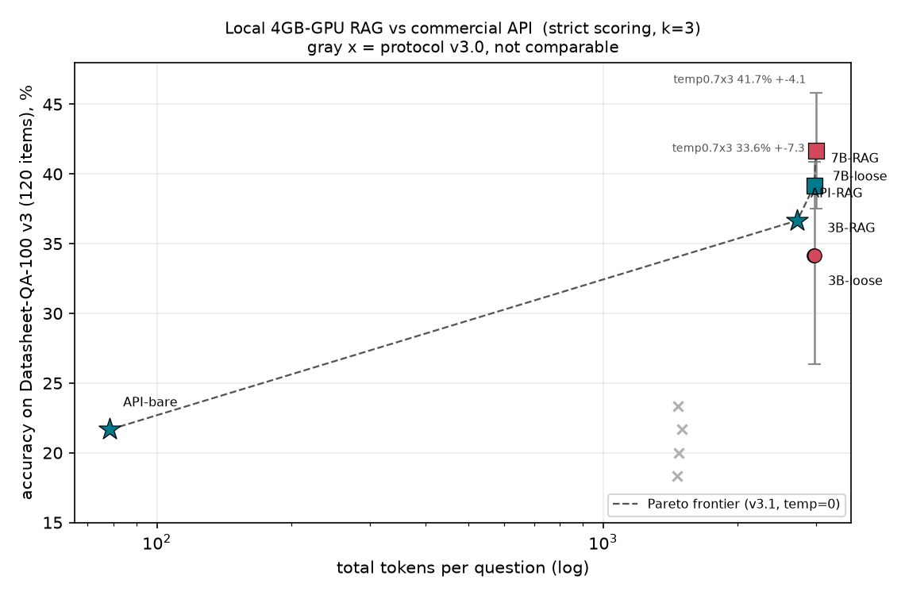
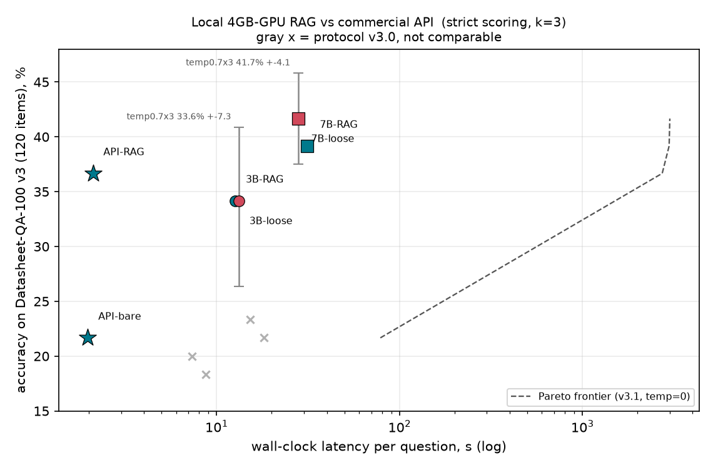

# HD-Agent：基于分层记忆 RAG 的电子元器件 Datasheet 智能问答

面向消费级硬件（RTX 3050 Ti **4GB** 显存笔记本）的电子元器件 Datasheet 问答系统研究与评测基准。
8 周研究计划的开源产出：**Datasheet-QA-100 评测集**（v3 120 题正式 / v6 168 题含应用电路档）、**456 篇结构化语料库（7579 章节切片）**、**分层记忆 RAG 全链路**与**可复现实验**。

## 核心结果（严格判分 `eval/qa100/score2.py`：数值含符号精确 + 单位强制 + 范围双端点）

| 结论 | 数字 | 来源 |
|---|---|---|
| MemTier 分层记忆复现（qwen2.5-3B，4GB 显存，LongMemEval-S 500 题） | **0.364**（论文 7B 参照 0.382） | `eval/REPORT_memtier_repro.md` |
| 本地 RAG-7B-loose vs 商用 API + 同检索协议（QA-100 v3 120 题） | **41.7% vs 36.7%** | `results_v31_rag7b_loose.json` / `results_v31_api_rag.json` |
| 7B-loose 重采样 temp=0.7 × 3 seeds | mean **41.7% ± 1.7pp**，95%CI [37.5, 45.8] | `results_kt_rag7b_s{1,2,3}.json` |
| 3B 重采样同协议 | mean 33.6% ± 2.9pp，CI [26.3, 40.9] | `results_kt_rag3b_s{1,2,3}.json` |
| **7B − 3B = 8.1pp 分辨不出**（Welch 差值 CI [−0.3, +16.4] 含 0） | 只可写"不劣于"，不可写"显著优于" | `eval/REPORT_ktrial.md` |
| 查询路由（题面型号定位 → 文档内定向检索）增益 | **+16pp**，大于模型规模增益 | `REPORT_qa100_baseline.md` 协议 v3.1 节 |
| 应用电路题分档（人工审校 48 题） | **档A 原理图图注 7/22 = 31.8%** ／ **档B 选型表 3/26 = 11.5%**（两档不可平均） | `eval/qa100/app_tier_summary.json` |




前沿只连**同协议（v3.1）同题集（v3 120 题）temp=0** 的 6 个配置；灰色 x 为旧协议 v3.0（上下文构造不同，1470 vs 2975 token/题），不参与前沿；误差棒是 temp=0.7×3 seeds 的 95%CI。数据表 `eval/qa100/pareto_summary.csv`，生成脚本 `_setup/pareto.py`（只读聚合）。

**负结果同样入档**（避免后人重复踩）：提示词松绑对 3B 有效对 7B 交互反转；归属校验"原地重试修复"净增 0 题；混合路由 oracle 上界 18.9% < 纯 API 21.6%；cross 检索改 BM25 分桶劣于词重叠（已回滚）；LongMemEval 日期排序在该数据集上是恒等操作。详见 `eval/REPORT_qa100_baseline.md`。

## 目录结构
```
corpus/    语料层: scripts/{manifest,download,parse}.py + data/{raw_pdf,parsed,chunks,index}
rag/       检索/记忆/编排层: hierarchical(三层检索) bm25 embed(bge/Ollama双后端)
           llm(Ollama + SCNet OpenAI兼容) verify(归属校验) orchestrate(路由) answer/cli
eval/      评测层: run_longmemeval.py + retrieval_ablation.py
eval/qa100/ 出题与判分链: draft prescreen finalize rebuild_cross clean_gold gen_app_drafts
           run score2 variance_probe hybrid_run + datasheet_qa100_v{3,5,6}.json + REPORT/results
_setup/    一次性驱动与聚合脚本(默认 .gitignore 排除，见下"发布边界")
```

## 复现
```bash
pip install pymupdf requests numpy matplotlib torch transformers   # 语料/评测/出图
ollama pull qwen2.5:3b-instruct && ollama pull qwen2.5:7b-instruct-q4_K_M

python corpus/scripts/download.py && python corpus/scripts/parse.py     # 语料重建
python rag/build_vectors.py                                             # 可选: 向量索引(约9min,CPU)
export HF_HUB_OFFLINE=1                                                # 离线加载 bge
python -m rag.cli "LM2596 absolute max input voltage" -k 5              # 检索冒烟

# QA-100（--ds 必须显式给：不给时 run.py 会按"存在即最新"自动选数据集）
python eval/qa100/run.py --ds eval/qa100/datasheet_qa100_v3.json \
       --model qwen2.5:7b-instruct-q4_K_M --loose --tag rag7b_loose
python eval/qa100/run.py --ds eval/qa100/datasheet_qa100_v6.json --only app --tag app48
python eval/qa100/score2.py                                             # 离线重判已有 pred，零 GPU
python _setup/pareto.py                                                 # 成本-准确率前沿图与表

python eval/run_longmemeval.py --n 500 --k 3                            # LongMemEval-S
```
商用 API 对照：`.env` 里放 `SCNET_API_KEY`（勿提交），`RAG_LLM_MODEL=scnet:<模型ID>`（模型 ID 大小写敏感）。
实验固定量：seed=42 / temperature=0；方差协议另用 temperature=0.7 × 3 seeds 报告 mean±95%CI(t=4.303)。

## 数据集
- `datasheet_qa100_v3.json` — **120 题**（param 83 + cross 37），全部人工审校，**对外结论以此为准**
- `datasheet_qa100_v5.json` — 132 题 = v3 + 应用电路 12 题（第一轮审校）
- `datasheet_qa100_v6.json` — **168 题** = v5 + 应用电路 36 题（批次二审校）；app 48 题按取证章节分两档，见 `app_tier_summary.json`
- `datasheet_qa100_v4.json` — 150 题，其中 30 道 app 为 **auto-draft 未经人工审校**（16 道经核实是型号字符串残片），仅作清洗前后对照，**不可用于结论**
- 审校留痕：`review.csv`(229 行含 verdict) / `review_app*.csv` + 生成时原值 `review_app3.json`
- 语料索引 `corpus/data/index/corpus_index.jsonl`（456 文档 / 7579 章节切片 / 厂商、年份元数据）

## 发布边界
- `.gitignore` 排除：`.env`、`rag/.cache_*.pkl`、`corpus/data/{raw_pdf,parsed,chunks}`、`corpus/logs/`、`data/eval/`、`_setup/`
- **`_setup/` 默认不入库**，但 `package.py`/`pareto.py`/`finalize_app.py` 是交付流水线的一部分 → 若要完整可复现的公开仓库，需把这三个脚本移到 `eval/` 或从 `.gitignore` 里白名单放行。交付包内的副本位于 `delivery/code/setup/`（README 中的图片路径按仓库根相对定位，在包内查看请改指 `../qa100/`）
- 交付包不含 456 份 PDF 原件（0.98 GB），只含清单 `raw_pdf_manifest.json`；不含检索缓存，接手方按上面命令自重建

## 许可
Datasheet 版权归原作者/厂商所有，本仓库仅分发解析后的文本切片用于研究，不重新分发 PDF。代码 MIT。
