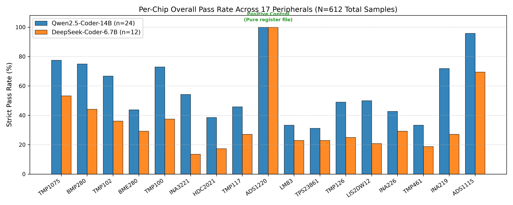
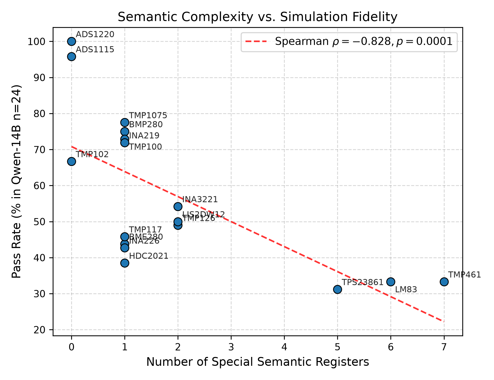
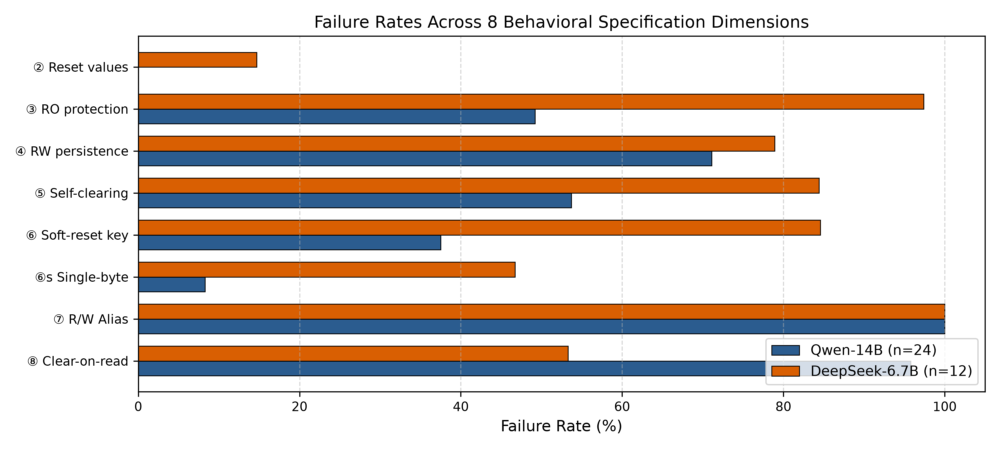

# D2D-Twin：基于芯片数据手册生成寄存器级行为仿真器的大模型评估基准

<p align="center">
  <a href="https://doi.org/10.5281/zenodo.23262086"></a>
  <a href="https://huggingface.co/datasets/eggdan666/d2d-twin"></a>
  <a href="LICENSE"></a>
  <a href="https://www.python.org/"></a>
  <a href="DATASET.md"></a>
  <a href="d2d/eval/"></a>
  <a href="d2d/eval/test_d2d_blackbox.py"></a>
  <a href="README.md"></a>
</p>

> **完全确定性、零 LLM-as-a-Judge 偏见的代码大模型硬件虚拟原型合成基准。**  
> 覆盖 **17 颗工业级外设芯片**、**612 份模型合成代码样本**，基于 **8 大硬件行为规范维度** 进行沙盒黑盒 pytest 读写断言。

---

## 📌 项目定位与核心亮点

在电子设计自动化（EDA）与嵌入式系统固件研发中，**外设寄存器级行为仿真器（Virtual Peripheral Twins）** 是系统级仿真与驱动测试的基石。传统评估大模型硬件理解能力的方法普遍依赖文本问答（QA）或 LLM 作为裁判（LLM-as-a-judge），不可避免地存在幻觉与主观偏见。

**D2D-Twin** 提出了端到端的客观工程评估范式：
> **数据手册规范 $\to$ 金标中间表示（Gold IR） $\to$ 代码大模型生成 Python 行为仿真器 $\to$ 注入总线激励并进行黑盒 pytest 断言判分。**

- **全量 17 颗芯片大满贯**：涵盖环境传感、精密 ADC、电源监控、加速度计、以太网供电（PoE）等主流工业品类。
- **双模型 612 份样本全量回归**：
  - Qwen2.5-Coder-14B-Instruct：每颗芯片独立评测 24 份样本（seeds 1–6，每 seed 4 份），总计 408 份代码；
  - DeepSeek-Coder-6.7B-Instruct：每颗芯片独立评测 12 份样本，总计 204 份代码。
- **确定性测试套件校验**：评测核心 `test_d2d_blackbox.py` 具有固化哈希指纹（`MD5: 8cf0854d4779467bc8e472ee4fb97023`），杜绝改题与跑偏。
- **纯 CPU 秒级离线复现**：无需 GPU 显存与 API 额度，通过 `python run_benchmark.py` 即可在秒级时间内完成全量样本对账与主表生成。

---

## 🔍 四大核心科学发现

```
[数据手册 PDF] ──> [金标中间表示 (Gold IR)] ──> [代码大模型 (14B / 6.7B)] ──> [Python 仿真器]
                                                                                │
[通用测试 Harness (MD5: 8cf0854d)] ─────────────────────────────────────────────▼
                                                                [黑盒总线读写激励与状态断言]
```

1. **子寄存器位域持久性赤字（Sub-register Bitfield Deficit）**：
   - 现有代码大模型习惯将寄存器视为整体整型变量存储（`self.regs[addr] = val`）；
   - 在部分位域写入时，模型频繁发生相邻只读位或保留位的意外冲刷，导致 **只读保护失败率达 49.2%**，**位域持久性失败率高达 71.1%**（经严格三桶解耦，确证其中 47.5% 为纯位运算逻辑缺陷）。
2. **读写别名盲区（Alias Blindness，100.0% 全败）**：
   - 在工业硬件中，同一物理功能常对应不同的读/写地址（如 LM83 与 TMP461 的读写别名映射）；
   - **两款大模型在所有种子下全部失败（48/48，失败率 100.0%）**。大模型本质上缺乏跨地址状态映射机制。
3. **同厂 IP 模板复用污染与自清零脆弱性**：
   - 在 TI 电流监控芯片家族（INA219、INA226、INA3221）中，模型在写 1 触发自清零（`RST`）维度上 **失败率达 53.7%**，出现幻觉复用相同模板代码的现象。
4. **复杂度坍塌（Spearman $\rho = -0.828, p = 0.0001$）**：
   - 芯片包含的特殊语义寄存器数量与大模型的综合生成通过率呈现极显著负相关。

---

## 📊 评测基准天梯榜

### 表 1：主基准失败维度统计（Qwen2.5-Coder-14B，分母 $N=408$ 份样本）

产物对账文件：`d2d/eval/main_table_n24.json` ｜ 测试套件指纹：`8cf0854d4779467bc8e472ee4fb97023`

| # | 行为规范评估维度 | 聚类数 $k$ | 失败 / 适用 | 失败率 (%) | 统计推断方式 | 95% 置信区间 / 上界 |
|:---:|:---|:---:|:---:|:---:|:---:|:---:|
| **②** | 复位默认值读回 | 17 | 0 / 408 | **0.0%** | Rule of Three | $\le 0.7\%$ |
| **③** | 只读（RO）写保护 | 16 | 189 / 384 | **49.2%** | 聚类 Bootstrap | [34.9%, 62.5%] |
| **④** | RW 位域持久性 | 17 | 290 / 408 | **71.1%** | 聚类 Bootstrap | [49.8%, 89.2%] |
| **⑤** | 写触发/自清零位 | 9 | 116 / 216 | **53.7%** | 聚类 Bootstrap | [35.6%, 70.4%] |
| **⑥** | 软复位密钥（写专有） | 2 | 18 / 48 | **37.5%** | 描述性统计 ($k < 5$) | [23.8%, 51.2%] |
| **⑥s**| 单字节总线语义 | 1 | 2 / 24 | **8.3%** | 描述性统计 ($k < 5$) | [0.0%, 19.4%] |
| **⑦** | 读写地址别名寄存器 | 2 | 48 / 48 | **100.0%** | 描述性统计 ($k < 5$) | [100.0%, 100.0%] |
| **⑧** | 读即清零中断位 | 1 | 23 / 24 | **95.8%** | 描述性统计 ($k < 5$) | [87.8%, 100.0%] |

> *说明（④ 约定位解耦模型）*：我们将 71.1% 失败率严格正交拆分为：**④a 已文档化真实能力失败 47.5%** ＋ **④b 业界约定位失败 3.9%** ＋ **④u 未定档保留位 19.6%**，严禁将未文档化约定归咎于模型能力缺陷。

---

### 表 2：17 颗芯片跨模型综合通过率对比（$N=612$ 份样本）

| 芯片型号 | 芯片厂商 | 品类分类 | 寄存器数 | Qwen2.5-Coder-14B ($n=24$) | DeepSeek-Coder-6.7B ($n=12$) |
|:---|:---|:---|:---:|:---:|:---:|
| **TMP1075** | TI | 数字温度传感器 | 5 | **77.5%** | 53.3% |
| **TMP102** | TI | 低功耗温度传感器 | 4 | **66.7%** | 36.1% |
| **TMP100** | TI | 数字温度传感器 | 4 | **72.9%** | 37.5% |
| **TMP117** | TI | 高精度温度传感器 | 10 | **45.8%** | 27.1% |
| **TMP126** | TI | 高精度温度传感器 | 9 | **49.0%** | 25.0% |
| **TMP461** | TI | 远端温度传感器 | 24 | **33.3%** | 18.8% |
| **LM83** | 国半 / TI | 4 通道热监控芯片 | 14 | **33.3%** | 22.9% |
| **HDC2021** | TI | 温湿度传感器 | 20 | **38.5%** | 17.3% |
| **BME280** | Bosch | 气压温湿度传感器 | 14 | **43.8%** | 29.2% |
| **BMP280** | Bosch | 气压温度传感器 | 11 | **75.0%** | 44.2% |
| **INA219** | TI | 电流/功率监控芯片 | 6 | **71.9%** | 27.1% |
| **INA226** | TI | 高边电流监控芯片 | 10 | **42.7%** | 29.2% |
| **INA3221** | TI | 3 通道电流监控芯片 | 20 | **54.2%** | 13.5% |
| **ADS1115** | TI | 16 位精密 ADC | 4 | **95.8%** | 69.4% |
| **ADS1220** | TI | 24 位精密 ADC（纯寄存器堆正对照） | 4 | **100.0%** | **100.0%** |
| **LIS2DW12** | ST意法 | 3 轴加速度计 | 15 | **50.0%** | 20.8% |
| **TPS23861** | TI | 4 端口以太网供电控制芯片 | 19 | **31.2%** | 22.9% |

---

## 📈 学术出版级评测图表

<p align="center">
  
  <br>
  <em>图 1：17 颗芯片在 Qwen-14B (n=24) 与 DeepSeek-6.7B (n=12) 下的黑盒断言通过率对比。</em>
</p>

<p align="center">
  
  <br>
  <em>图 2：特殊语义寄存器数量与模型综合通过率负相关分析（Spearman &rho; = -0.828, p = 0.0001）。</em>
</p>

<p align="center">
  
  <br>
  <em>图 3：跨模型在 8 大行为规范维度上的失败率条形对比。</em>
</p>

---

## 🚀 极速上手：1 分钟零 GPU 完整复现

只需 Python 3.10+ 环境，无需显卡，所有结果开箱即复现：

### 1. 克隆仓库与安装依赖

```bash
git clone https://github.com/your-username/d2d-twin.git
cd d2d-twin

# 安装极简评测依赖（仅 pytest, numpy, scipy, matplotlib, pandas）
pip install -r requirements.txt
```

### 2. 校验测试套件 MD5 并输出主榜单

```bash
# 验证 Harness MD5（8cf0854d4779467bc8e472ee4fb97023）并打印表 1 与表 2
python run_benchmark.py
```

### 3. 一键校验 17 颗金标参考实现（准入测试）

```bash
# 运行全部 17 颗金标仿真器的黑盒测试（耗时 < 1 秒，断言 100% 全绿）
python run_benchmark.py --test-ref all

# 单测指定芯片的金标参考实现
python run_benchmark.py --test-ref TMP1075
```

### 4. 重新渲染出版级图表与 LaTeX 代码

```bash
# 生成高清 PNG 图表至 assets/ 并生成 LaTeX 表格代码至 _out/latex/
python run_benchmark.py --make-assets
```

---

## 📂 项目结构规范

```
.
├── LICENSE                      # Apache-2.0 开源许可证
├── README.md                    # 英文主页文档
├── README_zh.md                 # 中文完整技术白皮书（本文档）
├── DATASET.md                   # Hugging Face Dataset Card 与 17 颗芯片规格表
├── requirements.txt             # 评测环境极简依赖
├── run_benchmark.py             # 一键式复现与准入验证 CLI
├── assets/                      # 高清学术图表资产
│   ├── fig1_per_chip_passrate.png
│   ├── fig2_spearman_complexity.png
│   └── fig3_dimension_failure_rates.png
├── d2d/                         # D2D-Twin 评测基准核心
│   ├── ir/                      # 17 颗芯片金标中间表示（单写者人工校对，拒斥模型撰写）
│   ├── rtl/                     # 芯片抽象基类与 17 颗金标参考实现
│   └── eval/                    # 通用测试套件、评测数据对账表、612 份模型合成源码
│       ├── test_d2d_blackbox.py # 通用 pytest 黑盒断言套件（MD5 固化）
│       ├── main_table_n24.json  # Qwen-14B 全量评测数据
│       ├── main_table_ds67b.json# DeepSeek-6.7B 对照数据
│       └── results_gen_*.json   # 生成的 Python 行为仿真器代码全集
├── rag/                         # 前置系统 HD-Agent 分层检索与 RAG 源码
└── corpus/                      # 芯片手册抽取脚本与清洗清单
```

---

## 📚 前置系统：HD-Agent（分层记忆 Datasheet QA-100）

在实现芯片代码数字孪生之前，大模型对外设手册的理解严重受限于**文档检索与结构解析**。前置系统 **HD-Agent** 包含：
- **语料规模**：456 篇芯片手册，共 7,579 个章节切片；
- **Datasheet-QA-100 评测集**：120 道正式题（参数定位 83 题 ＋ 跨章节综合 37 题），基于 `eval/qa100/score2.py` 严格判分；
- **结论**：上游检索与解析损失合计占失败原因的 **40%–45%**，这一发现坚定了我们转向直接以结构化 Gold IR 输入评估代码模型行为建模能力的科研路线。

---

## 📝 引用

如果您在科研或工程项目中使用了 D2D-Twin 或 HD-Agent，欢迎引用本项目：

```bibtex
@misc{lan2024d2dtwin,
  title={D2D-Twin: Benchmarking Large Language Models on Datasheet-to-Digital-Twin Synthesis for Peripheral Hardware Emulators},
  author={Lan, Chengtong},
  year={2024},
  doi={10.5281/zenodo.23262086},
  url={https://doi.org/10.5281/zenodo.23262086},
  howpublished={\url{https://github.com/eggdan6666/d2d-twin}},
  note={Deterministic Blackbox Pytest Benchmark across 17 Peripheral ICs}
}
```

---

## 📜 许可证与免责声明

- 本基准的核心测试代码、通用 Testbench、Gold IR 规范均遵循 [Apache 2.0 许可证](LICENSE) 开源；
- 芯片 Datasheet 的商标与原始文档版权归属于原半导体制造厂商（TI、Bosch、ST 等），本仓库仅分发用于学术评测与可复现研究的结构化元数据。
