BME280

# Combined humidity and pressure sensor

# BME280 – Data sheet

Document revision

1.24

Document release date

February 2024

Document number

BST-BME280-DS001-24

Sales Part Number (SPN)

0 273 141 185

Notes

Data and descriptions in this document are subject to change without notice. Product photos and pictures are for illustration purposes only and may differ from the real product appearance

# BME280 Digital humidity, pressure and temperature sensor

# Key features

• Package $2 . 5 \ : \mathrm { m m } \times 2 . 5 \ : \mathrm { m m } \times 0 . 9 3 \ : \mathrm { m m }$ metal lid LGA   
• Digital interface $\mathsf { I } ^ { 2 } \mathsf { C }$ (up to $3 . 4 ~ \mathsf { M H z } ,$ ) and SPI (3 and 4 wire, up to 10 MHz)   
• Supply voltage VDD main supply voltage range: $1 . 7 1 \mathrm { ~ V ~ }$ to 3.6 V VDDIO interface voltage range: $1 . 2 \vee$ to 3.6 V   
• Current consumption $1 . 8 \mu \mathsf { A }$ $@$ 1 Hz humidity and temperature $2 . 8 \mu \mathsf { A }$ $@$ 1 Hz pressure and temperature $3 . 6 \mu \Delta \ @ \mathrm { ~ 1 ~ } \mathsf { H z }$ humidity, pressure and temperature $0 . 1 \ \mu \mathsf { A }$ in sleep mode   
• Operating range $- 4 0 \ldots + 8 5 ^ { \circ } C$ , $0 \ldots 1 0 0 \%$ rel. humidity, 300…1100 hPa   
Humidity sensor and pressure sensor can be independently enabled / disabled   
• Register and performance compatible to Bosch Sensortec BMP280 digital pressure sensor RoHS compliant, halogen-free, MSL1

# Key parameters for humidity sensor

Response time $( \tau _ { 6 3 \% } )$ 1 s • Accuracy tolerance $13 \%$ relative humidity • Hysteresis $\pm 1 \%$ relative humidity

# Key parameters for pressure sensor

• RMS Noise $0 . 2 \mathsf { P a }$ , equiv. to $1 . 7 \mathsf { c m }$ • Offset temperature coefficient $\pm 1 . 5 \mathsf { P a } / \mathsf { K }$ , equiv. to $\pm 1 2 . 6$ cm at $1 \ ^ { \circ } \mathsf { C }$ temperature change

# Typical application

• Context awareness, e.g. skin detection, room change detection   
• Fitness monitoring / well-being • Warning regarding dryness or high temperatures Measurement of volume and air flow   
• Home automation control • control heating, venting, air conditioning (HVAC)   
• Internet of things GPS enhancement (e.g. time-to-first-fix improvement, dead reckoning, slope detection) Indoor navigation (change of floor detection, elevator detection) Outdoor navigation, leisure and sports applications Weather forecast Vertical velocity indication (rise/sink speed)

# Target devices

Handsets such as mobile phones, tablet PCs, GPS devices   
Navigation systems   
Gaming, e.g flying toys   
Camera (DSC, video)   
Home weather stations   
Flying toys   
Watches

# General Description

The BME280 is as combined digital humidity, pressure and temperature sensor based on proven sensing principles. The sensor module is housed in an extremely compact metal-lid LGA package with a footprint of only $2 . 5 \times 2 . 5 \mathsf { m m } ^ { 2 }$ with a height of $0 . 9 3 ~ \mathsf { m m }$ . Its small dimensions and its low power consumption allow the implementation in battery driven devices such as handsets, GPS modules or watches. The BME280 is register and performance compatible to the Bosch Sensortec BMP280 digital pressure sensor (see chapter 5.2 for details).

The BME280 achieves high performance in all applications requiring humidity and pressure measurement. These emerging applications of home automation control, in-door navigation, fitness as well as GPS refinement require a high accuracy and a low TCO at the same time.

The humidity sensor provides an extremely fast response time for fast context awareness applications and high overall accuracy over a wide temperature range.

The pressure sensor is an absolute barometric pressure sensor with extremely high accuracy and resolution and drastically lower noise than the Bosch Sensortec BMP180.

The integrated temperature sensor has been optimized for lowest noise and highest resolution. Its output is used for temperature compensation of the pressure and humidity sensors and can also be used for estimation of the ambient temperature.

The sensor provides both SPI and I²C interfaces and can be supplied using 1.71 to $3 . 6 \lor$ for the sensor supply $V _ { \mathsf { D D } }$ and 1.2 to $3 . 6 \lor$ for the interface supply VDDIO. Measurements can be triggered by the host or performed in regular intervals. When the sensor is disabled, current consumption drops to $0 . 1 \ \mu \mathsf { A }$ .

BME280 can be operated in three power modes (see chapter 3.3):

• sleep mode • normal mode • forced mode

In order to tailor data rate, noise, response time and current consumption to the needs of the user, a variety of oversampling modes, filter modes and data rates can be selected.

Please contact your regional Bosch Sensortec partner for more information about software packages.

# Index of Contents

# 1. Specification .................... .8

1.1 General electrical specification.. . 8   
1.2 Humidity parameter specification . 9   
1.3 Pressure sensor specification.... 10   
1.4 Temperature sensor specification.. 11

2. Absolute maximum ratings .......... ... 13

3. Functional description ........ . 14

3.1 Block diagram.. ..14   
3.2 Power management ... .14

3.3 Sensor modes.... .. 14

3.3.1 Sensor mode transitions .... 15   
3.3.2 Sleep mode... 15   
3.3.3 Forced mode... 15   
3.3.4 Normal mode ... . 16

3.4 Measurement flow ... ..17

3.4.1 Humidity measurement.. 17   
3.4.2 Pressure measurement . 17   
3.4.3 Temperature measurement . 17   
3.4.4 IIR filter... 18

3.5 Recommended modes of operation ...... .. 19

3.5.1 Weather monitoring ... 19   
3.5.2 Humidity sensing .. 19   
3.5.3 Indoor navigation .... . 20   
3.5.4 Gaming .. . 20

3.6 Noise.... . 21

# 4. Data readout........ .. 23

4.1 Data register shadowing.. ..23

# 4.2 Output compensation .. .. 23

4.2.1 Computational requirements ......... .. 23   
4.2.2 Trimming parameter readout ......... . 24   
4.2.3 Compensation formulas...... .. 25

# 5. Global memory map and register description...... . 26

5.1 General remarks. 26   
5.2 Register compatibility to BMP280.. 26   
5.3 Memory map.... .26

5.4 Register description ..... . 27

5.4.1 Register 0xD0 “id”. .. 27   
5.4.2 Register 0xE0 “reset”.. . 27   
5.4.3 Register 0xF2 “ctrl_hum” . 27   
5.4.4 Register 0xF3 “status” .. . 28   
5.4.5 Register 0xF4 “ctrl_meas” . . 28   
5.4.6 Register 0xF5 “config” ... .. 30   
5.4.7 Register 0xF7…0xF9 “press” (_msb, _lsb, _xlsb) ... .. 30   
5.4.8 Register 0xFA…0xFC “temp” (_msb, _lsb, _xlsb) ... . 31   
5.4.9 Register 0xFD…0xFE “hum” (_msb, _lsb) ... . 31

# 6. Digital interfaces . . 32

6.1 Interface selection ... .. 32

6.2 I²C Interface .. . 32

6.2.1 I²C write......... .. 33   
6.2.2 I²C read .... .. 33

6.3 SPI interface .... .. 34

6.3.1 SPI write.. . 34   
6.3.2 SPI read .. 35

6.4 Interface parameter specification ... .. 35

6.4.1 General interface parameters ........... ... 35  
6.4.2 I²C timings....... . 35  
6.4.3 SPI timings... .. 36

# 7. Pin-out and connection diagram ..... .. 38

7.1 Pin-out ... .38

7.2 Connection diagram I2C.. .39

7.3 Connection diagram 4-wire SPI.. .. 40

7.4 Connection diagram 3-wire SPI.. .. 41

7.5 Package dimensions . .. 42

7.6 Landing pattern recommendation... .. 43

# 7.7 Marking ...... .44

7.7.1 Mass production devices .. .... 44   
7.7.2 Engineering samples ...... . 44

7.8 Soldering guidelines and reconditioning recommendations.. .. 45

7.9 Reconditioning Procedure .. .. 46

7.10 Tape and reel specification ... .. 46

7.10.1 Dimensions .... .. 46   
7.10.2 Orientation within the reel ........ . 47

7.11 Mounting and assembly recommendations... .. 48

7.12 Environmental safety ..... .. 48

7.12.1 RoHS .. 48   
7.12.2 Halogen content... .. 48   
7.12.3 Internal package structure ..... .. 48

# 8. Appendix A: Alternative compensation formulas ............ ...... 49

8.1 Compensation formulas in double precision floating point.. .. 49   
8.2 Pressure compensation in 32 bit fixed point.. .50

# 9. Appendix B: Measurement time and current calculation............ .... 51

9.1 Measurement time.. . 51   
9.2 Measurement rate in forced mode . 51   
9.3 Measurement rate in normal mode... 51   
9.4 Response time using IIR filter... .52

9.5 Current consumption .... .52

10.Self test....... ..... 53

10.1 Self-test flow .. .53

10.2 Function return codes.. .54

10.3 Usage . . 55

10.3.1 File and function pointer integration ....... . 55   
10.3.2 Function call.... . 55   
10.3.3 Test time and interface requirements .... . 55

# 10.4 Function explanation .. . 56

10.4.1 Communication test... .. 56   
10.4.2 Bond wire test ... .. 56   
10.4.3 Measurement plausibility test .... .. 56

10.5 Sample read, write and delay function .. .. 57

# 11. Legal disclaimer ............. ... 58

11.1 Engineering samples . .58   
11.2 Product use.. .58   
11.3 Application examples and hints . . 58

12.Document history and modification.... . 59

# 1. Specification

If not stated otherwise,

All values are valid over the full voltage range   
All minimum/maximum values are given for the full accuracy temperature range   
Minimum/maximum values of drifts, offsets and temperature coefficients are $\pm 3 \sigma$ values over   
lifetime   
Typical values of drifts, offsets and temperature coefficients are $\pm 1 \sigma$ values over lifetime   
Typical values of currents and state machine timings are determined at ${ } ^ { 2 5 } { } ^ { \circ } \mathsf { C }$   
Minimum/maximum values of currents are determined using corner lots over complete   
temperature range   
Minimum/maximum values of state machine timings are determined using corner lots over   
$0 . . . + 6 5 ^ { \circ } \mathsf { C }$ temperature range

The specification tables are split into humidity, pressure, and temperature part of BME280.

# 1.1 General electrical specification

Table 1: Electrical parameter specification   

<table><tr><td rowspan=1 colspan=1>Parameter</td><td rowspan=1 colspan=1>Symbol</td><td rowspan=1 colspan=1>Condition</td><td rowspan=1 colspan=1>Min</td><td rowspan=1 colspan=1>Typ</td><td rowspan=1 colspan=1>Max</td><td rowspan=1 colspan=1>Unit</td></tr><tr><td rowspan=1 colspan=1>Supply VoltageInternal Domains</td><td rowspan=1 colspan=1>VDD</td><td rowspan=1 colspan=1> ripple max. 50 mVpp</td><td rowspan=1 colspan=1>1.71</td><td rowspan=1 colspan=1>1.8</td><td rowspan=1 colspan=1>3.6</td><td rowspan=1 colspan=1>V</td></tr><tr><td rowspan=1 colspan=1> Supply Voltage I/O Domain</td><td rowspan=1 colspan=1>VDDIO</td><td rowspan=1 colspan=1></td><td rowspan=1 colspan=1>1.2</td><td rowspan=1 colspan=1>1.8</td><td rowspan=1 colspan=1>3.6</td><td rowspan=1 colspan=1>V</td></tr><tr><td rowspan=1 colspan=1> Sleep current</td><td rowspan=1 colspan=1>IDDSL</td><td rowspan=1 colspan=1></td><td rowspan=1 colspan=1></td><td rowspan=1 colspan=1>0.1</td><td rowspan=1 colspan=1>0.3</td><td rowspan=1 colspan=1>μA</td></tr><tr><td rowspan=1 colspan=1> Standby current(inactive period of normal mode)</td><td rowspan=1 colspan=1>IDDSB</td><td rowspan=1 colspan=1></td><td rowspan=1 colspan=1></td><td rowspan=1 colspan=1>0.2</td><td rowspan=1 colspan=1>0.5</td><td rowspan=1 colspan=1>μA</td></tr><tr><td rowspan=1 colspan=1> Current during humidity measurement</td><td rowspan=1 colspan=1>IDDH</td><td rowspan=1 colspan=1> Max value at 85 °C</td><td rowspan=1 colspan=1></td><td rowspan=1 colspan=1>340</td><td rowspan=1 colspan=1></td><td rowspan=1 colspan=1> μA</td></tr><tr><td rowspan=1 colspan=1> Current during pressure measurement</td><td rowspan=1 colspan=1>IDDP</td><td rowspan=1 colspan=1> Max value at -40 C</td><td rowspan=1 colspan=1></td><td rowspan=1 colspan=1>714</td><td rowspan=1 colspan=1></td><td rowspan=1 colspan=1>μA</td></tr><tr><td rowspan=1 colspan=1> Current during temperature measurement</td><td rowspan=1 colspan=1>IDDT</td><td rowspan=1 colspan=1> Max value at 85 C</td><td rowspan=1 colspan=1></td><td rowspan=1 colspan=1>350</td><td rowspan=1 colspan=1></td><td rowspan=1 colspan=1>HA</td></tr><tr><td rowspan=1 colspan=1> Start-up time</td><td rowspan=1 colspan=1> tstartup</td><td rowspan=1 colspan=1> Time to first communication after both VDD &gt; 1.58 V and VDDIo &gt; 0.65 V</td><td rowspan=1 colspan=1></td><td rowspan=1 colspan=1></td><td rowspan=1 colspan=1>2</td><td rowspan=1 colspan=1>ms</td></tr><tr><td rowspan=1 colspan=1> Power supplyrejection ratio (DC)</td><td rowspan=1 colspan=1>PSRR</td><td rowspan=1 colspan=1> full VDD range</td><td rowspan=1 colspan=1></td><td rowspan=1 colspan=1></td><td rowspan=1 colspan=1>±0.01±5</td><td rowspan=1 colspan=1>%RH/VPa/V</td></tr><tr><td rowspan=1 colspan=1> Standby timeaccuracy</td><td rowspan=1 colspan=1>△tstandby</td><td rowspan=1 colspan=1></td><td rowspan=1 colspan=1></td><td rowspan=1 colspan=1>±5</td><td rowspan=1 colspan=1>±25</td><td rowspan=1 colspan=1>%</td></tr></table>

# 1.2 Humidity parameter specification

Table 2: Humidity parameter specification   

<table><tr><td rowspan=1 colspan=1> Parameter</td><td rowspan=1 colspan=1>Symbol</td><td rowspan=1 colspan=1>Condition</td><td rowspan=1 colspan=1>Min</td><td rowspan=1 colspan=1>Typ</td><td rowspan=1 colspan=1>Max</td><td rowspan=1 colspan=1>Unit</td></tr><tr><td rowspan=2 colspan=1>Operating range1</td><td rowspan=2 colspan=1>RH</td><td rowspan=2 colspan=1> For temperatures&lt; 0°C and &gt; 60°℃C see Figure 1</td><td rowspan=1 colspan=1>-40</td><td rowspan=1 colspan=1>25</td><td rowspan=1 colspan=1>85</td><td rowspan=1 colspan=1>℃</td></tr><tr><td rowspan=1 colspan=1>0</td><td rowspan=1 colspan=1></td><td rowspan=1 colspan=1>100</td><td rowspan=1 colspan=1>%RH</td></tr><tr><td rowspan=1 colspan=1> Supply current</td><td rowspan=1 colspan=1>IDD,H</td><td rowspan=1 colspan=1>1 Hz forced mode, humidity and temperature</td><td rowspan=1 colspan=1></td><td rowspan=1 colspan=1>1.8</td><td rowspan=1 colspan=1>2.8</td><td rowspan=1 colspan=1>μA</td></tr><tr><td rowspan=1 colspan=1> Absolute accuracy tolerance</td><td rowspan=1 colspan=1>AH</td><td rowspan=1 colspan=1> 20...80 %RH, 25 °C, including hysteresis</td><td rowspan=1 colspan=1></td><td rowspan=1 colspan=1>±3</td><td rowspan=1 colspan=1></td><td rowspan=1 colspan=1>%RH</td></tr><tr><td rowspan=1 colspan=1> Hysteresis²</td><td rowspan=1 colspan=1>HH</td><td rowspan=1 colspan=1>10 →90→10 %RH,25℃</td><td rowspan=1 colspan=1></td><td rowspan=1 colspan=1>±1</td><td rowspan=1 colspan=1></td><td rowspan=1 colspan=1>%RH</td></tr><tr><td rowspan=1 colspan=1> Nonlinearity3</td><td rowspan=1 colspan=1>NLH</td><td rowspan=1 colspan=1>10-→90 %RH, 25 C</td><td rowspan=1 colspan=1></td><td rowspan=1 colspan=1>1</td><td rowspan=1 colspan=1></td><td rowspan=1 colspan=1>%RH</td></tr><tr><td rowspan=1 colspan=1>Response time tocomplete 63% of step4</td><td rowspan=1 colspan=1>T63%</td><td rowspan=1 colspan=1>90→0 or 0 →90 %RH,25°℃</td><td rowspan=1 colspan=1></td><td rowspan=1 colspan=1>1</td><td rowspan=1 colspan=1></td><td rowspan=1 colspan=1>s</td></tr><tr><td rowspan=1 colspan=1>Resolution</td><td rowspan=1 colspan=1>RH</td><td rowspan=1 colspan=1></td><td rowspan=1 colspan=1></td><td rowspan=1 colspan=1>0.008</td><td rowspan=1 colspan=1></td><td rowspan=1 colspan=1>%RH</td></tr><tr><td rowspan=1 colspan=1> Noise in humidity (RMS)</td><td rowspan=1 colspan=1>NH</td><td rowspan=1 colspan=1> Highest oversampling, see chapter 3.6</td><td rowspan=1 colspan=1></td><td rowspan=1 colspan=1>0.02</td><td rowspan=1 colspan=1></td><td rowspan=1 colspan=1>%RH</td></tr><tr><td rowspan=1 colspan=1> Long term stability</td><td rowspan=1 colspan=1>△Hstab</td><td rowspan=1 colspan=1>10...90 %RH, 25 ℃C</td><td rowspan=1 colspan=1></td><td rowspan=1 colspan=1>0.5</td><td rowspan=1 colspan=1></td><td rowspan=1 colspan=1>%RH/year</td></tr></table>

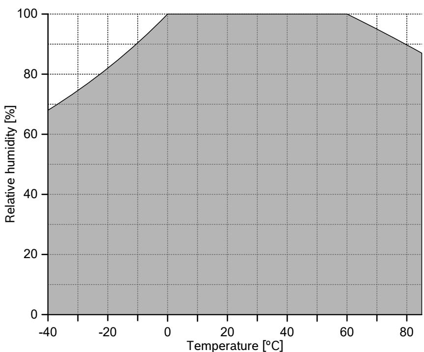  
Figure 1: humidity sensor operating range

# 1.3 Pressure sensor specification

Table 3: Pressure parameter specification   

<table><tr><td colspan="1" rowspan="1">Parameter</td><td colspan="1" rowspan="1">Symbol</td><td colspan="1" rowspan="1">Condition</td><td colspan="1" rowspan="1">Min</td><td colspan="1" rowspan="1">Typ</td><td colspan="1" rowspan="1">Max</td><td colspan="1" rowspan="1">Unit</td></tr><tr><td colspan="1" rowspan="2"> Operating temperaturerange</td><td colspan="1" rowspan="2">TA</td><td colspan="1" rowspan="1"> operational</td><td colspan="1" rowspan="1">-40</td><td colspan="1" rowspan="1">25</td><td colspan="1" rowspan="1">+85</td><td colspan="1" rowspan="1">℃</td></tr><tr><td colspan="1" rowspan="1"> full accuracy</td><td colspan="1" rowspan="1">0</td><td colspan="1" rowspan="1"></td><td colspan="1" rowspan="1">+65</td><td colspan="1" rowspan="1"></td></tr><tr><td colspan="1" rowspan="1"> Operating pressurerange</td><td colspan="1" rowspan="1">P</td><td colspan="1" rowspan="1"> full accuracy</td><td colspan="1" rowspan="1">300</td><td colspan="1" rowspan="1"></td><td colspan="1" rowspan="1">1100</td><td colspan="1" rowspan="1">hPa</td></tr><tr><td colspan="1" rowspan="1"> Supply current</td><td colspan="1" rowspan="1">IDD,LP</td><td colspan="1" rowspan="1">1 Hz forced mode, pressure and temperature, lowest power</td><td colspan="1" rowspan="1"></td><td colspan="1" rowspan="1">2.8</td><td colspan="1" rowspan="1">4.2</td><td colspan="1" rowspan="1"> μA</td></tr><tr><td colspan="1" rowspan="2">Temperature coefficientof offset5</td><td colspan="1" rowspan="2">TCOp</td><td colspan="1" rowspan="2">25...65 ℃, 900 hPa</td><td colspan="1" rowspan="1"></td><td colspan="1" rowspan="1">±1.5</td><td colspan="1" rowspan="1"></td><td colspan="1" rowspan="1"> Pa/K</td></tr><tr><td colspan="1" rowspan="1"></td><td colspan="1" rowspan="1">±12.6</td><td colspan="1" rowspan="1"></td><td colspan="1" rowspan="1"> cm/K</td></tr><tr><td colspan="1" rowspan="3"> Absolute accuracy pressure</td><td colspan="1" rowspan="1">APext</td><td colspan="1" rowspan="1">300. . 1100 hPa-20...0°℃</td><td colspan="1" rowspan="1"></td><td colspan="1" rowspan="1">±1.7</td><td colspan="1" rowspan="1"></td><td colspan="1" rowspan="1"> hPa</td></tr><tr><td colspan="1" rowspan="1"> Ap,full </td><td colspan="1" rowspan="1">300... 1100 hPa0... 65°℃</td><td colspan="1" rowspan="1"></td><td colspan="1" rowspan="1">±1.0</td><td colspan="1" rowspan="1"></td><td colspan="1" rowspan="1"> hPa</td></tr><tr><td colspan="1" rowspan="1">AP</td><td colspan="1" rowspan="1">1100 ... 1250 hPa25...40°℃</td><td colspan="1" rowspan="1"></td><td colspan="1" rowspan="1">±1.5</td><td colspan="1" rowspan="1"></td><td colspan="1" rowspan="1"> hPa</td></tr><tr><td colspan="1" rowspan="1"> Relative accuracy pressureVDD = 3.3V</td><td colspan="1" rowspan="1">Arel</td><td colspan="1" rowspan="1"> 700 ...900hPa25 ...40°℃</td><td colspan="1" rowspan="1"></td><td colspan="1" rowspan="1">±0.12</td><td colspan="1" rowspan="1"></td><td colspan="1" rowspan="1"> hPa</td></tr><tr><td colspan="1" rowspan="1">Resolution of pressure output data</td><td colspan="1" rowspan="1">RP</td><td colspan="1" rowspan="1"> Highest oversampling</td><td colspan="1" rowspan="1"></td><td colspan="1" rowspan="1">0.18</td><td colspan="1" rowspan="1"></td><td colspan="1" rowspan="1">Pa</td></tr><tr><td colspan="1" rowspan="4"> Noise in pressure</td><td colspan="1" rowspan="2"> NpfulBW</td><td colspan="1" rowspan="2"> Full bandwidth, highest oversampling See chapter 3.6</td><td colspan="1" rowspan="1"></td><td colspan="1" rowspan="1">1.3</td><td colspan="1" rowspan="1"></td><td colspan="1" rowspan="1"> Pa</td></tr><tr><td colspan="1" rowspan="1"></td><td colspan="1" rowspan="1">11</td><td colspan="1" rowspan="1"></td><td colspan="1" rowspan="1">cm</td></tr><tr><td colspan="1" rowspan="2"> NPpfiltered</td><td colspan="1" rowspan="2"> Reduced bandwidth, highest oversampling See chapter 3.6</td><td colspan="1" rowspan="1"></td><td colspan="1" rowspan="1">0.2</td><td colspan="1" rowspan="1"></td><td colspan="1" rowspan="1"> Pa</td></tr><tr><td colspan="1" rowspan="1"></td><td colspan="1" rowspan="1">1.7</td><td colspan="1" rowspan="1"></td><td colspan="1" rowspan="1">cm</td></tr><tr><td colspan="1" rowspan="1"> Solder drift</td><td colspan="1" rowspan="1"></td><td colspan="1" rowspan="1"> Minimum solder height50um</td><td colspan="1" rowspan="1">-0.5</td><td colspan="1" rowspan="1"></td><td colspan="1" rowspan="1">+2.0</td><td colspan="1" rowspan="1"> hPa</td></tr><tr><td colspan="1" rowspan="1"> Long term stability6</td><td colspan="1" rowspan="1">△Pstab</td><td colspan="1" rowspan="1"> per year</td><td colspan="1" rowspan="1"></td><td colspan="1" rowspan="1">±1.0</td><td colspan="1" rowspan="1"></td><td colspan="1" rowspan="1"> hPa</td></tr><tr><td colspan="1" rowspan="1"> Possible sampling rate</td><td colspan="1" rowspan="1">fsample_P</td><td colspan="1" rowspan="1"> Lowest oversampling, see chapter 9.2</td><td colspan="1" rowspan="1">157</td><td colspan="1" rowspan="1">182</td><td colspan="1" rowspan="1"></td><td colspan="1" rowspan="1"> Hz</td></tr></table>

# 1.4 Temperature sensor specification

Table 4: Temperature parameter specification   

<table><tr><td colspan="1" rowspan="1"> Parameter</td><td colspan="1" rowspan="1">Symbol</td><td colspan="1" rowspan="1">Condition</td><td colspan="1" rowspan="1">Min</td><td colspan="1" rowspan="1">Typ</td><td colspan="1" rowspan="1">Max</td><td colspan="1" rowspan="1">Unit</td></tr><tr><td colspan="1" rowspan="2"> Operating range</td><td colspan="1" rowspan="2">T</td><td colspan="1" rowspan="1"> Operational</td><td colspan="1" rowspan="1">-40</td><td colspan="1" rowspan="1">25</td><td colspan="1" rowspan="1">85</td><td colspan="1" rowspan="1">℃</td></tr><tr><td colspan="1" rowspan="1"> Full accuracy</td><td colspan="1" rowspan="1">0</td><td colspan="1" rowspan="1"></td><td colspan="1" rowspan="1">65</td><td colspan="1" rowspan="1">℃</td></tr><tr><td colspan="1" rowspan="1"> Supply current</td><td colspan="1" rowspan="1">IDD,T</td><td colspan="1" rowspan="1"> 1 Hz forced mode, temperature measurement only</td><td colspan="1" rowspan="1"></td><td colspan="1" rowspan="1">1.0</td><td colspan="1" rowspan="1"></td><td colspan="1" rowspan="1">μA</td></tr><tr><td colspan="1" rowspan="1"></td><td colspan="1" rowspan="1">AT,25</td><td colspan="1" rowspan="1">25°℃</td><td colspan="1" rowspan="1"></td><td colspan="1" rowspan="1">±0.5</td><td colspan="1" rowspan="1"></td><td colspan="1" rowspan="1">℃</td></tr><tr><td colspan="1" rowspan="3"> Absolute accuracy temperature7</td><td colspan="1" rowspan="1">AT,full </td><td colspan="1" rowspan="1">0...65 ℃</td><td colspan="1" rowspan="1"></td><td colspan="1" rowspan="1">±0.5</td><td colspan="1" rowspan="1"></td><td colspan="1" rowspan="1">℃</td></tr><tr><td colspan="1" rowspan="1">At,ext8</td><td colspan="1" rowspan="1"> -20 ....0°℃</td><td colspan="1" rowspan="1"></td><td colspan="1" rowspan="1">±1.25</td><td colspan="1" rowspan="1"></td><td colspan="1" rowspan="1">℃</td></tr><tr><td colspan="1" rowspan="1">At,ext9</td><td colspan="1" rowspan="1">-40 .. -20 °℃</td><td colspan="1" rowspan="1"></td><td colspan="1" rowspan="1">±1.5</td><td colspan="1" rowspan="1"></td><td colspan="1" rowspan="1">℃</td></tr><tr><td colspan="1" rowspan="1"> Output resolution</td><td colspan="1" rowspan="1">Rt</td><td colspan="1" rowspan="1"> APl output resolution</td><td colspan="1" rowspan="1"></td><td colspan="1" rowspan="1">0.01</td><td colspan="1" rowspan="1"></td><td colspan="1" rowspan="1">°℃</td></tr><tr><td colspan="1" rowspan="1"> RMS noise</td><td colspan="1" rowspan="1">NT</td><td colspan="1" rowspan="1"> Lowest oversampling</td><td colspan="1" rowspan="1"></td><td colspan="1" rowspan="1">0.005</td><td colspan="1" rowspan="1"></td><td colspan="1" rowspan="1">℃</td></tr></table>

# 2. Absolute maximum ratings

The absolute maximum ratings are determined over complete temperature range using corner lots.   
The values are provided in Table 5.

Table 5: Absolute maximum ratings   

<table><tr><td rowspan=1 colspan=1>Parameter</td><td rowspan=1 colspan=1>Condition</td><td rowspan=1 colspan=1>Min</td><td rowspan=1 colspan=1>Max</td><td rowspan=1 colspan=1>Unit</td></tr><tr><td rowspan=1 colspan=1> Voltage at any supply pin</td><td rowspan=1 colspan=1> VDD and VDDIo pin</td><td rowspan=1 colspan=1>-0.3</td><td rowspan=1 colspan=1>4.25</td><td rowspan=1 colspan=1>V</td></tr><tr><td rowspan=1 colspan=1> Voltage at any interface pin</td><td rowspan=1 colspan=1></td><td rowspan=1 colspan=1>-0.3</td><td rowspan=1 colspan=1>VDDIO + 0.3</td><td rowspan=1 colspan=1>V</td></tr><tr><td rowspan=1 colspan=1> Storage temperature</td><td rowspan=1 colspan=1> ≤ 65% RH</td><td rowspan=1 colspan=1>-45</td><td rowspan=1 colspan=1>+85</td><td rowspan=1 colspan=1>℃</td></tr><tr><td rowspan=1 colspan=1> Pressure</td><td rowspan=1 colspan=1></td><td rowspan=1 colspan=1>0</td><td rowspan=1 colspan=1>20 000</td><td rowspan=1 colspan=1> hPa</td></tr><tr><td rowspan=3 colspan=1> ESD</td><td rowspan=1 colspan=1> HBM, at any pin</td><td rowspan=1 colspan=1></td><td rowspan=1 colspan=1>+2</td><td rowspan=1 colspan=1>kv</td></tr><tr><td rowspan=1 colspan=1>CDM</td><td rowspan=1 colspan=1></td><td rowspan=1 colspan=1>±500</td><td rowspan=1 colspan=1>V</td></tr><tr><td rowspan=1 colspan=1>Machine model</td><td rowspan=1 colspan=1></td><td rowspan=1 colspan=1>±200</td><td rowspan=1 colspan=1>V</td></tr></table>

# 3. Functional description

# 3.1 Block diagram

Figure 2 shows a simplified block diagram of the BME280:

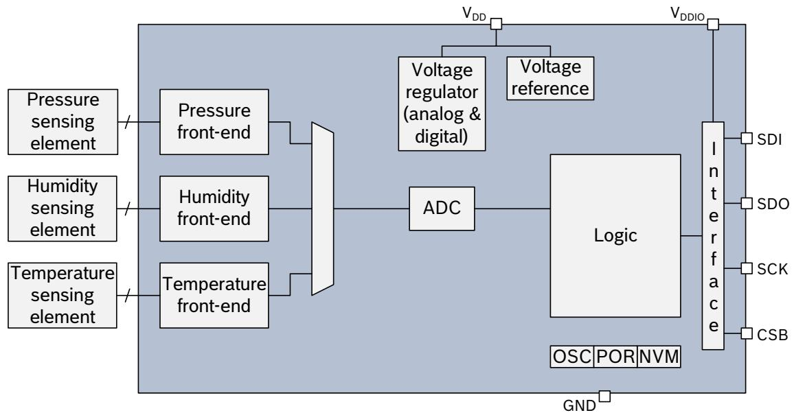  
Figure 2: Block diagram of BME280

# 3.2 Power management

The BME280 has two distinct power supply pins

VDD is the main power supply for all internal analog and digital functional blocks VDDIO is a separate power supply pin used for the supply of the digital interface

A power-on reset (POR) generator is built in; it resets the logic part and the register values after both VDD and VDDIO reach their minimum levels. There are no limitations on slope and sequence of raising the $\mathsf { V } _ { \mathsf { D D } }$ and VDDIO levels. After powering up, the sensor settles in sleep mode (described in chapter 3.3.2).

It is prohibited to keep any interface pin (SDI, SDO, SCK or CSB) at a logical high level when VDDIO is switched off. Such a configuration can permanently damage the device due an excessive current flow through the ESD protection diodes.

If VDDIO is supplied, but $\mathsf { V } _ { \mathsf { D D } }$ is not, the interface pins are kept at a high-Z level. The bus can therefore already be used freely before the BME280 VDD supply is established.

Resetting the sensor is possible by cycling VDD level or by writing a soft reset command. Cycling the VDDIO level will not cause a reset.

# 3.3 Sensor modes

The BME280 offers three sensor modes: sleep mode, forced mode and normal mode. These can be selected using the mode[1:0] setting (see chapter 5.4.5). The available modes are:

Sleep mode: no operation, all registers accessible, lowest power, selected after startup Forced mode: perform one measurement, store results and return to sleep mode Normal mode: perpetual cycling of measurements and inactive periods.

The modes will be explained in detail in chapters 3.3.2 (sleep mode), 3.3.3 (forced mode) and 3.3.4 (normal mode).

# 3.3.1 Sensor mode transitions

The supported mode transitions are shown in Figure 3. If the device is currently performing a measurement, execution of mode switching commands is delayed until the end of the currently running measurement period. Further mode change commands or other write commands to the register ctrl_hum are ignored until the mode change command has been executed. Mode transitions other than the ones shown below are tested for stability but do not represent recommended use of the device.

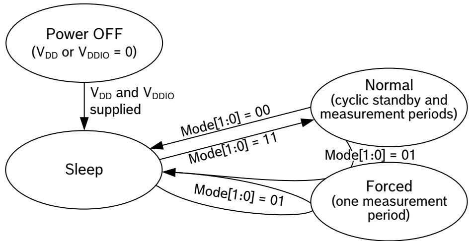  
Figure 3: Sensor mode transition diagram

# 3.3.2 Sleep mode

Sleep mode is entered by default after power on reset. In sleep mode, no measurements are performed and power consumption (IDDSM) is at a minimum. All registers are accessible; Chip-ID and compensation coefficients can be read. There are no special restrictions on interface timings.

# 3.3.3 Forced mode

In forced mode, a single measurement is performed in accordance to the selected measurement and filter options. When the measurement is finished, the sensor returns to sleep mode and the measurement results can be obtained from the data registers. For a next measurement, forced mode needs to be selected again. This is similar to BMP180 operation. Using forced mode is recommended for applications which require low sampling rate or host-based synchronization. The timing diagram is shown below.

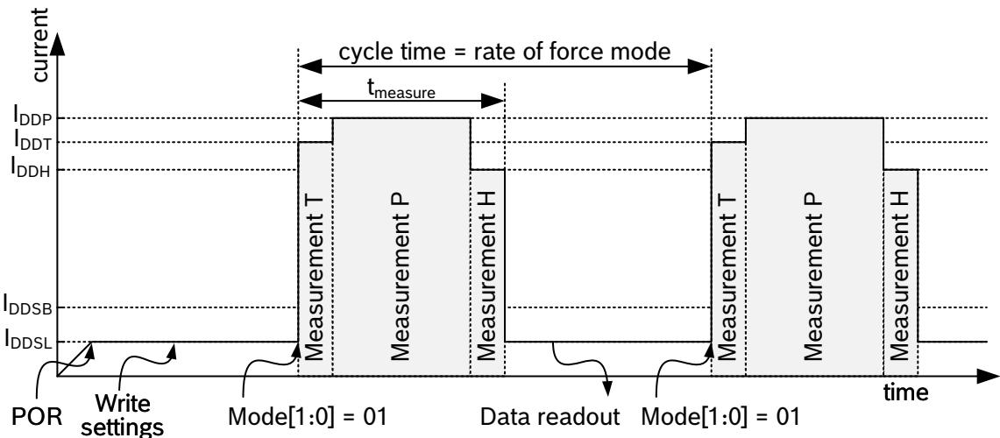  
Figure 4: Forced mode timing diagram

# 3.3.4 Normal mode

Normal mode comprises an automated perpetual cycling between an (active) measurement period and an (inactive) standby period.

The measurements are performed in accordance to the selected measurement and filter options. The standby time is determined by the setting t_sb[2:0] and can be set to between 0.5 and $1 0 0 0 ~ \mathrm { { m s } }$ according to Table 27.

The total cycle time depends on the sum of the active time (see chapter 9) and standby time tstandby. The current in the standby period (IDDSB) is slightly higher than in sleep mode. After setting the measurement and filter options and enabling normal mode, the last measurement results can always be obtained at the data registers without the need of further write accesses.

Using normal mode is recommended when using the IIR filter. This is useful for applications in which short-term disturbances (e.g. blowing into the sensor) should be filtered. The timing diagram is shown below:

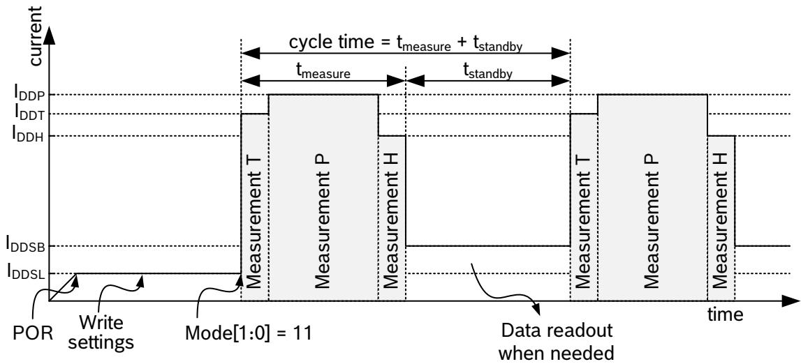  
Figure 5: Normal mode timing diagram

# 3.4 Measurement flow

The BME280 measurement period consists of a temperature, pressure and humidity measurement with selectable oversampling. After the measurement period, the pressure and temperature data can be passed through an optional IIR filter, which removes short-term fluctuations in pressure (e.g. caused by slamming a door). For humidity, such a filter is not needed and has not been implemented. The flow is depicted in the diagram below.

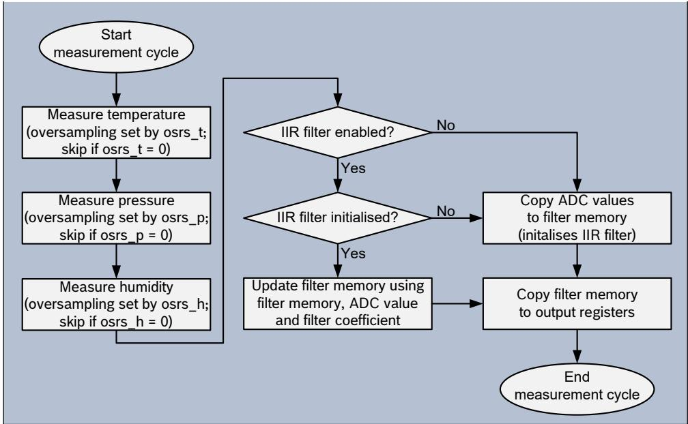  
Figure 6: BME280 measurement cycle

The individual blocks of the diagram above will be detailed in the following subchapters.

# 3.4.1 Humidity measurement

The humidity measurement can be enabled or skipped. When enabled, several oversampling options exist. The humidity measurement is controlled by the osrs_h[2:0] setting, which is detailed in chapter 5.4.3. For the humidity measurement, oversampling is possible to reduce the noise. The resolution of the humidity measurement is fixed at 16 bit ADC output.

# 3.4.2 Pressure measurement

Pressure measurement can be enabled or skipped. When enabled, several oversampling options exist. The pressure measurement is controlled by the osrs_p[2:0] setting which is detailed in chapter 5.4.5. For the pressure measurement, oversampling is possible to reduce the noise. The resolution of the pressure data depends on the IIR filter (see chapter 3.4.4) and the oversampling setting (see chapter 5.4.5):

When the IIR filter is enabled, the pressure resolution is 20 bit.   
When the IIR filter is disabled, the pressure resolution is $1 6 + ( o s r s \_ p - 1 )$ bit, e.g. 18 bit when osrs_ $p$ is set to $\mathfrak { s }$ .

# 3.4.3 Temperature measurement

Temperature measurement can be enabled or skipped. Skipping the measurement could be useful to measure pressure extremely rapidly. When enabled, several oversampling options exist. The temperature measurement is controlled by the osrs_t[2:0] setting which is detailed in chapter 5.4.5. For the temperature measurement, oversampling is possible to reduce the noise. The resolution of the temperature data depends on the IIR filter (see chapter 3.4.4) and the oversampling setting (see chapter 5.4.5):

When the IIR filter is enabled, the temperature resolution is 20 bit.

When the IIR filter is disabled, the temperature resolution is $1 6 + ( o s r s \_ t - 1 )$ bit, e.g. 18 bit when osrs_t is set to $\mathfrak { s }$ .

# 3.4.4 IIR filter

The humidity value inside the sensor does not fluctuate rapidly and does not require low pass filtering. However, the environmental pressure is subject to many short-term changes, caused e.g. by slamming of a door or window, or wind blowing into the sensor. To suppress these disturbances in the output data without causing additional interface traffic and processor work load, the BME280 features an internal IIR filter. It effectively reduces the bandwidth of the temperature and pressure output signals10 and increases the resolution of the pressure and temperature output data to 20 bit. The output of a next measurement step is filtered using the following formula:

Data_filtered_old is the data coming from the current filter memory, and data_ADC is the data coming from current ADC acquisition. Data_filtered is the new value of filter memory and the value that will be sent to the output registers.

The IIR filter can be configured to different filter coefficients, which slows down the response to the sensor inputs. Note that the response time with enabled IIR filter depends on the number of samples generated, which means that the data output rate must be known to calculate the actual response time. For register configuration, please refer to Table 28. A sample response time calculation is shown in chapter 9.4.

Table 6: filter settings   

<table><tr><td rowspan=1 colspan=1>Filter coefficient</td><td rowspan=1 colspan=1>Samples to reach ≥75 % of step response</td></tr><tr><td rowspan=1 colspan=1> Filter off</td><td rowspan=1 colspan=1>1</td></tr><tr><td rowspan=1 colspan=1>2</td><td rowspan=1 colspan=1>2</td></tr><tr><td rowspan=1 colspan=1>4</td><td rowspan=1 colspan=1>5</td></tr><tr><td rowspan=1 colspan=1>8</td><td rowspan=1 colspan=1>11</td></tr><tr><td rowspan=1 colspan=1>16</td><td rowspan=1 colspan=1>22</td></tr></table>

In order to find a suitable setting for filter, please consult chapter 3.5.

When writing to the register filter, the filter is reset. The next ADC values will the pass through the filter unchanged and become the initial memory values for the filter. If temperature or pressure measurements are skipped, the corresponding filter memory will be kept unchanged even though the output registers are set to $0 \times 8 0 0 0 0$ . When the previously skipped measurement is re-enabled, the output will be filtered using the filter memory from the last time when the measurement was not skipped. If this is not desired, please write to the filter register in order to re-initialize the filter.

The step response (e.g. response to in sudden change in height) of the different filter settings is displayed in Figure 7.

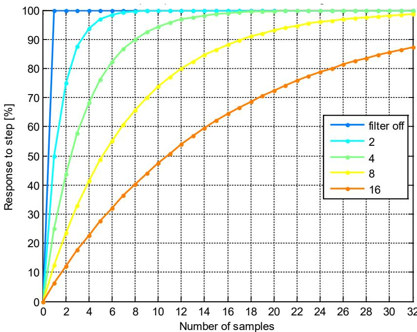  
Figure 7: Step response at different IIR filter settings

# 3.5 Recommended modes of operation

The different oversampling options, filter settings and sensor modes result in a large number of possible settings. In this chapter, a number of settings recommended for various scenarios are presented.

# 3.5.1 Weather monitoring

Description: Only a very low data rate is needed. Power consumption is minimal. Noise of pressure values is of no concern. Humidity, pressure and temperature are monitored.

Table 7: Settings and performance for weather monitoring   

<table><tr><td rowspan=1 colspan=2> Suggested settings for weather monitoring</td></tr><tr><td rowspan=1 colspan=1> Sensor mode</td><td rowspan=1 colspan=1> forced mode, 1 sample / minute</td></tr><tr><td rowspan=1 colspan=1> Oversampling settings</td><td rowspan=1 colspan=1> pressure ×1, temperature ×1, humidity ×1</td></tr><tr><td rowspan=1 colspan=1> IIR fiter settings</td><td rowspan=1 colspan=1> filter off</td></tr><tr><td rowspan=1 colspan=2> Performance for suggested settings</td></tr><tr><td rowspan=1 colspan=1> Current consumption</td><td rowspan=1 colspan=1>0.16 μA</td></tr><tr><td rowspan=1 colspan=1>RMS Noise</td><td rowspan=1 colspan=1> 3.3 Pa/ 30 cm, 0.07 %RH</td></tr><tr><td rowspan=1 colspan=1> Data output rate</td><td rowspan=1 colspan=1>1/60 Hz</td></tr></table>

# 3.5.2 Humidity sensing

Description: A low data rate is needed. Power consumption is minimal. Forced mode is used to minimize power consumption and to synchronize readout, but using normal mode would also be possible.

Table 8: Settings and performance for humidity sensing   

<table><tr><td rowspan=1 colspan=2> Suggested settings for weather monitoring</td></tr><tr><td rowspan=1 colspan=1> Sensor mode</td><td rowspan=1 colspan=1>forced mode, 1 sample / second</td></tr><tr><td rowspan=1 colspan=1> Oversampling settings</td><td rowspan=1 colspan=1> pressure ×0, temperature ×1, humidity ×1</td></tr><tr><td rowspan=1 colspan=1>IIR filter settings</td><td rowspan=1 colspan=1> filter off</td></tr><tr><td rowspan=1 colspan=2> Performance for suggested settings</td></tr><tr><td rowspan=1 colspan=1>Current consumption</td><td rowspan=1 colspan=1>2.9 μA</td></tr><tr><td rowspan=1 colspan=1> RMS Noise</td><td rowspan=1 colspan=1>0.07 %RH</td></tr><tr><td rowspan=1 colspan=1> Data output rate</td><td rowspan=1 colspan=1>1 Hz</td></tr></table>

# 3.5.3 Indoor navigation

Lowest possible altitude noise is needed. A very low bandwidth is preferred. Increased power consumption is tolerated. Humidity is measured to help detect room changes. This setting is suggested for the Android settings ‘SENSOR_DELAY_NORMAL’ and ‘SENSOR_DELAY_UI’.

Table 9: Settings and performance for indoor navigation   

<table><tr><td rowspan=1 colspan=2>Suggested settings for indoor navigation</td></tr><tr><td rowspan=1 colspan=1> Sensor mode</td><td rowspan=1 colspan=1> normal mode, tstandby = 0.5 ms</td></tr><tr><td rowspan=1 colspan=1> Oversampling settings</td><td rowspan=1 colspan=1> pressure x16, temperature ×2, humidity ×1</td></tr><tr><td rowspan=1 colspan=1> IIR filter settings</td><td rowspan=1 colspan=1>filter coefficient 16</td></tr><tr><td rowspan=1 colspan=2> Performance for suggested settings</td></tr><tr><td rowspan=1 colspan=1> Current consumption</td><td rowspan=1 colspan=1>633 μA</td></tr><tr><td rowspan=1 colspan=1> RMS Noise</td><td rowspan=1 colspan=1>0.2 Pa/1.7 cm</td></tr><tr><td rowspan=1 colspan=1> Data output rate</td><td rowspan=1 colspan=1>25Hz</td></tr><tr><td rowspan=1 colspan=1> Filter bandwidth</td><td rowspan=1 colspan=1>0.53 Hz</td></tr><tr><td rowspan=1 colspan=1>Response time (75%)</td><td rowspan=1 colspan=1>0.9 s</td></tr></table>

# 3.5.4 Gaming

Low altitude noise is needed. The required bandwidth is $\sim 2 ~ \mathsf { H z }$ in order to respond quickly to altitude changes (e.g. be able to dodge a flying monster in a game). Increased power consumption is tolerated. Humidity sensor is disabled. This setting is suggested for the Android settings ‘SENSOR_DELAY_GAMING’ and ‘SENSOR_DELAY_FASTEST’.

Table 10: Settings and performance for gaming   

<table><tr><td rowspan=1 colspan=2>Suggested settings for gaming</td></tr><tr><td rowspan=1 colspan=1> Sensor mode</td><td rowspan=1 colspan=1> normal mode, tstandby = 0.5 ms</td></tr><tr><td rowspan=1 colspan=1> Oversampling settings</td><td rowspan=1 colspan=1> pressure ×4, temperature ×1, humidity ×0</td></tr><tr><td rowspan=1 colspan=1>IIR filter settings</td><td rowspan=1 colspan=1> filter coefficient 16</td></tr><tr><td rowspan=1 colspan=2> Performance for suggested settings</td></tr><tr><td rowspan=1 colspan=1> Current consumption</td><td rowspan=1 colspan=1>581 uA</td></tr><tr><td rowspan=1 colspan=1> RMS Noise</td><td rowspan=1 colspan=1>0.3 Pa/ 2.5 cm</td></tr><tr><td rowspan=1 colspan=1> Data output rate</td><td rowspan=1 colspan=1>83 Hz</td></tr><tr><td rowspan=1 colspan=1>Filter bandwidth</td><td rowspan=1 colspan=1>1.75 Hz</td></tr><tr><td rowspan=1 colspan=1> Response time (75%)</td><td rowspan=1 colspan=1>0.3 s</td></tr></table>

# 3.6 Noise

The noise depends on the oversampling and, for pressure and temperature, on the filter setting used. The stated values were determined in a controlled environment and are based on the average standard deviation of 32 consecutive measurement points taken at highest sampling speed. This is needed in order to exclude long term drifts from the noise measurement. The noise depends both on humidity/pressure oversampling and temperature oversampling, since the temperature value is used for humidity/pressure temperature compensation. The oversampling combinations use below results in an optimal power to noise ratio.

Table 11: Noise and current for humidity   

<table><tr><td rowspan=1 colspan=1> Humidity /temperature oversampling setting</td><td rowspan=1 colspan=1>Typical RMS noise inhumidity[%RH]at 25℃</td><td rowspan=1 colspan=1>Typ. current [uA] at 1 Hz forcedmode, 255 °C, humidity and temperature measurement, incl.IDDSM</td></tr><tr><td rowspan=1 colspan=1>×1/ ×1</td><td rowspan=1 colspan=1>0.07</td><td rowspan=1 colspan=1>1.8</td></tr><tr><td rowspan=1 colspan=1>×2/ ×1</td><td rowspan=1 colspan=1>0.05</td><td rowspan=1 colspan=1>2.5</td></tr><tr><td rowspan=1 colspan=1>×4/ ×1</td><td rowspan=1 colspan=1>0.04</td><td rowspan=1 colspan=1>3.8</td></tr><tr><td rowspan=1 colspan=1>x8/ ×1</td><td rowspan=1 colspan=1>0.03</td><td rowspan=1 colspan=1>6.5</td></tr><tr><td rowspan=1 colspan=1>×16/ ×1</td><td rowspan=1 colspan=1>0.02</td><td rowspan=1 colspan=1>11.7</td></tr></table>

Table 12: Noise and current for pressure   

<table><tr><td rowspan=3 colspan=6>Typical RMS noise in pressure [Pa] at 25 °CPressure /temperature              IIR fiter coefficient oversampling settingoff    2      4      8    16</td><td rowspan=3 colspan=1> Typ. current [uA] at 1 Hz forcedmode,25 ℃,p,pressure and temperature measurement, incl.IDDSM</td></tr><tr><td rowspan=1 colspan=5> IIR fiter coefficient</td></tr><tr><td rowspan=1 colspan=1>off</td><td rowspan=1 colspan=1>2</td><td rowspan=1 colspan=1>4</td><td rowspan=1 colspan=1>8</td><td rowspan=1 colspan=1>16</td></tr><tr><td rowspan=1 colspan=1>×1/ ×1</td><td rowspan=1 colspan=1>3.3</td><td rowspan=1 colspan=1>1.9</td><td rowspan=1 colspan=1>1.2</td><td rowspan=1 colspan=1>0.9</td><td rowspan=1 colspan=1>0.4</td><td rowspan=1 colspan=1>2.8</td></tr><tr><td rowspan=1 colspan=1> ×2/ ×1</td><td rowspan=1 colspan=1>2.6</td><td rowspan=1 colspan=1>1.5</td><td rowspan=1 colspan=1>1.0</td><td rowspan=1 colspan=1>0.6</td><td rowspan=1 colspan=1>0.4</td><td rowspan=1 colspan=1>4.2</td></tr><tr><td rowspan=1 colspan=1>x4/ ×1</td><td rowspan=1 colspan=1>2.1</td><td rowspan=1 colspan=1>1.2</td><td rowspan=1 colspan=1>0.8</td><td rowspan=1 colspan=1>0.5</td><td rowspan=1 colspan=1>0.3</td><td rowspan=1 colspan=1>7.1</td></tr><tr><td rowspan=1 colspan=1> x8/ x1</td><td rowspan=1 colspan=1>1.6</td><td rowspan=1 colspan=1>1.0</td><td rowspan=1 colspan=1>0.6</td><td rowspan=1 colspan=1>0.4</td><td rowspan=1 colspan=1>0.2</td><td rowspan=1 colspan=1>12.8</td></tr><tr><td rowspan=1 colspan=1>×16/×2</td><td rowspan=1 colspan=1>1.3</td><td rowspan=1 colspan=1>0.8</td><td rowspan=1 colspan=1>0.5</td><td rowspan=1 colspan=1>0.4</td><td rowspan=1 colspan=1>0.2</td><td rowspan=1 colspan=1>24.9</td></tr></table>

Table 13: Temperature dependence of pressure noise   

<table><tr><td rowspan=1 colspan=2>RMS noise at different temperatures</td></tr><tr><td rowspan=1 colspan=1>Temperature</td><td rowspan=1 colspan=1>Typical change in noisecompared to 25 °C</td></tr><tr><td rowspan=1 colspan=1>-10℃</td><td rowspan=1 colspan=1>+25 %</td></tr><tr><td rowspan=1 colspan=1>25℃</td><td rowspan=1 colspan=1>±0%</td></tr><tr><td rowspan=1 colspan=1>75℃</td><td rowspan=1 colspan=1>-5 %</td></tr></table>

Table 14: Noise in temperature   

<table><tr><td rowspan=1 colspan=1>Temperature oversampling setting</td><td rowspan=1 colspan=1>Typical RMS noise intemperaturee[C] at 25℃</td></tr><tr><td rowspan=1 colspan=1>×1</td><td rowspan=1 colspan=1>0.005</td></tr><tr><td rowspan=1 colspan=1>×2</td><td rowspan=1 colspan=1>0.004</td></tr><tr><td rowspan=1 colspan=1>x4</td><td rowspan=1 colspan=1>0.003</td></tr><tr><td rowspan=1 colspan=1>x8</td><td rowspan=2 colspan=1>0.0030.002</td></tr><tr><td rowspan=1 colspan=1>×16</td></tr></table>

# 4. Data readout

To read out data after a conversion, it is strongly recommended to use a burst read and not address every register individually. This will prevent a possible mix-up of bytes belonging to different measurements and reduce interface traffic. Note that in I²C mode, even when pressure was not measured, reading the unused registers is faster than reading temperature and humidity data separately.

Data readout is done by starting a burst read from 0xF7 to 0xFC (temperature and pressure) or from 0xF7 to 0xFE (temperature, pressure and humidity). The data are read out in an unsigned 20-bit format both for pressure and for temperature and in an unsigned 16-bit format for humidity. It is strongly recommended to use the BME280 API, available from Bosch Sensortec, for readout and compensation. For details on memory map and interfaces, please consult chapters 5 and 6 respectively.

After the uncompensated values for pressure, temperature and humidity ‘ut’, ‘up’ and ‘uh’ have been read, the actual humidity, pressure and temperature needs to be calculated using the compensation parameters stored in the device. The procedure is elaborated in chapter 4.2.

# 4.1 Data register shadowing

In normal mode, the timing of measurements is not necessarily synchronized to the readout by the user. This means that new measurement results may become available while the user is reading the results from the previous measurement. In this case, shadowing is performed in order to guarantee data consistency. Shadowing will only work if all data registers are read in a single burst read. Therefore, the user must use burst reads if he does not synchronize data readout with the measurement cycle. Using several independent read commands may result in inconsistent data. If a new measurement is finished and the data registers are still being read, the new measurement results are transferred into shadow data registers. The content of shadow registers is transferred into data registers as soon as the user ends the burst read, even if not all data registers were read. The end of the burst read is marked by the rising edge of CSB pin in SPI case or by the recognition of a stop condition in ${ \mathsf { I } } ^ { 2 } { \mathsf { C } }$ case. After the end of the burst read, all user data registers are updated at once.

# 4.2 Output compensation

The BME280 output consists of the ADC output values. However, each sensing element behaves differently. Therefore, the actual pressure and temperature must be calculated using a set of calibration parameters. In this chapter, the method to read out the trimming values will be given. The recommended calculation uses fixed point arithmetic and is given in chapter 4.2.3.

In high-level languages like Matlab™ or LabVIEW™, fixed-point code may not be well supported. In this case the floating-point code in appendix 8.1 can be used as an alternative.

For 8-bit micro controllers, the variable size may be limited. In this case a simplified 32 bit integer code with reduced accuracy is given in appendix 8.2.

# 4.2.1 Computational requirements

In the table below an overview is given for the number of clock cycles needed for compensation on a 32 bit Cortex-M3 micro controller with GCC optimization level -O2. This controller does not feature a floating point unit, thus all floating-point calculations are emulated. Floating point is only recommended for PC application, where an FPU is present and these calculations are performed drastically faster.

Table 15: Computational requirements for compensation formulas   

<table><tr><td rowspan=2 colspan=1>Compensation of</td><td rowspan=1 colspan=3>Number of clocks (ARM Cortex-M3)</td></tr><tr><td rowspan=1 colspan=1> 32 bit integer</td><td rowspan=1 colspan=1> 64 bit integer</td><td rowspan=1 colspan=1>Double precision</td></tr><tr><td rowspan=1 colspan=1> Humidity</td><td rowspan=1 colspan=1>~83</td><td rowspan=1 colspan=1></td><td rowspan=1 colspan=1>~2900 1</td></tr><tr><td rowspan=1 colspan=1>Temperature</td><td rowspan=1 colspan=1>~46</td><td rowspan=1 colspan=1></td><td rowspan=1 colspan=1>~2400 11</td></tr><tr><td rowspan=1 colspan=1>Pressure</td><td rowspan=1 colspan=1>~112 12</td><td rowspan=1 colspan=1>~1400</td><td rowspan=1 colspan=1>~5400 11</td></tr></table>

# 4.2.2 Trimming parameter readout

The trimming parameters are programmed into the devices’ non-volatile memory (NVM) during production and cannot be altered by the customer. Each compensation word is a 16-bit signed or unsigned integer value stored in two’s complement. As the memory is organized into 8-bit words, two words must always be combined in order to represent the compensation word. The 8-bit registers are named calib00…calib41 and are stored at memory addresses $0 { \times } 8 8 . . . 0 { \times } 4 1$ and $0 { \times } 5 1 \ldots 0 { \times } 5 7$ . The corresponding compensation words are named dig_T# for temperature compensation related values, dig_P# for pressure related values and dig_H# for humidity related values. The mapping is seen in Table 16.

Table 16: Compensation parameter storage, naming and data type   

<table><tr><td rowspan=1 colspan=1>Register Address</td><td rowspan=1 colspan=1>Register content</td><td rowspan=1 colspan=1>Data type</td></tr><tr><td rowspan=1 colspan=1>0x88/0x89</td><td rowspan=1 colspan=1>dig_T1 [7:0]/[15:8]</td><td rowspan=1 colspan=1> unsigned short</td></tr><tr><td rowspan=1 colspan=1>Ox8A/0x8B</td><td rowspan=1 colspan=1>dig_T2 [7:0] /[15:8]</td><td rowspan=1 colspan=1> signed short</td></tr><tr><td rowspan=1 colspan=1>0x8C/0x8D</td><td rowspan=1 colspan=1>dig_T3 [7:0] /[15:8]</td><td rowspan=1 colspan=1> signed short</td></tr><tr><td rowspan=1 colspan=1>Ox8E/0x8F</td><td rowspan=1 colspan=1>dig_P1 [7:0]/[15:8]</td><td rowspan=1 colspan=1> unsigned short</td></tr><tr><td rowspan=1 colspan=1>0x90 / 0x91</td><td rowspan=1 colspan=1>dig_P2 [7:0]/[15:8]</td><td rowspan=1 colspan=1> signed short</td></tr><tr><td rowspan=1 colspan=1>0x92 / 0x93</td><td rowspan=1 colspan=1>dig_P3 [7:0]/[15:8]</td><td rowspan=1 colspan=1> signed short</td></tr><tr><td rowspan=1 colspan=1>0x94 /0x95</td><td rowspan=1 colspan=1>dig_P4 [7:0]/[15:8]</td><td rowspan=1 colspan=1> signed short</td></tr><tr><td rowspan=1 colspan=1>Ox96 / 0x97</td><td rowspan=1 colspan=1>dig_P5 [7:0]/[15:8]</td><td rowspan=1 colspan=1> signed short</td></tr><tr><td rowspan=1 colspan=1>0x98/ 0x99</td><td rowspan=1 colspan=1>dig_P6 [7:0]/[15:8]</td><td rowspan=1 colspan=1> signed short</td></tr><tr><td rowspan=1 colspan=1>Ox9A/0x9B</td><td rowspan=1 colspan=1>dig_P7 [7:0]/[15:8]</td><td rowspan=1 colspan=1> signed short</td></tr><tr><td rowspan=1 colspan=1>0x9C/0x9D</td><td rowspan=1 colspan=1> dig_P8 [7:0]/[15:8]</td><td rowspan=1 colspan=1> signed short</td></tr><tr><td rowspan=1 colspan=1>Ox9E/0x9F</td><td rowspan=1 colspan=1>dig_P9 [7:0]/[15:8]</td><td rowspan=1 colspan=1> signed short</td></tr><tr><td rowspan=1 colspan=1>0xA1</td><td rowspan=1 colspan=1>dig_H1 [7:0]</td><td rowspan=1 colspan=1> unsigned char</td></tr><tr><td rowspan=1 colspan=1>OxE1/0xE2</td><td rowspan=1 colspan=1>dig_H2 [7:0]/[15:8]</td><td rowspan=1 colspan=1> signed short</td></tr><tr><td rowspan=1 colspan=1>0xE3</td><td rowspan=1 colspan=1>dig_H3 [7:0]</td><td rowspan=1 colspan=1> unsigned char</td></tr><tr><td rowspan=1 colspan=1>0xE4 / 0xE5[3:0]</td><td rowspan=1 colspan=1>dig_H4 [11:4]/[3:0]</td><td rowspan=1 colspan=1> signed short</td></tr><tr><td rowspan=1 colspan=1>0xE5[7:4]/ 0xE6</td><td rowspan=1 colspan=1>dig_H5 [3:0]/[11:4]</td><td rowspan=1 colspan=1> signed short</td></tr></table>

11 Use only recommended for high-level programming languages like Matlab™ or LabVIEW™ 12 Use only recommended for 8-bit micro controllers

# 4.2.3 Compensation formulas

Please note that it is strongly advised to use the API available from Bosch Sensortec to perform readout and compensation. If this is not wanted, the code below can be applied at the user’s risk. Both pressure and temperature values are expected to be received in 20 bit format, positive, stored in a 32 bit signed integer. Humidity is expected to be received in 16 bit format, positive, stored in a 32 bit signed integer.

The variable t_fine (signed 32 bit) carries a fine resolution temperature value over to the pressure and humidity compensation formula and could be implemented as a global variable.

The data type “BME280_S32_t” should define a 32 bit signed integer variable type and can usually be defined as “long signed int”.

The data type “BME280_U32_t” should define a 32 bit unsigned integer variable type and can usually be defined as “long unsigned int”.

For best possible calculation accuracy in pressure, 64 bit integer support is needed. If this is not possible on your platform, please see appendix 8.2 for a 32 bit alternative.

The data type “BME280_S64_t” should define a 64 bit signed integer variable type, which on most supporting platforms can be defined as “long long signed int”. The revision of the code is rev.1.1.

// Returns temperature in DegC, resolution is 0.01 DegC. Output value of $" 5 1 2 3 \prime \prime$ equals 51.23   
DegC.   
// t_fine carries fine temperature as global value   
BME280_S32_t t_fine;   
BME280_S32_t BME280_compensate_T_int32(BME280_S32_t adc_T)   
{ BME280_S32_t var1, var2, T; var1 $\stackrel { - } { = }$ ((((adc_ $\mathbb { T } > > 3$ ) – ((BME280_S32_t)dig_ $\mathbb { T } \mathbb { 1 } < < \mathbb { 1 }$ ))) $\star$ ((BME280_S32_t)dig_T2)) $> > ~ 1 1$ ; var2 $=$ (((((adc_T>>4) – ((BME280_S32_t)dig_T1)) \* ((adc_ $\mathord { \mathbb { T } } ^ { > > 4 }$ ) – ((BME280_S32_t)dig_T1)))   
$> > \ 1 2 \ .$ ) \* ((BME280_S32_t)dig_T3)) $> > ~ 1 4$ ; t_fine $=$ var1 $^ +$ var2; $\mathrm { T } ^ { - } ~ = ~ ( \ t ~ \ t ~ \ t ~ \cdot ~ \mathsf { f } ~ \mathsf { i } ~ \mathsf { n } \textsf { e } ^ { \mathrm { ~ \star ~ } } ~ 5 ~ + ~ \mathsf { 1 } 2 8 ) ~ > > ~ $ 8; return T;   
} // Returns pressure in Pa as unsigned 32 bit integer in Q24.8 format (24 integer bits and 8 fractional bits).   
// Output value of “24674867” represents 24674867/256 $=$ 96386.2 Pa $=$ 963.862 hPa   
BME280_U32_t BME280_compensate_P_int64(BME280_S32_t adc_P)   
{ BME280_S64_t var1, var2, p;   
var1 $=$ ((BME280_S64_t)t_fine) – 128000;   
var2 $=$ var1 $\star$ var1 \* (BME280_S64_t)dig_P6;   
var2 $=$ var2 $^ +$ ((var1\*(BME280_S64_t)dig_P5) $< < 1 7$ );   
var2 $=$ var2 + (((BME280_S64_t)dig_P4) $< \overline { { < } } 3 5$ );   
var1 $=$ ((var1 \* var1 \* (BME280_S64_t)dig_P3) $> > 8$ ) $^ +$ ((var1 $\star$ (BME280_S64_t)dig_P2) $< < 1 2$ ); var1 $=$ (((((BME280_S64_t)1)<<47)+var1))\*((BME280_S64_t)dig_P1) $> > 3 3$ ;   
if (var1 $\scriptstyle = = 0$ )   
{   
return 0; // avoid exception caused by division by zero   
}   
$\mathtt { p } ~ = ~ \mathtt { 1 0 4 8 5 7 6 - a d c }$ _P;   
p = (( $( \mathrm { p } < < 3 1 $ )-var2)\*3125)/var1;   
var1 $=$ (((BME280_S64_t)dig_P9) $\star$ ( $. p > > 1 3$ ) $\star$ ( $. p { > } { > } 1 3 .$ )) $> > ~ 2 5$ ;   
var2 $=$ (((BME280_S64_t)dig_P8) \* p) >> 19;   
$\texttt { p } = \texttt { ( ( p + v a r l + v a r 2 ) } > > \texttt { 8 } +$ (((BME280_S64_t)dig_P7) $< < 4$ );   
return (BME280_U32_t)p; // Returns humidity in %RH as unsigned 32 bit integer in Q22.10 format (22 integer and 10 fractional bits).   
// Output value of $" 4 7 4 4 5 \prime \prime$ represents 47445/1024 $=$ 46.333 %RH   
BME280_U32_t bme280_compensate_H_int32(BME280_S32_t adc_H)   
{

BME280_S32_t v_x1_u32r;

v_x1_u32r $=$ (t_fine – ((BME280_S32_t)76800));

v_x1_u32r $=$ (((((adc_H << 14) – (((BME280_S32_t)dig_H4) $< < ~ 2 0$ ) – (((BME280_S32_t)dig_H5) \* v_x1_u32r)) $^ +$ ((BME280_S32_t)16384)) >> 15) \* (((((((v_x1_u32r \* ((BME280_S32_t)dig_H6)) $> > ^ { - } 1 0$ ) $\star$ (((v_x1_u32r \* ((BME280_S32_t)dig_H3)) $> > ~ 1 1$ ) + ((BME280_S32_t)32768))) $> > ~ 1 0$ ) $^ +$ ((BME280_S32_t)2097152)) \* ((BME280_S32_t)dig_H2) + $8 1 9 2 ) > > 1 4 ) \bar { ) }$ ;   
v_x1_u32r = (v_x1_u32r – (((((v_x1_u32r >> 15) \* (v_x1_u32r >> 15)) >> 7) \* ((BME280_S32_t)dig_H1)) >> 4)); $\begin{array} { r } { \mathrm { ~ \texttt ~ { ~ \texttt ~ { ~ \texttt ~ { ~ x ~ 1 ~ } ~ u ~ 3 ~ 2 ~ r ~ } ~ } ~ } = \mathrm { ~ \texttt ~ { ~ ( ~ v ~ \texttt ~ { ~ x ~ 1 ~ } ~ u ~ 3 ~ 2 ~ r ~ } ~ < ~ 0 ~ \texttt ~ { ~ ? ~ } ~ 0 ~ : ~ \texttt ~ { ~ v ~ } ~ x ~ 1 ~ \mathrm { ~ u ~ 3 ~ 2 ~ r ~ } ~ ) ~ } ; } \end{array}$   
$\begin{array} { r l r } { \mathrm { ~ ` ~ x 1 ~ ` ~ u 3 2 r ~ = ~ ( \bar { v } ~ \bar { \ x } 1 ~ \bar { ~ } u 3 2 r ~ > ~ 4 1 9 4 3 0 4 0 0 ~ \bar { ~ } 2 ~ ' ~ } } & { { } } & { } \end{array}$ 419430400 : v_x1_u32r);   
return (BME280_U32_t) $( \mathtt { v \_ x } 1 \_ \mathtt { u } 3 2 \mathtt { r } > > 1 2 \mathtt { i }$ );

# 5. Global memory map and register description

# 5.1 General remarks

The entire communication with the device is performed by reading from and writing to registers. Registers have a width of 8 bits. There are several registers which are reserved; they should not be written to and no specific value is guaranteed when they are read. For details on the interface, consult chapter 6.

# 5.2 Register compatibility to BMP280

The BME280 is downward register compatible to the BMP280, which means that the pressure and temperature control and readout is identical to BMP280. However, the following exceptions have to be considered:

Table 17: Register incompatibilities between BMP280 and BME280   

<table><tr><td rowspan=1 colspan=1>Register</td><td rowspan=1 colspan=1>Bits</td><td rowspan=1 colspan=1>Content</td><td rowspan=1 colspan=1>BMP280</td><td rowspan=1 colspan=1>BME280</td></tr><tr><td rowspan=1 colspan=1>0xD0 “id”</td><td rowspan=1 colspan=1>7:0</td><td rowspan=1 colspan=1>chip_id</td><td rowspan=1 colspan=1> Read value is0x56 / 0x57 (samples)0x58 (mass production)</td><td rowspan=1 colspan=1> Read value is 0x60</td></tr><tr><td rowspan=1 colspan=1>0xF5&quot;config”</td><td rowspan=1 colspan=1>7:5</td><td rowspan=1 colspan=1>t_sb</td><td rowspan=1 colspan=1>`110&#x27;: 2000 ms`111&#x27;: 4000 ms</td><td rowspan=1 colspan=1>`110&#x27;: 10 ms`111&#x27;: 20 ms</td></tr><tr><td rowspan=1 colspan=1>0xF7...0xF9 “press”</td><td rowspan=1 colspan=1>19:0</td><td rowspan=1 colspan=1>press</td><td rowspan=1 colspan=1>Resolution (16...20 bit) depends only on osrs_p</td><td rowspan=1 colspan=1> Without filter, resolution depends on osrs_p; when using filter, resolution is always 20 bit</td></tr><tr><td rowspan=1 colspan=1>0xFA...0xFC “temp”</td><td rowspan=1 colspan=1>19:0</td><td rowspan=1 colspan=1> temp</td><td rowspan=1 colspan=1>Resolution (16...20 bit)only depends on osrs_t</td><td rowspan=1 colspan=1> Without filter, resolution depends on osrs_t; when using filter, resolution is always 20 bit</td></tr></table>

# 5.3 Memory map

The memory map is given in Table 18 below. Reserved registers are not shown.

Table 18: Memory map   

<table><tr><td rowspan=1 colspan=1>Register Name</td><td rowspan=1 colspan=1>Address</td><td rowspan=1 colspan=1>bit7</td><td rowspan=1 colspan=1>bit6</td><td rowspan=1 colspan=1>bit5</td><td rowspan=1 colspan=1>bit4</td><td rowspan=1 colspan=1>bit3</td><td rowspan=1 colspan=1>bit2</td><td rowspan=1 colspan=1>bit1</td><td rowspan=1 colspan=1>bito</td><td rowspan=1 colspan=1>Resetstate</td></tr><tr><td rowspan=1 colspan=1>hum_Isb</td><td rowspan=1 colspan=1>OxFE</td><td rowspan=1 colspan=8>hum_Isb&lt;7:0&gt;</td><td rowspan=1 colspan=1>0x00</td></tr><tr><td rowspan=1 colspan=1>hum_msb</td><td rowspan=1 colspan=1>0xFD</td><td rowspan=1 colspan=8>hum_msb&lt;7:0&gt;</td><td rowspan=1 colspan=1>0x80</td></tr><tr><td rowspan=1 colspan=1>temp_xlsb</td><td rowspan=1 colspan=1>0xFC</td><td rowspan=1 colspan=8>temp_xlsb&lt;7:4&gt;                   0         0         0         0</td><td rowspan=1 colspan=1>0x00</td></tr><tr><td rowspan=1 colspan=1>temp_Isb</td><td rowspan=1 colspan=1>0xFB</td><td rowspan=1 colspan=8>temp_Isb&lt;7:0&gt;</td><td rowspan=1 colspan=1>Ox00</td></tr><tr><td rowspan=1 colspan=1>temp_msb</td><td rowspan=1 colspan=1>OxFA</td><td rowspan=1 colspan=8>temp_msb&lt;7:0&gt;</td><td rowspan=1 colspan=1>0x80</td></tr><tr><td rowspan=1 colspan=1>press_xlsb</td><td rowspan=1 colspan=1>OxF9</td><td rowspan=1 colspan=8>press_xlsb&lt;7:4&gt;                   0         0         0         0</td><td rowspan=1 colspan=1>0x00</td></tr><tr><td rowspan=1 colspan=1>press_Isb</td><td rowspan=1 colspan=1>OxF8</td><td rowspan=1 colspan=8>press_Isb&lt;7:0&gt;</td><td rowspan=1 colspan=1>0x00</td></tr><tr><td rowspan=1 colspan=1>press_msb</td><td rowspan=1 colspan=1>0xF7</td><td rowspan=1 colspan=8>press_msb&lt;7:0&gt;</td><td rowspan=1 colspan=1>0x80</td></tr><tr><td rowspan=1 colspan=1>config</td><td rowspan=1 colspan=1>0xF5</td><td rowspan=1 colspan=3>t_sb[2:0]</td><td rowspan=1 colspan=3>filter[2:0]</td><td rowspan=1 colspan=2>spi3wen[0]</td><td rowspan=1 colspan=1>Ox00</td></tr><tr><td rowspan=1 colspan=1>ctrl_meas</td><td rowspan=1 colspan=1>OxF4</td><td rowspan=1 colspan=3>osrs_t[2:0]</td><td rowspan=1 colspan=3>osrs_p[2:0]</td><td rowspan=1 colspan=2>mode[1:0]</td><td rowspan=1 colspan=1>0x00</td></tr><tr><td rowspan=1 colspan=1>status</td><td rowspan=1 colspan=1>0xF3</td><td rowspan=1 colspan=5>measuring[0]</td><td rowspan=1 colspan=3>im_update[0]</td><td rowspan=1 colspan=1>0x00</td></tr><tr><td rowspan=1 colspan=1>ctrl_hum</td><td rowspan=1 colspan=1>0xF2</td><td></td><td></td><td></td><td></td><td></td><td rowspan=1 colspan=3>osrs_h[2:0]</td><td rowspan=1 colspan=1>Ox00</td></tr><tr><td rowspan=1 colspan=1>calib26..calib41</td><td rowspan=1 colspan=1>0xE1...0xF0</td><td rowspan=1 colspan=8>calibrationdata</td><td rowspan=1 colspan=1>individual</td></tr><tr><td rowspan=1 colspan=1>reset</td><td rowspan=1 colspan=1>OxE0</td><td rowspan=1 colspan=8>reset[7:0]</td><td rowspan=1 colspan=1>0x00</td></tr><tr><td rowspan=1 colspan=1>id</td><td rowspan=1 colspan=1>0xD0</td><td rowspan=1 colspan=8>chip_id[7:0]</td><td rowspan=1 colspan=1>0x60</td></tr><tr><td rowspan=1 colspan=1>caliboo..calib25</td><td rowspan=1 colspan=1>0x88...0xA1</td><td rowspan=1 colspan=8>calibrationdata</td><td rowspan=1 colspan=1>individual</td></tr></table>

<table><tr><td rowspan=2 colspan=1>Registers:Type:</td><td rowspan=1 colspan=1>Reservedreqisters</td><td rowspan=1 colspan=1>Calibrationdata</td><td rowspan=1 colspan=1>Controlreqisters</td><td rowspan=1 colspan=1>Datareqisters</td><td rowspan=1 colspan=1>Statusreqisters</td><td rowspan=1 colspan=1>Chip ID</td><td rowspan=1 colspan=1>Reset</td></tr><tr><td rowspan=1 colspan=1>donotchange</td><td rowspan=1 colspan=1> read only</td><td rowspan=1 colspan=1>read / write</td><td rowspan=1 colspan=1>read only</td><td rowspan=1 colspan=1> read only</td><td rowspan=1 colspan=1> read only</td><td rowspan=1 colspan=1>write only</td></tr></table>

# 5.4 Register description

# 5.4.1 Register $0 \times 0 0$ “id”

The “id” register contains the chip identification number chip_id[7:0], which is $0 \times 6 0$ . This number can be read as soon as the device finished the power-on-reset.

# 5.4.2 Register 0xE0 “reset”

The “reset” register contains the soft reset word reset[7:0]. If the value $0 \times 8 6$ is written to the register, the device is reset using the complete power-on-reset procedure. Writing other values than $0 \times 8 6$ has no effect. The readout value is always $0 \times 0 0$ .

# 5.4.3 Register 0xF2 “ctrl_hum”

The “ctrl_hum” register sets the humidity data acquisition options of the device. Changes to this register only become effective after a write operation to “ctrl_meas”.

Table 19: Register 0xF2 “ctrl_hum”   

<table><tr><td rowspan=1 colspan=1>Register 0xF2&quot;ctrl_hum”</td><td rowspan=1 colspan=1>Name</td><td rowspan=1 colspan=1>Description</td></tr><tr><td rowspan=1 colspan=1>Bit 2, 1, 0</td><td rowspan=1 colspan=1>osrs_h[2:0]</td><td rowspan=1 colspan=1>Controls oversampling of humidity data. See Table20 for settings and chapter 3.4.1 for details.</td></tr></table>

Table 20: register settings osrs_h   

<table><tr><td rowspan=1 colspan=1>osrs_h[2:0]</td><td rowspan=1 colspan=1> Humidity oversampling</td></tr><tr><td rowspan=1 colspan=1>000</td><td rowspan=1 colspan=1> Skipped (output set to 0x8000)</td></tr><tr><td rowspan=1 colspan=1>001</td><td rowspan=1 colspan=1> oversampling ×1</td></tr><tr><td rowspan=1 colspan=1>010</td><td rowspan=1 colspan=1> oversampling ×2</td></tr><tr><td rowspan=1 colspan=1>011</td><td rowspan=1 colspan=1> oversampling ×4</td></tr><tr><td rowspan=1 colspan=1>100</td><td rowspan=1 colspan=1> oversampling ×8</td></tr><tr><td rowspan=1 colspan=1>101, others</td><td rowspan=1 colspan=1>oversampling ×16</td></tr></table>

# 5.4.4 Register 0xF3 “status”

The “status” register contains two bits which indicate the status of the device.

Table 21: Register 0xF3 “status”   

<table><tr><td>Register 0xF3 &quot;status&quot;</td><td>Name</td><td>Description</td></tr><tr><td>Bit 3</td><td> measuring[0]</td><td>Automatically set to ‘1&#x27; whenever a conversion is running and back to ‘0&#x27; when the results have been transferred to the data registers.</td></tr><tr><td>Bit 0</td><td> im_update[0]</td><td>Automatically set to ‘1&#x27; when the NVM data are being copied to image registers and back to ‘0&#x27; when the copying is done. The data are copied at power-on- reset and before every conversion.</td></tr></table>

# 5.4.5 Register 0xF4 “ctrl_meas”

The “ctrl_meas” register sets the pressure and temperature data acquisition options of the device. The register needs to be written after changing “ctrl_hum” for the changes to become effective.

Table 22: Register 0xF4 “ctrl_meas”   

<table><tr><td rowspan=1 colspan=1>Register 0xF4&quot;ctrl_meas&quot;</td><td rowspan=1 colspan=1>Name</td><td rowspan=1 colspan=1>Description</td></tr><tr><td rowspan=1 colspan=1>Bit 7, 6, 5</td><td rowspan=1 colspan=1>osrs_t[2:0]</td><td rowspan=1 colspan=1>Controls oversampling of temperature data. SeeTable 24 for settings and chapter 3.4.3 for details.</td></tr><tr><td rowspan=1 colspan=1>Bit 4, 3, 2</td><td rowspan=1 colspan=1> osrs_p[2:0]</td><td rowspan=1 colspan=1>Controls oversampling of pressure data. SeeTable 23 for setings and chapter 3.4.2 for details.</td></tr><tr><td rowspan=1 colspan=1>Bit 1, 0</td><td rowspan=1 colspan=1>mode[1:0]</td><td rowspan=1 colspan=1>Controls the sensor mode of the device. See Table 25 for setings and chapter 3.3 for details.</td></tr></table>

Table 23: register settings osrs_p   

<table><tr><td rowspan=1 colspan=1>osrs_p[2:0]</td><td rowspan=1 colspan=1> Pressure oversampling</td></tr><tr><td rowspan=1 colspan=1>000</td><td rowspan=1 colspan=1> Skipped (output set to 0x80000)</td></tr><tr><td rowspan=1 colspan=1>001</td><td rowspan=1 colspan=1> oversampling ×1</td></tr><tr><td rowspan=1 colspan=1>010</td><td rowspan=1 colspan=1> oversampling ×2</td></tr><tr><td rowspan=1 colspan=1>011</td><td rowspan=1 colspan=1> oversampling ×4</td></tr><tr><td rowspan=1 colspan=1>100</td><td rowspan=1 colspan=1> oversampling ×8</td></tr><tr><td rowspan=1 colspan=1>101, others</td><td rowspan=1 colspan=1>oversampling ×16</td></tr></table>

Table 24: register settings osrs_t   

<table><tr><td rowspan=1 colspan=1>osrs_t[2:0]</td><td rowspan=1 colspan=1>Temperature oversampling</td></tr><tr><td rowspan=1 colspan=1>000</td><td rowspan=1 colspan=1> Skipped (output set to 0x80000)</td></tr><tr><td rowspan=1 colspan=1>001</td><td rowspan=1 colspan=1> oversampling ×1</td></tr><tr><td rowspan=1 colspan=1>010</td><td rowspan=1 colspan=1> oversampling ×2</td></tr><tr><td rowspan=1 colspan=1>011</td><td rowspan=1 colspan=1> oversampling ×4</td></tr><tr><td rowspan=1 colspan=1>100</td><td rowspan=1 colspan=1> oversampling ×8</td></tr><tr><td rowspan=1 colspan=1> 101, others</td><td rowspan=1 colspan=1>oversampling ×16</td></tr></table>

Table 25: register settings mode   

<table><tr><td rowspan=1 colspan=1>mode[1:0]</td><td rowspan=1 colspan=1>Mode</td></tr><tr><td rowspan=1 colspan=1>00</td><td rowspan=1 colspan=1> Sleep mode</td></tr><tr><td rowspan=1 colspan=1>01 and 10</td><td rowspan=1 colspan=1> Forced mode</td></tr><tr><td rowspan=1 colspan=1>11</td><td rowspan=1 colspan=1> Normal mode</td></tr></table>

# 5.4.6 Register 0xF5 “config”

The “config” register sets the rate, filter and interface options of the device. Writes to the “config” register in normal mode may be ignored. In sleep mode writes are not ignored.

Table 26: Register 0xF5 “config”   

<table><tr><td rowspan=1 colspan=1>Register 0xF5&quot;config&quot;</td><td rowspan=1 colspan=1>Name</td><td rowspan=1 colspan=1>Description</td></tr><tr><td rowspan=1 colspan=1>Bit 7, 6, 5</td><td rowspan=1 colspan=1>t_sb[2:0]</td><td rowspan=1 colspan=1>Controls inactive duration tstandby in normal mode.See Table 27 for setings and chapter 3.3.4 fordetails.</td></tr><tr><td rowspan=1 colspan=1>Bit 4, 3, 2</td><td rowspan=1 colspan=1>filter[2:0]</td><td rowspan=1 colspan=1>Controls the time constant of the IIR filter. See Table 27 for settings and chapter 3.4.4 for details.</td></tr><tr><td rowspan=1 colspan=1>Bit 0</td><td rowspan=1 colspan=1>spi3w_en[0]</td><td rowspan=1 colspan=1> Enables 3-wire SPl interface when set to ‘1&#x27;. Seechapter 6.3 for details.</td></tr></table>

Table 27: t_sb settings   

<table><tr><td rowspan=1 colspan=1>t_sb[2:0]</td><td rowspan=1 colspan=1>tstandby [ms]</td></tr><tr><td rowspan=1 colspan=1>000</td><td rowspan=1 colspan=1>0.5</td></tr><tr><td rowspan=1 colspan=1>001</td><td rowspan=1 colspan=1>62.5</td></tr><tr><td rowspan=1 colspan=1>010</td><td rowspan=1 colspan=1>125</td></tr><tr><td rowspan=1 colspan=1>011</td><td rowspan=1 colspan=1>250</td></tr><tr><td rowspan=1 colspan=1>100</td><td rowspan=1 colspan=1>500</td></tr><tr><td rowspan=1 colspan=1>101</td><td rowspan=1 colspan=1>1000</td></tr><tr><td rowspan=1 colspan=1>110</td><td rowspan=1 colspan=1>10</td></tr><tr><td rowspan=1 colspan=1>111 </td><td rowspan=1 colspan=1>20</td></tr></table>

Table 28: filter settings   

<table><tr><td rowspan=1 colspan=1>filter[2:0]</td><td rowspan=1 colspan=1>Filter coefficient</td></tr><tr><td rowspan=1 colspan=1>000</td><td rowspan=1 colspan=1> Filter off</td></tr><tr><td rowspan=1 colspan=1>001</td><td rowspan=1 colspan=1>2</td></tr><tr><td rowspan=1 colspan=1>010</td><td rowspan=1 colspan=1>4</td></tr><tr><td rowspan=1 colspan=1>011</td><td rowspan=1 colspan=1>8</td></tr><tr><td rowspan=1 colspan=1>100, others</td><td rowspan=1 colspan=1>16</td></tr></table>

# 5.4.7 Register 0xF7…0xF9 “press” (_msb, _lsb, _xlsb)

The “press” register contains the raw pressure measurement output data up[19:0]. For details on how to read out the pressure and temperature information from the device, please consult chapter 4.

Table 29: Register 0xF7 … 0xF9 “press”   

<table><tr><td rowspan=1 colspan=1> Register 0xF7...0xF9&quot;press&quot;</td><td rowspan=1 colspan=1>Name</td><td rowspan=1 colspan=1>Description</td></tr><tr><td rowspan=1 colspan=1>0xF7</td><td rowspan=1 colspan=1> press_msb[7:0]</td><td rowspan=1 colspan=1> Contains the MSB part up[19:12] of the raw pressuremeasurement output data.</td></tr><tr><td rowspan=1 colspan=1>0xF8</td><td rowspan=1 colspan=1> press_Isb[7:0]</td><td rowspan=1 colspan=1> Contains the LSB part up[11:4] of the raw pressure measurement output data.</td></tr><tr><td rowspan=1 colspan=1>0xF9 (bit 7, 6, 5, 4)</td><td rowspan=1 colspan=1> press_xlsb[3:0]</td><td rowspan=1 colspan=1>Contains the XLSB part up[3:0] of the raw pressure measurement output data. Contents depend on temperature resolution.</td></tr></table>

# 5.4.8 Register 0xFA…0xFC “temp” (_msb, _lsb, _xlsb)

The “temp” register contains the raw temperature measurement output data ut[19:0]. For details on how to read out the pressure and temperature information from the device, please consult chapter 4.

Table 30: Register 0xFA … 0xFC “temp”   

<table><tr><td rowspan=1 colspan=1>Register OxFA...0xFC&quot;temp&quot;</td><td rowspan=1 colspan=1>Name</td><td rowspan=1 colspan=1>Description</td></tr><tr><td rowspan=1 colspan=1>OxFA</td><td rowspan=1 colspan=1>temp_msb[7:0]</td><td rowspan=1 colspan=1>Contains the MSB part ut[19:12] of the raw temperature measurement output data.</td></tr><tr><td rowspan=1 colspan=1>0xFB</td><td rowspan=1 colspan=1> temp_lsb[7:0]</td><td rowspan=1 colspan=1>Contains the LSB part ut[11:4] of the raw temperature measurement output data.</td></tr><tr><td rowspan=1 colspan=1>OxFC (bit 7, 6, 5, 4)</td><td rowspan=1 colspan=1> temp_xlsb[3:0]</td><td rowspan=1 colspan=1>Contains the XLSB part ut[3:0] of the raw temperature measurement output data. Contentsdepend on pressure resolution.</td></tr></table>

# 5.4.9 Register 0xFD…0xFE “hum” (_msb, _lsb)

The “temp” register contains the raw temperature measurement output data ut[19:0]. For details on how to read out the pressure and temperature information from the device, please consult chapter 4.

Table 31: Register 0xFD … 0xFE “hum”   

<table><tr><td rowspan=1 colspan=1>Register 0xFD...0xFE&quot;hum&quot;99</td><td rowspan=1 colspan=1>Name</td><td rowspan=1 colspan=1>Description</td></tr><tr><td rowspan=1 colspan=1>0xFD</td><td rowspan=1 colspan=1>hum_msb[7:0]</td><td rowspan=1 colspan=1>Contains the MSB part uh[15:8] of the raw humidity measurement output data.</td></tr><tr><td rowspan=1 colspan=1>OxFE</td><td rowspan=1 colspan=1>temp_Isb[7:0]</td><td rowspan=1 colspan=1> Contains the LSB part uh[7:0] of the raw humiditymeasurement output data.</td></tr></table>

# 6. Digital interfaces

The BME280 supports the $1 ^ { 2 } \mathsf { C }$ and SPI digital interfaces; it acts as a slave for both protocols. The I²C interface supports the Standard, Fast and High Speed modes. The SPI interface supports both SPI mode $^ { \circ } 0 0 ^ { \circ } \left( \mathsf { C P O L } = \mathsf { C P H A } = ^ { \circ } 0 ^ { \circ } \right)$ ) and mode ‘11’ $\mathsf { \cdot C P O L } = \mathsf { C P H A } = \mathsf { \cdot 1 ^ { \circ } } )$ in 4-wire and 3-wire configuration.

The following transactions are supported:

• Single byte write   
• multiple byte write (using pairs of register addresses and register data)   
• single byte read multiple byte read (using a single register address which is auto-incremented)

# 6.1 Interface selection

Interface selection is done automatically based on CSB (chip select) status. If CSB is connected to VDDIO, the $\mathsf { I } ^ { 2 } \mathsf { C }$ interface is active. If CSB is pulled down, the SPI interface is activated. After CSB has been pulled down once (regardless of whether any clock cycle occurred), the $\mathsf { I } ^ { 2 } \mathsf { C }$ interface is disabled until the next power-on-reset. This is done in order to avoid inadvertently decoding SPI traffic to another slave as $1 ^ { 2 } \mathsf { C }$ data. Since the device startup is deferred until both VDD and VDDIO are established, there is no risk of incorrect protocol detection because of the power-up sequence used. However, if I²C is to be used and CSB is not directly connected to VDDIO but is instead connected to a programmable pin, it must be ensured that this pin already outputs the VDDIO level during power-onreset of the device. If this is not the case, the device will be locked in SPI mode and not respond to I²C commands.

# 6.2 I²C Interface

The $1 ^ { 2 } \mathsf { C }$ slave interface is compatible with Philips $1 ^ { 2 } \mathsf { C }$ Specification version 2.1. For detailed timings, please review Table 33. All modes (standard, fast, high speed) are supported. SDA and SCL are not pure open-drain. Both pads contain ESD protection diodes to VDDIO and GND. As the devices does not perform clock stretching, the SCL structure is a high-Z input without drain capability.

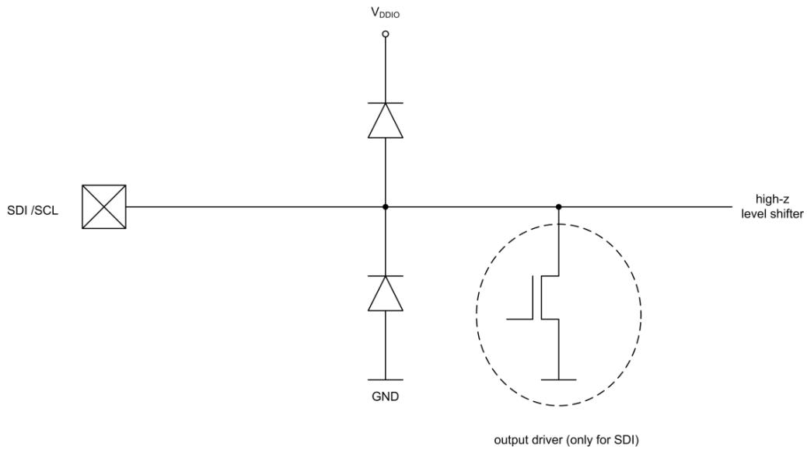  
Figure 8: SDI/SCK ESD drawing

The 7-bit device address is 111011x. The 6 MSB bits are fixed. The last bit is changeable by SDO value and can be changed during operation. Connecting SDO to GND results in slave address 1110110 (0x76); connection it to VDDIO results in slave address 1110111 (0x77), which is the same as

BMP280’s I²C address. The SDO pin cannot be left floating; if left floating, the I²C address will be undefined.

The I²C interface uses the following pins:

• SCK: serial clock (SCL)   
• SDI: data (SDA)   
• SDO: Slave address LSB (GND = ‘0’, VDDIO = ‘1’)

CSB must be connected to VDDIO to select I²C interface. SDI is bi-directional with open drain to GND: it must be externally connected to VDDIO via a pull up resistor. Refer to chapter 7 for connection instructions.

The following abbreviations will be used in the I²C protocol figures:

• S Start   
• P Stop   
• ACKS Acknowledge by slave   
• ACKM Acknowledge by master   
• NACKM Not acknowledge by master

# 6.2.1 I²C write

Writing is done by sending the slave address in write mode $( \mathsf { R W } = { } ^ { \circ } 0 ^ { \circ } )$ ), resulting in slave address 111011X0 (‘X’ is determined by state of SDO pin. Then the master sends pairs of register addresses and register data. The transaction is ended by a stop condition. This is depicted in Figure 9.

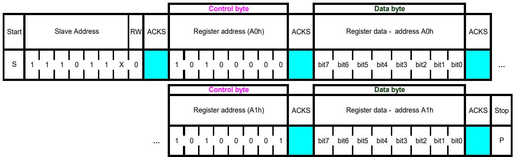  
Figure 9: I²C multiple byte write (not auto-incremented)

# 6.2.2 I²C read

To be able to read registers, first the register address must be sent in write mode (slave address 111011X0). Then either a stop or a repeated start condition must be generated. After this the slave is addressed in read mode $( \mathsf { R W } = ^ { \bullet } 1 ^ { \bullet } )$ ) at address 111011X1, after which the slave sends out data from auto-incremented register addresses until a NOACKM and stop condition occurs. This is depicted in Figure 10, where register $0 \times \mathsf { F } 6$ and $0 \times \mathsf { F 7 }$ are read.

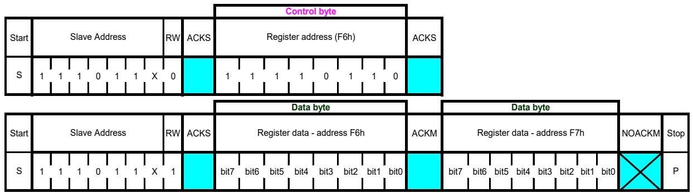  
Figure 10: I²C multiple byte read

# 6.3 SPI interface

The SPI interface is compatible with SPI mode $" 0 0 ^ { \bullet }$ $0 ^ { \circ } \left( \mathsf { C P O L } = \mathsf { C P H A } = ^ { \circ } 0 ^ { \circ } \right)$ ) and mode ‘11’ (CPOL $=$ ${ \mathsf { C P H A } } = { \mathsf { \Omega } } ^ { * } 1 { \mathsf { \Omega } } ^ { , }$ ). The automatic selection between mode $\mathfrak { e o }$ and ‘11’ is determined by the value of SCK after the CSB falling edge.

The SPI interface has two modes: 4-wire and 3-wire. The protocol is the same for both. The 3-wire mode is selected by setting ‘1’ to the register spi3w_en. The pad SDI is used as a data pad in 3-wire mode.

The SPI interface uses the following pins:

• CSB: chip select, active low   
• SCK: serial clock   
• SDI: serial data input; data input/output in 3-wire mode   
• SDO: serial data output; hi-Z in 3-wire mode

Refer to chapter 7 for connection instructions.

CSB is active low and has an integrated pull-up resistor. Data on SDI is latched by the device at SCK rising edge and SDO is changed at SCK falling edge. Communication starts when CSB goes to low and stops when CSB goes to high; during these transitions on CSB, SCK must be stable. The SPI protocol is shown in Figure 11. For timing details, please review Table 34.

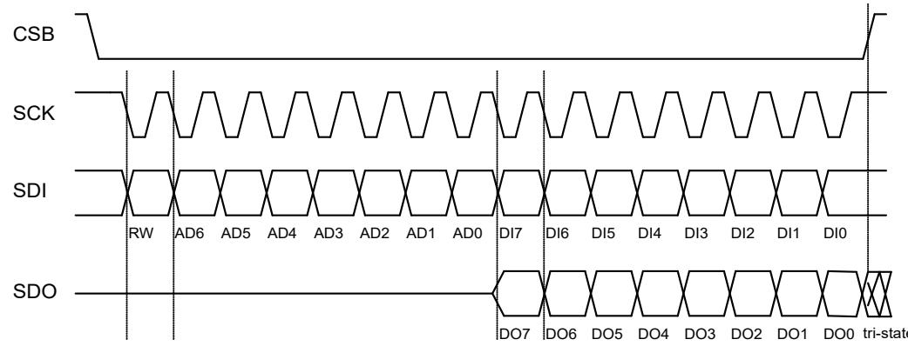  
Figure 11: SPI protocol (shown for mode ‘11’ in 4-wire configuration)   
Figure 12: SPI multiple byte write (not auto-incremented)

In SPI mode, only 7 bits of the register addresses are used; the MSB of register address is not used and replaced by a read/write bit $( \mathsf { R W } = { } ^ { \circ } 0 ^ { \circ }$ for write and $\mathsf { R W } = { \mathsf { \Omega } } ^ { \bullet } \mathsf { 1 } ^ { \prime }$ ’ for read).

Example: address $0 \times \mathsf { F 7 }$ is accessed by using SPI register address $0 { \times } 7 7$ . For write access, the byte $0 { \times } 7 7$ is transferred, for read access, the byte 0xF7 is transferred.

# 6.3.1 SPI write

Writing is done by lowering CSB and sending pairs control bytes and register data. The control bytes consist of the SPI register address ( $\mathop { \left. \sum \right.}  =$ full register address without bit 7) and the write command (bit7 $=$ $\mathsf { R W } = { \mathsf { \Omega } } ^ { \prime } 0 ^ { \prime }$ ). Several pairs can be written without raising CSB. The transaction is ended by a raising CSB. The SPI write protocol is depicted in Figure 12.

<table><tr><td rowspan=1 colspan=1></td><td rowspan=1 colspan=1></td><td rowspan=1 colspan=6>Controlbyte</td><td rowspan=1 colspan=8>Databyte</td><td rowspan=1 colspan=1></td><td rowspan=1 colspan=5>Controlbyte</td><td rowspan=1 colspan=8>Databyte</td><td rowspan=1 colspan=1></td></tr><tr><td rowspan=1 colspan=1>Start</td><td rowspan=1 colspan=1>RW</td><td rowspan=1 colspan=6>Register address (F4h)</td><td rowspan=1 colspan=8>Data register- address F4h</td><td rowspan=1 colspan=1>RW</td><td rowspan=1 colspan=5>Register address (F5h)</td><td rowspan=1 colspan=8>Data register-adress F5h</td><td rowspan=1 colspan=1>Stop</td></tr><tr><td rowspan=1 colspan=1>CSB=0</td><td rowspan=1 colspan=1>0</td><td rowspan=1 colspan=1>1</td><td rowspan=1 colspan=1>1</td><td rowspan=1 colspan=1>1</td><td rowspan=1 colspan=1>0  1</td><td rowspan=1 colspan=1>0</td><td rowspan=1 colspan=1>0</td><td rowspan=1 colspan=1>bit7</td><td rowspan=1 colspan=1>bit6</td><td rowspan=1 colspan=1>bit5</td><td rowspan=1 colspan=1>bit4</td><td rowspan=1 colspan=1>bit3</td><td rowspan=1 colspan=1>bit2</td><td rowspan=1 colspan=1>bit1</td><td rowspan=1 colspan=1>bito</td><td rowspan=1 colspan=1>0</td><td rowspan=1 colspan=1></td><td rowspan=1 colspan=1>0</td><td rowspan=1 colspan=1></td><td rowspan=1 colspan=1>0</td><td rowspan=1 colspan=1>1</td><td rowspan=1 colspan=1>bit7</td><td rowspan=1 colspan=1>bit6</td><td rowspan=1 colspan=1>bit5</td><td rowspan=1 colspan=1>bit4</td><td rowspan=1 colspan=1>bit3</td><td rowspan=1 colspan=1>bit2</td><td rowspan=1 colspan=1>bit1</td><td rowspan=1 colspan=1>bito</td><td rowspan=1 colspan=1>CSB=</td></tr></table>

# 6.3.2 SPI read

Reading is done by lowering CSB and first sending one control byte. The control bytes consist of the SPI register address $[ =$ full register address without bit 7) and the read command (bit $7 = \mathsf { R W } = { \mathsf { \Omega } } ^ { \ast } 1 ^ { \mathfrak { 3 } } )$ . After writing the control byte, data is sent out of the SDO pin (SDI in 3-wire mode); the register address is automatically incremented. The SPI read protocol is depicted in Figure 13.

<table><tr><td rowspan=1 colspan=1></td><td rowspan=1 colspan=8>Control byte</td><td rowspan=1 colspan=8>Databyte</td><td rowspan=1 colspan=8>Databyte</td><td rowspan=1 colspan=1></td></tr><tr><td rowspan=1 colspan=1>Start</td><td rowspan=1 colspan=1>RW</td><td rowspan=1 colspan=7>Register address (F6h)</td><td rowspan=1 colspan=8>Data register-address F6h</td><td rowspan=1 colspan=8>Data register-address F7h</td><td rowspan=1 colspan=1>Stop</td></tr><tr><td rowspan=3 colspan=1>CSB</td><td rowspan=3 colspan=1></td><td rowspan=3 colspan=1>1</td><td rowspan=3 colspan=1>1</td><td rowspan=1 colspan=1></td><td rowspan=1 colspan=1></td><td rowspan=1 colspan=1></td><td rowspan=1 colspan=1></td><td rowspan=1 colspan=1></td><td rowspan=1 colspan=1></td><td rowspan=1 colspan=1></td><td rowspan=1 colspan=1></td><td rowspan=1 colspan=1></td><td rowspan=1 colspan=1></td><td rowspan=1 colspan=1></td><td rowspan=1 colspan=1></td><td rowspan=1 colspan=1></td><td rowspan=1 colspan=1></td><td rowspan=1 colspan=1></td><td rowspan=1 colspan=1></td><td rowspan=2 colspan=1>bit4</td><td rowspan=2 colspan=1>bit3</td><td rowspan=2 colspan=1>bit2</td><td rowspan=2 colspan=1>bit1</td><td rowspan=2 colspan=1>bito</td><td rowspan=3 colspan=1>CSB=1</td></tr><tr><td rowspan=2 colspan=1>1</td><td rowspan=2 colspan=1>0</td><td></td><td></td><td></td><td></td><td></td><td></td><td></td><td></td><td></td><td></td><td></td><td></td><td></td><td></td></tr><tr><td rowspan=1 colspan=1></td><td rowspan=1 colspan=1></td><td rowspan=1 colspan=1></td><td rowspan=1 colspan=1></td><td rowspan=1 colspan=1></td><td rowspan=1 colspan=1></td><td rowspan=1 colspan=1></td><td rowspan=1 colspan=1></td><td rowspan=1 colspan=1></td><td rowspan=1 colspan=1></td><td rowspan=1 colspan=1></td><td rowspan=1 colspan=1></td><td rowspan=1 colspan=1></td><td rowspan=1 colspan=1></td><td rowspan=1 colspan=1></td><td rowspan=1 colspan=1></td><td rowspan=1 colspan=1></td><td rowspan=1 colspan=1></td><td rowspan=1 colspan=1></td></tr></table>

6.4 Interface parameter specification

# 6.4.1 General interface parameters

The general interface parameters are given in Table 32 below.

Table 32: interface parameters   

<table><tr><td rowspan=1 colspan=1>Parameter</td><td rowspan=1 colspan=1>Symbol</td><td rowspan=1 colspan=1>Condition</td><td rowspan=1 colspan=1>Min</td><td rowspan=1 colspan=1>Typ</td><td rowspan=1 colspan=1>Max</td><td rowspan=1 colspan=1>Unit</td></tr><tr><td rowspan=1 colspan=1> Input low level</td><td rowspan=1 colspan=1>Vil_si</td><td rowspan=1 colspan=1>VDDIo=1.2 V to 3. 6V</td><td rowspan=1 colspan=1></td><td rowspan=1 colspan=1></td><td rowspan=1 colspan=1>20</td><td rowspan=1 colspan=1>%VDDI。</td></tr><tr><td rowspan=1 colspan=1> Input high level</td><td rowspan=1 colspan=1>Vih_si</td><td rowspan=1 colspan=1>VDDIo=1.2 V to 3.6 V</td><td rowspan=1 colspan=1>80</td><td rowspan=1 colspan=1></td><td rowspan=1 colspan=1></td><td rowspan=1 colspan=1>%VDDI。</td></tr><tr><td rowspan=1 colspan=1> Output low level I²C</td><td rowspan=1 colspan=1>Vol_SDI</td><td rowspan=1 colspan=1>VDDI0=1.62 V, lol=3 mA</td><td rowspan=1 colspan=1></td><td rowspan=1 colspan=1></td><td rowspan=1 colspan=1>20</td><td rowspan=1 colspan=1>%VDDI。</td></tr><tr><td rowspan=1 colspan=1> Output low level I²C</td><td rowspan=1 colspan=1>Vol_SDI_1.2</td><td rowspan=1 colspan=1>VDDI0=1.20 V, lol=3 mA</td><td rowspan=1 colspan=1></td><td rowspan=1 colspan=1></td><td rowspan=1 colspan=1>23</td><td rowspan=1 colspan=1>%VDDI。</td></tr><tr><td rowspan=1 colspan=1> Output low level SPI</td><td rowspan=1 colspan=1>Vol_SDO</td><td rowspan=1 colspan=1>VDDI0=1.62 V, lol=1 mA</td><td rowspan=1 colspan=1></td><td rowspan=1 colspan=1></td><td rowspan=1 colspan=1>20</td><td rowspan=1 colspan=1>%VDDI0</td></tr><tr><td rowspan=1 colspan=1> Output low level SPl</td><td rowspan=1 colspan=1>Vol_SDO_1.2</td><td rowspan=1 colspan=1>VDDI0=1.20 V, lol=1 mA</td><td rowspan=1 colspan=1></td><td rowspan=1 colspan=1></td><td rowspan=1 colspan=1>23</td><td rowspan=1 colspan=1>%VDDI0</td></tr><tr><td rowspan=1 colspan=1> Output high level</td><td rowspan=1 colspan=1>Voh</td><td rowspan=1 colspan=1>VDDIo=1.62 V, loh=1 mA(SDO, SDI)</td><td rowspan=1 colspan=1>80</td><td rowspan=1 colspan=1></td><td rowspan=1 colspan=1></td><td rowspan=1 colspan=1>%VDDI。</td></tr><tr><td rowspan=1 colspan=1> Output high level</td><td rowspan=1 colspan=1>Voh_1.2</td><td rowspan=1 colspan=1>VDDI0=1.20 V, loh=1 mA(SDO, SDI)</td><td rowspan=1 colspan=1>60</td><td rowspan=1 colspan=1></td><td rowspan=1 colspan=1></td><td rowspan=1 colspan=1>%VDDI。</td></tr><tr><td rowspan=1 colspan=1> Pull-up resistor</td><td rowspan=1 colspan=1>Rpull</td><td rowspan=1 colspan=1> Internal CSB pull-up resistance to VDDIO</td><td rowspan=1 colspan=1>70</td><td rowspan=1 colspan=1>120</td><td rowspan=1 colspan=1>190</td><td rowspan=1 colspan=1> k</td></tr><tr><td rowspan=1 colspan=1> I²C bus load capacitor</td><td rowspan=1 colspan=1>Cb</td><td rowspan=1 colspan=1> On SDl and SCK</td><td rowspan=1 colspan=1></td><td rowspan=1 colspan=1></td><td rowspan=1 colspan=1>400</td><td rowspan=1 colspan=1>pF</td></tr></table>

# 6.4.2 I²C timings

For $1 ^ { 2 } \mathsf { C }$ timings, the following abbreviations are used:

“S&F mode” $=$ standard and fast mode “HS mode” $=$ high speed mode ${ \mathsf { C } } _ { \mathsf { b } } =$ bus capacitance on SDA line

All other naming refers to I²C specification 2.1 (January 2000).

The $1 ^ { 2 } \mathsf { C }$ timing diagram is in Figure 14. The corresponding values are given in Table 33.

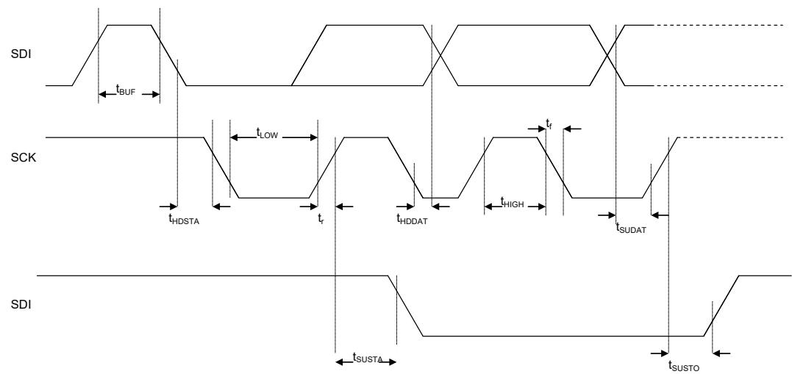  
Figure 14: I²C timing diagram

Table 33: I²C timings   

<table><tr><td rowspan=1 colspan=1> Parameter</td><td rowspan=1 colspan=1>Symbol</td><td rowspan=1 colspan=1>Condition</td><td rowspan=1 colspan=1>Min</td><td rowspan=1 colspan=1>Typ</td><td rowspan=1 colspan=1>Max</td><td rowspan=1 colspan=1>Unit</td></tr><tr><td rowspan=1 colspan=1> SDl setup time</td><td rowspan=1 colspan=1>tsU;DAT</td><td rowspan=1 colspan=1> S&amp;F Mode HS mode</td><td rowspan=1 colspan=1>16030</td><td rowspan=1 colspan=1></td><td rowspan=1 colspan=1></td><td rowspan=1 colspan=1>nsns</td></tr><tr><td rowspan=1 colspan=1> SDI hold time</td><td rowspan=1 colspan=1> tHD;DAT</td><td rowspan=1 colspan=1> S&amp;F Mode, Cb≤100 pF S&amp;F Mode, Cb≤400 pF HS mode, Cb≤100 pF HS mode, Cb≤400 pF</td><td rowspan=1 colspan=1>80901824</td><td rowspan=1 colspan=1></td><td rowspan=1 colspan=1>115150</td><td rowspan=1 colspan=1>nsnsnsns</td></tr><tr><td rowspan=1 colspan=1> SCK low pulse</td><td rowspan=1 colspan=1>tLow</td><td rowspan=1 colspan=1> HS mode, Cb≤100 pF VDDIO = 1.62 V</td><td rowspan=1 colspan=1>160</td><td rowspan=1 colspan=1></td><td rowspan=1 colspan=1></td><td rowspan=1 colspan=1>ns</td></tr><tr><td rowspan=1 colspan=1> SCK low pulse</td><td rowspan=1 colspan=1>tLow</td><td rowspan=1 colspan=1> HS mode, Cb≤100 pF VDDIO = 1.2 V</td><td rowspan=1 colspan=1>210</td><td rowspan=1 colspan=1></td><td rowspan=1 colspan=1></td><td rowspan=1 colspan=1>ns</td></tr></table>

The above-mentioned ${ \mathsf { I } } ^ { 2 } { \mathsf { C } }$ specific timings correspond to the following internal added delays:

Input delay between SDI and SCK inputs: SDI is more delayed than SCK by typically 100 ns in Standard and Fast Modes and by typically 20 ns in High Speed Mode. Output delay from SCK falling edge to SDI output propagation is typically 140 ns in Standard and Fast Modes and typically 70 ns in High Speed Mode.

# 6.4.3 SPI timings

The SPI timing diagram is in Figure 15, while the corresponding values are given in Table 34. All timings apply both to $4 \cdot$ and 3-wire SPI.

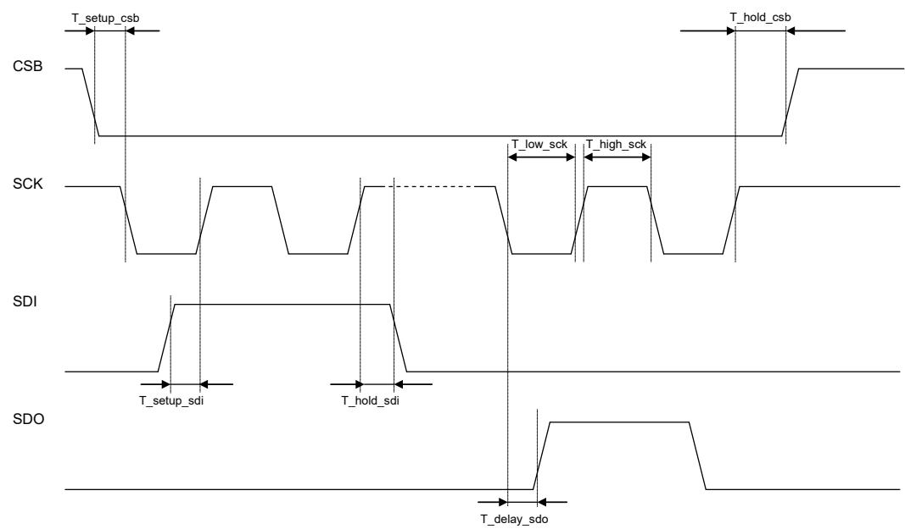  
Figure 15: SPI timing diagram

Table 34: SPI timings   

<table><tr><td rowspan=1 colspan=1> Parameter</td><td rowspan=1 colspan=1>Symbol</td><td rowspan=1 colspan=1>Condition</td><td rowspan=1 colspan=1>Min</td><td rowspan=1 colspan=1>Typ</td><td rowspan=1 colspan=1>Max</td><td rowspan=1 colspan=1>Unit</td></tr><tr><td rowspan=1 colspan=1>SPl clock input frequency</td><td rowspan=1 colspan=1>F_spi</td><td rowspan=1 colspan=1></td><td rowspan=1 colspan=1>0</td><td rowspan=1 colspan=1></td><td rowspan=1 colspan=1>10</td><td rowspan=1 colspan=1> MHz</td></tr><tr><td rowspan=1 colspan=1> SCK low pulse</td><td rowspan=1 colspan=1>T_low_sck</td><td rowspan=1 colspan=1></td><td rowspan=1 colspan=1>20</td><td rowspan=1 colspan=1></td><td rowspan=1 colspan=1></td><td rowspan=1 colspan=1>ns</td></tr><tr><td rowspan=1 colspan=1> SCK high pulse</td><td rowspan=1 colspan=1>T_high_sck</td><td rowspan=1 colspan=1></td><td rowspan=1 colspan=1>20</td><td rowspan=1 colspan=1></td><td rowspan=1 colspan=1></td><td rowspan=1 colspan=1>ns</td></tr><tr><td rowspan=1 colspan=1> SDl setup time</td><td rowspan=1 colspan=1>T_setup_sdi</td><td rowspan=1 colspan=1></td><td rowspan=1 colspan=1>20</td><td rowspan=1 colspan=1></td><td rowspan=1 colspan=1></td><td rowspan=1 colspan=1> ns</td></tr><tr><td rowspan=1 colspan=1>SDI hold time</td><td rowspan=1 colspan=1>T_hold_sdi</td><td rowspan=1 colspan=1></td><td rowspan=1 colspan=1>20</td><td rowspan=1 colspan=1></td><td rowspan=1 colspan=1></td><td rowspan=1 colspan=1>ns</td></tr><tr><td rowspan=1 colspan=1> SDO output delay</td><td rowspan=1 colspan=1>T_delay_sdo</td><td rowspan=1 colspan=1>T_delay_sdo25 pF load, VDDio=1.6 V min</td><td rowspan=1 colspan=1></td><td rowspan=1 colspan=1></td><td rowspan=1 colspan=1>30</td><td rowspan=1 colspan=1> ns</td></tr><tr><td rowspan=1 colspan=1> SDO output delay</td><td rowspan=1 colspan=1>T_delay_sdo</td><td rowspan=1 colspan=1>25 pF load, VDDlo=1.2 V min</td><td rowspan=1 colspan=1></td><td rowspan=1 colspan=1></td><td rowspan=1 colspan=1>40</td><td rowspan=1 colspan=1>ns</td></tr><tr><td rowspan=1 colspan=1> CSB setup time</td><td rowspan=1 colspan=1>T_setup_csb</td><td rowspan=1 colspan=1></td><td rowspan=1 colspan=1>20</td><td rowspan=1 colspan=1></td><td rowspan=1 colspan=1></td><td rowspan=1 colspan=1>ns</td></tr><tr><td rowspan=1 colspan=1> CSB hold time</td><td rowspan=1 colspan=1>T_hold_csb</td><td rowspan=1 colspan=1></td><td rowspan=1 colspan=1>20</td><td rowspan=1 colspan=1></td><td rowspan=1 colspan=1></td><td rowspan=1 colspan=1>ns</td></tr></table>

# 7. Pin-out and connection diagram

7.1 Pin-out

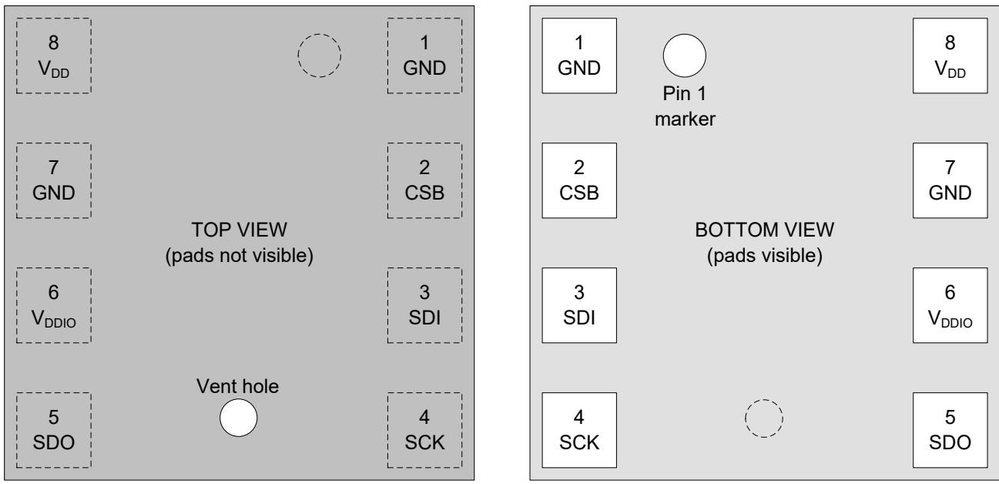  
Figure 16: Pin-out top and bottom view

Note: The pin numbering of BME280 is performed in the untypical clockwise direction when seen in top view and counter-clockwise when seen in bottom view.

Table 35: Pin description   

<table><tr><td rowspan=2 colspan=1>Pin</td><td rowspan=2 colspan=1>Name</td><td rowspan=2 colspan=1> I/O Type</td><td rowspan=2 colspan=1>Description</td><td rowspan=1 colspan=1></td><td rowspan=1 colspan=2>Connect to</td></tr><tr><td rowspan=1 colspan=1> SPI 4W</td><td rowspan=1 colspan=1>SPI 3W</td><td rowspan=1 colspan=1>PC</td></tr><tr><td rowspan=1 colspan=1>1</td><td rowspan=1 colspan=1>GND</td><td rowspan=1 colspan=1> Supply</td><td rowspan=1 colspan=1> Ground</td><td rowspan=1 colspan=1></td><td rowspan=1 colspan=2>GND</td></tr><tr><td rowspan=1 colspan=1>2</td><td rowspan=1 colspan=1>CSB</td><td rowspan=1 colspan=1>In</td><td rowspan=1 colspan=1> Chip select</td><td rowspan=1 colspan=1>CSB</td><td rowspan=1 colspan=1>CSB</td><td rowspan=1 colspan=1>VDDIO</td></tr><tr><td rowspan=1 colspan=1>3</td><td rowspan=1 colspan=1> SDI</td><td rowspan=1 colspan=1> In/Out</td><td rowspan=1 colspan=1> Serial data input</td><td rowspan=1 colspan=1> SDI</td><td rowspan=1 colspan=1> SDI/SDO</td><td rowspan=1 colspan=1> SDA</td></tr><tr><td rowspan=1 colspan=1>4</td><td rowspan=1 colspan=1>SCK</td><td rowspan=1 colspan=1>In</td><td rowspan=1 colspan=1> Serial clock input</td><td rowspan=1 colspan=1>SCK</td><td rowspan=1 colspan=1>SCK</td><td rowspan=1 colspan=1>SCL</td></tr><tr><td rowspan=1 colspan=1>5</td><td rowspan=1 colspan=1> SDO</td><td rowspan=1 colspan=1> In/Out</td><td rowspan=1 colspan=1> Serial data output</td><td rowspan=1 colspan=1> SDO</td><td rowspan=1 colspan=1>DNC</td><td rowspan=1 colspan=1> GND for default address</td></tr><tr><td rowspan=1 colspan=1>6</td><td rowspan=1 colspan=1>VDDIO</td><td rowspan=1 colspan=1>Supply</td><td rowspan=1 colspan=1>Digital / Interface supply</td><td rowspan=1 colspan=3>VDDIO</td></tr><tr><td rowspan=1 colspan=1>7</td><td rowspan=1 colspan=1>GND</td><td rowspan=1 colspan=1> Supply</td><td rowspan=1 colspan=1>Ground</td><td rowspan=1 colspan=3>GND</td></tr><tr><td rowspan=1 colspan=1>8</td><td rowspan=1 colspan=1>VDD</td><td rowspan=1 colspan=1> Supply</td><td rowspan=1 colspan=1> Analog supply</td><td rowspan=1 colspan=3>VDD</td></tr></table>

# 7.2 Connection diagram ${ \mathsf { I } } ^ { 2 } { \mathsf { C } }$

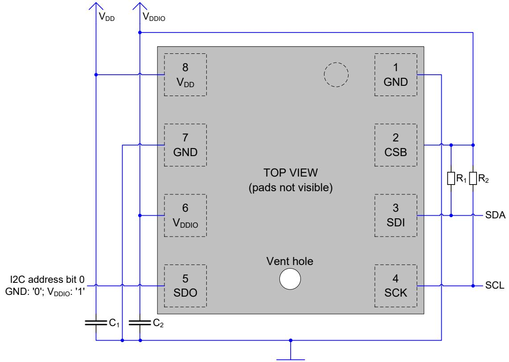  
Figure 17: I²C connection diagram

# Notes:

The recommended value for ${ \mathsf { C } } _ { 1 }$ , ${ \sf C } _ { 2 }$ is 100 nF The value for the pull-up resistors $\mathsf { R } _ { 1 }$ , ${ \sf R } _ { 2 }$ should be based on the interface timing and the bus load; a normal value is $4 . 7 \ k \Omega$ A direct connection between CSB and VDDIO is required

# 7.3 Connection diagram 4-wire SPI

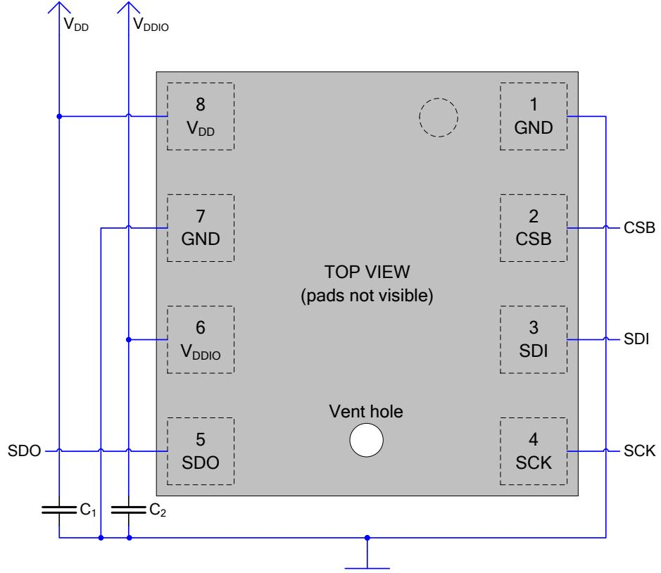  
Figure 18: 4-wire SPI connection diagram

Note: The recommended value for ${ \mathsf { C } } _ { 1 }$ , ${ \sf C } _ { 2 }$ is 100 nF

# 7.4 Connection diagram 3-wire SPI

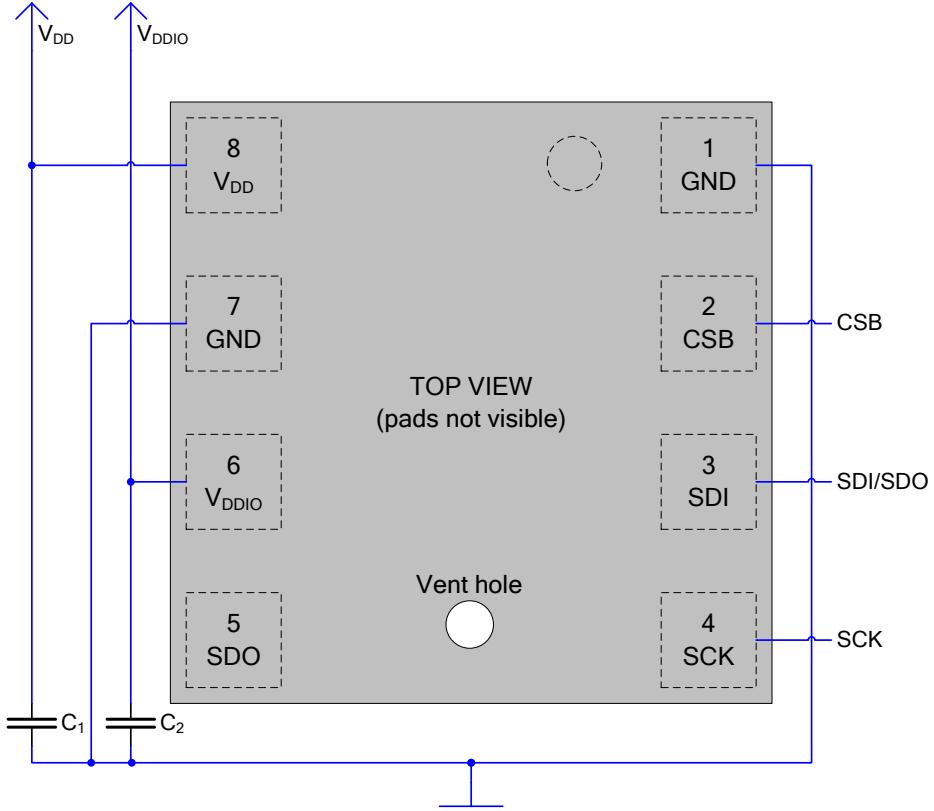  
Figure 19: 3-wire SPI connection diagram

Note: The recommended value for ${ \mathsf { C } } _ { 1 }$ , ${ \sf C } _ { 2 }$ is 100 nF

# 7.5 Package dimensions

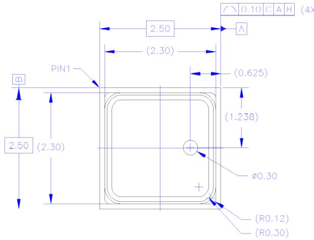

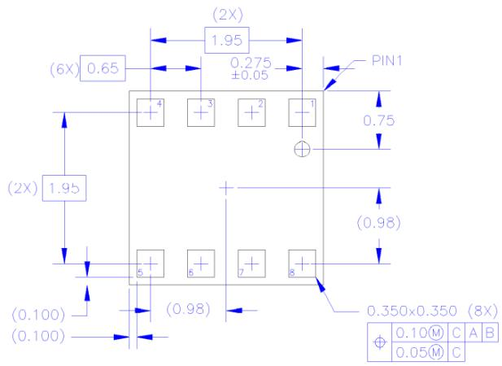

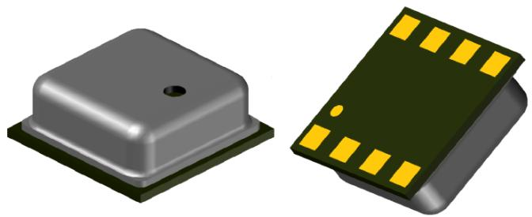

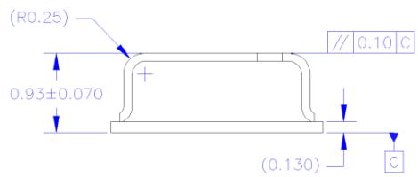  
Figure 20: Package dimensions for top, bottom and side view

<table><tr><td rowspan=1 colspan=2>PACKAGE TYPECAVITY MEMS</td><td rowspan=1 colspan=1>BODY X2.50</td><td rowspan=1 colspan=1>BODY Y2.50</td><td rowspan=1 colspan=1>BODY Z1.00(MAX)</td></tr><tr><td rowspan=1 colspan=1>LGA PITCH0.65</td><td rowspan=1 colspan=2>LGA SIZE0.350x0.350</td><td rowspan=1 colspan=1>LGA COUNT8</td><td rowspan=1 colspan=1>BALL MATRIXN/A</td></tr></table>

# 7.6 Landing pattern recommendation

For the design of the landing pattern, the following dimensioning is recommended:

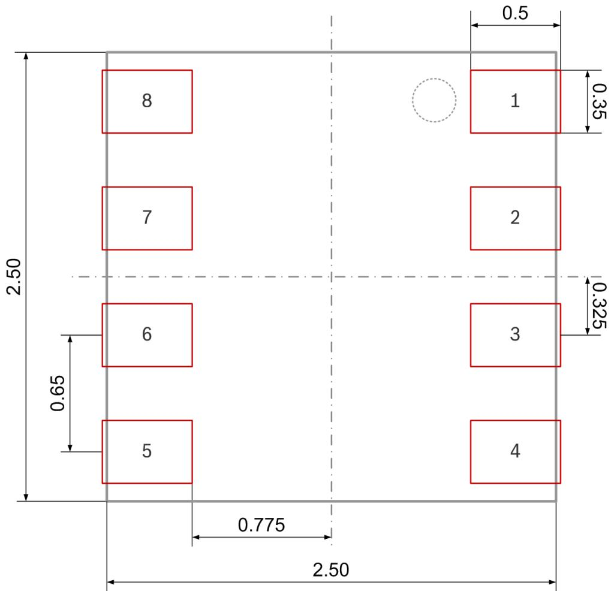  
Figure 21: Recommended landing pattern (top view)

Note: red areas demark exposed PCB metal pads.

In case of a solder mask defined (SMD) PCB process, the land dimensions should be defined by solder mask openings. The underlying metal pads are larger than these openings. In case of a non solder mask defined (NSMD) PCB process, the land dimensions should be defined in the metal layer. The mask openings are larger than these metal pads.

# 7.7 Marking

# 7.7.1 Mass production devices

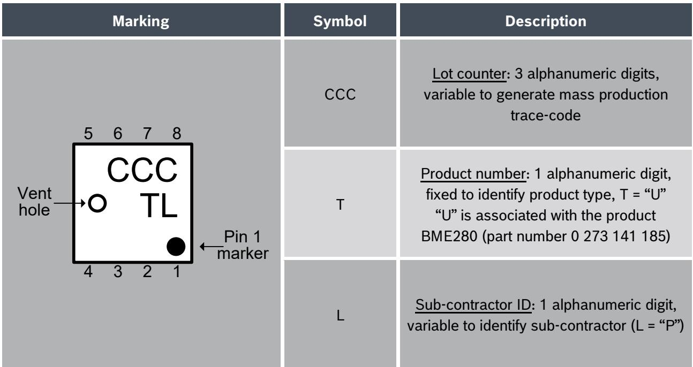

# 7.7.2 Engineering samples

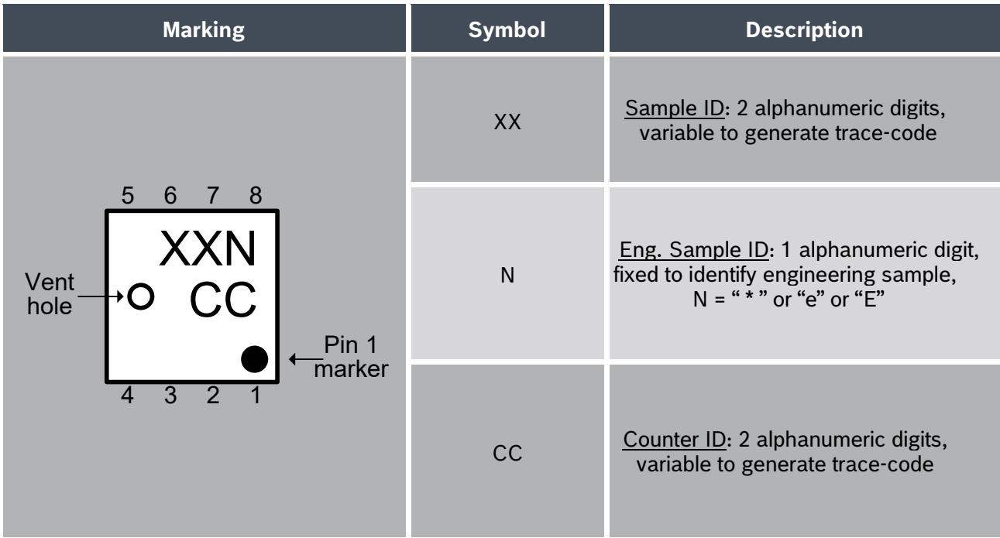

# 7.8 Soldering guidelines and reconditioning recommendations

The moisture sensitivity level of the BME280 sensors corresponds to JEDEC Level 1, see also: • IPC/JEDEC J-STD-020C “Joint Industry Standard: Moisture/Reflow Sensitivity Classification for non-hermetic Solid State Surface Mount Devices” IPC/JEDEC J-STD-033A “Joint Industry Standard: Handling, Packing, Shipping and Use of Moisture/Reflow Sensitive Surface Mount Devices”.

The sensor fulfils the lead-free soldering requirements of the above-mentioned IPC/JEDEC standard, i.e. reflow soldering with a peak temperature up to $2 6 0 ^ { \circ } \mathsf { C }$ . The minimum height of the solder after reflow shall be at least $5 0 \mu \mathrm { m }$ . This is required for good mechanical decoupling between the sensor device and the printed circuit board (PCB).

<table><tr><td rowspan=1 colspan=1>Profile Feature</td><td rowspan=1 colspan=1></td><td rowspan=1 colspan=1>Pb-FreeAssembly</td></tr><tr><td rowspan=1 colspan=1>AverageRamp-UpRate(TsmaxtoTp）</td><td rowspan=1 colspan=1></td><td rowspan=1 colspan=1>3°C/second max.</td></tr><tr><td rowspan=1 colspan=1>Preheat-Temperature Min(Tsmin)-Temperature Max(Tsmax）-Time (tsmin totsmax）</td><td rowspan=1 colspan=1></td><td rowspan=1 colspan=1>150℃200℃60-180 seconds</td></tr><tr><td rowspan=1 colspan=1>Timemaintained above-Temperature (TL)-Time (tL）</td><td rowspan=1 colspan=1></td><td rowspan=1 colspan=1>217℃60-150seconds</td></tr><tr><td rowspan=1 colspan=1>Peak/Classification Temperature(Tp)</td><td rowspan=1 colspan=1></td><td rowspan=1 colspan=1>260℃</td></tr><tr><td rowspan=1 colspan=1>Timewithin5Cofactual PeakTemperature (tp)</td><td rowspan=1 colspan=1></td><td rowspan=1 colspan=1>20-40 seconds</td></tr><tr><td rowspan=1 colspan=1>Ramp-Down Rate</td><td rowspan=1 colspan=1></td><td rowspan=1 colspan=1>6C/second max.</td></tr><tr><td rowspan=1 colspan=1>Time25CtoPeakTemperature</td><td rowspan=1 colspan=1></td><td rowspan=1 colspan=1>8 minutes max.</td></tr></table>

Note1:Alltmperaturesrefertotopsideofthepackagemeasuredonthepackagebodysurface.

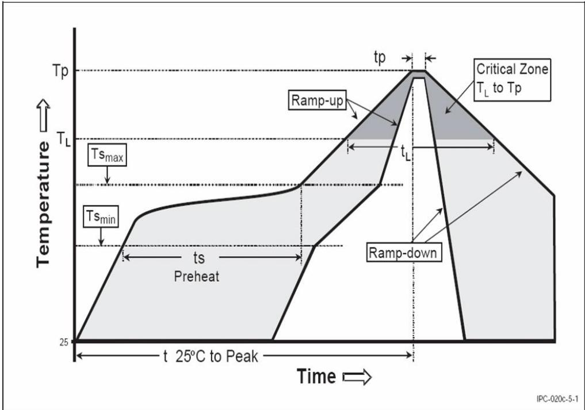  
Figure 22: Soldering profile

# 7.9 Reconditioning Procedure

After exposing the device to operating conditions, which exceed the limits specified in section 1.2, e.g. after reflow, the humidity sensor may possess an additional offset. Therefore the following reconditioning procedure is mandatory to restore the calibration state:

1. Dry-Baking: $12 0 ~ ^ { \circ } \mathrm { C }$ at $\textless 5 \%$ rH for $^ { 2 \mathfrak { h } }$   
2. Re-Hydration: $7 0 ~ ^ { \circ } \mathsf { C }$ at $75 \%$ rH for $6 \mathfrak { h }$

or alternatively

1. Dry-Baking: $12 0 ~ ^ { \circ } \mathrm { C }$ at $\textless 5 \%$ rH for $^ { 2 \textrm { h } }$   
2. Re-Hydration: ${ } ^ { 2 5 } { } ^ { \circ } \mathsf { C }$ at $7 5 \%$ rH for $2 4 ~ \mathsf { h }$

or alternatively after solder reflow only

1. Do not perform Dry-Baking   
2. Ambient Re-Hydration: ${ \sim } 2 5 ^ { \circ } \mathsf C$ at ${ > } 4 0 \%$ rH for $\mathtt { > 5 d }$

# 7.10 Tape and reel specification

# 7.10.1 Dimensions

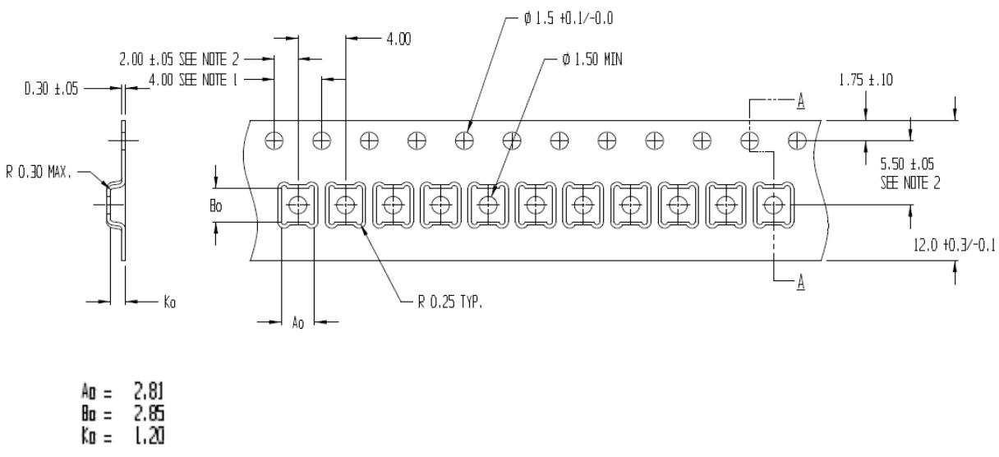  
Figure 23: Tape and Reel dimensions

Quantity per reel: 10 kpcs.

7.10.2 Orientation within the reel

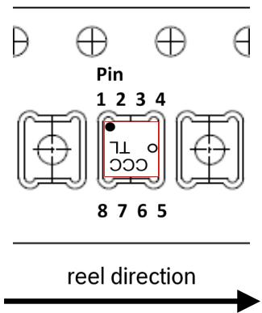  
Figure 24: Orientation within tape

# 7.11 Mounting and assembly recommendations

In order to achieve the specified performance for you design, the following recommendations and the “Handling, soldering & mounting instructions BME280” should be taken into consideration when mounting a pressure sensor on a printed-circuit board (PCB):

The clearance above the metal lid shall be $0 . 1 \mathsf { m m }$ at minimum.   
For the device housing appropriate venting needs to be provided in case the ambient pressure shall be measured.   
Liquids shall not come into direct contact with the device.   
During operation the sensor chip is sensitive to light, which can influence the accuracy of the measurement (photo-current of silicon). The position of the vent hole minimizes the light exposure of the sensor chip. Nevertheless, Bosch Sensortec recommends avoiding the exposure of BME280 to strong light sources.   
Soldering may not be done using vapor phase processes since the sensor will be damaged by the liquids used in these processes.

# 7.12 Environmental safety

# 7.12.1 RoHS

The BME280 sensor meets the requirements of the EC restriction of hazardous substances (RoHS) directive, see also:

RoHS–Directive 2011/65/EU and its amendments, including the amendment 2015/863/EU on the restriction of the use of certain hazardous substances in electrical and electronic equipment.

# 7.12.2 Halogen content

The BME280 is halogen-free. For more details on the analysis results please contact your Bosch Sensortec representative.

# 7.12.3 Internal package structure

Within the scope of Bosch Sensortec’s ambition to improve its products and secure the mass product supply, Bosch Sensortec qualifies additional sources (e.g. $2 ^ { \mathsf { n d } }$ source) for the package of the BME280.

While Bosch Sensortec took care that all of the technical packages parameters are described above are $100 \%$ identical for all sources, there can be differences in the chemical content and the internal structural between the different package sources.

However, as secured by the extensive product qualification process of Bosch Sensortec, this has no impact to the usage or to the quality of the BME280 product.

# 8. Appendix A: Alternative compensation formulas

8.1 Compensation formulas in double precision floating point

Please note that it is strongly advised to use the API available from Bosch Sensortec to perform readout and compensation. If this is not wanted, the code below can be applied at the user’s risk. Both pressure and temperature values are expected to be received in 20 bit format, positive, stored in a 32 bit signed integer. Humidity is expected to be received in 16 bit format, positive, stored in a 32 bit signed integer.

The variable t_fine (signed 32 bit) carries a fine resolution temperature value over to the pressure compensation formula and could be implemented as a global variable.

The data type “BME280_S32_t” should define a 32 bit signed integer variable type and could usually be defined as “long signed int”. The revision of the code is rev. 1.1 (pressure and temperature) and rev. 1.0 (humidity).

Compensating the measurement value with double precision gives the best possible accuracy but is only recommended for PC applications.

// Returns temperature in DegC, double precision. Output value of $" 5 1 . 2 3 \prime \prime$ equals 51.23 DegC.   
// t_fine carries fine temperature as global value   
BME280_S32_t t_fine;   
double BME280_compensate_T_double(BME280_S32_t adc_T) double var1, var2, T; var1 $=$ (((double)adc_T)/16384.0 – ((double)dig_T1)/1024.0) $\star$ ((double)dig_T2); var2 $=$ ((((double)adc_T)/131072.0 – ((double)dig_T1)/8192.0) \* (((double)adc_T)/131072.0 – ((double) dig_T1)/8192.0)) \* ((double)dig_T3); t_fine $=$ (BME280_S32_t)(var1 $^ +$ var2); $\bar { \mathrm { ~ \tt ~ T ~ } } ^ { - } =$ (var1 $^ +$ var2) / 5120.0; return T;   
  
// Returns pressure in Pa as double. Output value of “96386.2” equals 96386.2 Pa $=$ 963.862 hP   
double BME280_compensate_P_double(BME280_S32_t adc_P) double var1, var2, p; var1 $=$ ((double)t_fine/2.0) – 64000.0; var2 $=$ var1 \* var1 $\star$ ((double)dig_P6) / 32768.0; var2 $=$ var2 $^ +$ var1 $\star$ ((double)dig_P5) $\star$ 2.0; var2 $=$ (var2/4.0)+(((double)dig_P4) \* 65536.0); var1 $=$ (((double)dig_P3) $\star$ var1 \* var1 / 524288.0 $^ +$ ((double)dig_P2) $\star$ var1) / 524288.0; var1 $=$ (1.0 + var1 / 32768.0)\*((double)dig_P1); if (var1 == 0.0) { return 0; // avoid exception caused by division by zero } $\texttt { p } = \texttt { l } 0 4 8 5 7 6 . 0 \texttt { - }$ (double)adc_P; $\mathrm { ~ p ~ } =$ (p – (var2 / 4096.0)) \* 6250.0 / var1; var1 $=$ ((double)dig_P9) \* p \* p / 2147483648.0; var2 $=$ p \* ((double)dig_P8) / 32768.0; $\mathrm { ~ p ~ } = \mathrm { ~ p ~ } ^ { \mathrm { ~ + ~ } }$ (var1 $^ +$ var2 + ((double)dig_P7)) / 16.0; return p;   
}   
// Returns humidity in %rH as as double. Output value of “46.332” represents 46.332 %rH   
double bme280_compensate_H_double(BME280_S32_t adc_H); double var_H; var_H $=$ (((double)t_fine) – 76800.0); var_H $=$ (adc_H – (((double)dig_H4) \* 64.0 $^ +$ ((double)dig_H5) / 16384.0 \* var_H)) \* (((double)dig_H2) / 65536.0 $\star$ (1.0 + ((double)dig_H6) / 67108864.0 \* var_H \* (1.0 + ((double)dig_H3) / 67108864.0 $\star$ var_H))); var_H $=$ var_H \* (1.0 – ((double)dig_H1) $\star$ var_H / 524288.0); if (var_H > 100.0) var_H $=$ 100.0; else if $( \mathtt { v a r \_ H } < \ 0 . 0 )$ var_H = 0.0;   
return var_H;   
}

# 8.2 Pressure compensation in 32 bit fixed point

Please note that it is strongly advised to use the API available from Bosch Sensortec to perform readout and compensation. If this is not wanted, the code below can be applied at the user’s risk. Both pressure and temperature values are expected to be received in 20 bit format, positive, stored in a 32 bit signed integer.

The variable t_fine (signed 32 bit) carries a fine resolution temperature value over to the pressure compensation formula and could be implemented as a global variable.

The data type “BME280_S32_t” should define a 32 bit signed integer variable type and can usually be defined as “long signed int”.

The data type “BME280_U32_t” should define a 32 bit unsigned integer variable type and can usually be defined as “long unsigned int”.

Compensating the pressure value with 32 bit integer has an accuracy of typically 1 Pa (1-sigma). At high filter levels this adds a significant amount of noise to the output values and reduces their resolution.

// Returns temperature in DegC, resolution is 0.01 DegC. Output value of “5123” equals 51.23   
DegC.   
// t_fine carries fine temperature as global value   
BME280_S32_t t_fine;   
BME280_S32_t BME280_compensate_T_int32(BME280_S32_t adc_T)   
BME280_S32_t var1, var2, T; var1 $\stackrel { - } { = }$ ((((adc_ $\mathbb { T } > > 3$ ) – ((BME280_S32_t)dig_ $\mathbb { T } \mathbb { 1 } < < \mathbb { 1 }$ ))) \* ((BME280_S32_t)dig_T2)) >> 11; var2 $=$ (((((adc_T>>4) – ((BME280_S32_t)dig_T1)) \* ((adc_ $\mathbb { T } { > } { > } 4$ ) – ((BME280_S32_t)dig_T1)))   
$> > ~ 1 2$ ) \* ((BME280_S32_t)dig_T3)) $> > ~ 1 4$ ; t_fi $\mathsf { \Omega } _ { 1 \ominus } = \mathsf { \Omega } \cdot \mathsf { \Omega }$ var1 $^ +$ var2; T = (t_fine \* 5 + 128) >> 8; return T;   
1   
// Returns pressure in Pa as unsigned 32 bit integer. Output value of “96386” equals 96386 Pa   
$= 9 6 3 . 8 6 $ hPa   
BME280_U32_t BME280_compensate_P_int32(BME280_S32_t adc_P) BME280_S32_t var1, var2; BME280_U32_t p; var1 $=$ (((BME280_S32_t)t_fine) $> > 1$ ) – (BME280_S32_t)64000; var2 $=$ (((var1>>2) \* (var1>>2)) $> >$ 11 ) $\star$ ((BME280_S32_t)dig_P6); var2 $=$ var2 + ((var1\*((BME280_S32_t)dig_P5)) $< < 1$ ); var2 $=$ $( \mathtt { v a r } 2 > > 2$ )+(((BME280_S32_t)dig_P4) $< < 1 6$ ); var1 $=$ (((dig_P3 \* (((var1>>2) \* (var $. > > 2$ )) $> >$ 13 )) $> > 3$ ) $^ +$ ((((BME280_S32_t)dig_P2) \*   
var1) $> > 1$ )) $> > 1 8$ ; var1 $=$ ((((32768+var1))\*((BME280_S32_t)dig_P1)) ${ > } { > } 1 5$ ); if ( $\mathtt { v a r 1 } \ = = \ 0$ ) { return 0; // avoid exception caused by division by zero } p = (((BME280_U32_t)(((BME280_S32_t)1048576)-adc_P)-(var $2 > > 1 2$ ))) $^ { \star } 3 1 2 5$ ; if (p < 0x80000000) { p = (p << 1) / ((BME280_U32_t)var1); } else { p = (p / (BME280_U32_t)var1) \* 2; } var1 $=$ (((BME280_S32_t)dig_P9) \* ((BME280_S32_t)(( $( \mathtt { p } ) > > 3$ ) $\star$ ( $_ { \mathtt { p } > > 3 }$ )) $> > 1 3$ ))) $> > 1 2$ ; var2 $=$ (((BME280_S32_t)(p>>2)) \* ((BME280_S32_t)dig_P8)) ${ > } { > } 1 3$ ; p = (BME280_U32_t)((BME280_S32_t)p $^ +$ ((var1 $^ +$ var2 + dig_P7) >> 4)); return p;

# 9. Appendix B: Measurement time and current calculation

In this chapter, formulas are given to calculate measurement rate, filter bandwidth and current consumption in different settings.

# 9.1 Measurement time

The active measurement time depends on the selected values for humidity, temperature and pressure oversampling and can be calculated in milliseconds using the formulas below.

$$
\begin{array} { l } { { t _ { m e a s u r e , t y p } = 1 + [ 2 \cdot T _ { - } o v e r s a m p l i n g ] _ { o s r s \_ t \neq 0 } + [ 2 \cdot P _ { - } o v e r s a m p l i n g + 0 . 5 ] _ { o s r s \_ p \neq 0 } } } \\ { { + [ 2 \cdot H _ { - } o v e r s a m p l i n g + 0 . 5 ] _ { o s r s \_ h \neq 0 } } } \end{array}
$$

$$
\begin{array} { r l } & { t _ { m e a s u r e , m a x } = 1 . 2 5 + [ 2 . 3 \cdot T _ { - } o v e r s a m p l i n g ] _ { o s r s , t \neq 0 } + [ 2 . 3 \cdot P _ { - } o v e r s a m p l i n g + 0 . 5 7 5 ] _ { o s r s , p \neq 0 } } \\ & { \qquad + [ 2 . 3 \cdot H _ { - } o v e r s a m p l i n g + 0 . 5 7 5 ] _ { o s r s , h \neq 0 } } \end{array}
$$

For example, using temperature oversampling $\times 1$ , pressure oversampling $\times 4$ and no humidity measurement, the measurement time is:

$$
t _ { m e a s u r e , t y p } = 1 + [ 2 \cdot 1 ] + [ 2 \cdot 4 + 0 . 5 ] + [ 0 ] = 1 1 . 5  { \mathrm { m s } }
$$

$$
t _ { m e a s u r e , m a x } = 1 . 2 5 + [ 2 . 3 \cdot 1 ] + [ 2 . 3 \cdot 4 + 0 . 5 7 5 ] + [ 0 ] = 1 3 . 3 2 5 \mathrm { m s }
$$

# 9.2 Measurement rate in forced mode

In forced mode, the measurement rate depends on the rate at which it is forced by the master. The highest possible frequency in $\mathsf { H z }$ can be calculated as:

$$
O D R _ { m a x , f o r c e d } = \frac { 1 0 0 0 } { t _ { m e a s u r e } }
$$

If measurements are forced faster than they can be executed, the data rate saturates at the attainable data rate. For the example above with 11.5 ms measurement time, the typically achievable output data rate would be:

$$
O D R _ { m a x , f o r c e d } = { \frac { 1 0 0 0 } { 1 1 . 5 } } = 8 7 ~ { \mathrm { H z } }
$$

# 9.3 Measurement rate in normal mode

The measurement rate in normal mode depends on the measurement time and the standby time and can be calculated in $\mathsf { H } z$ using the following formula:

$$
O D R _ { n o r m a l \_ m o d e } = \frac { 1 0 0 0 } { t _ { m e a s u r e } + t _ { s t a n d b y } }
$$

The accuracy of tstandby is described in the specification parameter Δtstandby. For the example above with 11.5 ms measurement time, setting normal mode with a standby time of 62.5 ms would result in a data rate of:

$$
O D R _ { n o r m a l . m o d e } = \frac { 1 0 0 0 } { 1 1 . 5 + 6 2 . 5 } = 1 3 . 5 1 \mathrm { H z }
$$

# 9.4 Response time using IIR filter

When using the IIR filter, the response time of the sensor depends on the selected filter coefficient and the data rate used. It can be calculated using the following formula:

$$
t _ { r e s p o n s e , 7 5 \% } = \frac { 1 0 0 0 \cdot n _ { s a m p l e s , 7 5 \% } } { O D R }
$$

For the example above with a data rate of $1 3 . 5 1 \ H z$ , the user could select a filter coefficient of 8. According to Table 6, the number of samples needed to reach $75 \%$ of a step response using this filter setting is 11. The response time with filter is therefore:

$$
t _ { r e s p o n s e , 7 5 \% } = { \frac { 1 0 0 0 \cdot 1 1 } { 1 3 . 5 1 } } = 8 1 4 { \mathrm { ~ m s } }
$$

# 9.5 Current consumption

The current consumption depends on the selected oversampling settings, the measurement rate and the sensor mode, but not on the IIR filter setting. It can be calculated as:

$$
\begin{array} { r l } & { I _ { D D , f o r c e d } = I _ { D D S L } \cdot ( 1 - t _ { m e a s u r e } \cdot O D R ) + \frac { O D R } { 1 0 0 0 } } \\ & { \qquad \cdot \left( 2 0 5 + I _ { D D T } \cdot [ 2 \cdot T _ { - } O v e r s a m p l i n g ] _ { o s r s , t \neq 0 } + I _ { D D P } \cdot [ 2 \cdot P _ { - } o v e r s a m p l i n g + 0 . 5 ] _ { o s r s } \right. } \\ & { \qquad \left. + I _ { D D H } \cdot [ 2 \cdot H _ { - } o v e r s a m p l i n g + 0 . 5 ] _ { o s r s , h \neq 0 } \right) } \end{array}
$$

$$
\begin{array} { r l } & { I _ { D D , n o r m a l } = I _ { D D S B } \cdot ( 1 - t _ { m e a s u r e } \cdot O D R ) + \frac { O D R } { 1 0 0 0 } } \\ & { \qquad \cdot \left( 2 0 5 + I _ { D D T } \cdot [ 2 \cdot T _ { - } o v e r s a m p l i n g ] _ { o s r s , t \neq 0 } + I _ { D D P } \cdot [ 2 \cdot P _ { - } o v e r s a m p l i n g + 0 . 5 ] _ { o s r s } \right. } \\ & { \qquad \left. + I _ { D D H } \cdot [ 2 \cdot H _ { - } o v e r s a m p l i n g + 0 . 5 ] _ { o s r s , h \neq 0 } \right) } \end{array}
$$

Note that the only difference between forced and normal mode current consumption is that the current for the inactive time is either IDDSL or IDDSB. For the example above, the current would be

$$
\begin{array} { l } { { I _ { D D , n o r m a l } = 0 . 2 \cdot \left( 1 - 0 . 0 1 1 5 \cdot 1 3 . 5 1 \right) + { \displaystyle \frac { 1 3 . 5 1 } { 1 0 0 0 } } \left( 2 0 5 + 3 5 0 \cdot [ 2 \cdot 1 ] + 7 1 4 \cdot [ 2 \cdot 4 + 0 . 5 ] + [ 0 ] \right) } } \\ { { \displaystyle \qquad = 0 . 2 \cdot \left( 0 . 8 4 5 \right) + { \displaystyle \frac { 1 3 . 5 1 } { 1 0 0 0 } } \left( 2 0 5 + 7 0 0 + 6 0 6 9 + 0 \right) } } \\ { { \displaystyle \qquad = 0 . 2 + 9 4 . 2 = 9 4 . 4 \cdot \mathrm { { u A } } } } \end{array}
$$

# 10. Self test

The following chapter provides an explanation to the self-test code for the Bosch Sensortec BME280. The code itself refers to the API (Application Programming Interface) of the sensor, which can be obtained from Bosch Sensortec and is also included in this release package.

# 10.1 Self-test flow

The self-test starts by performing a soft reset of the device. After this, Chip-ID and trimming data are read and verified. Then temperature and pressure are measured and compared against customisable plausibility limits. A flow chart is given below.

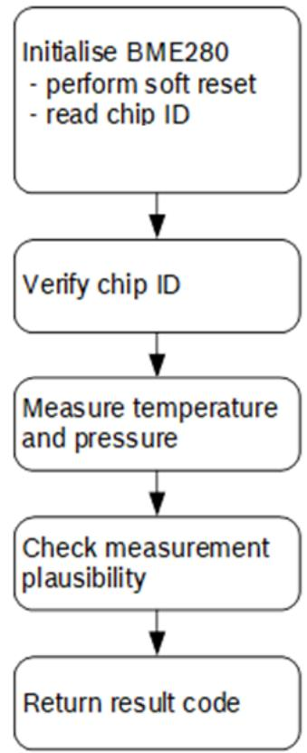  
Figure 25: Self-test flow chart

# 10.2 Function return codes

A list of the possible function return codes can be found below.

0 Sensor OK   
10 Communication error or wrong device found   
20 Trimming data out of bound   
30 Temperature bond wire failure or MEMS defect   
31 Pressure bond wire failure or MEMS defect   
40 Implausible temperature (default limits: $0 . . . 4 0 ^ { \circ } \mathrm { C } )$ )   
41 Implausible pressure (default limits: $9 0 0 . . . 1 1 0 0 \mathsf { h P a } )$   
42 Implausible humidity (default limits: $2 0 . . . 8 0 \% r \mathsf { H } )$

Error testing is done in ascending error code sequence. This means that if e.g. a trimming data error is detected (code 20), the temperature plausibility (code 40) is not checked anymore. Instead, error code 20 is returned and no others tests are performed.

# 10.3 Usage

# 10.3.1 File and function pointer integration

$\blacktriangleright$ Include bme280.c in your programming environment and add the path to the compiler. $\blacktriangleright$ Include bme280_selftest.c in your programming environment and add the path to the compiler. $\blacktriangleright$ Modify the lines with read/write function pointer to match your system. Sample functions are given in chapter 10.5:

bme280.bus_read $=$ BME280_I2C_bus_read; // must be defined by customer bme280.bus_write $=$ BME280_I2C_bus_write; // must be defined by customer bme280.delay_msec $=$ BME280_delay_msec; // must be defined by customer

If necessary, adapt the measurement plausibility limits in bme280_selftest.h. The default limits are $0 . . . 4 0 ^ { \circ } \mathrm { C }$ for temperature and 900…1100 hPa for pressure measurement.

$\blacktriangleright$ If you are using $1 ^ { 2 } \mathsf { C }$ communication with the address 0x77 (SDO pin high), then change the BME280.h line

#define BME280_I2C_ADDRESS BME280_I2C_ADDRESS1 into #define BME280_I2C_ADDRESS BME280_I2C_ADDRESS2

# 10.3.2 Function call

Call the self test function using:

unsigned char testresult;   
testresult $=$ bme280_selftest();

A test result of 0 indicates no error. The other return codes are detailed in chapter 10.2.

# 10.3.3 Test time and interface requirements

The self test uses a total wait time of 9 milliseconds. Of this, 2 milliseconds are used as wait time for soft reset and 7 milliseconds are used as wait time for conversion. The soft reset is performed in order to erase any possible old settings and could be omitted if the sensor is known to be in an untouched state after power on.

In the self test function, 4 write commands and 6 read commands are issued. In total, 4 bytes are written and 34 bytes are read. Assuming burst read is used, the following time duration can be expected for communication including overhead:

$\blacktriangleright$ 6.0 ms for I²C at $1 0 0 ~ \mathsf { k H z }$   
$\blacktriangleright$ 1.5 ms for I²C at $4 0 0 ~ \mathsf { k H z }$   
$\blacktriangleright$ 0.5 ms for SPI at 1 MHz

Assuming a $4 0 0 k H z 1 ^ { 2 } C$ interface with burst reads, the total function run time therefore equals 10.5 milliseconds.

# 10.4 Function explanation

# 10.4.1 Communication test

This function attempts to read the Chip ID. If it is correct, a functioning communication is assumed.   
Note that the write function functionality is not explicitly tested.

# 10.4.2 Bond wire test

A pressure and temperature measurement is performed and uncompensated pressure and temperature values are read out. If the measurement results are clipped to the respective minimum or maximum ADC values, this is usually caused by defective bond wires. However, a defective sensing element could also cause this test to fail.

Please note that some combinations of bond wire or sensing element defects do not result in clipping of the measurement value and will therefore not be detected with this test. These cases can be detected by the plausibility test instead.

# 10.4.3 Measurement plausibility test

The pressure and temperature values read out previously are compensated using the read out compensation parameters. The compensated temperature and pressure is compared against plausibility limits set in bme280_selftest.h, which must be set to match the customer production environment. Please use the the plausibility limits as described in chapter 3.

# 10.5 Sample read, write and delay function

Below some samples read, write and delay functions are given. These are platform dependant and should only give an idea of how the functions could look.

signed char BME280_I2C_bus_read(unsigned char device_addr, unsigned char reg_addr, unsigned char \*reg_data, unsigned char cnt)   
{ int iError ${ \boldsymbol { \mathbf { \mathit { \sigma } } } } = 0$ ; unsigned char array[I2C_BUFFER_LEN]; unsigned char stringpos; array[0] $=$ reg_addr; iError $=$ I2C_write_read_string(I2C0, device_addr, array, array, 1, cnt) for(stringpos ${ \ o } = 0$ ;stringpos<cnt;stringpos $^ { + + }$ ) { \*(reg_data $^ +$ stringpos) $=$ array[stringpos]; 1 return (signed char)iError;   
}   
signed char BME280_I2C_bus_write(unsigned char device_addr, unsigned char reg_addr, unsigned char \*reg_data, unsigned char cnt)   
{ int iError ${ \boldsymbol { \mathbf { \mathit { \sigma } } } } = 0$ ; unsigned char array[I2C_BUFFER_LEN]; unsigned char stringpos; array[0] $=$ reg_addr; for(stringpos ${ \mathfrak { s } } = 0$ ;stringpos<cnt;stringpo $\hphantom { 0 } \ 3 + +$ ) { array[stringpos $^ { + 1 }$ ] $\qquad = ~ { \star }$ (reg_data $^ +$ stringpos); } iError $=$ I2C_write_string(I2C0, device_addr, array, cnt $^ { + 1 }$ ); return (signed char)iError;   
}   
void BME280_delay_msec(BME280_U16_t msec) //delay in milliseconds   
{ BME280_U32_t counter; for (counter $\qquad = \quad 0$ ; counter/2000 $<$ msec; counter $^ { + + }$ ); // 2000 counts = 1   
msec   
}

# 11. Legal disclaimer

# 11.1 Engineering samples

Engineering Samples are marked with an asterisk (\*), (E) or (e). Samples may vary from the valid technical specifications of the product series contained in this data sheet. They are therefore not intended or fit for resale to third parties or for use in end products. Their sole purpose is internal client testing. The testing of an engineering sample may in no way replace the testing of a product series. Bosch Sensortec assumes no liability for the use of engineering samples. The Purchaser shall indemnify Bosch Sensortec from all claims arising from the use of engineering samples.

# 11.2 Product use

Bosch Sensortec products are developed for the consumer goods industry. They may only be used within the parameters of this product data sheet. They are not fit for use in life-sustaining or safetycritical systems. Safety-critical systems are those for which a malfunction is expected to lead to bodily harm, death or severe property damage. In addition, they shall not be used directly or indirectly for military purposes (including but not limited to nuclear, chemical or biological proliferation of weapons or development of missile technology), nuclear power, deep sea or space applications (including but not limited to satellite technology).

Bosch Sensortec products are released on the basis of the legal and normative requirements relevant to the Bosch Sensortec product for use in the following geographical target market: BE, BG, DK, DE, EE, FI, FR, GR, IE, IT, HR, LV, LT, LU, MT, NL, AT, PL, PT, RO, SE, SK, SI, ES, CZ, HU, CY, US, CN, JP, KR, TW. If you need further information or have further requirements, please contact your local sales contact.

The resale and/or use of Bosch Sensortec products are at the purchaser’s own risk and his own responsibility. The examination of fitness for the intended use is the sole responsibility of the purchaser.

The purchaser shall indemnify Bosch Sensortec from all third party claims arising from any product use not covered by the parameters of this product data sheet or not approved by Bosch Sensortec and reimburse Bosch Sensortec for all costs in connection with such claims.

The purchaser accepts the responsibility to monitor the market for the purchased products, particularly with regard to product safety, and to inform Bosch Sensortec without delay of all safety-critical incidents.

# 11.3 Application examples and hints

With respect to any examples or hints given herein, any typical values stated herein and/or any information regarding the application of the device, Bosch Sensortec hereby disclaims any and all warranties and liabilities of any kind, including without limitation warranties of non-infringement of intellectual property rights or copyrights of any third party. The information given in this document shall in no event be regarded as a guarantee of conditions or characteristics. They are provided for illustrative purposes only and no evaluation regarding infringement of intellectual property rights or copyrights or regarding functionality, performance or error has been made.

# 12. Document history and modification

<table><tr><td rowspan=1 colspan=1>Rev.NoPage</td><td rowspan=1 colspan=1>Page</td><td rowspan=1 colspan=1>Description of modification/changes</td><td rowspan=1 colspan=1>Date</td></tr><tr><td rowspan=1 colspan=1>0.1</td><td rowspan=1 colspan=1></td><td rowspan=1 colspan=1>Document creation</td><td rowspan=1 colspan=1>2012-11-06</td></tr><tr><td rowspan=1 colspan=1>1.0</td><td rowspan=1 colspan=1></td><td rowspan=1 colspan=1> Final datasheet</td><td rowspan=1 colspan=1>2014-11-12</td></tr><tr><td rowspan=1 colspan=1>1.1</td><td rowspan=1 colspan=1>48</td><td rowspan=1 colspan=1> Updated RoHS directive to 2011/65/EU effective 8 June 2011</td><td rowspan=1 colspan=1>2015-05-07</td></tr><tr><td rowspan=1 colspan=1>1.2</td><td rowspan=1 colspan=1>2,3</td><td rowspan=1 colspan=1> Adjusted target devices, applications</td><td rowspan=1 colspan=1>2015-10-15</td></tr><tr><td rowspan=1 colspan=1>1.4</td><td rowspan=1 colspan=1></td><td rowspan=1 colspan=1> Minor corrections</td><td rowspan=1 colspan=1>2018-01-17</td></tr><tr><td rowspan=1 colspan=1>1.5</td><td rowspan=1 colspan=1></td><td rowspan=1 colspan=1> Template update</td><td rowspan=1 colspan=1>2018-09-17</td></tr><tr><td rowspan=1 colspan=1>1.8</td><td rowspan=1 colspan=1>Chapter 10</td><td rowspan=1 colspan=1> Updated legal disclaimer</td><td rowspan=1 colspan=1>2020-03-12</td></tr><tr><td rowspan=1 colspan=1>1.9</td><td rowspan=1 colspan=1> Chapter 10</td><td rowspan=1 colspan=1> Update disclaimer</td><td rowspan=1 colspan=1>2020-11-23</td></tr><tr><td rowspan=1 colspan=1>1.10</td><td rowspan=1 colspan=1> Chapter 10</td><td rowspan=1 colspan=1> New added chapter self-test disclaimer now 11</td><td rowspan=1 colspan=1>2021-03-18</td></tr><tr><td rowspan=1 colspan=1>1.21</td><td rowspan=1 colspan=1> Chapter 1.4</td><td rowspan=1 colspan=1> New typical accuracy</td><td rowspan=1 colspan=1>2021-07-22</td></tr><tr><td rowspan=1 colspan=1>1.22</td><td rowspan=1 colspan=1> Chapter 7.12</td><td rowspan=1 colspan=1> Update of ROHS directive</td><td rowspan=1 colspan=1>2021-10-22</td></tr><tr><td rowspan=1 colspan=1>1.23</td><td rowspan=1 colspan=1>1.4</td><td rowspan=1 colspan=1> Final Temperature spec</td><td rowspan=1 colspan=1>2022-01-22</td></tr><tr><td rowspan=1 colspan=1>1.24</td><td rowspan=1 colspan=1>Chapter 2</td><td rowspan=1 colspan=1>Remove condensation</td><td rowspan=1 colspan=1>2024-02-20</td></tr></table>

contact@bosch-sensortec.com www.bosch-sensortec.com

Modifications reserved   
Document number: BST-BME280-DS001-24   
Revision_1.24_022024