# BMP280 Digital Pressure Sensor

# BMP280 – Data sheet

1.26

Document revision   
Document release date   
Document number   
Sales part number   
Ordering code   
Notes   
October 2021   
BST-BMP280-DS001-26   
0 273 300 436   
0.273.300.436-1NV

Data and descriptions in this document are subject to change without notice. Product photos and pictures are for illustration purposes only and may differ from the real product appearance

# BMP280 Digital Pressure Sensor

# Key parameters

• Pressure range

300 … 1100 hPa (equiv. to $+ 9 0 0 0 { \dots } { \cdot } 5 0 0 \ \mathrm { m }$ above/below sea level)

• Package

8-pin LGA metal-lid Footprint : $2 . 0 \times 2 . 5 ~ \mathsf { m m } ^ { 2 }$ , height: $0 . 9 5 ~ \mathsf { m m }$

$\pm 0 . 1 2 \mathsf { h P a }$ , equiv. to ±1 m

Absolute accuracy (950 ...1050 hPa, 0 ... $+ 4 0 ~ ^ { \circ } \mathrm { C } )$

typ. ±1 hPa

Temperature coefficient offset (25 ... $4 0 ^ { \circ } \mathsf { C }$ $ @ 9 0 0 \mathsf { h P a } )$

$1 . 5 \ \mathsf { P a } / \mathsf { K }$ , equiv. to $1 2 . 6 ~ \mathsf { c m } / \mathsf { K }$

• Digital interfaces

I²C (up to 3.4 MHz) SPI (3 and 4 wire, up to $\mathsf { 1 0 \ M H z } )$

• Current consumption

• Temperature range

$2 . 7 \mu \ A @ \mathrm { ~ 1 ~ H z }$ sampling rate $^ { - 4 0 } \dots + 8 5 ^ { \circ } \mathsf C$

• RoHS compliant, halogen-free

. • MSL 1

# Typical applications

Enhancement of GPS navigation   
(e.g. time-to-first-fix improvement, dead-reckoning, slope detection)   
Indoor navigation (floor detection, elevator detection)   
Outdoor navigation, leisure and sports applications   
Weather forecast   
Vertical velocity indication (e.g. rise/sink speed)

# Target devices

Handsets such as mobile phones, tablet PCs, GPS devices   
Navigation systems   
Home weather stations   
Flying toys   
Watches

# General Description

Robert Bosch is the world market leader for pressure sensors in automotive and consumer applications. Bosch’s proprietary APSM (Advanced Porous Silicon Membrane) MEMS manufacturing process is fully CMOS compatible and allows a hermetic sealing of the cavity in an all silicon process. The BMP280 is based on Bosch’s proven Piezo-resistive pressure sensor technology featuring high EMC robustness, high accuracy and linearity and long term stability.

The BMP280 is an absolute barometric pressure sensor especially designed for mobile applications. The sensor module is housed in an extremely compact 8-pin metal-lid LGA package with a footprint of only $2 . 0 \times 2 . 5 ~ \mathsf { m m } ^ { 2 }$ and $0 . 9 5 ~ \mathsf { m m }$ package height. Its small dimensions and its low power consumption of $2 . 7 \mu \mathsf { A } @ 1 \mathsf { H z }$ allow the implementation in battery driven devices such as mobile phones, GPS modules or watches.

As the successor to the widely adopted BMP180, the BMP280 delivers high performance in all applications that require precise pressure measurement. The BMP280 operates at lower noise, supports new filter modes and an SPI interface within a footprint $63 \%$ smaller than the BMP180.

The emerging applications of indoor navigation, fitness as well as GPS refinement require a high relative accuracy and a low TCO at the same time. BMP180 and BMP280 are perfectly suitable for applications like floor detection since both sensors feature excellent relative accuracy is $\pm 0 . 1 2 \mathsf { h P a }$ , which is equivalent to $\pm 1 \textrm { m }$ difference in altitude. The very low offset temperature coefficient (TCO) of $1 . 5 \ : \mathsf { P a } / \mathsf { K }$ translates to a temperature drift of only $1 2 . 6 ~ { \mathsf { c m } } / { \mathsf { K } } .$

Please contact your regional Bosch Sensortec partner for more information about software packages enhancing the calculation of the altitude given by the BMP280 pressure reading.

Table 1: Comparison between BMP180 and BMP280   

<table><tr><td rowspan=1 colspan=1>Parameter</td><td rowspan=1 colspan=1>BMP180</td><td rowspan=1 colspan=1>BMP280</td></tr><tr><td rowspan=1 colspan=1> Footprint</td><td rowspan=1 colspan=1>3.6 × 3.8 mm</td><td rowspan=1 colspan=1>2.0 × 2.5 mm</td></tr><tr><td rowspan=1 colspan=1> Minimum VDD</td><td rowspan=1 colspan=1>1.80 V</td><td rowspan=1 colspan=1>1.71 V</td></tr><tr><td rowspan=1 colspan=1> Minimum VDDIO</td><td rowspan=1 colspan=1>1.62 V</td><td rowspan=1 colspan=1>1.20 V</td></tr><tr><td rowspan=1 colspan=1>Current consumption @3 Pa RMS noise</td><td rowspan=1 colspan=1> 12 μA</td><td rowspan=1 colspan=1> 2.7 uA</td></tr><tr><td rowspan=1 colspan=1> RMS Noise</td><td rowspan=1 colspan=1>3 Pa</td><td rowspan=1 colspan=1>1.3 Pa</td></tr><tr><td rowspan=1 colspan=1>Pressure resolution</td><td rowspan=1 colspan=1>1 Pa</td><td rowspan=1 colspan=1>0.16 Pa</td></tr><tr><td rowspan=1 colspan=1>Temperature resolution</td><td rowspan=1 colspan=1>0.1°℃</td><td rowspan=1 colspan=1>0.01°℃</td></tr><tr><td rowspan=1 colspan=1> Interfaces</td><td rowspan=1 colspan=1>l²C</td><td rowspan=1 colspan=1> PC &amp; SPl (3 and 4 wire, mode ‘00&#x27; and ‘11&quot;)</td></tr><tr><td rowspan=1 colspan=1>Measurement modes</td><td rowspan=1 colspan=1>Only P or T, forced</td><td rowspan=1 colspan=1> P&amp;T, forced or periodic</td></tr><tr><td rowspan=1 colspan=1>Measurement rate</td><td rowspan=1 colspan=1> up to 120 Hz</td><td rowspan=1 colspan=1> up to 157 Hz</td></tr><tr><td rowspan=1 colspan=1> Filter options</td><td rowspan=1 colspan=1>None</td><td rowspan=1 colspan=1> Five bandwidths</td></tr></table>

# Index of Contents

1. Specification ....

2. Absolute maximum ratings .....................

3. Functional description .................... .... 10

3.1 Block Diagram ..... 11   
3.2 Power management ... 11

3.3 Measurement flow ...... 11

3.3.1 Pressure measurement ... . 12   
3.3.2 Temperature measurement .. 13   
3.3.3 IIR filter......... . 13

3.4 Filter selection... .14

3.5 Noise.... .15

3.6 Power modes... .. 15

3.6.1 Sleep mode... 15   
3.6.2 Forced mode. 15   
3.6.3 Normal mode .. 16   
3.6.4 Mode transition diagram .... 17

3.7 Current consumption .... ... 18

3.8 Measurement timings ...... . 18

3.8.1 Measurement time ... . 18   
3.8.2 Measurement rate in normal mode.. . 19

3.9 Data readout... .. 20

3.10 Data register shadowing.. ..20

3.11 Output compensation . . 20

3.11.1 Computational requirements ....... ..... 20   
3.11.2 Trimming parameter readout .. .. 21   
3.11.3 Compensation formula.... . 21

3.12 Calculating pressure and temperature ..... .22

4. Global memory map and register description.... . 24

4.1 General remarks... .24

4.2 Memory map.. .. 24

4.3 Register description ..... . 24

4.3.1 Register 0xD0 “id”.. .. 24   
4.3.2 Register 0xE0 “reset”.. . 24   
4.3.3 Register 0xF3 “status” . .. 25   
4.3.4 Register 0xF4 “ctrl_meas” . ........ 25   
4.3.5 Register 0xF5 “config” .... .. 26   
4.3.6 Register 0xF7…0xF9 “press” (_msb, _lsb, _xlsb) ... .. 26   
4.3.7 Register 0xFA…0xFC “temp” (_msb, _lsb, _xlsb) ........ .... 26

# 5. Digital interfaces ................... .. 27

5.1 Interface selection ... . 27

5.2 I²C Interface ..... .27

5.2.1 I²C write.... . 28   
5.2.2 I²C read .. .. 29

5.3 SPI interface .. .. 29

5.3.1 SPI write... ..... 30   
5.3.2 SPI read ... .. 30

5.4 Interface parameter specification ... .. 31

5.4.1 General interface parameters ........ .... 31  
5.4.2 I²C timings.... .. 31  
5.4.3 SPI timings.... .. 33

6. Pin-out and connection diagram .... . 34

6.1 Pin-out . .34   
6.2 Connection diagram 3-wire SPI.. .36   
6.3 Connection diagram I2C... .37

7. Package, reel and environment .... .. 38

7.1 Outline dimensions .... .38

7.2 Landing pattern recommendation.. . 39

7.3 Marking ...... .40

7.3.1 Mass production devices .. ..... 40   
7.3.2 Engineering samples ... . 40

7.4 Soldering guidelines ... .. 41

7.5 Tape and reel specification ..... ..42

7.5.1 Dimensions . . 42   
7.5.2 Orientation within the reel . . 42

7.6 Mounting and assembly recommendations..... ... 43

7.7 Environmental safety .. .43

7.7.1 RoHS ...... ....... 43   
7.7.2 Halogen content... .. 43   
7.7.3 Internal package structure ... .. 43

# 8. Appendix 1: Computation formulae for 32 bit systems..... .. 44

8.1 Compensation formula in floating point .. .44   
8.2 Compensation formula in 32 bit fixed point .. .44

9. Legal disclaimer ......... . 46

9.1 Engineering samples .. . 46   
9.2 Product use... 46   
9.3 Application examples and hints . . 46

10.Document history and modification.......... ..... 47

# 1. Specification

If not stated otherwise,

All values are valid over the full voltage range   
All minimum/maximum values are given for the full accuracy temperature range   
Minimum/maximum values of drifts, offsets and temperature coefficients are $\pm 3 \sigma$ values over   
lifetime   
Typical values of currents and state machine timings are determined at ${ } ^ { 2 5 } { } ^ { \circ } \mathsf { C }$   
Minimum/maximum values of currents are determined using corner lots over complete   
temperature range   
Minimum/maximum values of state machine timings are determined using corner lots over   
$0 . . . + 6 5 ^ { \circ } \mathrm { C }$ temperature range

The specification tables are split into pressure and temperature part of BMP280.

Table 2: Parameter specification   

<table><tr><td colspan="1" rowspan="1"> Parameter</td><td colspan="1" rowspan="1">Symbol</td><td colspan="1" rowspan="1">Condition</td><td colspan="1" rowspan="1">Min</td><td colspan="1" rowspan="1">Typ</td><td colspan="1" rowspan="1">Max</td><td colspan="1" rowspan="1">Units</td></tr><tr><td colspan="1" rowspan="2"> Operating temperaturerange</td><td colspan="1" rowspan="2">TA</td><td colspan="1" rowspan="1"> operational</td><td colspan="1" rowspan="1">-40</td><td colspan="1" rowspan="1">25</td><td colspan="1" rowspan="1">+85</td><td colspan="1" rowspan="1">℃</td></tr><tr><td colspan="1" rowspan="1"> full accuracy</td><td colspan="1" rowspan="1">0</td><td colspan="1" rowspan="1"></td><td colspan="1" rowspan="1">+65</td><td colspan="1" rowspan="1"></td></tr><tr><td colspan="1" rowspan="1"> Operating pressurerange</td><td colspan="1" rowspan="1">P</td><td colspan="1" rowspan="1"> full accuracy</td><td colspan="1" rowspan="1">300</td><td colspan="1" rowspan="1"></td><td colspan="1" rowspan="1">1100</td><td colspan="1" rowspan="1"> hPa</td></tr><tr><td colspan="1" rowspan="1"> Sensor supply voltage</td><td colspan="1" rowspan="1">VDD</td><td colspan="1" rowspan="1"> ripple max. 50mVpp</td><td colspan="1" rowspan="1">1.71</td><td colspan="1" rowspan="1">1.8</td><td colspan="1" rowspan="1">3.6</td><td colspan="1" rowspan="1">v</td></tr><tr><td colspan="1" rowspan="1"> Interface supply voltage</td><td colspan="1" rowspan="1">VDDIO</td><td colspan="1" rowspan="1"></td><td colspan="1" rowspan="1">1.2</td><td colspan="1" rowspan="1">1.8</td><td colspan="1" rowspan="1">3.6</td><td colspan="1" rowspan="1">v</td></tr><tr><td colspan="1" rowspan="1"> Supply current</td><td colspan="1" rowspan="1">IDD,LP</td><td colspan="1" rowspan="1"> 1 Hz forced mode, pressure and temperature, lowest power</td><td colspan="1" rowspan="1"></td><td colspan="1" rowspan="1">2.8</td><td colspan="1" rowspan="1">4.2</td><td colspan="1" rowspan="1">uA</td></tr><tr><td colspan="1" rowspan="1"> Peak current</td><td colspan="1" rowspan="1">lpeak</td><td colspan="1" rowspan="1"> during pressure measurement</td><td colspan="1" rowspan="1"></td><td colspan="1" rowspan="1">720</td><td colspan="1" rowspan="1">1120</td><td colspan="1" rowspan="1">HA</td></tr><tr><td colspan="1" rowspan="1">Current at temperature measurement</td><td colspan="1" rowspan="1">IDDT</td><td colspan="1" rowspan="1"></td><td colspan="1" rowspan="1"></td><td colspan="1" rowspan="1">325</td><td colspan="1" rowspan="1"></td><td colspan="1" rowspan="1">uA</td></tr><tr><td colspan="1" rowspan="1"> Sleep current1</td><td colspan="1" rowspan="1">IDDSL</td><td colspan="1" rowspan="1">25°℃</td><td colspan="1" rowspan="1"></td><td colspan="1" rowspan="1">0.1</td><td colspan="1" rowspan="1">0.3</td><td colspan="1" rowspan="1">μA</td></tr><tr><td colspan="1" rowspan="1"> Standby current(inactive period ofnormal mode) ²</td><td colspan="1" rowspan="1">IDDSB</td><td colspan="1" rowspan="1">25℃</td><td colspan="1" rowspan="1"></td><td colspan="1" rowspan="1">0.2</td><td colspan="1" rowspan="1">0.5</td><td colspan="1" rowspan="1">HA</td></tr><tr><td colspan="1" rowspan="2"> Relative accuracy pressure VDD = 3.3V</td><td colspan="1" rowspan="2">Arel</td><td colspan="1" rowspan="2"> 700 ...900hPa25...40°℃</td><td colspan="1" rowspan="1"></td><td colspan="1" rowspan="1">±0.12</td><td colspan="1" rowspan="1"></td><td colspan="1" rowspan="1"> hPa</td></tr><tr><td colspan="1" rowspan="1"></td><td colspan="1" rowspan="1">±1.0</td><td colspan="1" rowspan="1"></td><td colspan="1" rowspan="1">m</td></tr><tr><td colspan="1" rowspan="2"> Offset temperaturecoefficient</td><td colspan="1" rowspan="2">TCO</td><td colspan="1" rowspan="2"> 900hPa25...40°℃</td><td colspan="1" rowspan="1"></td><td colspan="1" rowspan="1">±1.5</td><td colspan="1" rowspan="1"></td><td colspan="1" rowspan="1"> Pa/K</td></tr><tr><td colspan="1" rowspan="1"></td><td colspan="1" rowspan="1">12.6</td><td colspan="1" rowspan="1"></td><td colspan="1" rowspan="1"> cm/k</td></tr><tr><td colspan="1" rowspan="2"> Absolute accuracy pressure</td><td colspan="1" rowspan="1">APext</td><td colspan="1" rowspan="1">300..1100 hPa-20...0℃</td><td colspan="1" rowspan="1"></td><td colspan="1" rowspan="1">±1.7</td><td colspan="1" rowspan="1"></td><td colspan="1" rowspan="1"> hPa</td></tr><tr><td colspan="1" rowspan="1">APfull</td><td colspan="1" rowspan="1">300... 1100 hPa0...65℃</td><td colspan="1" rowspan="1"></td><td colspan="1" rowspan="1">±1.0</td><td colspan="1" rowspan="1"></td><td colspan="1" rowspan="1"> hPa</td></tr><tr><td colspan="1" rowspan="2">Resolution of output data in ultra high resolution mode</td><td colspan="1" rowspan="1">RP</td><td colspan="1" rowspan="1"> Pressure</td><td colspan="1" rowspan="1"></td><td colspan="1" rowspan="1">0.0016</td><td colspan="1" rowspan="1"></td><td colspan="1" rowspan="1"> hPa</td></tr><tr><td colspan="1" rowspan="1">RT</td><td colspan="1" rowspan="1"> Temperature</td><td colspan="1" rowspan="1"></td><td colspan="1" rowspan="1">0.01</td><td colspan="1" rowspan="1"></td><td colspan="1" rowspan="1">°℃</td></tr><tr><td colspan="1" rowspan="4"> Noise in pressure</td><td colspan="1" rowspan="2">Vp.full</td><td colspan="1" rowspan="2"> Full bandwidth, ultrahigh resolution See chapter 3.5</td><td colspan="1" rowspan="1"></td><td colspan="1" rowspan="1">1.3</td><td colspan="1" rowspan="1"></td><td colspan="1" rowspan="1">Pa</td></tr><tr><td colspan="1" rowspan="1"></td><td colspan="1" rowspan="1">11</td><td colspan="1" rowspan="1"></td><td colspan="1" rowspan="1">cm</td></tr><tr><td colspan="1" rowspan="2">Ve.fitered</td><td colspan="1" rowspan="2"> Lowest bandwidth, ultra high resolutionSee chapter 3.5</td><td colspan="1" rowspan="1"></td><td colspan="1" rowspan="1">0.2</td><td colspan="1" rowspan="1"></td><td colspan="1" rowspan="1">Pa</td></tr><tr><td colspan="1" rowspan="1"></td><td colspan="1" rowspan="1">1.7</td><td colspan="1" rowspan="1"></td><td colspan="1" rowspan="1">cm</td></tr><tr><td colspan="1" rowspan="2"> Absolute accuracy temperature3</td><td colspan="1" rowspan="2">AT</td><td colspan="1" rowspan="1">@ 25℃</td><td colspan="1" rowspan="1"></td><td colspan="1" rowspan="1">±0.5</td><td colspan="1" rowspan="1"></td><td colspan="1" rowspan="1">℃</td></tr><tr><td colspan="1" rowspan="1">0...+65℃</td><td colspan="1" rowspan="1"></td><td colspan="1" rowspan="1"> ±1.0</td><td colspan="1" rowspan="1"></td><td colspan="1" rowspan="1">℃</td></tr><tr><td colspan="1" rowspan="1">PSRR (DC)</td><td colspan="1" rowspan="1"> PSRR</td><td colspan="1" rowspan="1"> full VDD range</td><td colspan="1" rowspan="1"></td><td colspan="1" rowspan="1"></td><td colspan="1" rowspan="1">±0.005</td><td colspan="1" rowspan="1">Pa/mv</td></tr><tr><td colspan="1" rowspan="1"> Long term stability4</td><td colspan="1" rowspan="1">△Pstab</td><td colspan="1" rowspan="1"> 12 months</td><td colspan="1" rowspan="1"></td><td colspan="1" rowspan="1">±1.0</td><td colspan="1" rowspan="1"></td><td colspan="1" rowspan="1"> hPa</td></tr><tr><td colspan="1" rowspan="1"> Solder drifts</td><td colspan="1" rowspan="1"></td><td colspan="1" rowspan="1"> Minimum solderheight 50 um</td><td colspan="1" rowspan="1">-0.5</td><td colspan="1" rowspan="1"></td><td colspan="1" rowspan="1">+2</td><td colspan="1" rowspan="1"> hPa</td></tr><tr><td colspan="1" rowspan="1"> Start-up time</td><td colspan="1" rowspan="1"> tstartup</td><td colspan="1" rowspan="1"> Time to first communication after both VDD &gt; 1.58V andVDDIo &gt; 0.65V</td><td colspan="1" rowspan="1"></td><td colspan="1" rowspan="1"></td><td colspan="1" rowspan="1">2</td><td colspan="1" rowspan="1">ms</td></tr><tr><td colspan="1" rowspan="1"> Possible sampling rate</td><td colspan="1" rowspan="1">fsample</td><td colspan="1" rowspan="1">osrs_t = osrs_p = 1; See chapter 3.8</td><td colspan="1" rowspan="1">157</td><td colspan="1" rowspan="1">182</td><td colspan="1" rowspan="1">tbd5</td><td colspan="1" rowspan="1">Hz</td></tr><tr><td colspan="1" rowspan="1"> Standby time accuracy</td><td colspan="1" rowspan="1"> △tstandby</td><td colspan="1" rowspan="1"></td><td colspan="1" rowspan="1"></td><td colspan="1" rowspan="1">±5</td><td colspan="1" rowspan="1">±25</td><td colspan="1" rowspan="1">%</td></tr></table>

# 2. Absolute maximum ratings

The absolute maximum ratings are provided in Table 3.

Table 3: Absolute maximum ratings   

<table><tr><td rowspan=1 colspan=1>Parameter</td><td rowspan=1 colspan=1>Condition</td><td rowspan=1 colspan=1>Min</td><td rowspan=1 colspan=1>Max</td><td rowspan=1 colspan=1>Unit</td></tr><tr><td rowspan=1 colspan=1> Voltage at any supply pin</td><td rowspan=1 colspan=1>VDD and VDDIo Pin</td><td rowspan=1 colspan=1>-0.3</td><td rowspan=1 colspan=1>4.25</td><td rowspan=1 colspan=1>V</td></tr><tr><td rowspan=1 colspan=1>Voltage at any interface pin</td><td rowspan=1 colspan=1></td><td rowspan=1 colspan=1>-0.3</td><td rowspan=1 colspan=1>VDDIO + 0.3</td><td rowspan=1 colspan=1>V</td></tr><tr><td rowspan=1 colspan=1> Storage Temperature</td><td rowspan=1 colspan=1> ≤ 65% rel. H.</td><td rowspan=1 colspan=1>-45</td><td rowspan=1 colspan=1>+85</td><td rowspan=1 colspan=1>°℃</td></tr><tr><td rowspan=1 colspan=1>Pressure</td><td rowspan=1 colspan=1></td><td rowspan=1 colspan=1>0</td><td rowspan=1 colspan=1>20 000</td><td rowspan=1 colspan=1> hPa</td></tr><tr><td rowspan=3 colspan=1>ESD</td><td rowspan=1 colspan=1> HBM, at any Pin</td><td rowspan=1 colspan=1></td><td rowspan=1 colspan=1>±2</td><td rowspan=1 colspan=1>kV</td></tr><tr><td rowspan=1 colspan=1>CDM</td><td rowspan=1 colspan=1></td><td rowspan=1 colspan=1>±500</td><td rowspan=1 colspan=1>V</td></tr><tr><td rowspan=1 colspan=1>Machine model</td><td rowspan=1 colspan=1></td><td rowspan=1 colspan=1>±200</td><td rowspan=1 colspan=1>V</td></tr></table>

# 3. Functional description

The BMP280 consists of a Piezo-resistive pressure sensing element and a mixed-signal ASIC. The ASIC performs A/D conversions and provides the conversion results and sensor specific compensation data through a digital interface.

BMP280 provides highest flexibility to the designer and can be adapted to the requirements regarding accuracy, measurement time and power consumption by selecting from a high number of possible combinations of the sensor settings.

BMP280 can be operated in three power modes (see chapter 3.6):

sleep mode • normal mode forced mode

In sleep mode, no measurements are performed. Normal mode comprises an automated perpetual cycling between an active measurement period and an inactive standby period. In forced mode, a single measurement is performed. When the measurement is finished, the sensor returns to sleep mode.

A set of oversampling settings is available ranging from ultra low power to ultra high resolution setting in order to adapt the sensor to the target application. The settings are predefined combinations of pressure measurement oversampling and temperature measurement oversampling. Pressure and temperature measurement oversampling can be selected independently from 0 to 16 times oversampling (see chapter 3.3.1 and 3.3.2):

Temperature measurement   
• Ultra low power   
• Low power   
• Standard resolution High resolution Ultra high resolution

BMP280 is equipped with a built-in IIR filter in order to minimize short-term disturbances in the output data caused by the slamming of a door or window. The filter coefficient ranges from 0 (off) to 16.

In order to simplify the device usage and reduce the high number of possible combinations of power modes, oversampling rates and filter settings, Bosch Sensortec provides a proven set of recommendations for common use-cases in smart-phones, mobile weather stations or flying toys (see chapter 3.3):

Handheld device low-power (e.g. smart phones running Android) Handheld device dynamic (e.g. smart phones running Android)   
• Weather monitoring (setting with lowest power consumption)   
• Elevator / floor change detection Drop detection Indoor navigation

# 3.1 Block Diagram

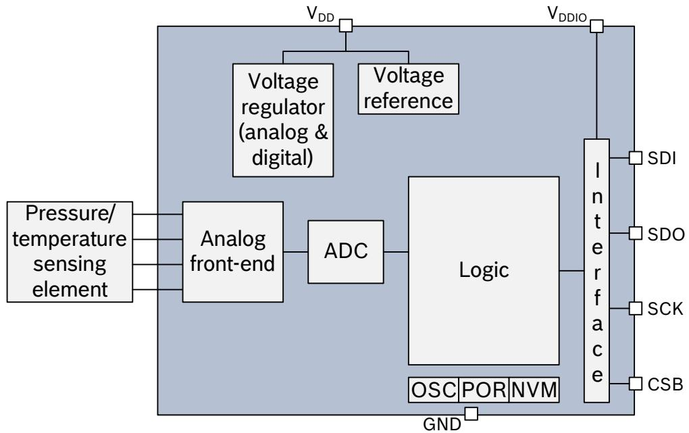  
Figure 1 shows a simplified block diagram of the BMP280:   
Figure 1: Block diagram of BMP280

# 3.2 Power management

The BMP280 has two separate power supply pins

VDD is the main power supply for all internal analog and digital functional blocks VDDIO is a separate power supply pin, used for the supply of the digital interface

A power-on reset generator is built in which resets the logic circuitry and the register values after the power-on sequence. There are no limitations on slope and sequence of raising the VDD and VDDIO levels. After powering up, the sensor settles in sleep mode (see 3.6.1).

Warning. Holding any interface pin (SDI, SDO, SCK or CSB) at a logical high level when VDDIO is switched off can permanently damage the device due caused by excessive current flow through the ESD protection diodes.

If VDDIO is supplied, but VDD is not, the interface pins are kept at a high-Z level. The bus can therefore already be used freely before the BMP280 VDD supply is established.

# 3.3 Measurement flow

The BMP280 measurement period consists of a temperature and pressure measurement with selectable oversampling. After the measurement period, the data are passed through an optional IIR filter, which removes short-term fluctuations in pressure (e.g. caused by slamming a door). The flow is depicted in the diagram below.

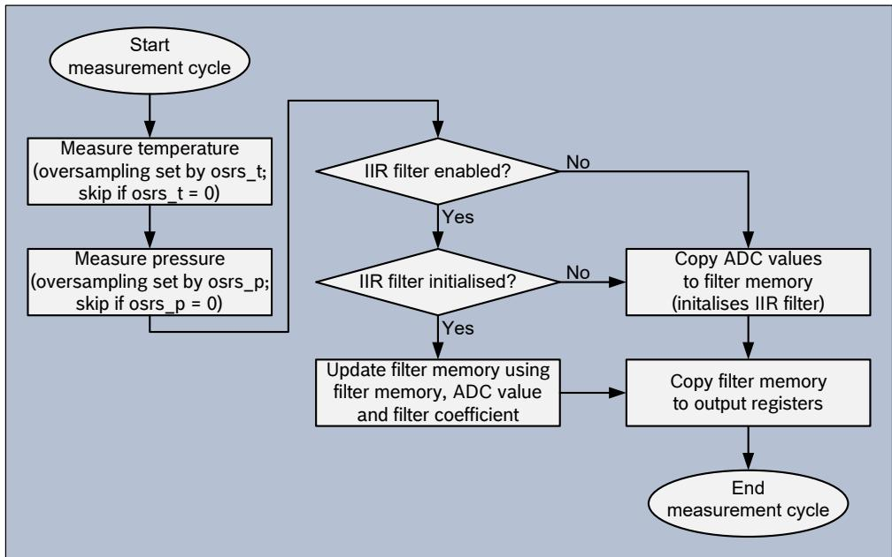  
Figure 2: BMP280 measurement cycle

The individual blocks of the diagram above will be detailed in the following subchapters.

# 3.3.1 Pressure measurement

Pressure measurement can be enabled or skipped. Skipping the measurement could be useful if BMP280 is used as temperature sensor. When enabled, several oversampling options exist. Each oversampling step reduces noise and increases the output resolution by one bit, which is stored in the XLSB data register 0xF9. Enabling/disabling the measurement and oversampling settings are selected through the osrs_p[2:0] bits in control register $\mathtt { 0 x F 4 }$ .

Table 4: osrs_p settings   

<table><tr><td rowspan=1 colspan=1> Oversampling setting</td><td rowspan=1 colspan=1>Pressureoversampling</td><td rowspan=1 colspan=1>Typical pressureresolution</td><td rowspan=1 colspan=1> Recommended temperatureoversampling</td></tr><tr><td rowspan=1 colspan=1> Pressure measurementskipped</td><td rowspan=1 colspan=1> Skipped(output set to 0x80000)</td><td rowspan=1 colspan=1></td><td rowspan=1 colspan=1>As needed</td></tr><tr><td rowspan=1 colspan=1> Ultra low power</td><td rowspan=1 colspan=1>×1</td><td rowspan=1 colspan=1>16 bit / 2.62 Pa</td><td rowspan=1 colspan=1>×1</td></tr><tr><td rowspan=1 colspan=1>Low power</td><td rowspan=1 colspan=1>×2</td><td rowspan=1 colspan=1>17 bit / 1.31 Pa</td><td rowspan=1 colspan=1>×1</td></tr><tr><td rowspan=1 colspan=1> Standard resolution</td><td rowspan=1 colspan=1>×4</td><td rowspan=1 colspan=1> 18 bit / 0.66 Pa</td><td rowspan=1 colspan=1>×1</td></tr><tr><td rowspan=1 colspan=1> High resolution</td><td rowspan=1 colspan=1>×8</td><td rowspan=1 colspan=1>19 bit / 0.33 Pa</td><td rowspan=1 colspan=1>×1</td></tr><tr><td rowspan=1 colspan=1>Ultra high resolution</td><td rowspan=1 colspan=1>×16</td><td rowspan=1 colspan=1> 20 bit / 0.16 Pa</td><td rowspan=1 colspan=1>×2</td></tr></table>

In order to find a suitable setting for osrs $. { \pmb \rho }$ , please consult chapter 3.4.

# 3.3.2 Temperature measurement

Temperature measurement can be enabled or skipped. Skipping the measurement could be useful to measure pressure extremely rapidly. When enabled, several oversampling options exist. Each oversampling step reduces noise and increases the output resolution by one bit, which is stored in the XLSB data register 0xFC. Enabling/disabling the temperature measurement and oversampling setting are selected through the osrs_t[2:0] bits in control register 0xF4.

Table 5: osrs_t settings   

<table><tr><td rowspan=1 colspan=1>osrs_t[2:0]</td><td rowspan=1 colspan=1> Temperature oversampling</td><td rowspan=1 colspan=1>Typical temperatureresolution</td></tr><tr><td rowspan=1 colspan=1>000</td><td rowspan=1 colspan=1> Skipped(output set to 0x80000)</td><td rowspan=1 colspan=1></td></tr><tr><td rowspan=1 colspan=1>001</td><td rowspan=1 colspan=1>×1</td><td rowspan=1 colspan=1>16 bit/ 0.0050 C</td></tr><tr><td rowspan=1 colspan=1>010</td><td rowspan=1 colspan=1>×2</td><td rowspan=1 colspan=1>17 bit / 0.0025 C</td></tr><tr><td rowspan=1 colspan=1>011</td><td rowspan=1 colspan=1>×4</td><td rowspan=1 colspan=1>18 bit/ 0.0012 °C</td></tr><tr><td rowspan=1 colspan=1>100</td><td rowspan=1 colspan=1>×8</td><td rowspan=1 colspan=1>19 bit /0.0006 °℃</td></tr><tr><td rowspan=1 colspan=1>101, 110, 111</td><td rowspan=1 colspan=1>×16</td><td rowspan=1 colspan=1>20 bit/ 0.0003 C</td></tr></table>

It is recommended to base the value of osrs_t on the selected value of osrs $\boldsymbol { \mathbf { \mathit { p } } }$ as per Table 4. Temperature oversampling above $\times 2$ is possible, but will not significantly improve the accuracy of the pressure output any further. The reason for this is that the noise of the compensated pressure value depends more on the raw pressure than on the raw temperature noise. Following the recommended setting will result in an optimal noise-to-power ratio.

# 3.3.3 IIR filter

The environmental pressure is subject to many short-term changes, caused e.g. by slamming of a door or window, or wind blowing into the sensor. To suppress these disturbances in the output data without causing additional interface traffic and processor work load, the BMP280 features an internal IIR filter. It effectively reduces the bandwidth of the output signals6. The output of a next measurement step is filter using the following formula:

$$
d a t a \_ f i l t e r e d = \frac { d a t a \_ f i l t e r e d \_ o l d \cdot ( f i l t e r \_ c o e f f i c i e n t - 1 ) + d a t a \_ A D C } { f i l t e r \_ c o e f f i c i e n t } 
$$

where data_filtered_old is the data coming from the previous acquisition, and data_ADC is the data coming from the ADC before IIR filtering.

The IIR filter can be configured using the filter[2:0] bits in control register $\mathtt { 0 x F 5 }$ with the following options:

Table 6: filter settings   

<table><tr><td rowspan=1 colspan=1>Filter coefficient</td><td rowspan=1 colspan=1>Samples to reach ≥75 % of step response</td></tr><tr><td rowspan=1 colspan=1> Filter off</td><td rowspan=1 colspan=1>1</td></tr><tr><td rowspan=1 colspan=1>2</td><td rowspan=1 colspan=1>2</td></tr><tr><td rowspan=1 colspan=1>4</td><td rowspan=1 colspan=1>5</td></tr><tr><td rowspan=1 colspan=1>8</td><td rowspan=1 colspan=1>11</td></tr><tr><td rowspan=1 colspan=1>16</td><td rowspan=1 colspan=1>22</td></tr></table>

In order to find a suitable setting for filter, please consult chapter 3.4.

When writing to the register filter, the filter is reset. The next value will pass through the filter and be the initial memory value for the filter. If temperature or pressure measurement is skipped, the corresponding filter memory will be kept unchanged even though the output registers are set to $0 \times 8 0 0 0 0$ . When the previously skipped measurement is re-enabled, the output will be filtered using the filter memory from the last time when the measurement was not skipped.

# 3.4 Filter selection

In order to select optimal settings, the following use cases are suggested:

Table 7: Recommended filter settings based on use cases   

<table><tr><td rowspan=1 colspan=1>Use case</td><td rowspan=1 colspan=1>Mode</td><td rowspan=1 colspan=1>Over-samplingsetting</td><td rowspan=1 colspan=1>osrs_p</td><td rowspan=1 colspan=1>osrs_t</td><td rowspan=1 colspan=1>IIRfiltercoeff.(see3.3.3)</td><td rowspan=1 colspan=1>IDD[uA](see3.7)</td><td rowspan=1 colspan=1>ODR[Hz](see3.8.2)</td><td rowspan=1 colspan=1>RMSNoise[cm](see3.5)</td></tr><tr><td rowspan=1 colspan=1>handheld devicelow-power(e.g. Android)</td><td rowspan=1 colspan=1>Normal</td><td rowspan=1 colspan=1>Ultra high resolution</td><td rowspan=1 colspan=1>×16</td><td rowspan=1 colspan=1>×2</td><td rowspan=1 colspan=1>4</td><td rowspan=1 colspan=1>247</td><td rowspan=1 colspan=1>10.0</td><td rowspan=1 colspan=1>4.0</td></tr><tr><td rowspan=1 colspan=1>handheld devicedynamic(e.g. Android)</td><td rowspan=1 colspan=1>Normal</td><td rowspan=1 colspan=1> Standard resolution</td><td rowspan=1 colspan=1>×4</td><td rowspan=1 colspan=1>×1</td><td rowspan=1 colspan=1>16</td><td rowspan=1 colspan=1>577</td><td rowspan=1 colspan=1>83.3</td><td rowspan=1 colspan=1>2.4</td></tr><tr><td rowspan=1 colspan=1>Weather monitoring(lowest power)</td><td rowspan=1 colspan=1>Forced</td><td rowspan=1 colspan=1>Ultra lowpower</td><td rowspan=1 colspan=1>×1</td><td rowspan=1 colspan=1>×1</td><td rowspan=1 colspan=1>Off</td><td rowspan=1 colspan=1>0.14</td><td rowspan=1 colspan=1>1/60</td><td rowspan=1 colspan=1>26.4</td></tr><tr><td rowspan=1 colspan=1> Elevator / floor change detection</td><td rowspan=1 colspan=1>Normal</td><td rowspan=1 colspan=1> Standardresolution</td><td rowspan=1 colspan=1>×4</td><td rowspan=1 colspan=1>×1</td><td rowspan=1 colspan=1>4</td><td rowspan=1 colspan=1>50.9</td><td rowspan=1 colspan=1>7.3</td><td rowspan=1 colspan=1>6.4</td></tr><tr><td rowspan=1 colspan=1>Drop detection</td><td rowspan=1 colspan=1>Normal</td><td rowspan=1 colspan=1>Lowpower</td><td rowspan=1 colspan=1>×2</td><td rowspan=1 colspan=1>×1</td><td rowspan=1 colspan=1>Off</td><td rowspan=1 colspan=1>509</td><td rowspan=1 colspan=1>125</td><td rowspan=1 colspan=1>20.8</td></tr><tr><td rowspan=1 colspan=1> Indoor navigation</td><td rowspan=1 colspan=1> Normal</td><td rowspan=1 colspan=1> Ultra highresolution</td><td rowspan=1 colspan=1>×16</td><td rowspan=1 colspan=1>×2</td><td rowspan=1 colspan=1>16</td><td rowspan=1 colspan=1>650</td><td rowspan=1 colspan=1>26.3</td><td rowspan=1 colspan=1>1.6</td></tr></table>

# 3.5 Noise

Noise depends on the oversampling and filter settings selected. The stated values were determined in a controlled pressure environment and are based on the average standard deviation of 32 consecutive measurement points taken at highest sampling speed. This is needed in order to exclude long term drifts from the noise measurement.

Table 8: Noise in pressure   

<table><tr><td rowspan=2 colspan=6>Typical RMS noise in pressure [Pa] Oversampling setting         IIR filter coefficient</td></tr><tr><td rowspan=2 colspan=1> Oversampling setting</td></tr><tr><td rowspan=1 colspan=1>off</td><td rowspan=1 colspan=1>2</td><td rowspan=1 colspan=1>4</td><td rowspan=1 colspan=1>8</td><td rowspan=1 colspan=1>16</td></tr><tr><td rowspan=1 colspan=1> Ultra low power</td><td rowspan=1 colspan=1>3.3</td><td rowspan=1 colspan=1>1.9</td><td rowspan=1 colspan=1>1.2</td><td rowspan=1 colspan=1>0.9</td><td rowspan=1 colspan=1>0.4</td></tr><tr><td rowspan=1 colspan=1>Low power</td><td rowspan=1 colspan=1>2.6</td><td rowspan=1 colspan=1>1.5</td><td rowspan=1 colspan=1>1.0</td><td rowspan=1 colspan=1>0.6</td><td rowspan=1 colspan=1>0.4</td></tr><tr><td rowspan=1 colspan=1> Standard resolution</td><td rowspan=1 colspan=1>2.1</td><td rowspan=1 colspan=1>1.2</td><td rowspan=1 colspan=1>0.8</td><td rowspan=1 colspan=1>0.5</td><td rowspan=1 colspan=1>0.3</td></tr><tr><td rowspan=1 colspan=1> High resolution</td><td rowspan=1 colspan=1>1.6</td><td rowspan=1 colspan=1>1.0</td><td rowspan=1 colspan=1>0.6</td><td rowspan=1 colspan=1>0.4</td><td rowspan=1 colspan=1>0.2</td></tr><tr><td rowspan=1 colspan=1> Ultra high resolution</td><td rowspan=1 colspan=1>1.3</td><td rowspan=1 colspan=1>0.8</td><td rowspan=1 colspan=1>0.5</td><td rowspan=1 colspan=1>0.4</td><td rowspan=1 colspan=1>0.2</td></tr></table>

Table 9: Noise in temperature   

<table><tr><td rowspan=1 colspan=2>Typical RMS noise in temperature [C]</td></tr><tr><td rowspan=1 colspan=1>Temperature oversampling</td><td rowspan=1 colspan=1> IIR fiter off</td></tr><tr><td rowspan=1 colspan=1> oversampling ×1</td><td rowspan=1 colspan=1>0.005</td></tr><tr><td rowspan=1 colspan=1> oversampling ×2</td><td rowspan=1 colspan=1>0.004</td></tr><tr><td rowspan=1 colspan=1>oversampling ×4</td><td rowspan=1 colspan=1>0.003</td></tr><tr><td rowspan=1 colspan=1> oversampling ×8</td><td rowspan=1 colspan=1>0.003</td></tr><tr><td rowspan=1 colspan=1>oversampling ×16</td><td rowspan=1 colspan=1>0.002</td></tr></table>

# 3.6 Power modes

The BMP280 offers three power modes: sleep mode, forced mode and normal mode. These can be selected using the mode[1:0] bits in control register 0xF4.

Table 10: mode settings   

<table><tr><td rowspan=1 colspan=1>mode[1:0]</td><td rowspan=1 colspan=1>Mode</td></tr><tr><td rowspan=1 colspan=1>00</td><td rowspan=1 colspan=1> Sleep mode</td></tr><tr><td rowspan=1 colspan=1> 01 and 10</td><td rowspan=1 colspan=1> Forced mode</td></tr><tr><td rowspan=1 colspan=1>11</td><td rowspan=1 colspan=1> Normal mode</td></tr></table>

# 3.6.1 Sleep mode

Sleep mode is set by default after power on reset. In sleep mode, no measurements are performed and power consumption (IDDSM) is at a minimum. All registers are accessible; Chip-ID and compensation coefficients can be read.

# 3.6.2 Forced mode

In forced mode, a single measurement is performed according to selected measurement and filter options. When the measurement is finished, the sensor returns to sleep mode and the measurement results can be obtained from the data registers. For a next measurement, forced mode needs to be

selected again. This is similar to BMP180 operation. Forced mode is recommended for applications which require low sampling rate or host-based synchronization.

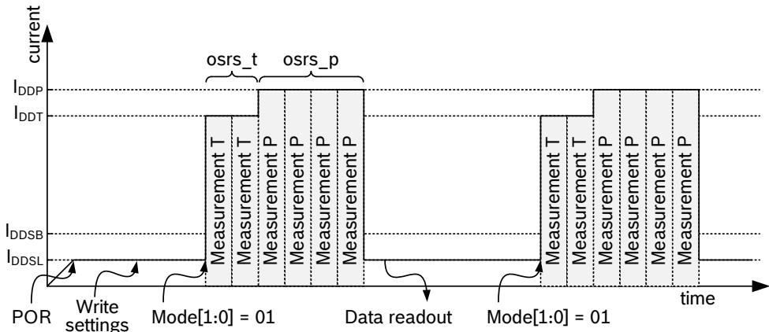  
Figure 3: Forced mode timing diagram

# 3.6.3 Normal mode

Normal mode 16ontinuously cycles between an (active) measurement period and an (inactive) standby period, whose time is defined by tstandby. The current in the standby period (IDDSB) is slightly higher than in sleep mode. After setting the mode,measurement and filter options, the last measurement results can be obtained from the data registers without the need of further write accesses. Normal mode is recommended when using the IIR filter, and useful for applications in which short-term disturbances (e.g. blowing into the sensor) should be filtered.

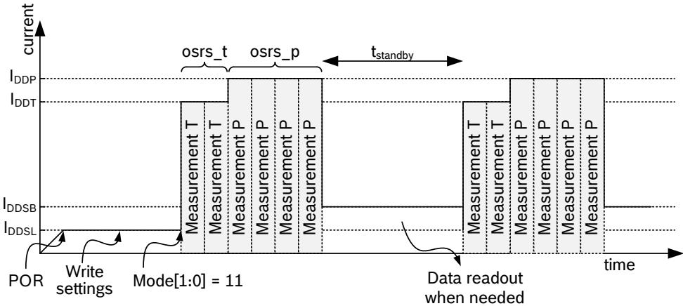  
Figure 4: Normal mode timing diagram

The standby time is determined by the contents of the t_sb[2:0] bits in control register 0xF5 according to the table below:

Table 11: t_sb settings   

<table><tr><td rowspan=1 colspan=1>t_sb[1:0]</td><td rowspan=1 colspan=1>tstandby [ms]</td></tr><tr><td rowspan=1 colspan=1>000</td><td rowspan=1 colspan=1>0.5</td></tr><tr><td rowspan=1 colspan=1>001</td><td rowspan=1 colspan=1>62.5</td></tr><tr><td rowspan=1 colspan=1>010</td><td rowspan=1 colspan=1>125</td></tr><tr><td rowspan=1 colspan=1>011</td><td rowspan=1 colspan=1>250</td></tr><tr><td rowspan=1 colspan=1>100</td><td rowspan=1 colspan=1>500</td></tr><tr><td rowspan=1 colspan=1>101</td><td rowspan=1 colspan=1>1000</td></tr><tr><td rowspan=1 colspan=1>110</td><td rowspan=1 colspan=1>2000</td></tr><tr><td rowspan=1 colspan=1>111 </td><td rowspan=1 colspan=1>4000</td></tr></table>

# 3.6.4 Mode transition diagram

The supported mode transitions are displayed below. If the device is currently performing a measurement, execution of mode switching commands is delayed until the end of the currently running measurement period. Further mode change commands are ignored until the last mode change command is executed. Mode transitions other than the ones shown below are tested for stability but do not represent recommended use of the device.

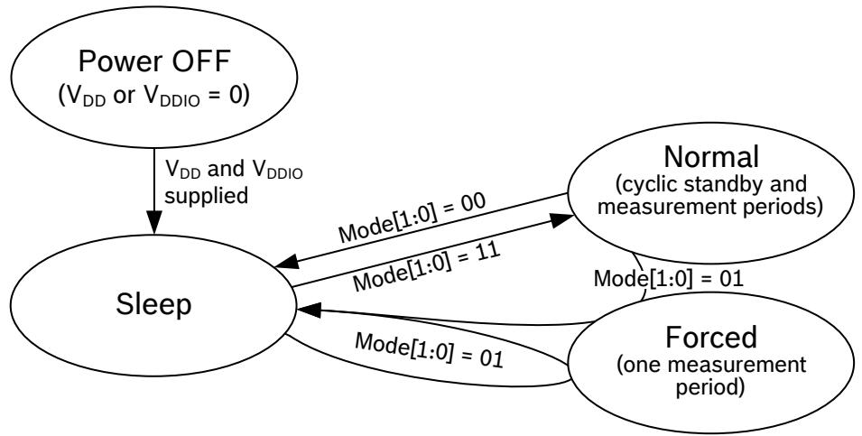  
Figure 5: Mode transition diagram

# 3.7 Current consumption

The current consumption depends on ODR and oversampling setting. The values given below are normalized to an ODR of 1 Hz. The actual consumption at a given ODR can be calculated by multiplying the consumption in Table 12 with the ODR used. The actual ODR is defined either by the frequency at which the user sets forced measurements or by oversampling and tstandby settings in normal mode in Table 14.

Table 12: Current consumption   

<table><tr><td rowspan=2 colspan=1>Oversampling setting</td><td rowspan=2 colspan=1>Pressure oversampling</td><td rowspan=2 colspan=1>Temperature oversampling</td><td rowspan=1 colspan=2>IbD [uA] @ 1 Hz forced mode</td></tr><tr><td rowspan=1 colspan=1>Typ</td><td rowspan=1 colspan=1> Max</td></tr><tr><td rowspan=1 colspan=1> Ultra low power</td><td rowspan=1 colspan=1>×1</td><td rowspan=1 colspan=1>×1</td><td rowspan=1 colspan=1>2.74</td><td rowspan=1 colspan=1>4.16</td></tr><tr><td rowspan=1 colspan=1>Low power</td><td rowspan=1 colspan=1>×2</td><td rowspan=1 colspan=1>×1</td><td rowspan=1 colspan=1>4.17</td><td rowspan=1 colspan=1>6.27</td></tr><tr><td rowspan=1 colspan=1> Standard resolution</td><td rowspan=1 colspan=1>×4</td><td rowspan=1 colspan=1>×1</td><td rowspan=1 colspan=1>7.02</td><td rowspan=1 colspan=1>10.50</td></tr><tr><td rowspan=1 colspan=1> High resolution</td><td rowspan=1 colspan=1>×8</td><td rowspan=1 colspan=1>×1</td><td rowspan=1 colspan=1>12.7</td><td rowspan=1 colspan=1>18.95</td></tr><tr><td rowspan=1 colspan=1> Ultra high resolution</td><td rowspan=1 colspan=1>×16</td><td rowspan=1 colspan=1>×2</td><td rowspan=1 colspan=1>24.8</td><td rowspan=1 colspan=1>36.85</td></tr></table>

# 3.8 Measurement timings

The rate at which measurements can be performed in forced mode depends on the oversampling settings osrs_t and osrs_p. The rate at which they are performed in normal mode depends on the oversampling setting settings osrs_t and osrs_ $p$ and the standby time tstandby. In the following table the resulting ODRs are given only for the suggested osrs combinations.

# 3.8.1 Measurement time

The following table explains the typical and maximum measurement time based on selected oversampling setting. The minimum achievable frequency is determined by the maximum measurement time.

Table 13: Measurement time   

<table><tr><td rowspan=2 colspan=1>Oversampling setting</td><td rowspan=2 colspan=1>Pressure oversampling</td><td rowspan=2 colspan=1>Temperatureoversampling</td><td rowspan=1 colspan=2>Measurementtime [ms]</td><td rowspan=1 colspan=2> Measurementrate[Hz]</td></tr><tr><td rowspan=1 colspan=1>Typ</td><td rowspan=1 colspan=1> Max</td><td rowspan=1 colspan=1>Typ</td><td rowspan=1 colspan=1>Min</td></tr><tr><td rowspan=1 colspan=1> Ultra low power</td><td rowspan=1 colspan=1>×1</td><td rowspan=1 colspan=1>×1</td><td rowspan=1 colspan=1>5.5</td><td rowspan=1 colspan=1>6.4</td><td rowspan=1 colspan=1>181.8</td><td rowspan=1 colspan=1>155.6</td></tr><tr><td rowspan=1 colspan=1>Low power</td><td rowspan=1 colspan=1>×2</td><td rowspan=1 colspan=1>×1</td><td rowspan=1 colspan=1>7.5</td><td rowspan=1 colspan=1>8.7</td><td rowspan=1 colspan=1>133.3</td><td rowspan=1 colspan=1>114.6</td></tr><tr><td rowspan=1 colspan=1> Standard resolution</td><td rowspan=1 colspan=1>×4</td><td rowspan=1 colspan=1>×1</td><td rowspan=1 colspan=1>11.5</td><td rowspan=1 colspan=1>13.3</td><td rowspan=1 colspan=1>87.0</td><td rowspan=1 colspan=1>75.0</td></tr><tr><td rowspan=1 colspan=1> High resolution</td><td rowspan=1 colspan=1>×8</td><td rowspan=1 colspan=1>×1</td><td rowspan=1 colspan=1>19.5</td><td rowspan=1 colspan=1>22.5</td><td rowspan=1 colspan=1>51.3</td><td rowspan=1 colspan=1>44.4</td></tr><tr><td rowspan=1 colspan=1> Ultra high resolution</td><td rowspan=1 colspan=1>×16</td><td rowspan=1 colspan=1>×2</td><td rowspan=1 colspan=1>37.5</td><td rowspan=1 colspan=1>43.2</td><td rowspan=1 colspan=1>26.7</td><td rowspan=1 colspan=1>23.1</td></tr></table>

# 3.8.2 Measurement rate in normal mode

The following table explains which measurement rates can be expected in normal mode based on oversampling setting and tstandby.

Table 14: typical output data Rate (ODR) in normal mode [Hz]   

<table><tr><td rowspan=2 colspan=1> Oversamplingsetting</td><td rowspan=1 colspan=8>tstandby [ms]</td></tr><tr><td rowspan=1 colspan=1>0.5</td><td rowspan=1 colspan=1>62.5</td><td rowspan=1 colspan=1>125</td><td rowspan=1 colspan=1>250</td><td rowspan=1 colspan=1>500</td><td rowspan=1 colspan=1>1000</td><td rowspan=1 colspan=1>2000</td><td rowspan=1 colspan=1>4000</td></tr><tr><td rowspan=1 colspan=1>Ultra low power</td><td rowspan=1 colspan=1>166.67</td><td rowspan=1 colspan=1>14.71</td><td rowspan=1 colspan=1>7.66</td><td rowspan=1 colspan=1>3.91</td><td rowspan=1 colspan=1>1.98</td><td rowspan=1 colspan=1>0.99</td><td rowspan=1 colspan=1>0.50</td><td rowspan=1 colspan=1>0.25</td></tr><tr><td rowspan=1 colspan=1>Low power</td><td rowspan=1 colspan=1>125.00</td><td rowspan=1 colspan=1>14.29</td><td rowspan=1 colspan=1>7.55</td><td rowspan=1 colspan=1>3.88</td><td rowspan=1 colspan=1>1.97</td><td rowspan=1 colspan=1>0.99</td><td rowspan=1 colspan=1>0.50</td><td rowspan=1 colspan=1>0.25</td></tr><tr><td rowspan=1 colspan=1> Standard resolution</td><td rowspan=1 colspan=1>83.33</td><td rowspan=1 colspan=1>13.51</td><td rowspan=1 colspan=1>7.33</td><td rowspan=1 colspan=1>3.82</td><td rowspan=1 colspan=1>1.96</td><td rowspan=1 colspan=1>0.99</td><td rowspan=1 colspan=1>0.50</td><td rowspan=1 colspan=1>0.25</td></tr><tr><td rowspan=1 colspan=1> High resolution</td><td rowspan=1 colspan=1>50.00</td><td rowspan=1 colspan=1>12.20</td><td rowspan=1 colspan=1>6.92</td><td rowspan=1 colspan=1>3.71</td><td rowspan=1 colspan=1>1.92</td><td rowspan=1 colspan=1>0.98</td><td rowspan=1 colspan=1>0.50</td><td rowspan=1 colspan=1>0.25</td></tr><tr><td rowspan=1 colspan=1> Ultra high resolution</td><td rowspan=1 colspan=1>26.32</td><td rowspan=1 colspan=1>10.00</td><td rowspan=1 colspan=1>6.15</td><td rowspan=1 colspan=1>3.48</td><td rowspan=1 colspan=1>1.86</td><td rowspan=1 colspan=1>0.96</td><td rowspan=1 colspan=1>0.49</td><td rowspan=1 colspan=1>0.25</td></tr></table>

Table 15: Sensor timing according to recommended settings (based on use cases)   

<table><tr><td rowspan=1 colspan=1>Use case</td><td rowspan=1 colspan=1>Mode</td><td rowspan=1 colspan=1>Over- samplingsetting</td><td rowspan=1 colspan=1>osrs_p</td><td rowspan=1 colspan=1>osrs_t</td><td rowspan=1 colspan=1>IIRfiltercoeff. (see3.3.3)</td><td rowspan=1 colspan=1>Timing</td><td rowspan=1 colspan=1>ODR[Hz] (see3.8.2)</td><td rowspan=1 colspan=1>BW[Hz] (see3.3.3)</td></tr><tr><td rowspan=1 colspan=1>handheld devicelow-power (e.g.Android)</td><td rowspan=1 colspan=1>Normal</td><td rowspan=1 colspan=1>Ultra highresolution</td><td rowspan=1 colspan=1>×16</td><td rowspan=1 colspan=1>×2</td><td rowspan=1 colspan=1>4</td><td rowspan=1 colspan=1> tstandby =62.5 ms</td><td rowspan=1 colspan=1>10.0</td><td rowspan=1 colspan=1>0.92</td></tr><tr><td rowspan=1 colspan=1>handheld devicedynamic (e.g.Android)</td><td rowspan=1 colspan=1> Normal</td><td rowspan=1 colspan=1> Standard resolution</td><td rowspan=1 colspan=1>×4</td><td rowspan=1 colspan=1>×1</td><td rowspan=1 colspan=1>16</td><td rowspan=1 colspan=1> tstandby =0.5 ms</td><td rowspan=1 colspan=1>83.3</td><td rowspan=1 colspan=1>1.75</td></tr><tr><td rowspan=1 colspan=1>Weather monitoring(lowest power)</td><td rowspan=1 colspan=1>Forced</td><td rowspan=1 colspan=1> Ultra low power</td><td rowspan=1 colspan=1>×1</td><td rowspan=1 colspan=1>×1</td><td rowspan=1 colspan=1>Off</td><td rowspan=1 colspan=1> 1/min</td><td rowspan=1 colspan=1>1/60</td><td rowspan=1 colspan=1> full</td></tr><tr><td rowspan=1 colspan=1>Elevator /floorchangedetection</td><td rowspan=1 colspan=1> Normal</td><td rowspan=1 colspan=1> Standard resolution</td><td rowspan=1 colspan=1>×4</td><td rowspan=1 colspan=1>×1</td><td rowspan=1 colspan=1>4</td><td rowspan=1 colspan=1>tstandby =125 ms</td><td rowspan=1 colspan=1>7.3</td><td rowspan=1 colspan=1>0.67</td></tr><tr><td rowspan=1 colspan=1> Drop detection</td><td rowspan=1 colspan=1> Normal</td><td rowspan=1 colspan=1>Lowpower</td><td rowspan=1 colspan=1>×2</td><td rowspan=1 colspan=1>×1</td><td rowspan=1 colspan=1>Off</td><td rowspan=1 colspan=1> tstandby =0.5ms</td><td rowspan=1 colspan=1>125</td><td rowspan=1 colspan=1> full</td></tr><tr><td rowspan=1 colspan=1>Indoor navigation</td><td rowspan=1 colspan=1>Normal</td><td rowspan=1 colspan=1> Ultra high resolution</td><td rowspan=1 colspan=1>×16</td><td rowspan=1 colspan=1>×2</td><td rowspan=1 colspan=1>16</td><td rowspan=1 colspan=1>tstandby =0.5 ms</td><td rowspan=1 colspan=1>26.3</td><td rowspan=1 colspan=1>0.55</td></tr></table>

# 3.9 Data readout

To read out data after a conversion, it is strongly recommended to use a burst read and not address every register individually. This will prevent a possible mix-up of bytes belonging to different measurements and reduce interface traffic. Data readout is done by starting a burst read from 0xF7 to $\mathsf { O x F C }$ . The data are read out in an unsigned 20-bit format both for pressure and for temperature. It is strongly recommended to use the BMP280 API, available from Bosch Sensortec, for readout and compensation. For details on memory map and interfaces, please consult chapters 3.12 and 5 respectively.

The timing for data readout in forced mode should be done so that the maximum measurement times (see chapter 3.8.1) are respected. In normal mode, readout can be done at a speed similar to the expected data output rate (see chapter 3.8.2). After the values of ‘ut’ and ‘up’ have been read, the actual pressure and temperature need to be calculated using the compensation parameters stored in the device. The procedure is elaborated in chapter 3.11.

# 3.10 Data register shadowing

In normal mode, measurement timing is not necessarily synchronized to readout. This means that new measurement results may become available while the user is reading the results from the previous measurement. In this case, shadowing is performed in order to guarantee data consistency. Shadowing will only work if all data registers are read in a single burst read. Therefore, the user must use burst reads if he does not synchronize data readout with the measurement cycle. Using several independent read commands may result in inconsistent data.

If a new measurement is finished and the data registers are still being read, the new measurement results are transferred into shadow data registers. The content of shadow registers is transferred into data registers as soon as the user ends the burst read, even if not all data registers were read. Reading across several data registers can therefore only be guaranteed to be consistent within one measurement cycle if a single burst read command is used. The end of the burst read is marked by the rising edge of CSB pin in SPI case or by the recognition of a stop condition in I2C case. After the end of the burst read, all user data registers are updated at once.

# 3.11 Output compensation

The BMP280 output consists of the ADC output values. However, each sensing element behaves differently, and actual pressure and temperature must be calculated using a set of calibration parameters. The recommended calculation in chapter 3.11.3 uses fixed point arithmetic. In high-level languages like Matlab™ or LabVIEW™, fixed-point code may not be well supported. In this case the floating-point code in appendix 8.1 can be used as an alternative. For 8-bit micro controllers, the variable size may be limited. In this case a simplified 32 bit integer code with reduced accuracy is given in appendix 8.2.

# 3.11.1 Computational requirements

The table below shows the number of clock cycles needed for compensation calculations on a 32 bit Cortex-M3 micro controller with GCC optimization level –O2. This controller does not contain a floating point unit, so all floating-point calculations are emulated. Floating point is only recommended for PC applications where an FPU is present.

Table 16: Computational requirements for compensation formulas   

<table><tr><td rowspan=2 colspan=1>Compensation of</td><td rowspan=1 colspan=3>Number of clock cycles (ARM Cortex-M3)</td></tr><tr><td rowspan=1 colspan=1> 32 bit integer</td><td rowspan=1 colspan=1> 64 bit integer</td><td rowspan=1 colspan=1> Double precision</td></tr><tr><td rowspan=1 colspan=1> Temperature</td><td rowspan=1 colspan=1>~46</td><td rowspan=1 colspan=1></td><td rowspan=1 colspan=1>~2400 7</td></tr><tr><td rowspan=1 colspan=1>Pressure</td><td rowspan=1 colspan=1>~1128</td><td rowspan=1 colspan=1>~1400</td><td rowspan=1 colspan=1>~54007</td></tr></table>

# 3.11.2 Trimming parameter readout

The trimming parameters are programmed into the devices’ non-volatile memory (NVM) during production and cannot be altered by the customer. Each compensation word is a 16-bit signed or unsigned integer value stored in two’s complement. As the memory is organized into 8-bit words, two words must always be combined in order to represent the compensation word. The 8-bit registers are named calib00…calib25 and are stored at memory addresses $0 { \times } 8 8 . . . 0 { \times } \mathsf { A } 1$ . The corresponding compensation words are named dig_T# for temperature compensation related values and dig_P# for pressure compensation related values. The mapping is shown in Table 17.

Table 17: Compensation parameter storage, naming and data type   

<table><tr><td rowspan=1 colspan=1>RegisterAddressLSB / MSB</td><td rowspan=1 colspan=1>Registercontent</td><td rowspan=1 colspan=1>Data type</td></tr><tr><td rowspan=1 colspan=1>0x88/ 0x89</td><td rowspan=1 colspan=1>dig_T1</td><td rowspan=1 colspan=1> unsigned short</td></tr><tr><td rowspan=1 colspan=1>0x8A/0x8B</td><td rowspan=1 colspan=1>dig_T2</td><td rowspan=1 colspan=1> signed short</td></tr><tr><td rowspan=1 colspan=1>Ox8C/0x8D</td><td rowspan=1 colspan=1>dig_T3</td><td rowspan=1 colspan=1> signed short</td></tr><tr><td rowspan=1 colspan=1>Ox8E/Ox8F</td><td rowspan=1 colspan=1>dig_P1</td><td rowspan=1 colspan=1> unsigned short</td></tr><tr><td rowspan=1 colspan=1>Ox90/ 0x91</td><td rowspan=1 colspan=1>dig_P2</td><td rowspan=1 colspan=1> signed short</td></tr><tr><td rowspan=1 colspan=1>0x92/ 0x93</td><td rowspan=1 colspan=1>dig_P3</td><td rowspan=1 colspan=1> signed short</td></tr><tr><td rowspan=1 colspan=1>0x94/ 0x95</td><td rowspan=1 colspan=1>dig_P4</td><td rowspan=1 colspan=1> signed short</td></tr><tr><td rowspan=1 colspan=1>0x96 / 0x97</td><td rowspan=1 colspan=1>dig_P5</td><td rowspan=1 colspan=1> signed short</td></tr><tr><td rowspan=1 colspan=1>0x98/0x99</td><td rowspan=1 colspan=1>dig_P6</td><td rowspan=1 colspan=1> signed short</td></tr><tr><td rowspan=1 colspan=1>0x9A/0x9B</td><td rowspan=1 colspan=1>dig_P7</td><td rowspan=1 colspan=1> signed short</td></tr><tr><td rowspan=1 colspan=1>0x9C/0x9D</td><td rowspan=1 colspan=1>dig_P8</td><td rowspan=1 colspan=1> signed short</td></tr><tr><td rowspan=1 colspan=1>Ox9E/0x9F</td><td rowspan=1 colspan=1>dig_P9</td><td rowspan=1 colspan=1> signed short</td></tr><tr><td rowspan=1 colspan=1>0xA0 / 0xA1</td><td rowspan=1 colspan=1>reserved</td><td rowspan=1 colspan=1>reserved</td></tr></table>

# 3.11.3 Compensation formula

Please note that it is strongly advised to use the API available from Bosch Sensortec to perform readout and compensation. If this is not wanted, the code below can be applied at the user’s risk. Both pressure and temperature values are expected to be received in 20 bit format, positive, stored in a 32 bit signed integer.

The variable t_fine (signed 32 bit) carries a fine resolution temperature value over to the pressure compensation formula and could be implemented as a global variable.

The data type “BMP280_S32_t” should define a 32 bit signed integer variable type and can usually be defined as “long signed int”.

The data type “BMP280_U32_t” should define a 32 bit unsigned integer variable type and can usually be defined as “long unsigned int”.

For best possible calculation accuracy, 64 bit integer support is needed. If this is not possible on your platform, please see appendix 8.2 for a 32 bit alternative.

The data type “BMP280_S64_t” should define a 64 bit signed integer variable type, which on most supporting platforms can be defined as “long long signed int”. The revision of the code is rev.1.1.

// Returns temperature in DegC, resolution is 0.01 DegC. Output value of $" 5 1 2 3 \prime \prime$ equals 51.23   
DegC.   
// t_fine carries fine temperature as global value   
BMP280_S32_t t_fine;   
BMP280_S32_t bmp280_compensate_T_int32(BMP280_S32_t adc_T)   
{ BMP280_S32_t var1, var2, T; var1 $\sqsupseteq$ ((((adc_ $\mathbb { T } > > 3$ ) – ((BMP280_S32_t)dig_ $\mathbb { T } \mathbb { 1 } < < \mathbb { 1 }$ ))) $\star$ ((BMP280_S32_t)dig_T2)) $> > ~ 1 1$ ; var2 $=$ (((((adc_T>>4) – ((BMP280_S32_t)dig_T1)) \* ((adc_ $\mathbb { T } { > } { > } 4$ ) – ((BMP280_S32_t)dig_T1)))   
$> > ~ 1 2$ ) \* ((BMP280_S32_t)dig_T3)) $> > ~ 1 4$ ; t_fine = var1 $^ +$ var2; $\begin{array} { r } {  { \mathbb { T } } ^ { - } = ( \tplus \underline { { \sf \sf \sf \sf \sf \sf \sf } } { \mathrm { \bf \sf ~ f ~ i } }  { \boldsymbol { \mathrm { n e } } } ^ { - } \star 5 + \ 1 2 8 ) > > 8 ; } \end{array}$ return T;   
1   
// Returns pressure in Pa as unsigned 32 bit integer in Q24.8 format (24 integer bits and 8   
fractional bits).   
// Output value of “24674867” represents 24674867/256 $=$ 96386.2 Pa $=$ 963.862 hPa   
BMP280_U32_t bmp280_compensate_P_int64(BMP280_S32_t adc_P)   
{ BMP280_S64_t var1, var2, p; var1 $=$ ((BMP280_S64_t)t_fine) – 128000; var2 $=$ var1 \* var1 \* (BMP280_S64_t)dig_P6; var2 $=$ var2 $^ +$ ((var1\*(BMP280_S64_t)dig_P5) $< < 1 7$ ); var2 $=$ var2 + (((BMP280_S64_t)dig_P4) $< \overline { { < } } 3 5$ ); var1 $=$ ((var1 \* var1 \* (BMP280_S64_t)dig_P3) $> > 8$ ) $^ +$ ((var1 $\star$ (BMP280_S64_t)dig_P2) $< < 1 2$ ); var1 $=$ (((((BMP280_S64_t)1)<<47)+var1))\*((BMP280_S64_t)dig_P1) $> > 3 3$ ; if (var1 $\scriptstyle = = 0$ ) { return 0; // avoid exception caused by division by zero } $\mathtt { p } ~ = ~ \mathtt { 1 0 4 8 5 7 6 - a d c \_ P } ;$ ; $\texttt { p } = \texttt { ( ( p < < 3 1 ) - v a r 2 ) } ^ { \star } 3 1$ $^ { \star } 3 1 2 5$ )/var1; var1 $=$ (((BMP280_S64_t)dig_P9) $\star$ ( $. p > > 1 3$ ) $\star$ ( $. p { > } { > } 1 3 .$ )) $> > ~ 2 5$ ; $\begin{array} { r c l } { { \tt V a r 2 } } & { { = } } & { { ( \tt ( ( B M P 2 8 0 \_ S 6 4 \_ t ) d i g \_ P 8 ) } } \end{array} \ ,$ \* p) >> 19; $\texttt { p } = \texttt { ( ( p + v a r l + v a r 2 ) } > > \texttt { 8 } +$ (((BMP280_S64_t)dig_P7) $< < 4$ ); return $( \mathtt { B M P 2 8 0 \_ U 3 2 \_ t } ) \mathtt { F }$ ;

# 3.12 Calculating pressure and temperature

The following figure shows the detailed algorithm for pressure and temperature measurement.

This algorithm is available to customers as reference C source code (“BMP28x_ API”) from Bosch Sensortec and via its sales and distribution partners.

# Please contact your Bosch Sensortec representative for details.

# Calculation of pressure and temperature for BMP280

<table><tr><td colspan="4"></td></tr><tr><td colspan="4">Sample trimming values</td></tr><tr><td>Register Address (LSB /MSB) Ox88/0x89</td><td>Name</td><td>Value</td><td>Type</td></tr><tr><td></td><td>dig_T1</td><td></td><td>27504unsigned short</td></tr><tr><td>Ox8A/Ox8B</td><td>dig_T2</td><td>26435</td><td>short</td></tr><tr><td>0x8C/0x8D</td><td>dig_T3</td><td>-1000short</td><td></td></tr><tr><td>Ox8E/0x8F</td><td>dig P1</td><td>36477</td><td>unsigned short</td></tr><tr><td>Ox90/0x91</td><td>dig P2</td><td>-10685</td><td>short</td></tr><tr><td>0x92/0x93</td><td>dig_P3</td><td>3024short</td><td></td></tr><tr><td>Ox94/0x95</td><td>dig_P4</td><td>2855short</td><td></td></tr><tr><td>Ox96/0x97</td><td>dig_P5</td><td>140short</td><td></td></tr><tr><td>Ox98/Ox99</td><td>dig P6</td><td></td><td>-7short</td></tr><tr><td>0x9A/0x9B</td><td>dig_P7</td><td>15500short</td><td></td></tr><tr><td>0x9C/0x9D</td><td>dig_P8</td><td>-14600short</td><td></td></tr><tr><td>0x9E/0x9F</td><td>dig_P9</td><td>6000short</td><td></td></tr><tr><td>OxA0 / 0xA1</td><td></td><td></td><td></td></tr></table>

Sample measurement values   

<table><tr><td>Register Address (MSB/LSB /XLSB)</td><td>Name</td><td>Value</td><td>Type</td></tr><tr><td>0xF7/0xF8/0xF9[7:4]</td><td>UT [20 bit]</td><td>519888</td><td>signedlong (*)</td></tr><tr><td>0xFA/0xFB/0xFC[7:4]</td><td>UP [20 bit]</td><td>415148</td><td>signed long (*)</td></tr></table>

<table><tr><td rowspan="2"></td><td>128793,1787</td><td rowspan="2"></td><td rowspan="2">var1 = ((double)adc_T)r16384.0 - (double)dig_T1)/1024.0)*(double)dig_T2); var2 =(doubd320(doubedi)8)(dubead2ube)d8190)*oube)dig;</td></tr><tr><td>var1= var2 = -370,8917052</td></tr><tr><td>tfine =</td><td>128422</td><td></td><td>t_fine = (BMP280_S32_t)[var1+ var2);</td></tr><tr><td>T=</td><td>25,08</td><td>Temperature[C] T = (var1+var2) /5120.0;</td><td></td></tr><tr><td>integer result (**):</td><td></td><td>2508 Temperature [1/100 °C]</td><td></td></tr><tr><td></td><td></td><td></td><td></td></tr><tr><td>var1 =</td><td>211,1435029</td><td></td><td>var1= (double)t_fine/2.0) - 64000.0; var2 = var1* var1*((double)dig_P6)/ 32768.0;</td></tr><tr><td>var2 =</td><td>-9,523652701</td><td></td><td></td></tr><tr><td>var2 =</td><td>59110,65716</td><td></td><td>var2 = var2 + var1*(double)dig_P5)* 2.0;</td></tr><tr><td>var2 = var1=</td><td>187120057,7</td><td></td><td>var2 = (var2/4.0)+(double)dig_P4)* 65536.0); var1= ([(double)dig_P3)* var1* var1/ 524288.0 + ([double)dig_P2)* varl)/ 524288.0;</td></tr><tr><td>var1=</td><td>-4,302618389 36472,21037</td><td></td><td>var1= (1.0•var132768.0)(double)dig_Pl);</td></tr><tr><td>p=</td><td>633428</td><td></td><td>p = 1048576.0 - (double)adc_P;</td></tr><tr><td>p=</td><td>100717,8456</td><td></td><td>p= (p-(var2/4096.0))*6250.0 varl;</td></tr><tr><td>var1=</td><td>28342,24444</td><td></td><td>var1= (double)dig_P9)*p*p /2147483648.0;</td></tr><tr><td>var2 =</td><td>-44875,50492</td><td></td><td>var2 = p *((double)dig_P8)/ 32768.0;</td></tr><tr><td>p=</td><td>100653,27</td><td>Pressure [Pa] p =p•[(varl+ var2+(double)dig_P7))/16.0;</td><td></td></tr><tr><td>int32 result (**):</td><td>100653</td><td>Pressure [Pa]</td><td></td></tr><tr><td></td><td></td><td>Pressure [1/256Pa]</td><td></td></tr><tr><td>int64 result (**):</td><td>25767236</td><td></td><td></td></tr></table>

(\*Theactualresultoftheintegercalculationmaydeviatesligtlyfomthevuesshonereduetointegercalculationroundingeo

# 4. Global memory map and register description

# 4.1 General remarks

All communication with the device is performed by reading from and writing to registers. Registers have a width of 8 bits. There are several registers which are reserved; they should not be written to and no specific value is guaranteed when they are read. For details on the interface, consult chapter 5.

# 4.2 Memory map

The memory map is given in Table 18 below. Reserved registers are not shown.

Table 18: Memory map   

<table><tr><td rowspan=1 colspan=1>Register Name</td><td rowspan=1 colspan=1>Address</td><td rowspan=1 colspan=1>bit7</td><td rowspan=1 colspan=1>bit6</td><td rowspan=1 colspan=1>bit5</td><td rowspan=1 colspan=1>bit4</td><td rowspan=1 colspan=1>bit3</td><td rowspan=1 colspan=1>bit2</td><td rowspan=1 colspan=1>bit1</td><td rowspan=1 colspan=1>bito</td><td rowspan=1 colspan=1>Resetstate</td></tr><tr><td rowspan=1 colspan=1>temp_xlsb</td><td rowspan=1 colspan=1>OxFC</td><td rowspan=1 colspan=4>temp_xlsb&lt;7:4&gt;</td><td rowspan=1 colspan=1>0</td><td rowspan=1 colspan=1>0</td><td rowspan=1 colspan=1>0</td><td rowspan=1 colspan=1>0</td><td rowspan=1 colspan=1>Ox00</td></tr><tr><td rowspan=1 colspan=1>temp_Isb</td><td rowspan=1 colspan=1>OxFB</td><td rowspan=1 colspan=8>temp_Isb&lt;7:0&gt;</td><td rowspan=1 colspan=1>0x00</td></tr><tr><td rowspan=1 colspan=1>temp_msb</td><td rowspan=1 colspan=1>OxFA</td><td rowspan=1 colspan=8>temp_msb&lt;7:0&gt;</td><td rowspan=1 colspan=1>0x80</td></tr><tr><td rowspan=1 colspan=1>press_xlsb</td><td rowspan=1 colspan=1>OxF9</td><td rowspan=1 colspan=8>press xlsb&lt;7:4&gt;                   0        0        0        0</td><td rowspan=1 colspan=1>0x00</td></tr><tr><td rowspan=1 colspan=1>press_Isb</td><td rowspan=1 colspan=1>OxF8</td><td rowspan=1 colspan=8>press Isb&lt;7:0&gt;</td><td rowspan=1 colspan=1>Ox00</td></tr><tr><td rowspan=1 colspan=1>press_msb</td><td rowspan=1 colspan=1>0xF7</td><td rowspan=1 colspan=8>press_msb&lt;7:0&gt;</td><td rowspan=1 colspan=1>0x80</td></tr><tr><td rowspan=1 colspan=1>config</td><td rowspan=1 colspan=1>0xF5</td><td rowspan=1 colspan=3>t_sb[2:0]</td><td rowspan=1 colspan=3>filter[2:0]</td><td rowspan=1 colspan=2>spi3w_en[0]</td><td rowspan=1 colspan=1>0x00</td></tr><tr><td rowspan=1 colspan=1>ctrlmeas</td><td rowspan=1 colspan=1>OxF4</td><td rowspan=1 colspan=3>osrs_t[2:0]</td><td rowspan=1 colspan=3>osrs_p[2:0]</td><td rowspan=1 colspan=2>mode[1:0]</td><td rowspan=1 colspan=1>0x00</td></tr><tr><td rowspan=1 colspan=1>status</td><td rowspan=1 colspan=1>0xF3</td><td></td><td></td><td></td><td></td><td rowspan=1 colspan=4>measuring[0]                     imupdate[0]</td><td rowspan=1 colspan=1>0x00</td></tr><tr><td rowspan=1 colspan=1>reset</td><td rowspan=1 colspan=1>OxE0</td><td></td><td></td><td></td><td></td><td></td><td></td><td></td><td></td><td rowspan=1 colspan=1>Ox00</td></tr><tr><td rowspan=1 colspan=1>id</td><td rowspan=1 colspan=1>0xD0</td><td rowspan=1 colspan=8>chip_id[7:0]</td><td rowspan=1 colspan=1>0x58</td></tr><tr><td rowspan=1 colspan=1>calib25...calibo0</td><td rowspan=1 colspan=1>OxA1...0x88</td><td rowspan=1 colspan=8>calibration data</td><td rowspan=1 colspan=1>individual</td></tr></table>

<table><tr><td rowspan=2 colspan=1>Registers:Type:</td><td rowspan=1 colspan=1>Reservedregisters</td><td rowspan=1 colspan=1>Calibrationdata</td><td rowspan=1 colspan=1>Controlregisters</td><td rowspan=1 colspan=1>Dataregisters</td><td rowspan=1 colspan=1>Statusregisters</td><td rowspan=1 colspan=1>Revision</td><td rowspan=1 colspan=1>Reset</td></tr><tr><td rowspan=1 colspan=1>donotwrite</td><td rowspan=1 colspan=1> read only</td><td rowspan=1 colspan=1>read / write</td><td rowspan=1 colspan=1>read only</td><td rowspan=1 colspan=1> read only</td><td rowspan=1 colspan=1> read only</td><td rowspan=1 colspan=1>write only</td></tr></table>

# 4.3 Register description

# 4.3.1 Register 0xD0 “id”

The “id” register contains the chip identification number chip_id[7:0], which is 0x58. This number can be read as soon as the device finished the power-on-reset.

# 4.3.2 Register $\mathtt { O x E 0 }$ “reset”

The “reset” register contains the soft reset word reset[7:0]. If the value $0 \times 8 6$ is written to the register, the device is reset using the complete power-on-reset procedure. Writing other values than $0 \times \mathsf { B } 6$ has no effect. The readout value is always $0 \times 0 0$ .

# 4.3.3 Register 0xF3 “status”

The “status” register contains two bits which indicate the status of the device.

Table 19: Register 0xF3 “status”   

<table><tr><td>Register 0xF3 &quot;status&quot;</td><td>Name</td><td>Description</td></tr><tr><td>Bit 3</td><td> measuring[0]</td><td>Automatically set to ‘1&#x27; whenever a conversion is running and back to ‘0&#x27; when the results have been transferred to the data registers.</td></tr><tr><td>Bit 0</td><td> im_update[0]</td><td>Automatically set to ‘1&#x27; when the NVM data are being copied to image registers and back to ‘0&#x27; when the copying is done. The data are copied at power-on- reset and before every conversion.</td></tr></table>

# 4.3.4 Register 0xF4 “ctrl_meas”

The “ctrl_meas” register sets the data acquisition options of the device.

Table 20: Register 0xF4 “ctrl_meas”   

<table><tr><td rowspan=1 colspan=1>Register 0xF4&quot;ctrl_meas&quot;</td><td rowspan=1 colspan=1>Name</td><td rowspan=2 colspan=1>Description Controls oversampling of temperature data. Seechapter 3.3.2 for details.</td></tr><tr><td rowspan=1 colspan=1>Bit 7,6, 5</td><td rowspan=1 colspan=1>osrs_t[2:0]</td></tr><tr><td rowspan=1 colspan=1>Bit 4, 3, 2</td><td rowspan=1 colspan=1> osrs_p[2:0]</td><td rowspan=1 colspan=1> Controls oversampling of pressure data. See chapter 3.3.1 for details.</td></tr><tr><td rowspan=1 colspan=1>Bit 1, 0</td><td rowspan=1 colspan=1> mode[1:0]</td><td rowspan=1 colspan=1> Controls the power mode of the device. See chapter 3.6 for details.</td></tr></table>

Table 21: register settings osrs_p   

<table><tr><td rowspan=1 colspan=1>osrs_p[2:0]</td><td rowspan=1 colspan=1>Pressureoversampling</td></tr><tr><td rowspan=1 colspan=1>000</td><td rowspan=1 colspan=1> Skipped (output set to0x80000)</td></tr><tr><td rowspan=1 colspan=1>001</td><td rowspan=1 colspan=1> oversampling ×1</td></tr><tr><td rowspan=1 colspan=1>010</td><td rowspan=1 colspan=1> oversampling ×2</td></tr><tr><td rowspan=1 colspan=1>011</td><td rowspan=1 colspan=1> oversampling ×4</td></tr><tr><td rowspan=1 colspan=1>100</td><td rowspan=1 colspan=1>oversampling ×8</td></tr><tr><td rowspan=1 colspan=1> 101, Others</td><td rowspan=1 colspan=1> oversampling ×16</td></tr></table>

Table 22: register settings osrs_t   

<table><tr><td rowspan=1 colspan=1>osrs_t[2:0]</td><td rowspan=1 colspan=1> Temperature oversampling</td></tr><tr><td rowspan=1 colspan=1>000</td><td rowspan=1 colspan=1>Skipped (output set to 0x80000)</td></tr><tr><td rowspan=1 colspan=1>001</td><td rowspan=1 colspan=1> oversampling ×1</td></tr><tr><td rowspan=1 colspan=1>010</td><td rowspan=1 colspan=1> oversampling ×2</td></tr><tr><td rowspan=1 colspan=1>011</td><td rowspan=1 colspan=1> oversampling ×4</td></tr><tr><td rowspan=1 colspan=1>100</td><td rowspan=1 colspan=1> oversampling ×8</td></tr><tr><td rowspan=1 colspan=1>101, 110, 111</td><td rowspan=1 colspan=1>oversampling ×16</td></tr></table>

# 4.3.5 Register 0xF5 “config”

The “config” register sets the rate, filter and interface options of the device. Writes to the “config” register in normal mode may be ignored. In sleep mode writes are not ignored.

Table 23: Register 0xF5 “config”   

<table><tr><td rowspan=1 colspan=1>Register 0xF5&quot;config&quot;</td><td rowspan=1 colspan=1>Name</td><td rowspan=3 colspan=1>Description Controls inactive duration tstandby in normal mode. See chapter 3.6.3 for details. Controls the time constant of the IIR filter. Seechapter 3.3.3 for details.</td></tr><tr><td rowspan=1 colspan=1>Bit 7, 6, 5</td><td rowspan=1 colspan=1>t_sb[2:0]</td></tr><tr><td rowspan=1 colspan=1>Bit 4, 3, 2</td><td rowspan=1 colspan=1> filter[2:0]</td></tr><tr><td rowspan=1 colspan=1>Bit 0</td><td rowspan=1 colspan=1>spi3w_en[0]</td><td rowspan=1 colspan=1> Enables 3-wire SPl interface when set to ‘1&#x27;. Seechapter 5.3 for details.</td></tr></table>

# 4.3.6 Register 0xF7…0xF9 “press” (_msb, _lsb, _xlsb)

The “press” register contains the raw pressure measurement output data up[19:0]. For details on how to read out the pressure and temperature information from the device, please consult chapter0.

Table 24: Register 0xF7 … 0xF9 “press”   

<table><tr><td rowspan=1 colspan=1>Register 0xF7-OxF9 &quot;press&quot;</td><td rowspan=1 colspan=1>Name</td><td rowspan=3 colspan=1>Description Contains the MSB part up[19:12] of the raw pressure measurement output data. Contains the LSB part up[11:4] of the raw pressure measurement output data.</td></tr><tr><td rowspan=1 colspan=1>0xF7</td><td rowspan=1 colspan=1>press_msb[7:0]</td></tr><tr><td rowspan=1 colspan=1>0xF8</td><td rowspan=1 colspan=1> press_lsb[7:0]</td></tr><tr><td rowspan=1 colspan=1>OxF9 (bit 7, 6, 5, 4)</td><td rowspan=1 colspan=1> press_xlsb[3:0]</td><td rowspan=1 colspan=1> Contains the XLSB part up[3:0] of the raw pressure measurement output data. Contents depend on temperature resolution, see table 5.</td></tr></table>

# 4.3.7 Register 0xFA…0xFC “temp” (_msb, _lsb, _xlsb)

The “temp” register contains the raw temperature measurement output data ut[19:0]. For details on how to read out the pressure and temperature information from the device, please consult chapter 0.

Table 25: Register 0xFA … 0xFC “temp”   

<table><tr><td rowspan=1 colspan=1>Register 0xFA-OxFC&quot;press&quot;</td><td rowspan=1 colspan=1>Name</td><td rowspan=1 colspan=1>Description</td></tr><tr><td rowspan=1 colspan=1>0xFA</td><td rowspan=1 colspan=1> temp_msb[7:0]</td><td rowspan=1 colspan=1> Contains the MSB part ut[19:12] of the raw temperature measurement output data.</td></tr><tr><td rowspan=1 colspan=1>0xFB</td><td rowspan=1 colspan=1>temp_Isb[7:0]</td><td rowspan=1 colspan=1> Contains the LSB part ut[11:4] of the raw temperature measurement output data.</td></tr><tr><td rowspan=1 colspan=1>OxFC (bit 7, 6, 5, 4)</td><td rowspan=1 colspan=1>temp_xlsb[3:0]</td><td rowspan=1 colspan=1> Contains the XLSB part ut3:0] of the raw temperature measurement output data. Contents depend on pressure resolution, see Table 4.</td></tr></table>

# 5. Digital interfaces

The BMP280 supports the $\mathsf { I } ^ { 2 } \mathsf { C }$ and SPI digital interfaces; it acts as a slave for both protocols. The I²C interface supports the Standard, Fast and High Speed modes. The SPI interface supports both SPI mode $\mathfrak { o o }$ $) 0 ^ { \prime } \left( \mathsf { C P O L } = \mathsf { C P H A } = { } ^ { \circ } 0 ^ { \prime } \right)$ ) and mode ‘11’ ${ \mathsf { C P O L } } = { \mathsf { C P H A } } = ^ { \circ } \mathbf { \dot { 1 } } ^ { \circ } )$ in 4-wire and 3-wire configuration.

The following transactions are supported:

Single byte write   
multiple byte write (using pairs of register addresses and register data)   
single byte read   
multiple byte read (using a single register address which is auto-incremented)

# 5.1 Interface selection

Interface selection is done automatically based on CSB (chip select) status. If CSB is connected to VDDIO, the $\mathsf { I } ^ { 2 } \mathsf { C }$ interface is active. If CSB is pulled down, the SPI interface is activated. After CSB has been pulled down once (regardless of whether any clock cycle occurred), the $\mathsf { I } ^ { 2 } \mathsf { C }$ interface is disabled until the next power-on-reset. This is done in order to avoid inadvertently decoding SPI traffic to another slave as $\mathsf { I } ^ { 2 } \mathsf { C }$ data. Since power-on-reset is only executed when both VDD and VDDIO are established, there is no risk of incorrect protocol detection due to power-up sequence used. However, if I²C is to be used and CSB is not directly connected to VDDIO but rather through a programmable pin, it must be ensured that this pin already outputs the VDDIO level during power-on-reset of the device. If this is not the case, the device will be locked in SPI mode and not respond to $\mathsf { I } ^ { 2 } \mathsf { C }$ commands.

# 5.2 I²C Interface

The $\mathsf { I } ^ { 2 } \mathsf { C }$ slave interface is compatible with Philips I²C Specification version 2.1. For detailed timings refer to Table 27. All modes (standard, fast, high speed) are supported. SDA and SCL are not pure open-drain. Both pads contain ESD protection diodes to VDDIO and GND. As the devices does not perform clock stretching, the SCL structure is a high-Z input without drain capability.

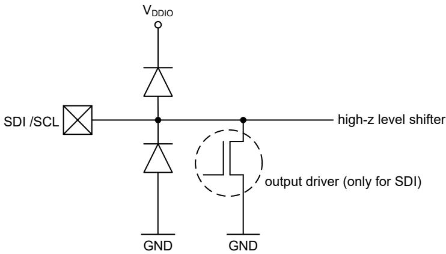  
Figure 6: SDI/SCK ESD drawing

The 7-bit device address is 111011x. The 6 MSB bits are fixed. The last bit is changeable by SDO value and can be changed during operation. Connecting SDO to GND results in slave address 1110110 $( 0 \times 7 6 )$ ; connection it to VDDIO results in slave address 1110111 (0x77), which is the same as BMP180’s I²C address. The SDO pin cannot be left floating; if left floating, the $\mathsf { I } ^ { 2 } \mathsf { C }$ address will be undefined.

The I²C interface uses the following pins:

• SCK: serial clock (SCL)   
• SDI: data (SDA)   
• SDO: Slave address LSB $( \mathsf { G N D } = \mathsf { \Omega } ^ { \prime } 0 ^ { \prime }$ , $\mathsf { V } _ { \mathsf { D D I O } } = \mathsf { \Omega } ^ { \bullet } \mathsf { 1 } ^ { \bullet } ,$ )

CSB must be connected to VDDIO to select $\mathsf { I } ^ { 2 } \mathsf { C }$ interface. SDI is bi-directional with open drain to GND: it must be externally connected to VDDIO via a pull up resistor. Refer to chapter 6 for connection instructions.

The following abbreviations will be used in the $\mathsf { I } ^ { 2 } \mathsf { C }$ protocol figures:

• S Start   
• P Stop   
• ACKS Acknowledge by slave   
• ACKM Acknowledge by master   
• NACKM Not acknowledge by master

# 5.2.1 I²C write

Writing is done by sending the slave address in write mode $( \mathsf { R W } = { } ^ { \circ } 0 ^ { \circ } )$ , resulting in slave address 111011X0 (‘X’ is determined by state of SDO pin. Then the master sends pairs of register addresses and register data. The transaction is ended by a stop condition. This is depicted in Figure 7.

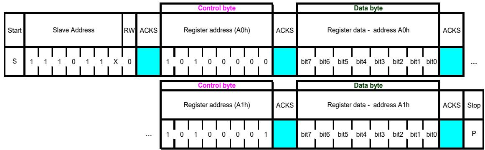  
Figure 7: I²C multiple byte write (not auto-incremented)

# 5.2.2 I²C read

To be able to read registers, first the register address must be sent in write mode (slave address 111011X0). Then either a stop or a repeated start condition must be generated. After this the slave is addressed in read mode $( \mathsf { R W } = \mathsf { \Omega } ^ { \bullet } 1 ^ { \bullet } )$ ) at address 111011X1, after which the slave sends out data from auto-incremented register addresses until a NOACKM and stop condition occurs. This is depicted in Figure 8, where two bytes are read from register $\mathtt { O x F 6 }$ and 0xF7.

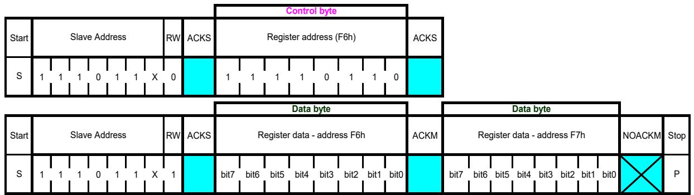  
Figure 8: I²C multiple byte read

# 5.3 SPI interface

The SPI interface is compatible with SPI mode $\mathfrak { o o }$ ( ${ \mathsf { C P O L } } = { \mathsf { C P H A } } = { \mathsf { \Phi } } ^ { \prime } 0 ^ { \prime } )$ ) and mode ‘11’ (CPOL $=$ ${ \mathsf { C P H A } } = { \mathsf { \Omega } } ^ { * }$ ). The automatic selection between mode $\mathfrak { o o }$ and ‘11’ is determined by the value of SCK after the CSB falling edge.

The SPI interface has two modes: 4-wire and 3-wire. The protocol is the same for both. The 3-wire mode is selected by setting $\mathbf { \omega } ^ { \mathbf { 6 } } \mathbf { 1 } ^ { \mathbf { , } }$ to the register spi3w_en. The pad SDI is used as a data pad in 3-wire mode.

The SPI interface uses the following pins:

• CSB: chip select, active low   
• SCK: serial clock   
• SDI: serial data input; data input/output in 3-wire mode   
• SDO: serial data output; hi-Z in 3-wire mode

Refer to chapter 6 for connection instructions.

CSB is active low and has an integrated pull-up resistor. Data on SDI is latched by the device at SCK rising edge and SDO is changed at SCK falling edge. Communication starts when CSB goes to low and stops when CSB goes to high; during these transitions on CSB, SCK must be stable. The SPI protocol is shown in Figure 9. For timing details, please review Table 28

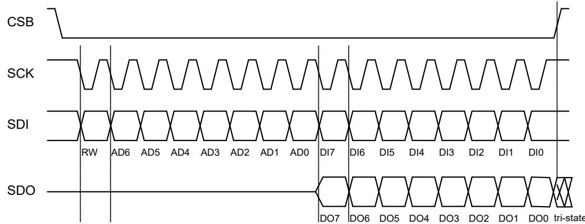  
Figure 9: SPI protocol (shown for mode ‘11’ in 4-wire configuration)

In SPI mode, only 7 bits of the register addresses are used; the MSB of register address is not used and replaced by a read/write bit $( \mathsf { R W } = { } ^ { \circ } 0 ^ { \circ }$ for write and $\mathsf { R W } = \mathsf { \Phi } ^ { \prime } \mathsf { 1 } ^ { \prime }$ for read).

Example: address 0xF7 is accessed by using SPI register address $0 { \times } 7 7$ . For write access, the byte $0 { \times } 7 7$ is transferred, for read access, the byte 0xF7 is transferred.

# 5.3.1 SPI write

Writing is done by lowering CSB and sending pairs control bytes and register data. The control bytes consist of the SPI register address ( $\mathop { \left. \sum \right.}  =$ full register address without bit 7) and the write command (bit7 $=$ $\mathsf { R W } = \mathsf { \Phi } ^ { \prime } 0 ^ { \prime }$ ). Several pairs can be written without raising CSB. The transaction is ended by a raising CSB. The SPI write protocol is depicted in Figure 10.

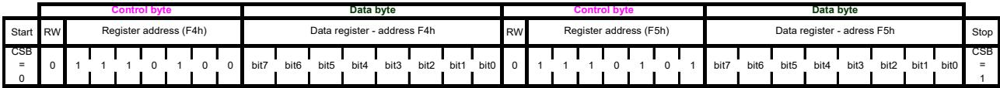  
Figure 10: SPI multiple byte write (not auto-incremented)

# 5.3.2 SPI read

Reading is done by lowering CSB and first sending one control byte. The control bytes consist of the SPI register address ( $\stackrel { \cdot } { = }$ full register address without bit 7) and the read command (bit $7 = \mathsf { R W } = { \mathsf { \Omega } } ^ { \bullet } \mathbf { 1 } ^ { \bullet } )$ . After writing the control byte, data is sent out of the SDO pin (SDI in 3-wire mode); the register address is automatically incremented. The SPI read protocol is shown in Figure 11.

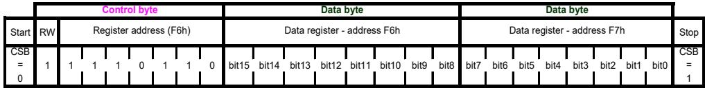  
Figure 11: SPI multiple byte read

5.4 Interface parameter specification

# 5.4.1 General interface parameters

The general interface parameters are given in Table 26 below.

Table 26: interface parameters   

<table><tr><td rowspan=1 colspan=1>Parameter</td><td rowspan=1 colspan=1>Symbol</td><td rowspan=1 colspan=1>Condition</td><td rowspan=1 colspan=1>Min</td><td rowspan=1 colspan=1>Typ</td><td rowspan=1 colspan=1>Max</td><td rowspan=1 colspan=1>Units</td></tr><tr><td rowspan=1 colspan=1> Input - low level</td><td rowspan=1 colspan=1>Vil_si</td><td rowspan=1 colspan=1>VDDIo=1.2V to 3.6V</td><td rowspan=1 colspan=1></td><td rowspan=1 colspan=1></td><td rowspan=1 colspan=1>0.2 *VDDIO</td><td rowspan=1 colspan=1>V</td></tr><tr><td rowspan=1 colspan=1> Input - high level</td><td rowspan=1 colspan=1>Vih_si</td><td rowspan=1 colspan=1>VDDIo=1.2V to 3.6V</td><td rowspan=1 colspan=1>0.8 *VDDIO</td><td rowspan=1 colspan=1></td><td rowspan=1 colspan=1></td><td rowspan=1 colspan=1>V</td></tr><tr><td rowspan=1 colspan=1> Output - low level for I2C</td><td rowspan=1 colspan=1>Vol_SDI</td><td rowspan=1 colspan=1>Vol_SDIVDDIo=1.62V,iol=3 mA</td><td rowspan=1 colspan=1></td><td rowspan=1 colspan=1></td><td rowspan=1 colspan=1>0.2 *VDDIO</td><td rowspan=1 colspan=1>V</td></tr><tr><td rowspan=1 colspan=1> Output - low level for I2C</td><td rowspan=1 colspan=1>Vol_SDI_1.2</td><td rowspan=1 colspan=1> VDDI0=1.20V, iol=3 mA</td><td rowspan=1 colspan=1></td><td rowspan=1 colspan=1></td><td rowspan=1 colspan=1>0.23 *VDDIO</td><td rowspan=1 colspan=1>V</td></tr><tr><td rowspan=1 colspan=1> Output - low level</td><td rowspan=1 colspan=1>Vol_SD。</td><td rowspan=1 colspan=1> VDDIo=1.62V, iol=1 mA</td><td rowspan=1 colspan=1></td><td rowspan=1 colspan=1></td><td rowspan=1 colspan=1>0.2 *VDDIO</td><td rowspan=1 colspan=1>V</td></tr><tr><td rowspan=1 colspan=1> Output - low level</td><td rowspan=1 colspan=1>Vol_SDO_1.2</td><td rowspan=1 colspan=1> VDDI0=1.20V, iol=1 mA</td><td rowspan=1 colspan=1></td><td rowspan=1 colspan=1></td><td rowspan=1 colspan=1>0.23 *VDDIO</td><td rowspan=1 colspan=1>V</td></tr><tr><td rowspan=1 colspan=1> Output - high level</td><td rowspan=1 colspan=1>Voh</td><td rowspan=1 colspan=1>VDDIo=1.62V, ioh=1 mA(SDO, SDI)</td><td rowspan=1 colspan=1>0.8 *VDDIO</td><td rowspan=1 colspan=1></td><td rowspan=1 colspan=1></td><td rowspan=1 colspan=1>V</td></tr><tr><td rowspan=1 colspan=1> Output - high level</td><td rowspan=1 colspan=1>Voh_1.2</td><td rowspan=1 colspan=1>VDDIo=1.2V, ioh=1 mA(SDO, SDI)</td><td rowspan=1 colspan=1>0.6 *VDDIO</td><td rowspan=1 colspan=1></td><td rowspan=1 colspan=1></td><td rowspan=1 colspan=1>v</td></tr><tr><td rowspan=1 colspan=1> Pull-up resistor</td><td rowspan=1 colspan=1>Rpull</td><td rowspan=1 colspan=1>Internal pull-upresistance to VDDIO</td><td rowspan=1 colspan=1>70</td><td rowspan=1 colspan=1>120</td><td rowspan=1 colspan=1>190</td><td rowspan=1 colspan=1>kΩ</td></tr><tr><td rowspan=1 colspan=1> I²C bus load capacitor</td><td rowspan=1 colspan=1>Cb</td><td rowspan=1 colspan=1> On SDl and SCK</td><td rowspan=1 colspan=1></td><td rowspan=1 colspan=1></td><td rowspan=1 colspan=1>400</td><td rowspan=1 colspan=1>pF</td></tr></table>

# 5.4.2 I²C timings

For $\mathsf { I } ^ { 2 } \mathsf { C }$ timings, the following abbreviations are used:

“S&F mode” $=$ standard and fast mode • “HS mode” $=$ high speed mode Cb $=$ bus capacitance on SDA line

All other naming refers to $\mathsf { I } ^ { 2 } \mathsf { C }$ specification 2.1 (January 2000).

The $\mathsf { I } ^ { 2 } \mathsf { C }$ timing diagram is shown in

Figure 12. The corresponding values are given in Table 27

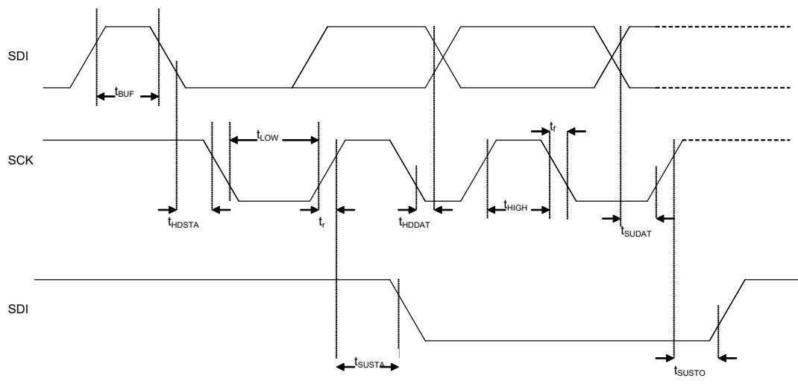  
Figure 12: I²C timing diagram

Table 27: I²C timings   

<table><tr><td rowspan=1 colspan=1>Parameter</td><td rowspan=1 colspan=1>Symbol</td><td rowspan=1 colspan=1>Condition</td><td rowspan=1 colspan=1>Min</td><td rowspan=1 colspan=1>Typ</td><td rowspan=1 colspan=1>Max</td><td rowspan=1 colspan=1>Units</td></tr><tr><td rowspan=1 colspan=1> SDl setup time</td><td rowspan=1 colspan=1>tsU;DAT</td><td rowspan=1 colspan=1>S&amp;F ModeHS mode</td><td rowspan=1 colspan=1>16030</td><td rowspan=1 colspan=1></td><td rowspan=1 colspan=1></td><td rowspan=1 colspan=1>nsns</td></tr><tr><td rowspan=1 colspan=1> SDI hold time</td><td rowspan=1 colspan=1>tHD;DAT</td><td rowspan=1 colspan=1> S&amp;F Mode, Cb≤100 pF S&amp;F Mode, Cb≤400 pF HS mode, Cb≤100 pFHS mode, Cb≤400 pF</td><td rowspan=1 colspan=1>80901824</td><td rowspan=1 colspan=1></td><td rowspan=1 colspan=1>115150</td><td rowspan=1 colspan=1>nsnsnsns</td></tr><tr><td rowspan=1 colspan=1> SCK low pulse</td><td rowspan=1 colspan=1>tLow</td><td rowspan=1 colspan=1>HS mode, Cb≤100 pFVDDIO = 1.62 V</td><td rowspan=1 colspan=1>160</td><td rowspan=1 colspan=1></td><td rowspan=1 colspan=1></td><td rowspan=1 colspan=1>ns</td></tr><tr><td rowspan=1 colspan=1> SCK low pulse</td><td rowspan=1 colspan=1>tLow</td><td rowspan=1 colspan=1> HS mode, Cb≤100 pFVDDIO = 1.2 V</td><td rowspan=1 colspan=1>210</td><td rowspan=1 colspan=1></td><td rowspan=1 colspan=1></td><td rowspan=1 colspan=1>ns</td></tr></table>

The above-mentioned I2C specific timings correspond to the following internal added delays:

Input delay between SDI and SCK inputs: SDI is more delayed than SCK by typically 100 ns in Standard and Fast Modes and by typically 20 ns in High Speed Mode. Output delay from SCK falling edge to SDI output propagation is typically 140 ns in Standard and Fast Modes and typically 70 ns in High Speed Mode.

# 5.4.3 SPI timings

The SPI timing diagram is in Figure 13, while the corresponding values are given in Table 28. All timings apply both to $4 \cdot$ and 3-wire SPI.

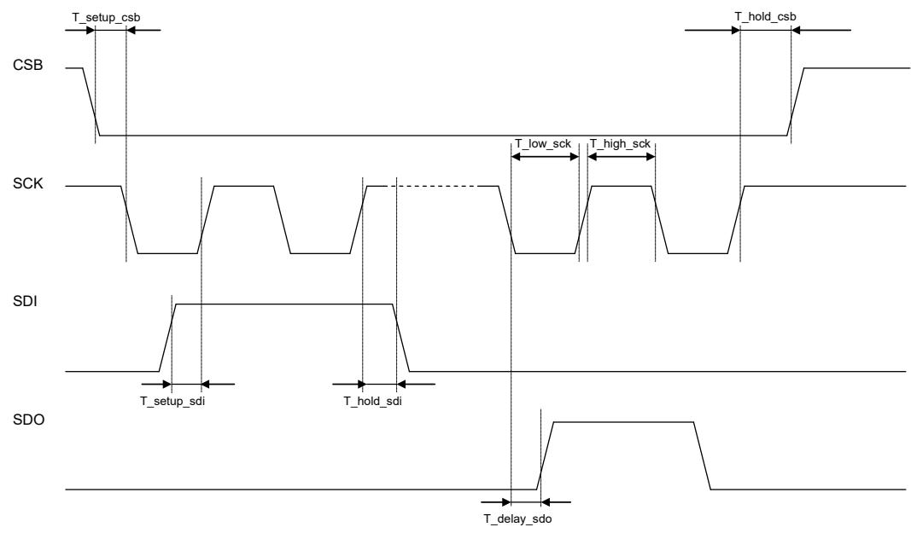  
Figure 13: SPI timing diagram

Table 28: SPI timings   

<table><tr><td rowspan=1 colspan=1>Parameter</td><td rowspan=1 colspan=1>Symbol</td><td rowspan=1 colspan=1>Condition</td><td rowspan=1 colspan=1>Min</td><td rowspan=1 colspan=1>Typ</td><td rowspan=1 colspan=1>Max</td><td rowspan=1 colspan=1>Units</td></tr><tr><td rowspan=1 colspan=1>SPl clock input frequency</td><td rowspan=1 colspan=1>F_spi</td><td rowspan=1 colspan=1></td><td rowspan=1 colspan=1>0</td><td rowspan=1 colspan=1></td><td rowspan=1 colspan=1>10</td><td rowspan=1 colspan=1>MHz</td></tr><tr><td rowspan=1 colspan=1> SCK low pulse</td><td rowspan=1 colspan=1>T_low_sck</td><td rowspan=1 colspan=1></td><td rowspan=1 colspan=1>20</td><td rowspan=1 colspan=1></td><td rowspan=1 colspan=1></td><td rowspan=1 colspan=1>ns</td></tr><tr><td rowspan=1 colspan=1>SCK high pulse</td><td rowspan=1 colspan=1>T_high_sck</td><td rowspan=1 colspan=1></td><td rowspan=1 colspan=1>20</td><td rowspan=1 colspan=1></td><td rowspan=1 colspan=1></td><td rowspan=1 colspan=1>ns</td></tr><tr><td rowspan=1 colspan=1> SDl setup time</td><td rowspan=1 colspan=1>T_setup_sdi</td><td rowspan=1 colspan=1></td><td rowspan=1 colspan=1>20</td><td rowspan=1 colspan=1></td><td rowspan=1 colspan=1></td><td rowspan=1 colspan=1>ns</td></tr><tr><td rowspan=1 colspan=1> SDI hold time</td><td rowspan=1 colspan=1>T_hold_sdi</td><td rowspan=1 colspan=1></td><td rowspan=1 colspan=1>20</td><td rowspan=1 colspan=1></td><td rowspan=1 colspan=1></td><td rowspan=1 colspan=1>ns</td></tr><tr><td rowspan=1 colspan=1> SDO output delay</td><td rowspan=1 colspan=1>T_delay_sdo</td><td rowspan=1 colspan=1>25pF load, VDDio=1.6V min</td><td rowspan=1 colspan=1></td><td rowspan=1 colspan=1></td><td rowspan=1 colspan=1>30</td><td rowspan=1 colspan=1>ns</td></tr><tr><td rowspan=1 colspan=1> SDO output delay</td><td rowspan=1 colspan=1>T_delay_sdo</td><td rowspan=1 colspan=1>25pF load, VdDio=1.2V min</td><td rowspan=1 colspan=1></td><td rowspan=1 colspan=1></td><td rowspan=1 colspan=1>40</td><td rowspan=1 colspan=1>ns</td></tr><tr><td rowspan=1 colspan=1> CSB setup time</td><td rowspan=1 colspan=1>T_setup_csb</td><td rowspan=1 colspan=1></td><td rowspan=1 colspan=1>20</td><td rowspan=1 colspan=1></td><td rowspan=1 colspan=1></td><td rowspan=1 colspan=1>ns</td></tr><tr><td rowspan=1 colspan=1>CSB hold time</td><td rowspan=1 colspan=1>T_hold_csb</td><td rowspan=1 colspan=1></td><td rowspan=1 colspan=1>20</td><td rowspan=1 colspan=1></td><td rowspan=1 colspan=1></td><td rowspan=1 colspan=1>ns</td></tr></table>

# 6. Pin-out and connection diagram

# 6.1 Pin-out

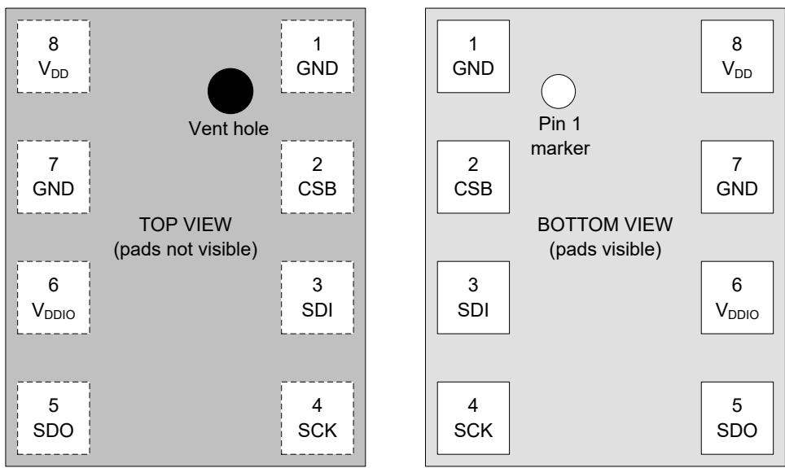  
Figure 14: Pin-out top and bottom view

Table 29: Pin description   

<table><tr><td rowspan=2 colspan=1>Pin</td><td rowspan=2 colspan=1>Name</td><td rowspan=2 colspan=1> I/O Type</td><td rowspan=2 colspan=1>Description</td><td rowspan=1 colspan=3>Connect to</td></tr><tr><td rowspan=1 colspan=1>SPI 4W</td><td rowspan=1 colspan=1>SPI 3W</td><td rowspan=1 colspan=1>PC</td></tr><tr><td rowspan=1 colspan=1>1</td><td rowspan=1 colspan=1>GND</td><td rowspan=1 colspan=1> Supply</td><td rowspan=1 colspan=1>Ground</td><td rowspan=1 colspan=3>GND</td></tr><tr><td rowspan=1 colspan=1>2</td><td rowspan=1 colspan=1>CSB</td><td rowspan=1 colspan=1>In</td><td rowspan=1 colspan=1>Chip select</td><td rowspan=1 colspan=1>CSB</td><td rowspan=1 colspan=1>CSB</td><td rowspan=1 colspan=1>VDDIO</td></tr><tr><td rowspan=1 colspan=1>3</td><td rowspan=1 colspan=1> SDI</td><td rowspan=1 colspan=1> In/Out</td><td rowspan=1 colspan=1> Serial data input</td><td rowspan=1 colspan=1> SDI</td><td rowspan=1 colspan=1> SDI/SDO</td><td rowspan=1 colspan=1> SDA</td></tr><tr><td rowspan=1 colspan=1>4</td><td rowspan=1 colspan=1>SCK</td><td rowspan=1 colspan=1>In</td><td rowspan=1 colspan=1> Serial clock input</td><td rowspan=1 colspan=1>SCK</td><td rowspan=1 colspan=1>SCK</td><td rowspan=1 colspan=1>SCL</td></tr><tr><td rowspan=1 colspan=1>5</td><td rowspan=1 colspan=1>SDO</td><td rowspan=1 colspan=1> In/Out</td><td rowspan=1 colspan=1> Serial data output</td><td rowspan=1 colspan=1>SDO</td><td rowspan=1 colspan=1>DNC</td><td rowspan=1 colspan=1> GND fordefaultaddress</td></tr><tr><td rowspan=1 colspan=1>6</td><td rowspan=1 colspan=1>VDDIO</td><td rowspan=1 colspan=1> Supply</td><td rowspan=1 colspan=1> Digital interface supply</td><td rowspan=1 colspan=3>VDDIO</td></tr><tr><td rowspan=1 colspan=1>7</td><td rowspan=1 colspan=1>GND</td><td rowspan=1 colspan=1> Supply</td><td rowspan=1 colspan=1>Ground</td><td rowspan=2 colspan=3>GNDVDD</td></tr><tr><td rowspan=1 colspan=1>8</td><td rowspan=1 colspan=1>VDD</td><td rowspan=1 colspan=1> Supply</td><td rowspan=1 colspan=1> Analog supply</td></tr></table>

Connection diagram 4-wire SPI

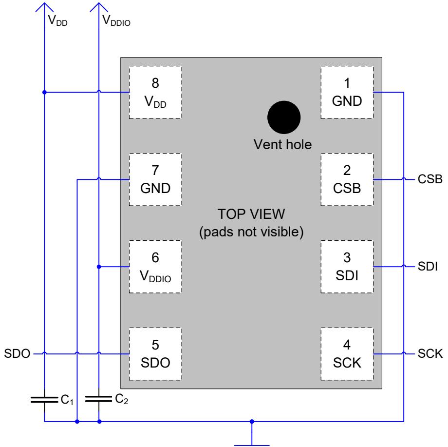  
Figure 15: 4-wire SPI connection diagram (Pin1 marking indicated)

Note: the recommended value for ${ \sf C } _ { 1 }$ , ${ \sf C } _ { 2 }$ is 100 nF.

# 6.2 Connection diagram 3-wire SPI

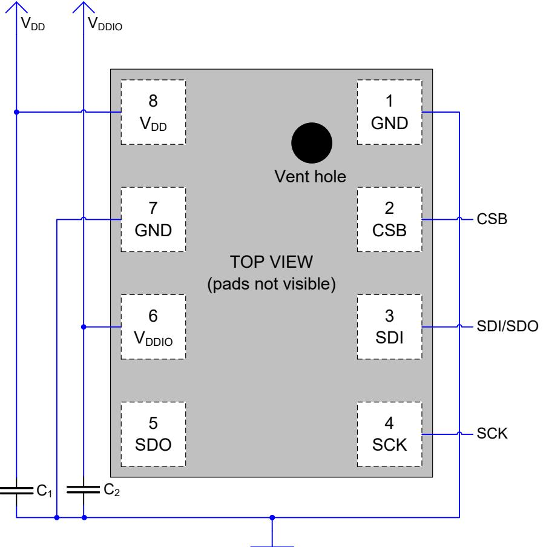  
Figure 16: 3-wire SPI connection diagram (Pin1 marking indicated)

Note: the recommended value for ${ \sf C } _ { 1 }$ , ${ \sf C } _ { 2 }$ is 100 nF.

# 6.3 Connection diagram I2C

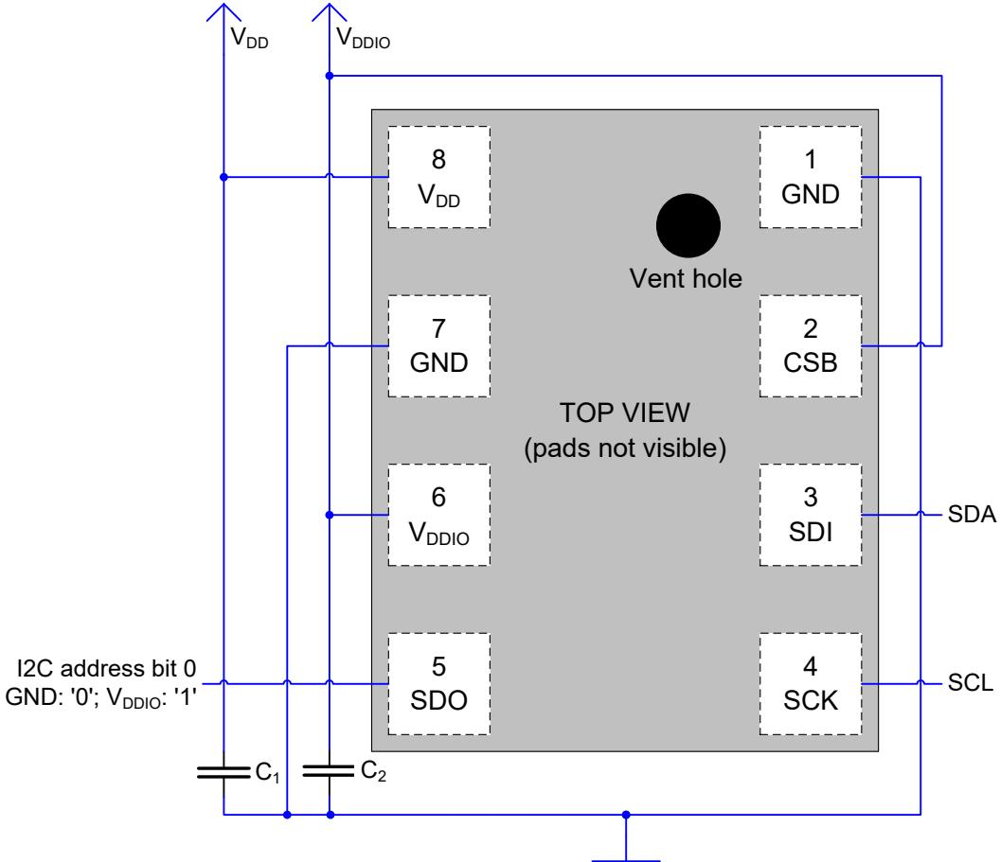  
Figure 17: I²C connection diagram (Pin1 marking indicated)

# Notes:

The recommended value for ${ \sf C } _ { 1 }$ , ${ \sf C } _ { 2 }$ is 100 nF. A direct connection between CSB and VDDIO is recommended. If CSB is detected as low during startup, the interface will be locked into SPI mode. See chapter 5.1.

# 7. Package, reel and environment

# 7.1 Outline dimensions

The sensor housing is an 8-pin metal-lid LGA $2 . 0 \times 2 . 5 \times 0 . 9 5 ~ \mathrm { m m } ^ { 3 }$ package. Its dimensions are depicted in Figure 18.

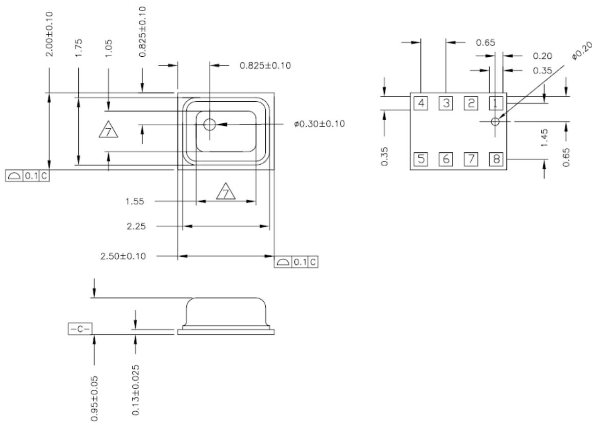  
Figure 18: Package outline dimensions for top, bottom and side view

Note: General tolerances are $\pm 5 0 \mu \mathrm { m }$ (linear) and $\pm 1 ^ { \circ } \mu \mathsf { m }$ (angular)

# 7.2 Landing pattern recommendation

For the design of the landing pattern, the following dimensioning is recommended:

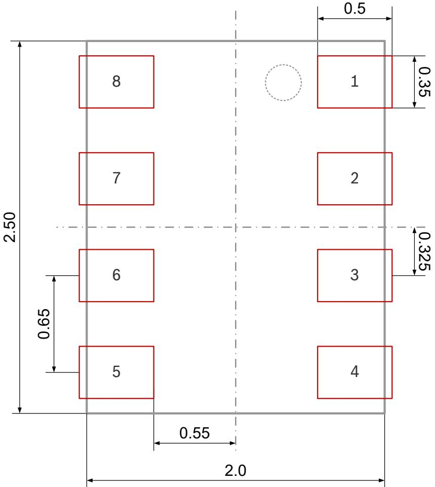  
Figure 19: Recommended landing pattern (top view); dimensions are in mm

Note: red areas demark exposed PCB metal pads.

In case of a solder mask defined (SMD) PCB process, the land dimensions should be defined by solder mask openings. The underlying metal pads are larger than these openings. In case of a non solder mask defined (NSMD) PCB process, the land dimensions should be defined in the metal layer. The mask openings are larger than the these metal pads.

# 7.3 Marking

# 7.3.1 Mass production devices

Table 30: Marking of mass production samples   

<table><tr><td rowspan=5 colspan=1>LabelingCCCTL</td><td rowspan=1 colspan=1>Name</td><td rowspan=1 colspan=1>Symbol</td><td rowspan=1 colspan=1>Remark</td></tr><tr><td rowspan=1 colspan=1>Lot counter</td><td rowspan=1 colspan=1>ccC</td><td rowspan=1 colspan=1> 3 alphanumeric digits, variableto generate mass production trace-code</td></tr><tr><td rowspan=1 colspan=1> Product number</td><td rowspan=1 colspan=1>T</td><td rowspan=1 colspan=1> 1 alphanumeric digit, fixed to identify product type, T =“K&quot;&quot;K&quot; is associated with the product BMP280</td></tr><tr><td rowspan=1 colspan=1>Sub-con ID</td><td rowspan=1 colspan=1></td><td rowspan=1 colspan=1> 1 alphanumeric digit, variable to identify subcon (L =“S&quot;,“M&quot; for newvariant, both part number 0273300436)</td></tr><tr><td rowspan=1 colspan=1> Orientation marker</td><td rowspan=1 colspan=1>：</td><td rowspan=1 colspan=1> Vent hole</td></tr></table>

# 7.3.2 Engineering samples

Table 31: Marking of engineering samples   

<table><tr><td rowspan=5 colspan=1>LabelingXXNCC</td><td rowspan=1 colspan=1>Name</td><td rowspan=1 colspan=1>Symbol</td><td rowspan=1 colspan=1>Remark</td></tr><tr><td rowspan=1 colspan=1>Eng. Sample ID</td><td rowspan=1 colspan=1>N</td><td rowspan=1 colspan=1>1 alphanumeric digit,fixed to identifyengineering sample, N = “* ” or&quot;e&quot;or“E”</td></tr><tr><td rowspan=1 colspan=1> Sample ID</td><td rowspan=1 colspan=1>xx</td><td rowspan=1 colspan=1> 2 alphanumeric digits, variable to generate trace-code</td></tr><tr><td rowspan=1 colspan=1>Counter ID</td><td rowspan=1 colspan=1>CC</td><td rowspan=1 colspan=1>2 alphanumeric digits, variable to generate trace-code</td></tr><tr><td rowspan=1 colspan=1> Orientation marker</td><td rowspan=1 colspan=1>：</td><td rowspan=1 colspan=1> Vent hole</td></tr></table>

# 7.4 Soldering guidelines

The moisture sensitivity level of the BMP280 sensors corresponds to JEDEC Level 1, see also:

IPC/JEDEC J-STD-020C “Joint Industry Standard: Moisture/Reflow Sensitivity Classification for non  
hermetic Solid State Surface Mount Devices”   
IPC/JEDEC J-STD-033A “Joint Industry Standard: Handling, Packing, Shipping and Use of Moisture/Reflow Sensitive Surface Mount Devices”.

The sensor fulfils the lead-free soldering requirements of the above-mentioned IPC/JEDEC standard, i.e. reflow soldering with a peak temperature up to $2 6 0 ^ { \circ } \mathsf { C }$ . The minimum height of the solder after reflow shall be at least $5 0 \mu \mathrm { m }$ . This is required for good mechanical decoupling between the sensor device and the printed circuit board (PCB).

<table><tr><td rowspan=1 colspan=1>Profile Feature</td><td rowspan=1 colspan=1></td><td rowspan=1 colspan=1>Pb-FreeAssembly</td></tr><tr><td rowspan=1 colspan=1>AverageRamp-UpRate(TsmaxtoTp）</td><td rowspan=1 colspan=1></td><td rowspan=1 colspan=1>3°C/second max.</td></tr><tr><td rowspan=1 colspan=1>Preheat-Temperature Min(Tsmin）-Temperature Max(Tsmax）-Time (tsmin totsmax）</td><td rowspan=1 colspan=1></td><td rowspan=1 colspan=1>150℃200℃60-180 seconds</td></tr><tr><td rowspan=1 colspan=1>Timemaintained above:-Temperature (TL)-Time (tL）</td><td rowspan=1 colspan=1></td><td rowspan=1 colspan=1>217℃60-150seconds</td></tr><tr><td rowspan=1 colspan=1>Peak/Classification Temperature(Tp)</td><td rowspan=1 colspan=1></td><td rowspan=1 colspan=1>260℃</td></tr><tr><td rowspan=1 colspan=1>Timewithin5Cofactual PeakTemperature (tp)</td><td rowspan=1 colspan=1></td><td rowspan=1 colspan=1>20-40 seconds</td></tr><tr><td rowspan=1 colspan=1>Ramp-Down Rate</td><td rowspan=1 colspan=1></td><td rowspan=1 colspan=1>6C/secondmax.</td></tr><tr><td rowspan=1 colspan=1>Time25CtoPeakTemperature</td><td rowspan=1 colspan=1></td><td rowspan=1 colspan=1>8 minutes max.</td></tr></table>

Note1:Alltemperaturesrefer totopsideof thepackage,measuredonthepackagebodysurface

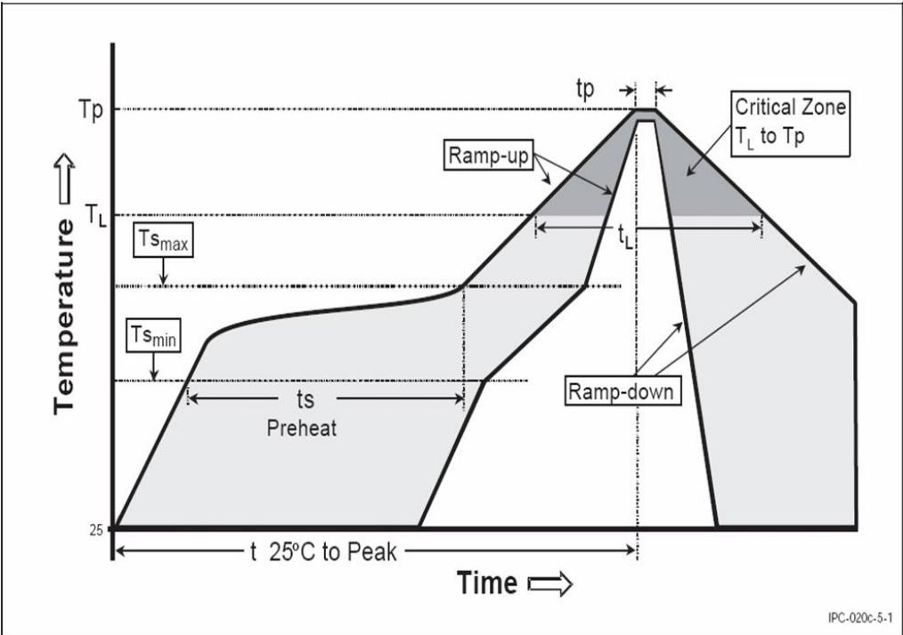  
Figure 20: Soldering profile

# 7.5 Tape and reel specification

# 7.5.1 Dimensions

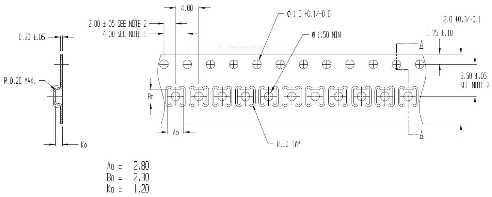  
Figure 21: Tape and Reel dimensions

Quantity per reel: 10 kpcs.

7.5.2 Orientation within the reel

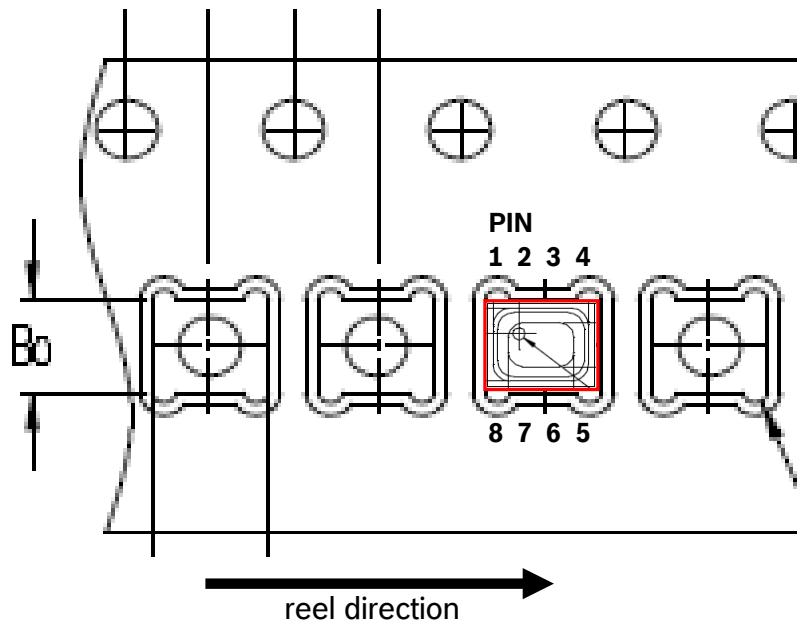  
Figure 22: Orientation within tape

# 7.6 Mounting and assembly recommendations

In addition to “Handling, soldering & mounting instructions BMP280”, the following recommendations should be taken into consideration when mounting a pressure sensor on a printed-circuit board (PCB):

The clearance above the metal lid shall be 0.1mm at minimum.   
For the device housing appropriate venting needs to be provided in case the ambient pressure shall be measured.   
Liquids shall not come into direct contact with the device.   
During operation the sensor chip is sensitive to light, which can influence the accuracy of the measurement (photo-current of silicon). The position of the vent hole minimizes the light exposure of the sensor chip. Nevertheless, BST recommends to avoid the exposure of BMP280 to strong light sources.   
Soldering may not be done using vapor phase processes since the sensor might be damaged.

# 7.7 Environmental safety

# 7.7.1 RoHS

The BMP280 sensor meets the requirements of the EC restriction of hazardous substances (RoHS) directive, see also: RoHS–Directive 2011/65/EU and its amendments, including the amendment 2015/863/EU on the restriction of the use of certain hazardous substances in electrical and electronic equipment.

# 7.7.2 Halogen content

The BMP280 is halogen-free. For more details on the analysis results please contact your Bosch Sensortec representative.

# 7.7.3 Internal package structure

Within the scope of Bosch Sensortec’s ambition to improve its products and secure the mass product supply, Bosch Sensortec qualifies additional sources (e.g. $2 ^ { \mathsf { n d } }$ source) for the LGA package of the BMP280.

While Bosch Sensortec took care that all of the technical packages parameters are described above are $100 \%$ identical for all sources, there can be differences in the chemical content and the internal structural between the different package sources.

However, as secured by the extensive product qualification process of Bosch Sensortec, this has no impact to the usage or to the quality of the BMP280 product.

# 8. Appendix 1: Computation formulae for 32 bit systems

# 8.1 Compensation formula in floating point

Please note that it is strongly advised to use the API available from Bosch Sensortec to perform readout and compensation. If this is not wanted, the code below can be applied at the user’s risk. Both pressure and temperature values are expected to be received in 20 bit format, positive, stored in a 32 bit signed integer.

The variable t_fine (signed 32 bit) carries a fine resolution temperature value over to the pressure compensation formula and could be implemented as a global variable.

The data type “BMP280_S32_t” should define a 32 bit signed integer variable type and could usually be defined as “long signed int”. The revision of the code is rev.1.1.

// Returns temperature in DegC, double precision. Output value of $" 5 1 . 2 3 \prime \prime$ equals 51.23 DegC.   
// t_fine carries fine temperature as global value   
BMP280_S32_t t_fine;   
double bmp280_compensate_T_double(BMP280_S32_t adc_T)   
f double var1, var2, T; var1 $=$ (((double)adc_T)/16384.0 – ((double)dig_T1)/1024.0) \* ((double)dig_T2); var2 $=$ ((((double)adc_T)/131072.0 – ((double)dig_T1)/8192.0) \* (((double)adc_T)/131072.0 – ((double) dig_T1)/8192.0)) \* ((double)dig_T3); t_fine $=$ (BMP280_S32_t)(var1 $^ +$ var2); T = (var1 $^ +$ var2) / 5120.0; return T;   
}   
// Returns pressure in Pa as double. Output value of “96386.2” equals 96386.2 Pa $=$ 963.862 hPa   
double bmp280_compensate_P_double(BMP280_S32_t adc_P) double var1, var2, p; var1 $=$ ((double)t_fine/2.0) – 64000.0; var2 $=$ var1 $^ { \star }$ var1 $\star$ ((double)dig_P6) / 32768.0; var2 $=$ var2 $^ +$ var1 $\star$ ((double)dig_P5) \* 2.0; var2 $=$ (var2/4.0)+(((double)dig_P4) \* 65536.0); var1 $=$ (((double)dig_P3) $\star$ var1 \* var1 / 524288.0 $^ +$ ((double)dig_P2) $\star$ var1) / 524288.0; var1 $=$ (1.0 + var1 / 32768.0)\*((double)dig_P1); if (var1 $\mathrm { ~  ~ \omega ~ } = \mathrm { ~  ~ 0 ~ } . 0$ ) { return 0; // avoid exception caused by division by zero } $\texttt { p } = \texttt { l } 0 4 8 5 7 6 . 0 \ -$ (double)adc_P; p = (p – (var2 / 4096.0)) \* 6250.0 / var1; var1 $=$ ((double)dig_P9) \* p \* p / 2147483648.0; var2 $=$ p \* ((double)dig_P8) / 32768.0; $\mathrm { ~ p ~ } = \mathrm { ~ p ~ } + \mathrm { ~ }$ (var1 $^ +$ var2 $^ +$ ((double)dig_P7)) / 16.0; return p;   
1

# 8.2 Compensation formula in 32 bit fixed point

Please note that it is strongly advised to use the API available from Bosch Sensortec to perform readout and compensation. If this is not wanted, the code below can be applied at the user’s risk. Both pressure and temperature values are expected to be received in 20 bit format, positive, stored in a 32 bit signed integer.

The variable t_fine (signed 32 bit) carries a fine resolution temperature value over to the pressure compensation formula and could be implemented as a global variable.   
The data type “BMP280_S32_t” should define a 32 bit signed integer variable type and can usually be defined as “long signed int”.

The data type “BMP280_U32_t” should define a 32 bit unsigned integer variable type and can usually be defined as “long unsigned int”.

Compensating the pressure value with 32 bit integer has an accuracy of typically 1 Pa (1-sigma). At very high filter levels this adds a noticeable amount of noise to the output values and reduces their resolution.

var1 $=$ ((((adc_ $\mathbb { T } > > 3$ ) – ((BMP280_S32_t)dig_T1 $< < 1$ ))) \* ((BMP280_S32_t)dig_T2)) $> > ~ 1 1$ ; var2 $=$ (((((adc_T>>4) – ((BMP280_S32_t)dig_T1)) \* ((adc_ $\mathbb { T } { > } > 4$ ) – ((BMP280_S32_t)dig_T1))) >> 12) \* ((BMP280_S32_t)dig_T3)) $> >$ 14; t_fine = var1 + var2; $\mathrm { ~  ~ { ~ \cal ~ T ~ } ~ } ^ { - } = ( \sf t \_ f i n e ^ { \alpha } \mathrm { ~  ~ { ~ \star ~ } ~ } \sf s + \mathrm { ~ \mathrm { 1 } ~ } \mathrm { 2 8 ~ } ) > 8 \ ;$ ; return T; }

// Returns pressure in Pa as unsigned 32 bit integer. Output value of “96386” equals 96386 Pa $=$ 963.86 hPa   
BMP280_U32_t bmp280_compensate_P_int32(BMP280_S32_t adc_P) BMP280_S32_t var1, var2; BMP280_U32_t p; var1 $= ^ { - }$ (((BMP280_S32_t)t_fine) $> > 1$ ) – (BMP280_S32_t)64000; var2 $=$ (((var1>>2) \* (var1>>2)) $> >$ 11 ) $^ { \star }$ ((BMP280_S32_t)dig_P6); var2 $=$ var2 + ((var1\*((BMP280_S32_t)dig_P5)) $< < 1$ ); var2 $=$ $( \mathtt { v a r } 2 > > 2 )$ )+(((BMP280_S32_t)dig_P4) $< < 1 6$ ); var1 $=$ (((dig_P3 \* (((var1>>2) \* (var1>>2)) >> 13 )) $> > ~ \bar { ~ }$ 3) + ((((BMP280_S32_t)dig_P2) \* var1) $> > 1$ )) $> > 1 8$ ; var1 $=$ ((((32768+var1))\*((BMP280_S32_t)dig_P1)) ${ > } { > } 1 5$ ); if $( \mathsf { v a r 1 } \ \mathsf { \Omega } = \mathsf { \Omega } 0$ ) { return 0; // avoid exception caused by division by zero } p = (((BMP280_U32_t)(((BMP280_S32_t)1048576)-adc_P)-(var $\Longrightarrow \pm 2$ ))) $^ { \star } 3 1 2 5$ ; if (p < 0x80000000) { p = (p << 1) / ((BMP280_U32_t)var1); } else { p = (p / (BMP280_U32_t)var1) \* 2; } var1 $=$ (((BMP280_S32_t)dig_P9) \* ((BMP280_S32_t)(( $( p > > 3$ ) $^ { \star }$ ( $. p > > 3$ )) $1 > > 1 3$ ))) $> > 1 2$ ; var2 $=$ (((BMP280_S32_t) $( \boldsymbol { \mathrm { p } } > > 2 )$ ) \* ((BMP280_S32_t)dig_P8)) $1 > > 1 3$ ; $\mathrm { ~ p ~ } =$ (BMP280_U32_t)((BMP280_S32_t)p $^ +$ ((var1 $^ +$ var2 + dig_P7) $> > ~ 4 )$ ); return p;

# 9. Legal disclaimer

# 9.1 Engineering samples

Engineering Samples are marked with an asterisk (\*), (E) or (e). Samples may vary from the valid technical specifications of the product series contained in this data sheet. They are therefore not intended or fit for resale to third parties or for use in end products. Their sole purpose is internal client testing. The testing of an engineering sample may in no way replace the testing of a product series. Bosch Sensortec assumes no liability for the use of engineering samples. The Purchaser shall indemnify Bosch Sensortec from all claims arising from the use of engineering samples.

# 9.2 Product use

Bosch Sensortec products are developed for the consumer goods industry. They may only be used within the parameters of this product data sheet. They are not fit for use in life-sustaining or safetycritical systems. Safety-critical systems are those for which a malfunction is expected to lead to bodily harm, death or severe property damage. In addition, they shall not be used directly or indirectly for military purposes (including but not limited to nuclear, chemical or biological proliferation of weapons or development of missile technology), nuclear power, deep sea or space applications (including but not limited to satellite technology).

Bosch Sensortec products are released on the basis of the legal and normative requirements relevant to the Bosch Sensortec product for use in the following geographical target market: BE, BG, DK, DE, EE, FI, FR, GR, IE, IT, HR, LV, LT, LU, MT, NL, AT, PL, PT, RO, SE, SK, SI, ES, CZ, HU, CY, US, CN, JP, KR, TW. If you need further information or have further requirements, please contact your local sales contact.

The resale and/or use of Bosch Sensortec products are at the purchaser’s own risk and his own responsibility. The examination of fitness for the intended use is the sole responsibility of the purchaser.

The purchaser shall indemnify Bosch Sensortec from all third party claims arising from any product use not covered by the parameters of this product data sheet or not approved by Bosch Sensortec and reimburse Bosch Sensortec for all costs in connection with such claims.

The purchaser accepts the responsibility to monitor the market for the purchased products, particularly with regard to product safety, and to inform Bosch Sensortec without delay of all safety-critical incidents.

# 9.3 Application examples and hints

With respect to any examples or hints given herein, any typical values stated herein and/or any information regarding the application of the device, Bosch Sensortec hereby disclaims any and all warranties and liabilities of any kind, including without limitation warranties of non-infringement of intellectual property rights or copyrights of any third party. The information given in this document shall in no event be regarded as a guarantee of conditions or characteristics. They are provided for illustrative purposes only and no evaluation regarding infringement of intellectual property rights or copyrights or regarding functionality, performance or error has been made.

# 10. Document history and modification

<table><tr><td rowspan=1 colspan=1>Rev. No</td><td rowspan=1 colspan=1>Chapter</td><td rowspan=1 colspan=1>Descriptionofmodification/changes</td><td rowspan=1 colspan=1>Date</td></tr><tr><td rowspan=1 colspan=1>0.1</td><td rowspan=1 colspan=1></td><td rowspan=1 colspan=1>Document creation</td><td rowspan=1 colspan=1>2012-08-06</td></tr><tr><td rowspan=3 colspan=1>1.0</td><td rowspan=1 colspan=1>9.2</td><td rowspan=1 colspan=1>Change of product use</td><td rowspan=3 colspan=1>2013-11-26</td></tr><tr><td rowspan=2 colspan=1>Table 2</td><td rowspan=1 colspan=1> Update of min/max data (only for restrictedversion)</td></tr><tr><td rowspan=1 colspan=1>Added comment on the sampling rate</td></tr><tr><td rowspan=3 colspan=1>1.1</td><td rowspan=1 colspan=1>1, 3.3.1</td><td rowspan=1 colspan=1>Changed value for resolution, values forosrs_p settings changed</td><td rowspan=1 colspan=1>2014-02-10</td></tr><tr><td rowspan=1 colspan=1>5.2</td><td rowspan=1 colspan=1>Changed sentence and added drawing</td><td rowspan=1 colspan=1>2014-02-18</td></tr><tr><td rowspan=1 colspan=1>3.7</td><td rowspan=1 colspan=1> Added max values for current consumption</td><td rowspan=1 colspan=1>2014-05-08</td></tr><tr><td rowspan=2 colspan=1>1.11</td><td rowspan=1 colspan=1>4.5.3</td><td rowspan=1 colspan=1>Modified write in normal mode</td><td rowspan=2 colspan=1>2014-06-25</td></tr><tr><td rowspan=1 colspan=1>5.2</td><td rowspan=1 colspan=1>Modified SDI/SCK ESD drawing</td></tr><tr><td rowspan=2 colspan=1>1.12</td><td rowspan=1 colspan=1>1</td><td rowspan=1 colspan=1> Changed min/max values for standby current,only valid for 25C</td><td rowspan=1 colspan=1>2014-07-12</td></tr><tr><td rowspan=1 colspan=1>Table 1</td><td rowspan=1 colspan=1>Pressure resolution 0.16Pa</td><td rowspan=1 colspan=1>2014-07-12</td></tr><tr><td rowspan=2 colspan=1>1.13</td><td rowspan=1 colspan=1>Page 2</td><td rowspan=1 colspan=1> New technical reference codes added</td><td rowspan=2 colspan=1>2014-11-12</td></tr><tr><td rowspan=1 colspan=1>7.3</td><td rowspan=1 colspan=1> New details about laser marking added</td></tr><tr><td rowspan=3 colspan=1>1.14</td><td rowspan=1 colspan=1>Table 6</td><td rowspan=1 colspan=1> Changed contents of table</td><td rowspan=2 colspan=1>2015-05-04</td></tr><tr><td rowspan=1 colspan=1>Page 1</td><td rowspan=1 colspan=1> Removed TRC 0 273 300 354 &amp; 0273 300391</td></tr><tr><td rowspan=1 colspan=1>Page 44</td><td rowspan=1 colspan=1> Updated RoHS directive to 2011/65/EUeffective 8 June 2011</td><td rowspan=1 colspan=1>2015-05-07</td></tr><tr><td rowspan=1 colspan=1>1.15</td><td rowspan=1 colspan=1>Page 2, 3</td><td rowspan=1 colspan=1>Modified target devices, applications</td><td rowspan=1 colspan=1>2015-10-15</td></tr><tr><td rowspan=1 colspan=1>1.16</td><td rowspan=1 colspan=1></td><td rowspan=1 colspan=1>Special customer-only</td><td rowspan=1 colspan=1>2016-01-28</td></tr><tr><td rowspan=1 colspan=1>1.17</td><td rowspan=1 colspan=1>7.3</td><td rowspan=1 colspan=1>Added all available TRC</td><td rowspan=1 colspan=1>2016-06-07</td></tr><tr><td rowspan=1 colspan=1>1.18</td><td rowspan=1 colspan=1>7.3</td><td rowspan=1 colspan=1>New marking</td><td rowspan=1 colspan=1>2016-11-02</td></tr><tr><td rowspan=1 colspan=1>1.19</td><td rowspan=1 colspan=1>Page 1</td><td rowspan=1 colspan=1>Update of technical reference code</td><td rowspan=1 colspan=1>2018-01-08</td></tr><tr><td rowspan=1 colspan=1>1.20</td><td rowspan=1 colspan=1>4.3.7</td><td rowspan=1 colspan=1>Modified typo in table header</td><td rowspan=1 colspan=1>2018-04-25</td></tr><tr><td rowspan=1 colspan=1>1.21</td><td rowspan=1 colspan=1></td><td rowspan=1 colspan=1> Template update</td><td rowspan=1 colspan=1>2018-09-17</td></tr><tr><td rowspan=1 colspan=1>1.22</td><td rowspan=1 colspan=1>9</td><td rowspan=1 colspan=1>Update of legal disclaimer</td><td rowspan=1 colspan=1>2019-11-07</td></tr><tr><td rowspan=1 colspan=1>1.23</td><td rowspan=1 colspan=1>9</td><td rowspan=1 colspan=1> Update disclaimer</td><td rowspan=1 colspan=1>2020-11-20</td></tr><tr><td rowspan=1 colspan=1>1.24</td><td rowspan=1 colspan=1>7.37.7</td><td rowspan=1 colspan=1>Updated markingUpdate Environmental safety</td><td rowspan=1 colspan=1>2021-07-12</td></tr><tr><td rowspan=1 colspan=1>1.25</td><td rowspan=1 colspan=1>Page 1</td><td rowspan=1 colspan=1>Added ordering code</td><td rowspan=1 colspan=1>2021-09-28</td></tr></table>

contact@bosch-sensortec.com www.bosch-sensortec.com

Modifications reserved Specifications subject to change without notice Document number: BST-BMP280-DS001-26