# TMP10x Temperature Sensor With I2C and SMBus Interface with Alert Function in SOT-23 Package

# 1 Features

Digital Output: SMBus™, Two-Wire, and ${ \mathsf { I } } ^ { 2 } { \mathsf { C } }$ Interface Compatibility

• Resolution: 9 to 12 Bits, User-Selectable

• Accuracy:

– $\pm 1 ^ { \circ } \mathsf { C }$ (Typical) from $\mathtt { - 5 5 ^ { \circ } C }$ to $1 2 5 ^ { \circ } \mathrm { C }$ – $\pm 2 ^ { \circ } \mathsf { C }$ (Maximum) from $\mathtt { - 5 5 ^ { \circ } C }$ to $1 2 5 ^ { \circ } \mathrm { C }$

• Low Quiescent Current: 45-μA, 0.1- ${ \mathsf { \Pi } } \cdot { \mathsf { \Pi } } \mu { \mathsf { A } }$ Standby

• Wide Supply Range: $2 . 7 \times$ to $5 . 5 \lor$

• TMP100 Features Two Address Pins

TMP101 Features One Address Pin and an ALERT Pin

• 6-Pin SOT-23 Package

# 2 Applications

Power-Supply Temperature Monitoring   
• Computer Peripheral Thermal Protection   
• Notebook Computers   
• Cell Phones   
Battery Management   
• Office Machines   
• Thermostat Controls   
• Environmental Monitoring and HVAC   
. Electromechanical Device Temperature

# 3 Description

The TMP100 and TMP101 devices are digital temperature sensors ideal for negative temperature coefficient (NTC) and positive temperature coefficient (PTC) thermistor replacement. The devices offer a typical accuracy of $\pm 1 ^ { \circ } \mathsf { C }$ without requiring calibration or external component signal conditioning. Device temperature sensors are highly linear and do not require complex calculations or look-up tables to derive the temperature. The on-chip, 12-bit ADC offers resolutions down to $0 . 0 6 2 5 ^ { \circ } \mathrm { C }$ . The devices are available in 6-Pin SOT-23 packages.

The TMP100 and TMP101 devices feature SMBus, Two-Wire, and ${ \mathsf { I } } ^ { 2 } { \mathsf { C } }$ interface compatibility. The TMP100 device allows up to eight devices on one bus. The TMP101 device offers an SMBus Alert function with up to three devices per bus.

The TMP100 and TMP101 devices are ideal for extended temperature measurement in a variety of communication, computer, consumer, environmental, industrial, and instrumentation applications.

The TMP100 and TMP101 devices are specified for operation over a temperature range of $\mathtt { - 5 5 ^ { \circ } C }$ to $1 2 5 ^ { \circ } \mathrm { C }$ .

Device Information(1)   

<table><tr><td rowspan=1 colspan=1>PART NUMBER</td><td rowspan=1 colspan=1>PACKAGE</td><td rowspan=1 colspan=1>BODY SIZE (NOM)</td></tr><tr><td rowspan=1 colspan=1>TMP100</td><td rowspan=1 colspan=1>SOT-23 (6)</td><td rowspan=1 colspan=1>2.90 mm × 1.60 mm</td></tr><tr><td rowspan=1 colspan=1>TMP101</td><td rowspan=1 colspan=1>SOT-23 (6)</td><td rowspan=1 colspan=1>2.90 mm × 1.60 mm</td></tr></table>

(1) For all available packages, see the orderable addendum at the end of the data sheet.

# Simplified Schematics

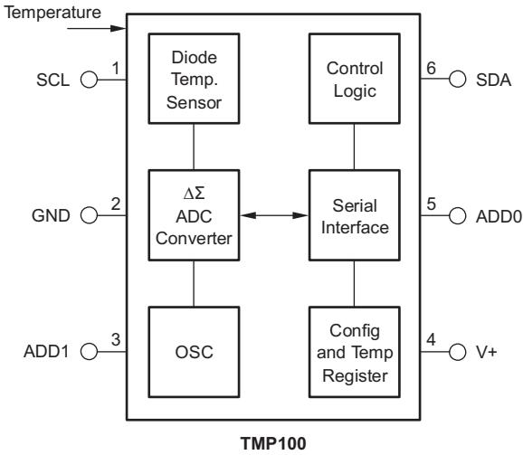

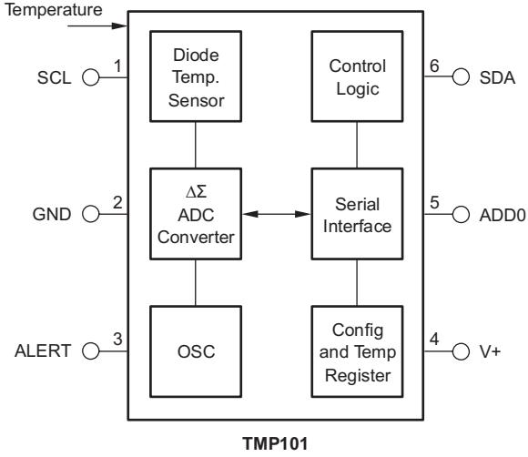

# Table of Contents

# 1 Features.. /

2 Applications .

3 Description ..

# 4 Revision History...

5 Pin Configuration and Functions.. 3

# 6 Specifications... 4

6.1 Absolute Maximum Ratings .... 4   
6.2 ESD Ratings 4   
6.3 Recommended Operating Conditions.. 4   
6.4 Thermal Information . 4   
6.5 Electrical Characteristics. 5   
6.6 Timing Requirements.. 6   
6.7 Typical Characteristics .. 7

# 7 Detailed Description . 8

7.1 Overview .. 8   
7.2 Functional Block Diagram ... 8   
7.3 Feature Description... 9   
7.4 Device Functional Modes.. 14   
7.5 Programming... 15

# 8 Application and Implementation .. 19

8.1 Application Information.... 19   
8.2 Typical Application .. 19

# 9 Power Supply Recommendations.. 21

# 10 Layout.. 21

10.1 Layout Guidelines ... 21   
10.2 Layout Examples... 21

# 11 Device and Documentation Support .. 23

11.1 Related Links .. 23   
11.2 Trademarks. 23   
11.3 Electrostatic Discharge Caution... . 23   
11.4 Glossary .... 23

# 12 Mechanical, Packaging, and Orderable Information . 23

# 4 Revision History

Changes from Revision H (March 2015) to Revision I

Page

• Changed body size values in Device Information table 1

Changes from Revision G (November 2007) to Revision H Page

Added ESD Ratings table, Feature Description section, Device Functional Modes, Application and Implementation section, Power Supply Recommendations section, Layout section, Device and Documentation Support section, and Mechanical, Packaging, and Orderable Information section. .. Changed specification values in Timing Requirements table . 6

# 5 Pin Configuration and Functions

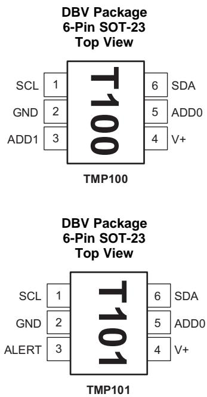

Pin Functions   

<table><tr><td rowspan=1 colspan=3> PIN</td><td rowspan=3 colspan=1>/0</td><td rowspan=3 colspan=1>DESCRIPTION</td></tr><tr><td rowspan=2 colspan=1>NAME</td><td rowspan=1 colspan=2>NO.</td></tr><tr><td rowspan=1 colspan=1>TMP100</td><td rowspan=1 colspan=1>TMP101</td></tr><tr><td rowspan=1 colspan=1>ADD0</td><td rowspan=1 colspan=1>5</td><td rowspan=1 colspan=1>5</td><td rowspan=1 colspan=1>一</td><td rowspan=1 colspan=1>Address select. Connect to GND, V+, or leave floating.</td></tr><tr><td rowspan=1 colspan=1>ADD1</td><td rowspan=1 colspan=1>3</td><td rowspan=1 colspan=1>二</td><td rowspan=1 colspan=1>1</td><td rowspan=1 colspan=1>Address select. Connect to GND, V+, or leave floating.</td></tr><tr><td rowspan=1 colspan=1>ALERT</td><td rowspan=1 colspan=1>二</td><td rowspan=1 colspan=1>3</td><td rowspan=1 colspan=1>0</td><td rowspan=1 colspan=1>Overtemperature alert. Open-drain output; requires a pullup resistor.</td></tr><tr><td rowspan=1 colspan=1>GND</td><td rowspan=1 colspan=1>2</td><td rowspan=1 colspan=1>2</td><td rowspan=1 colspan=1>二</td><td rowspan=1 colspan=1>Ground</td></tr><tr><td rowspan=1 colspan=1>SCL</td><td rowspan=1 colspan=1>1</td><td rowspan=1 colspan=1>1</td><td rowspan=1 colspan=1>一</td><td rowspan=1 colspan=1>Serial clock. Open-drain output; requires a pullup resistor.</td></tr><tr><td rowspan=1 colspan=1>SDA</td><td rowspan=1 colspan=1>6</td><td rowspan=1 colspan=1>6</td><td rowspan=1 colspan=1>/0</td><td rowspan=1 colspan=1>Serial data. Open-drain output; requires a pullup resistor.</td></tr><tr><td rowspan=1 colspan=1>V+</td><td rowspan=1 colspan=1>4</td><td rowspan=1 colspan=1>4</td><td rowspan=1 colspan=1>1</td><td rowspan=1 colspan=1>Supply voltage, 2.7 V to 5.5 V</td></tr></table>

# 6 Specifications

# 6.1 Absolute Maximum Ratings

over operating free-air temperature range (unless otherwise noted)(1)

<table><tr><td></td><td rowspan=1 colspan=1>MIN       MAX</td><td rowspan=1 colspan=1>UNIT</td></tr><tr><td rowspan=1 colspan=1>Power supply， V+</td><td rowspan=1 colspan=1>7.5</td><td rowspan=1 colspan=1>V</td></tr><tr><td rowspan=1 colspan=1>Input voltage(2)</td><td rowspan=1 colspan=1>-0.5        7.5</td><td rowspan=1 colspan=1>V</td></tr><tr><td rowspan=1 colspan=1>Operating temperature</td><td rowspan=1 colspan=1>-55        125</td><td rowspan=1 colspan=1>℃</td></tr><tr><td rowspan=1 colspan=1>Junction temperature,TJ</td><td rowspan=1 colspan=1>150</td><td rowspan=1 colspan=1>℃</td></tr><tr><td rowspan=1 colspan=1>Storage temperature, Tstg</td><td rowspan=1 colspan=1>-60        150</td><td rowspan=1 colspan=1>℃</td></tr></table>

(1) Stresses beyond those listed under Absolute Maximum Ratings may cause permanent damage to the device. These are stress ratings only, which do not imply functional operation of the device at these or any other conditions beyond those indicated under Recommended Operating Conditions. Exposure to absolute-maximum-rated conditions for extended periods may affect device reliability.   
(2) Input voltage rating applies to all TMP100 and TMP101 input voltages.

# 6.2 ESD Ratings

<table><tr><td></td><td></td><td rowspan=1 colspan=1>VALUE</td><td rowspan=1 colspan=1>UNIT</td></tr><tr><td rowspan=2 colspan=1>V(ESD)     Electrostatic discharge</td><td rowspan=1 colspan=1>Human body model (HBM),per ANSI/ESDA/JEDEC JS-001(1)</td><td rowspan=1 colspan=1>±2000</td><td rowspan=2 colspan=1>V</td></tr><tr><td rowspan=1 colspan=1>Charged device model (CDM), per JEDEC specification JESD22-C101(2)</td><td rowspan=1 colspan=1>±200</td></tr></table>

(1) JEDEC document JEP155 states that 500-V HBM allows safe manufacturing with a standard ESD control process.   
(2) JEDEC document JEP157 states that 250-V CDM allows safe manufacturing with a standard ESD control process.

# 6.3 Recommended Operating Conditions

over operating free-air temperature range (unless otherwise noted)

<table><tr><td></td><td>MIN</td><td>NOM</td><td>MAX</td><td>UNIT</td></tr><tr><td>Supply voltage</td><td>2.7</td><td></td><td>5.5</td><td>V</td></tr><tr><td>Operating free-air temperature,TA</td><td>-55</td><td></td><td>125</td><td>℃</td></tr></table>

# 6.4 Thermal Information

<table><tr><td rowspan=3 colspan=1> THERMAL METRIC(1)</td><td rowspan=1 colspan=1>TMP100, TMP101</td><td rowspan=3 colspan=1> UNIT</td></tr><tr><td rowspan=1 colspan=1>DBV (SOT-23)</td></tr><tr><td rowspan=1 colspan=1>6 PINS</td></tr><tr><td rowspan=1 colspan=1>ReJA        Junction-to-ambient thermal resistance</td><td rowspan=1 colspan=1>182.9</td><td rowspan=1 colspan=1>CN</td></tr><tr><td rowspan=1 colspan=1>ReJc(top)    Junction-to-case (top) thermal resistance</td><td rowspan=1 colspan=1>115</td><td rowspan=1 colspan=1>C/W</td></tr><tr><td rowspan=1 colspan=1>ReJB        Junction-to-board thermal resistance</td><td rowspan=1 colspan=1>30.2</td><td rowspan=1 colspan=1>CW</td></tr><tr><td rowspan=1 colspan=1>JT        Junction-to-top characterization parameter</td><td rowspan=1 colspan=1>17.1</td><td rowspan=1 colspan=1>C</td></tr><tr><td rowspan=1 colspan=1>JB         Junction-to-board characterization parameter</td><td rowspan=1 colspan=1>29.7</td><td rowspan=1 colspan=1>C/W</td></tr></table>

(1) For more information about traditional and new thermal metrics, see the IC Package Thermal Metrics application report, SPRA953.

# 6.5 Electrical Characteristics

At ${ \sf T } _ { \sf A } = - 5 5 ^ { \circ } { \sf C }$ to $1 2 5 ^ { \circ } \mathrm { C }$ and $\mathsf { V } + = 2 . 7 \mathrm { ~ V ~ }$ to $5 . 5 \lor$ , unless otherwise noted.

<table><tr><td rowspan=1 colspan=1>PARAMETER</td><td rowspan=1 colspan=1>TEST CONDITIONS</td><td rowspan=1 colspan=1>MIN     TYP     MAX</td><td rowspan=1 colspan=1> UNIT</td></tr><tr><td rowspan=1 colspan=1>TEMPERATURE INPUT</td><td rowspan=1 colspan=1></td><td rowspan=1 colspan=1></td><td rowspan=1 colspan=1></td></tr><tr><td rowspan=1 colspan=1>Range</td><td rowspan=1 colspan=1></td><td rowspan=1 colspan=1>-55                 125</td><td rowspan=1 colspan=1>℃</td></tr><tr><td rowspan=2 colspan=1>Accuracy (temperature error)</td><td rowspan=1 colspan=1>-25C to 85C</td><td rowspan=1 colspan=1>±0.5      +2</td><td rowspan=2 colspan=1>℃</td></tr><tr><td rowspan=1 colspan=1>-55C to 125℃</td><td rowspan=1 colspan=1>±1       +2</td></tr><tr><td rowspan=1 colspan=1>Accuracy (temperature error) vs supply</td><td rowspan=1 colspan=1></td><td rowspan=1 colspan=1>0.2     ±0.5</td><td rowspan=1 colspan=1>CN</td></tr><tr><td rowspan=1 colspan=1>Resolution</td><td rowspan=1 colspan=1>Selectable</td><td rowspan=1 colspan=1>0.0625</td><td rowspan=1 colspan=1>℃</td></tr><tr><td rowspan=1 colspan=1>DIGITAL INPUT/OUTPUT</td><td rowspan=1 colspan=1></td><td rowspan=1 colspan=1></td><td rowspan=1 colspan=1></td></tr><tr><td rowspan=1 colspan=1> Input capacitance</td><td rowspan=1 colspan=1></td><td rowspan=1 colspan=1>3</td><td rowspan=1 colspan=1>pF</td></tr><tr><td rowspan=1 colspan=1>ViH      High-level input logic</td><td rowspan=1 colspan=1></td><td rowspan=1 colspan=1>0.7(V+)                   6</td><td rowspan=1 colspan=1>V</td></tr><tr><td rowspan=1 colspan=1>VI      Low-level input logic</td><td rowspan=1 colspan=1></td><td rowspan=1 colspan=1>-0.5             0.3(V+)</td><td rowspan=1 colspan=1>V</td></tr><tr><td rowspan=1 colspan=1>IN       Input current</td><td rowspan=1 colspan=1>0V≤ViN≤6V</td><td rowspan=1 colspan=1>1</td><td rowspan=1 colspan=1>A</td></tr><tr><td rowspan=1 colspan=1>VoL      Low-level output logic SDA</td><td rowspan=1 colspan=1>loL=3mA</td><td rowspan=1 colspan=1>0     0.15      0.4</td><td rowspan=1 colspan=1>V</td></tr><tr><td rowspan=1 colspan=1>VoL      Low-level output logic ALERT</td><td rowspan=1 colspan=1>loL =4 mA</td><td rowspan=1 colspan=1>0     0.15      0.4</td><td rowspan=1 colspan=1>V</td></tr><tr><td rowspan=1 colspan=1>Resolution</td><td rowspan=1 colspan=1>Selectable</td><td rowspan=1 colspan=1>9                  12</td><td rowspan=1 colspan=1>Bits</td></tr><tr><td rowspan=4 colspan=1>Conversion time</td><td rowspan=1 colspan=1>9 bits</td><td rowspan=1 colspan=1>40      75</td><td rowspan=1 colspan=1></td></tr><tr><td rowspan=1 colspan=1>10 bits</td><td rowspan=1 colspan=1>80     150</td><td rowspan=3 colspan=1>ms</td></tr><tr><td rowspan=1 colspan=1>11 bits</td><td rowspan=1 colspan=1>160     300</td></tr><tr><td rowspan=1 colspan=1>12 bits</td><td rowspan=1 colspan=1>320      600</td></tr><tr><td rowspan=4 colspan=1>Conversion rate</td><td rowspan=1 colspan=1>9bits</td><td rowspan=1 colspan=1>25</td><td rowspan=4 colspan=1>s/s</td></tr><tr><td rowspan=1 colspan=1>10 bits</td><td rowspan=1 colspan=1>12</td></tr><tr><td rowspan=1 colspan=1>11 bits</td><td rowspan=1 colspan=1>6</td></tr><tr><td rowspan=1 colspan=1>12 bits</td><td rowspan=1 colspan=1>3</td></tr><tr><td rowspan=1 colspan=1>POWER SUPPLY</td><td rowspan=1 colspan=1></td><td rowspan=1 colspan=2></td></tr><tr><td rowspan=1 colspan=1>Operating range</td><td rowspan=1 colspan=1></td><td rowspan=1 colspan=1>2.7                 5.5</td><td rowspan=1 colspan=1>v</td></tr><tr><td rowspan=3 colspan=1>lQ        Quiescent current</td><td rowspan=1 colspan=1>Serial bus inactive</td><td rowspan=1 colspan=1>45      75</td><td rowspan=2 colspan=1>uA</td></tr><tr><td rowspan=1 colspan=1>Serial bus active,SCLfrequency = 400 kHz</td><td rowspan=1 colspan=1>70</td></tr><tr><td rowspan=1 colspan=1>Serial bus active,SCL frequency = 3.4 MHz</td><td rowspan=1 colspan=1>150</td><td rowspan=1 colspan=1></td></tr><tr><td rowspan=3 colspan=1>ISD       Shutdown current</td><td rowspan=1 colspan=1>Serial bus inactive</td><td rowspan=1 colspan=1>0.1       13</td><td rowspan=2 colspan=1>A</td></tr><tr><td rowspan=1 colspan=1>Serial bus active,SCL frequency = 400 kHz</td><td rowspan=1 colspan=1>20</td></tr><tr><td rowspan=1 colspan=1>Serial bus active,SCL frequency = 3.4 MHz</td><td rowspan=1 colspan=1>100</td><td rowspan=1 colspan=1></td></tr><tr><td rowspan=1 colspan=2>TEMPERATURE RANGE</td><td rowspan=1 colspan=2></td></tr><tr><td rowspan=1 colspan=1>Specified range</td><td rowspan=1 colspan=1></td><td rowspan=1 colspan=1>-55                 125</td><td rowspan=1 colspan=1>℃</td></tr><tr><td rowspan=1 colspan=1>Storage range</td><td rowspan=1 colspan=1></td><td rowspan=1 colspan=1>-60                150</td><td rowspan=1 colspan=1>℃</td></tr></table>

# 6.6 Timing Requirements

<table><tr><td rowspan=2 colspan=1>PARAMETER</td><td rowspan=1 colspan=1> FAST MODE</td><td rowspan=1 colspan=1> HIGH-SPEED MODE</td><td rowspan=2 colspan=1> UNIT</td></tr><tr><td rowspan=1 colspan=1>MIN     MAX</td><td rowspan=1 colspan=1>MIN     MAX</td></tr><tr><td rowspan=1 colspan=1>f(SCL)           SCL operating frequency</td><td rowspan=1 colspan=1>0.4</td><td rowspan=1 colspan=1>2</td><td rowspan=1 colspan=1>MHz</td></tr><tr><td rowspan=1 colspan=1>t(BUF)           Bus free time between STOP and START condition</td><td rowspan=1 colspan=1>1300</td><td rowspan=1 colspan=1>160</td><td rowspan=1 colspan=1>ns</td></tr><tr><td rowspan=1 colspan=1>Hold time after repeated START condition.t(HDSTA)         After this period, the first clock is generated.</td><td rowspan=1 colspan=1>600</td><td rowspan=1 colspan=1>160</td><td rowspan=1 colspan=1>ns</td></tr><tr><td rowspan=1 colspan=1>t(SUSTA)         Repeated START condition setup time</td><td rowspan=1 colspan=1>600</td><td rowspan=1 colspan=1>160</td><td rowspan=1 colspan=1>ns</td></tr><tr><td rowspan=1 colspan=1>t(sUSTO)        STOP condition setup time</td><td rowspan=1 colspan=1>600</td><td rowspan=1 colspan=1>160</td><td rowspan=1 colspan=1>ns</td></tr><tr><td rowspan=1 colspan=1>t(HDDAT)         Data hold time</td><td rowspan=1 colspan=1>20      900</td><td rowspan=1 colspan=1>20      170</td><td rowspan=1 colspan=1>ns</td></tr><tr><td rowspan=1 colspan=1>t(SUDAT)         Data setup time</td><td rowspan=1 colspan=1>100</td><td rowspan=1 colspan=1>20</td><td rowspan=1 colspan=1>ns</td></tr><tr><td rowspan=1 colspan=1>tLoW)           SCL clock LOW period</td><td rowspan=1 colspan=1>1300</td><td rowspan=1 colspan=1>360</td><td rowspan=1 colspan=1>ns</td></tr><tr><td rowspan=1 colspan=1>t(HIGH)          SCL clock HIGH period</td><td rowspan=1 colspan=1>600</td><td rowspan=1 colspan=1>60</td><td rowspan=1 colspan=1>ns</td></tr><tr><td rowspan=1 colspan=1>tRc，tFC         Clock rise and fall time</td><td rowspan=1 colspan=1>300</td><td rowspan=1 colspan=1>40</td><td rowspan=1 colspan=1>ns</td></tr><tr><td rowspan=1 colspan=1>tRD，tFD         Data rise and fall time</td><td rowspan=1 colspan=1>300</td><td rowspan=1 colspan=1>170</td><td rowspan=1 colspan=1>ns</td></tr></table>

# 6.7 Typical Characteristics

At $\bar { \mathsf { T } } _ { \mathsf { A } } = 2 5 ^ { \circ } \mathsf { C }$ and $\mathsf { V } + = 5 \mathsf { V }$ , unless otherwise noted.

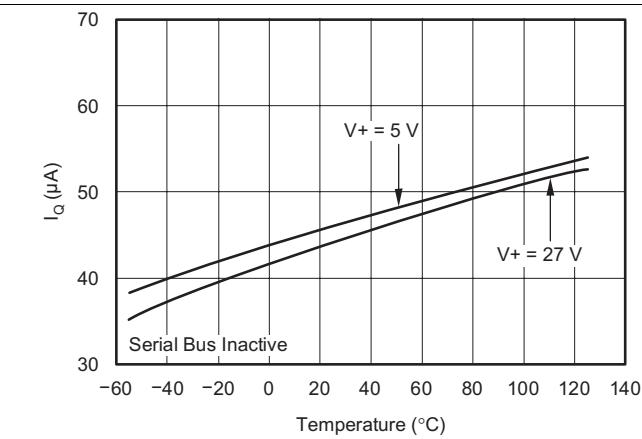

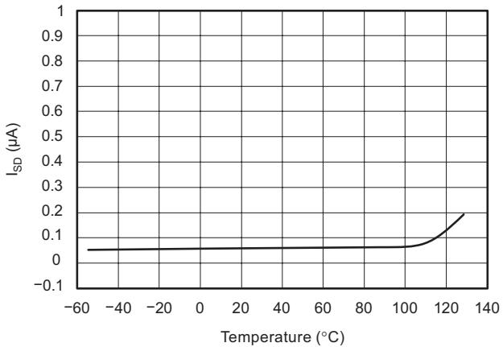

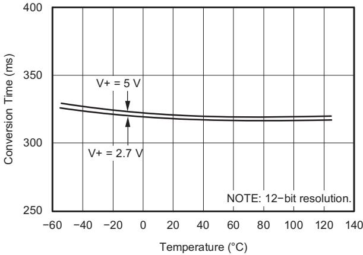  
Figure 1. Quiescent Current vs Temperature

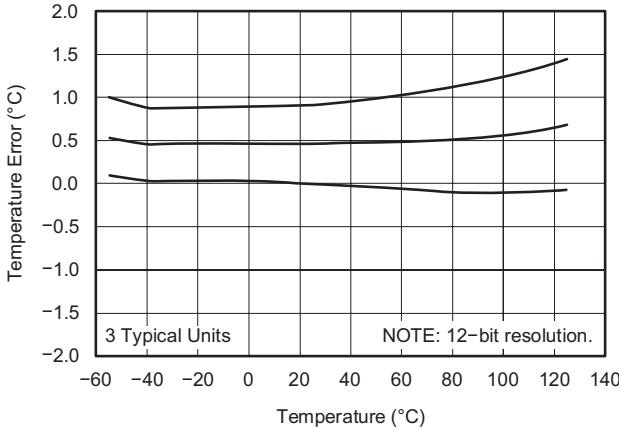  
Figure 2. Shutdown Current vs Temperature

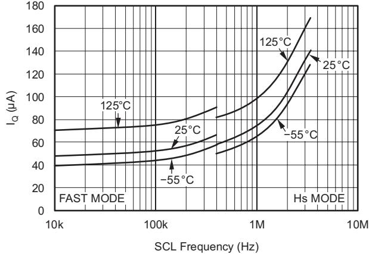  
Figure 3. Conversion Time vs Temperature   
Figure 4. Temperature Accuracy vs Temperature   
Figure 5. Quiescent Current With Bus Activity vs Temperature

# 7 Detailed Description

# 7.1 Overview

The TMP100 and TMP101 devices are digital temperature sensors optimal for thermal management and thermal protection applications. The TMP100 and TMP101 devices are Two-Wire, SMBus, and ${ \mathsf { I } } ^ { 2 } { \mathsf { C } }$ interface-compatible. These devices are specified over a operating temperature range of $\mathtt { - 5 5 ^ { \circ } C }$ to $1 2 5 ^ { \circ } \mathrm { C }$ . The Functional Block Diagram section shows the internal block diagrams of the TMP100 and TMP101 devices.

The temperature sensor in the TMP100 and TMP101 devices is the chip itself. Thermal paths run through the package leads as well as the plastic package. The package leads provide the primary thermal path because of the lower thermal resistance of the metal. The GND pin of the TMP100 or TMP101 is directly connected to the metal lead frame, and is the best choice for thermal input.

# 7.2 Functional Block Diagram

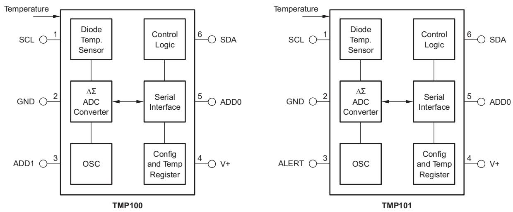

# 7.3 Feature Description

# 7.3.1 Digital Temperature Output

The digital output from each temperature measurement conversion is stored in the read-only Temperature Register. The Temperature Register of the TMP100 or TMP101 device is a 12-bit, read-only register that stores the output of the most recent conversion. Two bytes must be read to obtain data and are listed in Table 6 and Table 7. The first 12 bits are used to indicate temperature with all the remaining bits equal to zero. The data format for temperature is listed in Table 1. Negative numbers are represented in binary twos complement format. Following power-up or reset, the temperature register reads $0 \%$ until the first conversion is complete.

The user can obtain 9, 10, 11, or 12 bits of resolution by addressing the Configuration Register and setting the resolution bits accordingly. For 9-, 10-, or 11-bit resolution, the most significant bits (MSBs) in the Temperature Register are used with the unused least significant bits (LSBs) set to zero.

Table 1. Temperature Data Format   

<table><tr><td rowspan=2 colspan=1>TEMPERATURE(C)</td><td rowspan=1 colspan=2>DIGITAL OUTPUT</td></tr><tr><td rowspan=1 colspan=1>BINARY</td><td rowspan=1 colspan=1>HEX</td></tr><tr><td rowspan=1 colspan=1>128</td><td rowspan=1 colspan=1>0111 1111 1111</td><td rowspan=1 colspan=1>7FF</td></tr><tr><td rowspan=1 colspan=1>127.9375</td><td rowspan=1 colspan=1>0111 1111 1111</td><td rowspan=1 colspan=1>7FF</td></tr><tr><td rowspan=1 colspan=1>100</td><td rowspan=1 colspan=1>01100100 0000</td><td rowspan=1 colspan=1>640</td></tr><tr><td rowspan=1 colspan=1>80</td><td rowspan=1 colspan=1>010100000000</td><td rowspan=1 colspan=1>500</td></tr><tr><td rowspan=1 colspan=1>75</td><td rowspan=1 colspan=1>0100 10110000</td><td rowspan=1 colspan=1>4B0</td></tr><tr><td rowspan=1 colspan=1>50</td><td rowspan=1 colspan=1>001100100000</td><td rowspan=1 colspan=1>320</td></tr><tr><td rowspan=1 colspan=1>25</td><td rowspan=1 colspan=1>000110010000</td><td rowspan=1 colspan=1>190</td></tr><tr><td rowspan=1 colspan=1>0.25</td><td rowspan=1 colspan=1>000000000100</td><td rowspan=1 colspan=1>004</td></tr><tr><td rowspan=1 colspan=1>0</td><td rowspan=1 colspan=1>000000000000</td><td rowspan=1 colspan=1>000</td></tr><tr><td rowspan=1 colspan=1>-0.25</td><td rowspan=1 colspan=1>1111 1111 1100</td><td rowspan=1 colspan=1>FFC</td></tr><tr><td rowspan=1 colspan=1>-25</td><td rowspan=1 colspan=1>1110 01110000</td><td rowspan=1 colspan=1>E70</td></tr><tr><td rowspan=1 colspan=1>-55</td><td rowspan=1 colspan=1>1100 10010000</td><td rowspan=1 colspan=1>C90</td></tr><tr><td rowspan=1 colspan=1>-128</td><td rowspan=1 colspan=1>1000 00000000</td><td rowspan=1 colspan=1>800</td></tr></table>

# 7.3.2 Serial Interface

The TMP100 and TMP101 devices operate only as slave devices on the SMBus, Two-Wire, and ${ \mathsf { I } } ^ { 2 } { \mathsf { C } }$ interfacecompatible bus. Connections to the bus are made through the open-drain $_ { 1 / \bigcirc }$ lines SDA and SCL. The TMP100 and TMP101 devices support the transmission protocol for fast (up to $4 0 0 ~ \mathsf { k H z } )$ ) and high-speed (up to 2 MHz) modes. All data bytes are transmitted MSB first.

# 7.3.2.1 Bus Overview

The device that initiates the transfer is called a master, and the devices controlled by the master are slaves. The bus must be controlled by a master device that generates the serial clock (SCL), controls the bus access, and generates the START and STOP conditions.

To address a specific device, a START condition is initiated, indicated by pulling the data line (SDA) from a HIGH to LOW logic level while SCL is HIGH. All slaves on the bus shift in the slave address byte, with the last bit indicating whether a read or write operation is intended. During the ninth clock pulse, the slave being addressed responds to the master by generating an Acknowledge and pulling SDA LOW.

Data transfer is then initiated and sent over eight clock pulses followed by an Acknowledge Bit. During data transfer, SDA must remain stable while SCL is HIGH because any change in SDA while SCL is HIGH is interpreted as a control signal.

When all data are transferred, the master generates a STOP condition indicated by pulling SDA from LOW to HIGH, while SCL is HIGH.

# 7.3.2.2 Serial Bus Address

To program the TMP100 and TMP101 devices, the master must first address slave devices through a slave address byte. The slave address byte consists of seven address bits and a direction bit indicating the intent of executing a read or write operation.

The TMP100 device features two address pins to allow up to eight devices to be addressed on a single ${ \mathsf { I } } ^ { 2 } { \mathsf { C } }$ interface. Table 2 describes the pin logic levels used to properly connect up to eight devices. Float indicates the pin is left unconnected. The state of pins ADD0 and ADD1 is sampled on the first ${ \mathsf { I } } ^ { 2 } { \mathsf { C } }$ bus communication and must be set before any activity on the interface.

Table 2. Address Pins and Slave Addresses for the TMP100   

<table><tr><td rowspan=1 colspan=1>ADD1</td><td rowspan=1 colspan=1>ADDO</td><td rowspan=1 colspan=1>SLAVEADDRESS</td></tr><tr><td rowspan=1 colspan=1>0</td><td rowspan=1 colspan=1>0</td><td rowspan=1 colspan=1>1001000</td></tr><tr><td rowspan=1 colspan=1>0</td><td rowspan=1 colspan=1>Float</td><td rowspan=1 colspan=1>1001001</td></tr><tr><td rowspan=1 colspan=1>0</td><td rowspan=1 colspan=1>1</td><td rowspan=1 colspan=1>1001010</td></tr><tr><td rowspan=1 colspan=1>1</td><td rowspan=1 colspan=1>0</td><td rowspan=1 colspan=1>1001100</td></tr><tr><td rowspan=1 colspan=1>1</td><td rowspan=1 colspan=1>Float</td><td rowspan=1 colspan=1>1001101</td></tr><tr><td rowspan=1 colspan=1>1</td><td rowspan=1 colspan=1>1</td><td rowspan=1 colspan=1>1001110</td></tr><tr><td rowspan=1 colspan=1>Float</td><td rowspan=1 colspan=1>0</td><td rowspan=1 colspan=1>1001011</td></tr><tr><td rowspan=1 colspan=1>Float</td><td rowspan=1 colspan=1>1</td><td rowspan=1 colspan=1>1001111</td></tr></table>

The TMP101 device features one address pin and an ALERT pin, allowing up to three devices to be connected per bus. Pin logic levels are described in Table 3. The address pins of the TMP100 and TMP101 devices are read after reset or in response to an ${ \mathsf { I } } ^ { 2 } { \mathsf { C } }$ address acquire request. Following reading, the state of the address pins is latched to minimize power dissipation associated with detection.

Table 3. Address Pins and Slave Addresses for the TMP101   

<table><tr><td rowspan=1 colspan=1>ADDO</td><td rowspan=1 colspan=1>SLAVE ADDRESS</td></tr><tr><td rowspan=1 colspan=1>0</td><td rowspan=1 colspan=1>1001000</td></tr><tr><td rowspan=1 colspan=1>Float</td><td rowspan=1 colspan=1>1001001</td></tr><tr><td rowspan=1 colspan=1>1</td><td rowspan=1 colspan=1>1001010</td></tr></table>

# 7.3.2.3 Writing and Reading to the TMP100 and TMP101

Accessing a particular register on the TMP100 and TMP101 devices is accomplished by writing the appropriate value to the Pointer Register. The value for the Pointer Register is the first byte transferred after the ${ \mathsf { I } } ^ { 2 } { \mathsf { C } }$ slave address byte with the R/W bit LOW. Every write operation to the TMP100 and TMP101 devices requires a value for the Pointer Register (see Figure 7).

When reading from the TMP100 and TMP101 devices, the last value stored in the Pointer Register by a write operation is used to determine which register is read by a read operation. To change the register pointer for a read operation, a new value must be written to the Pointer Register. This action is accomplished by issuing an ${ \mathsf { I } } ^ { 2 } { \mathsf { C } }$ slave address byte with the R/W bit LOW, followed by the Pointer Register Byte. No additional data are required. The master can then generate a START condition and send the ${ \mathsf { I } } ^ { 2 } { \mathsf { C } }$ slave address byte with the $\mathsf { R } \bar { \mathsf { M } }$ bit HIGH to initiate the read command; see Figure 8 for details of this sequence. If repeated reads from the same register are desired, the Pointer Register bytes do not have to be continually sent because the TMP100 and TMP101 devices remember the Pointer Register value until that value is changed by the next write operation.

# 7.3.2.4 Slave Mode Operations

The TMP100 and TMP101 devices can operate as a slave receiver or slave transmitter.

# 7.3.2.4.1 Slave Receiver Mode

The first byte transmitted by the master is the slave address, with the $\mathsf { R } \bar { \mathsf { M } }$ bit LOW. The TMP100 or TMP101 devices then acknowledges reception of a valid address. The next byte transmitted by the master is the Pointer Register. The TMP100 or TMP101 devices then acknowledges reception of the Pointer Register byte. The next byte or bytes are written to the register addressed by the Pointer Register. The TMP100 and TMP101 devices acknowledge reception of each data byte. The master can terminate data transfer by generating a START or STOP condition.

# 7.3.2.4.2 Slave Transmitter Mode

The first byte is transmitted by the master and is the slave address, with the $\mathsf { R } \bar { \mathsf { M } }$ bit HIGH. The slave acknowledges reception of a valid slave address. The next byte is transmitted by the slave and is the most significant byte of the register indicated by the Pointer Register. The master acknowledges reception of the data byte. The next byte transmitted by the slave is the least significant byte. The master acknowledges reception of the data byte. The master can terminate data transfer by generating a Not-Acknowledge on reception of any data byte, or generating a START or STOP condition.

# 7.3.2.5 SMBus Alert Function

The TMP101 device supports the SMBus Alert function. When the TMP101 device is operating in Interrupt Mode $( \mathsf { T M } = \mathsf { 1 } )$ , the ALERT pin of the TMP101 device can be connected as an SMBus Alert signal. When a master senses that an ALERT condition is present on the ALERT line, the master sends an SMBus Alert command (00011001) on the bus. If the ALERT pin of the TMP101 device is active, the TMP101 device acknowledges the SMBus Alert command and responds by returning its slave address on the SDA line. The eighth bit (LSB) of the slave address byte indicates if the temperature exceeding ${ \sf T } _ { \sf H I G H }$ or falling below TLOW caused the ALERT condition. For ${ \mathsf { P O L } } = 0$ , this bit is LOW if the temperature is greater than or equal to THIGH. This bit is HIGH if the temperature is less than TLOW. The polarity of this bit is inverted if $\mathsf { P O L } = 1$ ; see Figure 9 for details of this sequence.

If multiple devices on the bus respond to the SMBus Alert command, arbitration during the slave address portion of the SMBus alert command determine which device clears its ALERT status. If the TMP101 device wins the arbitration, its ALERT pin becomes inactive at the completion of the SMBus Alert command. If the TMP101 loses the arbitration, its ALERT pin remains active.

The TMP100 device also responds to the SMBus ALERT command if its TM bit is set to 1. Because the device does not have an ALERT pin, the device must periodically poll the device by issuing an SMBus Alert command. If the TMP100 device generates an ALERT, the device acknowledges the SMBus Alert command and returns its slave address in the next byte.

# 7.3.2.6 General Call

The TMP100 and TMP101 devices respond to the ${ \mathsf { I } } ^ { 2 } { \mathsf { C } }$ General Call address (0000000) if the eighth bit is 0. The device acknowledges the General Call address and responds to commands in the second byte. If the second byte is 00000100, the TMP100 and TMP101 devices latch the status of their address pins, but do not reset. If the second byte is 00000110, the TMP100 and TMP101 devices latch the status of their address pins and reset their internal registers.

# 7.3.2.7 High-Speed Mode

In order for the ${ \mathsf { I } } ^ { 2 } { \mathsf { C } }$ bus to operate at frequencies above $4 0 0 ~ \mathsf { k H z }$ , the master device must issue an Hs-mode master code (00001XXX) as the first byte after a START condition to switch the bus to high-speed operation. The TMP100 and TMP101 devices do not acknowledge this byte as required by the ${ \mathsf { I } } ^ { 2 } { \mathsf { C } }$ specification, but do switch their input filters on SDA and SCL and their output filters on SDA to operate in Hs-mode, allowing transfers at up to 2 MHz. After the Hs-mode master code is issued, the master transmits an ${ \mathsf { I } } ^ { 2 } { \mathsf { C } }$ slave address to initiate a data transfer operation. The bus continues to operate in Hs-mode until a STOP condition occurs on the bus. Upon receiving the STOP condition, the TMP100 and TMP101 devices switch the input and output filter back to fast-mode operation.

# 7.3.2.8 POR (Power-On Reset)

The TMP100 and TMP101 devices both have on-chip, power-on reset circuits that reset the device to default settings when the device is powered on. This circuit activates when the power supply is less than $0 . 3 \ V$ for more than $1 0 0 ~ \mathsf { m s }$ . If the TMP100 and TMP101 devices are powered down by removing supply voltage from the device, but the supply voltage is not assured to be less than $0 . 3 \ V$ , TI recommends issuing a General Call reset command on the $| ^ { 2 } \dot { \mathsf { C } }$ interface bus to ensure that the TMP100 and TMP101 devices are completely reset.

# 7.3.3 Timing Diagrams

The TMP100 and TMP101 devices are Two-Wire, SMBUs, and ${ \mathsf { I } } ^ { 2 } { \mathsf { C } }$ interface-compatible. Figure 6 to Figure 9 describe the various operations on the TMP100 and TMP101. The following list provides bus definitions. Parameters for Figure 6 are defined in the Timing Requirements section.

Bus Idle: Both SDA and SCL lines remain HIGH.

Start Data Transfer: A change in the state of the SDA line, from HIGH to LOW, while the SCL line is HIGH defines a START condition. Each data transfer is initiated with a START condition.

Stop Data Transfer: A change in the state of the SDA line from LOW to HIGH while the SCL line is HIG defines a STOP condition. Each data transfer is terminated with a repeated START or STOP condition.

Data Transfer: The number of data bytes transferred between a START and a STOP condition is not limited an is determined by the master device. The receiver acknowledges the transfer of data.

Acknowledge: Each receiving device, when addressed, is obliged to generate an Acknowledge bit. A device that acknowledges must pull down the SDA line during the Acknowledge clock pulse in such a way that the SDA line is stable LOW during the HIGH period of the Acknowledge clock pulse. Setup and hold times must be taken into account. On a master receive, the termination of the data transfer can be signaled by the master generating a Not-Acknowledge on the last byte that is transmitted by the slave.

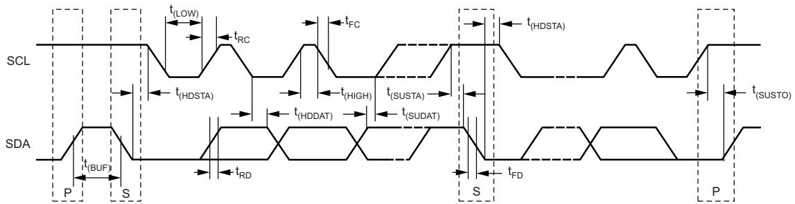  
Figure 6. I2C Timing Diagram

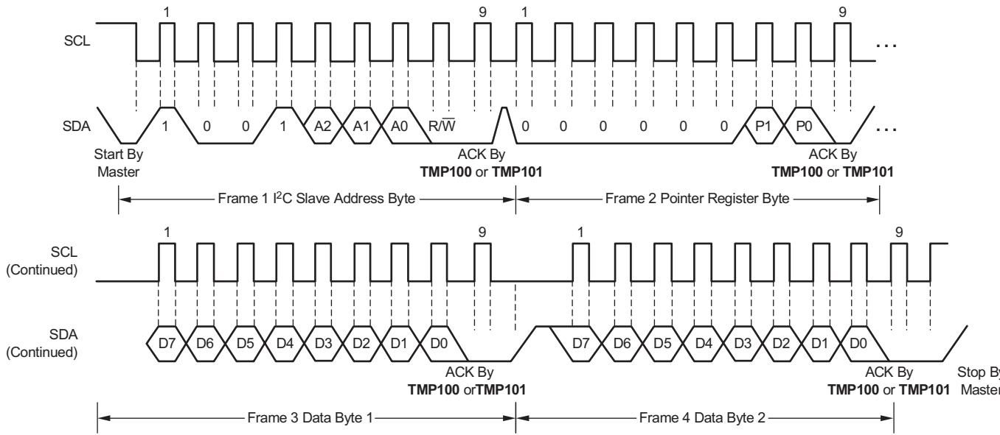  
Figure 7. I2C Timing Diagram for Write Word Format

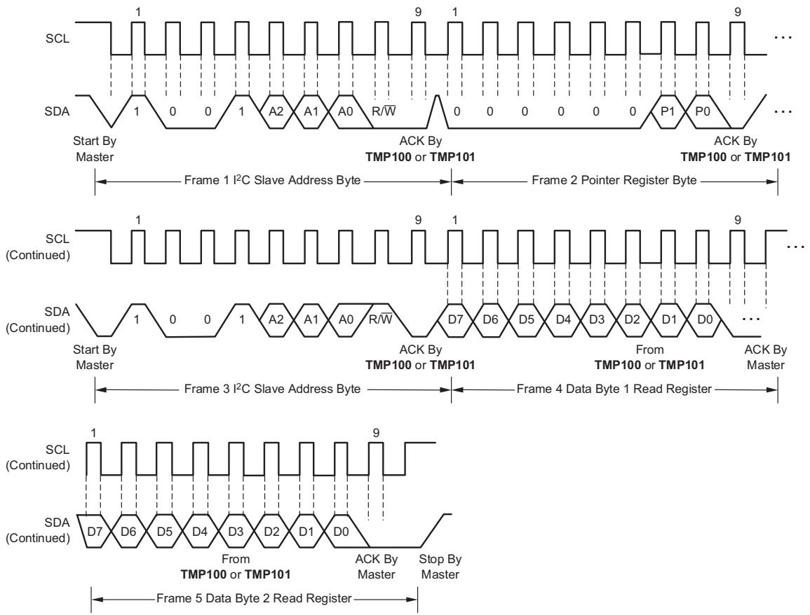  
Figure 8. I2C Timing Diagram for Read Word Format

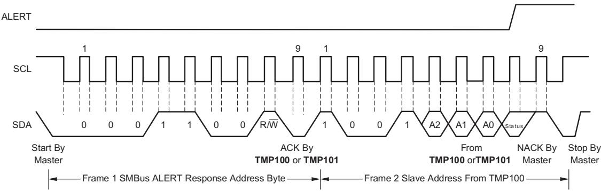  
Figure 9. Timing Diagram for SMBus ALERT

# 7.4 Device Functional Modes

# 7.4.1 Shutdown Mode (SD)

The Shutdown Mode of the TMP100 and TMP101 devices lets the user save maximum power by shutting down all device circuitry other than the serial interface, which reduces current consumption to less than $1 \ \mu \mathsf { A }$ . For the TMP100 and TMP101 devices, Shutdown Mode is enabled when the SD bit is 1. The device shuts down when the current conversion is completed. For SD equal to 0, the device maintains continuous conversion.

# 7.4.2 OS/ALERT (OS)

The TMP100 and TMP101 devices feature a One-Shot Temperature Measurement Mode. When the device is in Shutdown Mode, writing 1 to the OS/ALERT bit starts a single temperature conversion. The device returns to the shutdown state at the completion of the single conversion. This feature is useful to reduce power consumption in the TMP100 and TMP101 devices when continuous monitoring of temperature is not required.

Reading the OS/ALERT bit provides information about the Comparator Mode status. The state of the POL bit inverts the polarity of data returned from the OS/ALERT bit. For ${ \mathsf { P O L } } = 0$ , the OS/ALERT reads as 1 until the temperature equals or exceeds ${ \sf T } _ { \sf H I G H }$ for the programmed number of consecutive faults, causing the OS/ALERT bit to read as 0. The OS/ALERT bit continues to read as 0 until the temperature falls below ${ \sf T } _ { \sf L O W }$ for the programmed number of consecutive faults when the OS/ALERT bit again reads as 1. The status of the TM bit does not affect the status of the OS/ALERT bit.

# 7.4.3 Thermostat Mode (TM)

The Thermostat Mode bit of the TMP101 device indicates to the device whether to operate in Comparator Mode $( \mathsf { T M } = 0 )$ or Interrupt Mode $( \mathsf { T M } = \mathsf { 1 } )$ ). For more information on comparator and interrupt modes, see the Highand Low-Limit Registers section.

# 7.4.3.1 Comparator Mode $( T M = 0 )$

In Comparator Mode $( \mathsf { T M } = 0 )$ ), the ALERT pin is activated when the temperature equals or exceeds the value in the ${ \sf T } _ { \sf H I G H }$ register and remains active until the temperature falls below the value in the TLOW register. For more information on the Comparator Mode, see the High- and Low-Limit Registers section.

# 7.4.3.2 Interrupt Mode $( T M = 1 )$

In Interrupt Mode $( \mathsf { T M } = \mathsf { 1 } )$ ), the ALERT pin is activated when the temperature exceeds ${ \sf T } _ { \sf H I G H }$ or goes below the TLOW registers. The ALERT pin is cleared when the host controller reads the temperature register. For more information on the interrupt mode, see the High- and Low-Limit Registers section.

# 7.5 Programming

# 7.5.1 Pointer Register

Figure 10 shows the internal register structure of the TMP100 and TMP101 devices. The 8-bit Pointer Register of the TMP100 and TMP101 devices is used to address a given data register. The Pointer Register uses the two LSBs to identify which of the data registers respond to a read or write command. Table 4 identifies the bits of the Pointer Register byte. Table 5 describes the pointer address of the registers available in the TMP100 and TMP101 devices. The power-up reset value of P1 and P0 is 00.

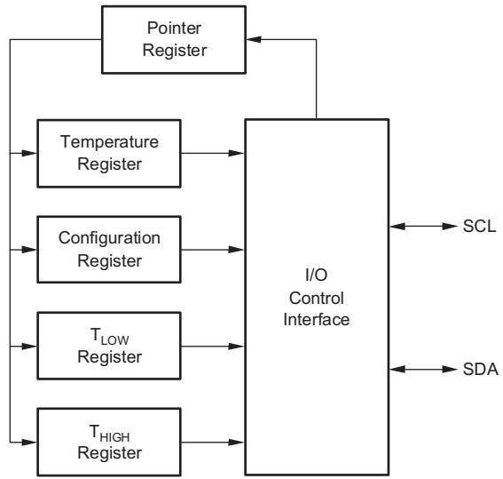  
Figure 10. Internal Register Structure of the TMP100 and TMP101

# 7.5.1.1 Pointer Register Byte (pointer $\mathbf { \mu } = \pmb { N } / \pmb { A }$ ) [reset $=$ 00h]

Table 4. Pointer Register Byte   

<table><tr><td rowspan=1 colspan=1>P7</td><td rowspan=1 colspan=1>P6</td><td rowspan=1 colspan=1>P5</td><td rowspan=1 colspan=1>P4</td><td rowspan=1 colspan=1>P3</td><td rowspan=1 colspan=1>P2</td><td rowspan=1 colspan=1>P1</td><td rowspan=1 colspan=1>PO</td></tr><tr><td rowspan=1 colspan=1>0</td><td rowspan=1 colspan=1>0</td><td rowspan=1 colspan=1>0</td><td rowspan=1 colspan=1>0</td><td rowspan=1 colspan=1>0</td><td rowspan=1 colspan=1>0</td><td rowspan=1 colspan=2>Register Bits</td></tr></table>

# 7.5.1.2 Pointer Addresses of the TMP100 and TMP101 Registers

Table 5. Pointer Addresses of the TMP100 and TMP101 Registers   

<table><tr><td rowspan=1 colspan=1>P1</td><td rowspan=1 colspan=1>P0</td><td rowspan=1 colspan=1>TYPE</td><td rowspan=1 colspan=1>REGISTER</td></tr><tr><td rowspan=1 colspan=1>0</td><td rowspan=1 colspan=1>0</td><td rowspan=1 colspan=1>R only, default</td><td rowspan=1 colspan=1>Temperature Register</td></tr><tr><td rowspan=1 colspan=1>0</td><td rowspan=1 colspan=1>1</td><td rowspan=1 colspan=1>R/W</td><td rowspan=1 colspan=1>Configuration Register</td></tr><tr><td rowspan=1 colspan=1>1</td><td rowspan=1 colspan=1>0</td><td rowspan=1 colspan=1>R/W</td><td rowspan=1 colspan=1>TLow Register</td></tr><tr><td rowspan=1 colspan=1>1</td><td rowspan=1 colspan=1>1</td><td rowspan=1 colspan=1>R/W</td><td rowspan=1 colspan=1>THIGH Register</td></tr></table>

# 7.5.2 Temperature Register

The Temperature Register of the TMP100 or TMP101 devices is a 12-bit, read-only register that stores the output of the most recent conversion. Two bytes must be read to obtain data, and are described in Table 6 and Table 7. The first 12 bits are used to indicate temperature, with all remaining bits equal to zero. Data format for temperature is summarized in Table 1. Following power-up or reset, the Temperature Register reads $0 ^ { \circ } \mathsf { C }$ until the first conversion is complete.

Table 6. Byte 1 of the Temperature Register   

<table><tr><td rowspan=1 colspan=1>D7</td><td rowspan=1 colspan=1>D6</td><td rowspan=1 colspan=1>D5</td><td rowspan=1 colspan=1>D4</td><td rowspan=1 colspan=1>D3</td><td rowspan=1 colspan=1>D2</td><td rowspan=1 colspan=1>D1</td><td rowspan=1 colspan=1>DO</td></tr><tr><td rowspan=1 colspan=1>T11</td><td rowspan=1 colspan=1>T10</td><td rowspan=1 colspan=1>T9</td><td rowspan=1 colspan=1>T8</td><td rowspan=1 colspan=1>T7</td><td rowspan=1 colspan=1>T6</td><td rowspan=1 colspan=1>T5</td><td rowspan=1 colspan=1>T4</td></tr></table>

Table 7. Byte 2 of the Temperature Register   

<table><tr><td rowspan=1 colspan=1>D7</td><td rowspan=1 colspan=1>D6</td><td rowspan=1 colspan=1>D5</td><td rowspan=1 colspan=1>D4</td><td rowspan=1 colspan=1>D3</td><td rowspan=1 colspan=1>D2</td><td rowspan=1 colspan=1>D1</td><td rowspan=1 colspan=1>DO</td></tr><tr><td rowspan=1 colspan=1>T3</td><td rowspan=1 colspan=1>T2</td><td rowspan=1 colspan=1>T1</td><td rowspan=1 colspan=1>T0</td><td rowspan=1 colspan=1>0</td><td rowspan=1 colspan=1>0</td><td rowspan=1 colspan=1>0</td><td rowspan=1 colspan=1>0</td></tr></table>

# 7.5.3 Configuration Register

The Configuration Register is an 8-bit read and write register used to store bits that control the operational modes of the temperature sensor. Read and write operations are performed MSB-first. The format of the Configuration Register for the TMP100 and TMP101 devices is shown in Table 8, followed by a breakdown of the register bits. The power-up or reset value of the Configuration Register is all bits equal to 0. The OS/ALERT bit reads as 1 after power-up or reset value.

Table 8. Configuration Register Format   

<table><tr><td rowspan=1 colspan=1>BYTE</td><td rowspan=1 colspan=1>D7</td><td rowspan=1 colspan=1>D6</td><td rowspan=1 colspan=1>D5</td><td rowspan=1 colspan=1>D4</td><td rowspan=1 colspan=1>D3</td><td rowspan=1 colspan=1>D2</td><td rowspan=1 colspan=1>D1</td><td rowspan=1 colspan=1>DO</td></tr><tr><td rowspan=1 colspan=1>1</td><td rowspan=1 colspan=1>OS/ALERT</td><td rowspan=1 colspan=1>R1</td><td rowspan=1 colspan=1>RO</td><td rowspan=1 colspan=1>F1</td><td rowspan=1 colspan=1>FO</td><td rowspan=1 colspan=1>POL</td><td rowspan=1 colspan=1>TM</td><td rowspan=1 colspan=1>SD</td></tr></table>

# 7.5.3.1 Shutdown Mode (SD)

The Shutdown Mode of the TMP100 and TMP101 devices allows the user to save maximum power by shutting down all device circuitry other than the serial interface, which reduces current consumption to less than $1 \ \mu \mathsf { A } .$ . For the TMP100 and TMP101 devices, Shutdown Mode is enabled when the SD bit is 1. The device shuts down when the current conversion is completed. For SD equal to 0, the device maintains continuous conversion.

# 7.5.3.2 Thermostat Mode (TM)

The Thermostat Mode bit of the TMP101 device indicates to the device whether to operate in Comparator Mode $( \mathsf { T M } = 0 )$ ) or Interrupt Mode $( \mathsf { T M } = 1$ ). For more information on comparator and interrupt modes, see High- and Low-Limit Registers.

# 7.5.3.3 Polarity (POL)

The Polarity bit of the TMP101 device lets the user adjust the polarity of the ALERT pin output. If the POL bit is set to 0 (default), the ALERT pin becomes active low. When the POL bit is set to 1, the ALERT pin becomes active high and the state of the ALERT pin is inverted. The operation of the ALERT pin in various modes is illustrated in Figure 11.

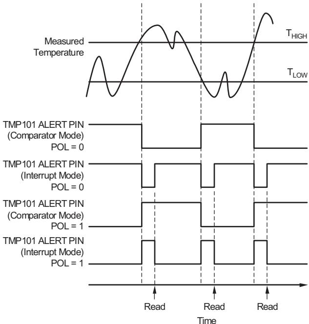  
Figure 11. Output Transfer Function Diagrams

# 7.5.3.4 Fault Queue (F1, F0)

A fault condition occurs when the measured temperature exceeds the user-defined limits set in the ${ \sf T } _ { \sf H I G H }$ and TLOW Registers. Additionally, the number of fault conditions required to generate an alert can be programmed using the Fault Queue. The Fault Queue is provided to prevent a false alert resulting from environmental noise. The Fault Queue requires consecutive fault measurements in order to trigger the alert function. If the temperature falls below TLOW before reaching the number of programmed consecutive faults limit, the count is reset to 0. Table 9 defines the number of measured faults that can be programmed to trigger an alert condition in the device.

Table 9. Fault Settings of the TMP100 and TMP101   

<table><tr><td rowspan=1 colspan=1>F1</td><td rowspan=1 colspan=1>F0</td><td rowspan=1 colspan=1>CONSECUTIVE FAULTS</td></tr><tr><td rowspan=1 colspan=1>0</td><td rowspan=1 colspan=1>0</td><td rowspan=1 colspan=1>1</td></tr><tr><td rowspan=1 colspan=1>0</td><td rowspan=1 colspan=1>1</td><td rowspan=1 colspan=1>2</td></tr><tr><td rowspan=1 colspan=1>1</td><td rowspan=1 colspan=1>0</td><td rowspan=1 colspan=1>4</td></tr><tr><td rowspan=1 colspan=1>1</td><td rowspan=1 colspan=1>1</td><td rowspan=1 colspan=1>6</td></tr></table>

# 7.5.3.5 Converter Resolution (R1, R0)

The Converter Resolution bits control the resolution of the internal analog-to-digital converter (ADC), thus allowing the user to maximize efficiency by programming for higher resolution or faster conversion time. Table 10 identifies the Resolution bits and the relationship between resolution and conversion time.

Table 10. Resolution of the TMP100 and TMP101   

<table><tr><td rowspan=1 colspan=1>R1</td><td rowspan=1 colspan=1>R0</td><td rowspan=1 colspan=1>RESOLUTION</td><td rowspan=1 colspan=1>CONVERSION TIME(Typical)</td></tr><tr><td rowspan=1 colspan=1>0</td><td rowspan=1 colspan=1>0</td><td rowspan=1 colspan=1>9 bits (0.5°C)</td><td rowspan=1 colspan=1>40 ms</td></tr><tr><td rowspan=1 colspan=1>0</td><td rowspan=1 colspan=1>1</td><td rowspan=1 colspan=1>10 bits (0.25C)</td><td rowspan=1 colspan=1>80 ms</td></tr><tr><td rowspan=1 colspan=1>1</td><td rowspan=1 colspan=1>0</td><td rowspan=1 colspan=1>11 bits (0.125℃)</td><td rowspan=1 colspan=1>160 ms</td></tr><tr><td rowspan=1 colspan=1>1</td><td rowspan=1 colspan=1>1</td><td rowspan=1 colspan=1>12 bits (0.0625C)</td><td rowspan=1 colspan=1>320 ms</td></tr></table>

# 7.5.3.6 OS/ALERT (OS)

The TMP100 and TMP101 devices feature a One-Shot Temperature Measurement Mode. When the device is in Shutdown Mode, writing 1 to the OS/ALERT bit starts a single temperature conversion. The device returns to the shutdown state at the completion of the single conversion. This feature is useful to reduce power consumption in the TMP100 and TMP101 when continuous temperature monitoring is not required.

Reading the OS/ALERT bit provides information about the Comparator Mode status. The state of the POL bit inverts the polarity of data returned from the OS/ALERT bit. For ${ \mathsf { P O L } } = 0$ , the OS/ALERT reads as 1 until the temperature equals or exceeds ${ \sf T } _ { \sf H I G H }$ for the programmed number of consecutive faults, causing the OS/ALERT bit to read as 0. The OS/ALERT bit continues to read as 0 until the temperature falls below ${ \sf T } _ { \sf L O W }$ for the programmed number of consecutive faults when the OS/ALERT bit again reads as 1. The status of the TM bit does not affect the status of the OS/ALERT bit.

# 7.5.4 High- and Low-Limit Registers

In Comparator Mode $( \mathsf { T M } = 0 )$ , the ALERT pin of the TMP101 becomes active when the temperature equals or exceeds the value in ${ \sf T } _ { \sf H I G H }$ and generates a consecutive number of faults according to fault bits F1 and F0. The ALERT pin remains active until the temperature falls below the indicated ${ \sf T } _ { \sf L O W }$ value for the same number of faults.

In Interrupt Mode $( \mathsf { T M } = \mathsf { 1 } )$ ) the ALERT pin becomes active when the temperature equals or exceeds ${ \sf T } _ { \sf H I G H }$ for a consecutive number of fault conditions. The ALERT pin remains active until a read operation of any register occurs or the device successfully responds to the SMBus Alert Response Address. The ALERT pin is also cleared if the device is placed in Shutdown Mode. When the ALERT pin is cleared, it only becomes active again by the temperature falling below TLOW. When the temperature falls below ${ \mathsf { T } } _ { \mathsf { L O W } }$ , the ALERT pin becomes active and remains active until cleared by a read operation of any register or a successful response to the SMBus Alert Response Address. When the ALERT pin is cleared, the above cycle repeats with the ALERT pin becoming active when the temperature equals or exceeds ${ \sf T } _ { \sf H I G H }$ . The ALERT pin can also be cleared by resetting the device with the General Call Reset command. This action also clears the state of the internal registers in the device, returning the device to Comparator Mode $\mathsf { T M } = 0 )$ .

Both operational modes are represented in Figure 11. Table 11, Table 12, Table 13, and Table 14 describe the format for the ${ \sf T } _ { \sf H I G H }$ and ${ \sf T } _ { \sf L O W }$ registers. Power-up reset values for ${ \sf T } _ { \sf H I G H }$ and ${ \sf T } _ { \sf L O W }$ are: $T _ { \mathsf { H I G H } } = 8 0 ^ { \circ } \mathsf { C }$ and $\mathsf { T } _ { \mathsf { L O W } } =$ $7 5 \textdegree$ . The format of the data for ${ \sf T } _ { \sf H I G H }$ and ${ \mathsf { T } } _ { \mathsf { L O W } }$ is the same as for the Temperature Register.

Table 11. Byte 1 of the ${ \sf T } _ { { \sf H I G H } }$ Register   

<table><tr><td rowspan=1 colspan=1>D7</td><td rowspan=1 colspan=1>D6</td><td rowspan=1 colspan=1>D5</td><td rowspan=1 colspan=1>D4</td><td rowspan=1 colspan=1>D3</td><td rowspan=1 colspan=1>D2</td><td rowspan=1 colspan=1>D1</td><td rowspan=1 colspan=1>DO</td></tr><tr><td rowspan=1 colspan=1>H11</td><td rowspan=1 colspan=1>H10</td><td rowspan=1 colspan=1>H9</td><td rowspan=1 colspan=1>H8</td><td rowspan=1 colspan=1>H7</td><td rowspan=1 colspan=1>H6</td><td rowspan=1 colspan=1>H5</td><td rowspan=1 colspan=1>H4</td></tr></table>

Table 12. Byte 2 of the ${ \sf T } _ { { \sf H I G H } }$ Register   

<table><tr><td rowspan=1 colspan=1>D7</td><td rowspan=1 colspan=1>D6</td><td rowspan=1 colspan=1>D5</td><td rowspan=1 colspan=1>D4</td><td rowspan=1 colspan=1>D3</td><td rowspan=1 colspan=1>D2</td><td rowspan=1 colspan=1>D1</td><td rowspan=1 colspan=1>DO</td></tr><tr><td rowspan=1 colspan=1>H3</td><td rowspan=1 colspan=1>H2</td><td rowspan=1 colspan=1>H1</td><td rowspan=1 colspan=1>H0</td><td rowspan=1 colspan=1>0</td><td rowspan=1 colspan=1>0</td><td rowspan=1 colspan=1>0</td><td rowspan=1 colspan=1>0</td></tr></table>

Table 13. Byte 1 of the $\mathsf { T } _ { \mathsf { L O W } }$ Register   

<table><tr><td rowspan=1 colspan=1>D7</td><td rowspan=1 colspan=1>D6</td><td rowspan=1 colspan=1>D5</td><td rowspan=1 colspan=1>D4</td><td rowspan=1 colspan=1>D3</td><td rowspan=1 colspan=1>D2</td><td rowspan=1 colspan=1>D1</td><td rowspan=1 colspan=1>DO</td></tr><tr><td rowspan=1 colspan=1>L11</td><td rowspan=1 colspan=1>L10</td><td rowspan=1 colspan=1>L9</td><td rowspan=1 colspan=1>L8</td><td rowspan=1 colspan=1>L7</td><td rowspan=1 colspan=1>L6</td><td rowspan=1 colspan=1>L5</td><td rowspan=1 colspan=1>L4</td></tr></table>

Table 14. Byte 2 of the $\mathsf { T } _ { \mathsf { L O W } }$ Register   

<table><tr><td rowspan=1 colspan=1>D7</td><td rowspan=1 colspan=1>D6</td><td rowspan=1 colspan=1>D5</td><td rowspan=1 colspan=1>D4</td><td rowspan=1 colspan=1>D3</td><td rowspan=1 colspan=1>D2</td><td rowspan=1 colspan=1>D1</td><td rowspan=1 colspan=1>D0</td></tr><tr><td rowspan=1 colspan=1>L3</td><td rowspan=1 colspan=1>L2</td><td rowspan=1 colspan=1>L1</td><td rowspan=1 colspan=1>L0</td><td rowspan=1 colspan=1>0</td><td rowspan=1 colspan=1>0</td><td rowspan=1 colspan=1>0</td><td rowspan=1 colspan=1>0</td></tr></table>

All 12 bits for the Temperature, ${ \sf T } _ { \sf H I G H }$ , and ${ \sf T } _ { \sf L O W }$ registers are used in the comparisons for the ALERT function for all converter resolutions. The three LSBs in ${ \sf T } _ { \sf H I G H }$ and ${ \sf T } _ { \sf L O W }$ can affect the ALERT output even if the converter is configured for 9-bit resolution.

# 8 Application and Implementation

# NOTE

Information in the following applications sections is not part of the TI component specification, and TI does not warrant its accuracy or completeness. TI’s customers are responsible for determining suitability of components for their purposes. Customers should validate and test their design implementation to confirm system functionality.

# 8.1 Application Information

The TMP100 and TMP101 devices are used to measure the printed circuit board (PCB) temperature of the board location where the devices are mounted. The TMP100 features two address pins to allow up to eight devices to be addressed on a single ${ \mathsf { I } } ^ { 2 } { \mathsf { C } }$ interface. The TMP101 device features one address pin and an ALERT pin, allowing up to three devices to be connected per bus. The TMP100 and TMP101 devices require no external components for operation except for pullup resistors on SCL, SDA, and ALERT (TMP101 device), although a 0.1-μF bypass capacitor is recommended.

The sensing device of the TMP100 and TMP101 devices is the chip itself. Thermal paths run through the package leads as well as the plastic package. The die flag of the lead frame is connected to GND. The lower thermal resistance of metal causes the leads to provide the primary thermal path. The GND pin of the TMP100 or TMP101 device is directly connected to the metal lead frame, and is the best choice for thermal input.

# 8.2 Typical Application

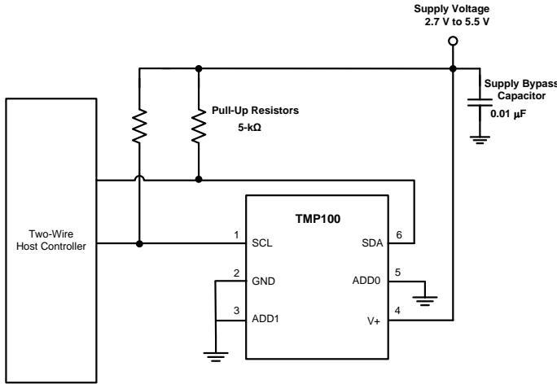  
Figure 12. Typical Connections of the TMP100

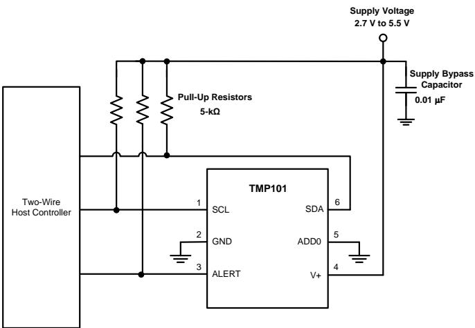  
Figure 13. Typical Connections of the TMP101

# 8.2.1 Design Requirements

The TMP100 and TMP101 devices require pullup resistors on the SCL, SDA, and ALERT (TMP101 device) pins. The recommended value for the pullup resistor is $5 { \cdot } { \mathsf { k } } \Omega$ . In some applications, the pullup resistor can be lower or higher than $5 { \cdot } { \mathsf { k } } \Omega$ but must not exceed $3 \mathsf { m A }$ of current on the SCL and SDA pins, and must not exceed $4 \mathsf { m } \mathsf { A }$ on the ALERT (TMP101) pin. A 0.1-μF bypass capacitor is recommended, as shown in Figure 12 and Figure 13. The SCL, SDA, and ALERT lines can be pulled up to a supply that is equal to or higher than ${ \sf V } _ { \sf S }$ through the pullup resistors. For the TMP100, to configure one of eight different addresses on the bus, connect ADD0 and ADD1 to either the GND pin, $\vee +$ pin, or float. Float indicates the pin is left unconnected. For the TMP101 device, to configure one of three different addresses on the bus, connect ADD0 to either the GND pin, $\vee +$ pin, or float.

# 8.2.2 Detailed Design Procedure

Place the TMP100 and TMP101 devices in close proximity to the heat source that must be monitored, with a proper layout for good thermal coupling. This placement ensures that temperature changes are captured within the shortest possible time interval. To maintain accuracy in applications that require air or surface temperature measurement, care must be taken to isolate the package and leads from ambient air temperature. A thermallyconductive adhesive is helpful in achieving accurate surface temperature measurement.

# Typical Application (continued)

# 8.2.3 Application Curve

Figure 14 shows the step response of the TMP100 and TMP101 devices to a submersion in an oil bath of $1 0 0 \%$ from room temperature $( 2 7 ^ { \circ } \mathsf { C } )$ . The time constant, or the time for the output to reach $6 3 \%$ of the input step, is $0 . 9 ~ \mathsf { s }$ . The time-constant result depends on the PCB that the TMP100 and TMP101 devices are mounted. For this test, the TMP100 and TMP101 devices are soldered to a two-layer PCB that measures 0.375 inch $\times { \ : 0 . 4 3 7 }$ inch.

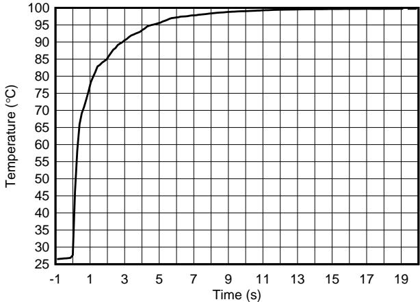  
Figure 14. Temperature Step Response

# 9 Power Supply Recommendations

The TMP100 and TMP101 devices operate with power supply in the range of $2 . 7 ~ \lor$ to $5 . 5 ~ \lor$ . A power-supply bypass capacitor is required for stability; place this capacitor as close as possible to the supply and ground pins of the device. A typical value for this supply bypass capacitor is $0 . 0 1 ~ \mu \mathsf { F }$ . Applications with noisy or highimpedance power supplies can require additional decoupling capacitors to reject power-supply noise.

# 10 Layout

# 10.1 Layout Guidelines

Place the power-supply bypass capacitor as close as possible to the supply and ground pins. The recommended value of this bypass capacitor is ${ \dot { 0 } } . 0 1 ~ \mu \mathsf { F }$ . Additional decoupling capacitance can be added to compensate for noisy or high-impedance power supplies. Pull up the open-drain output pins SDA , SCL, and ALERT (TMP101) through $5 \cdot \mathsf { k } \bar { \Omega }$ pullup resistors.

# 10.2 Layout Examples

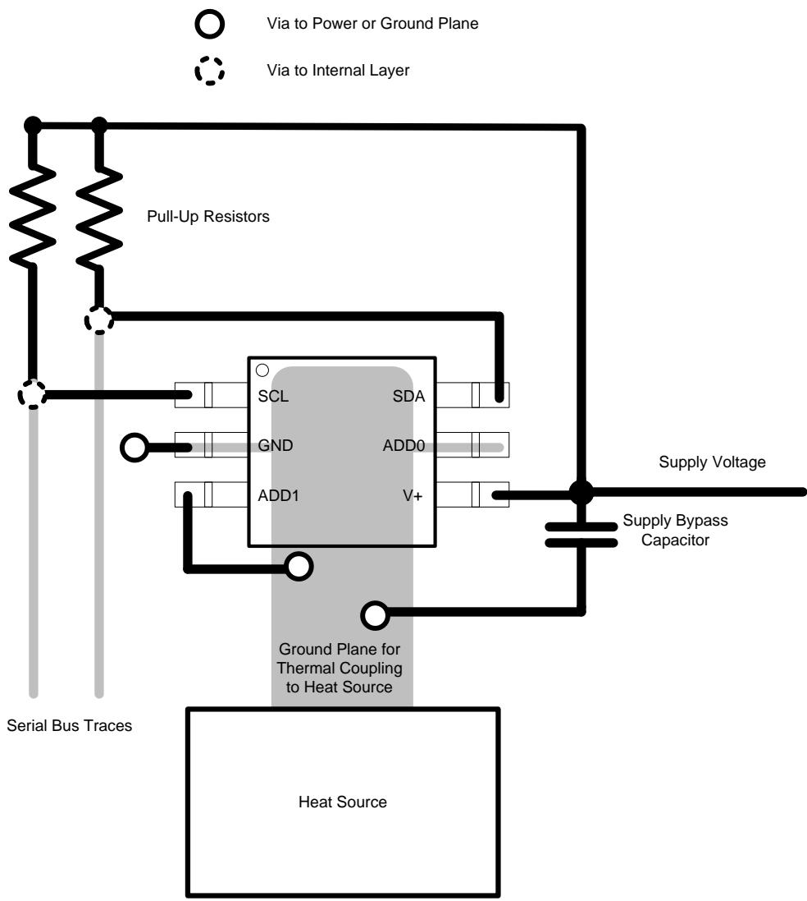  
Figure 15. TMP100 Layout Example

# Layout Examples (continued)

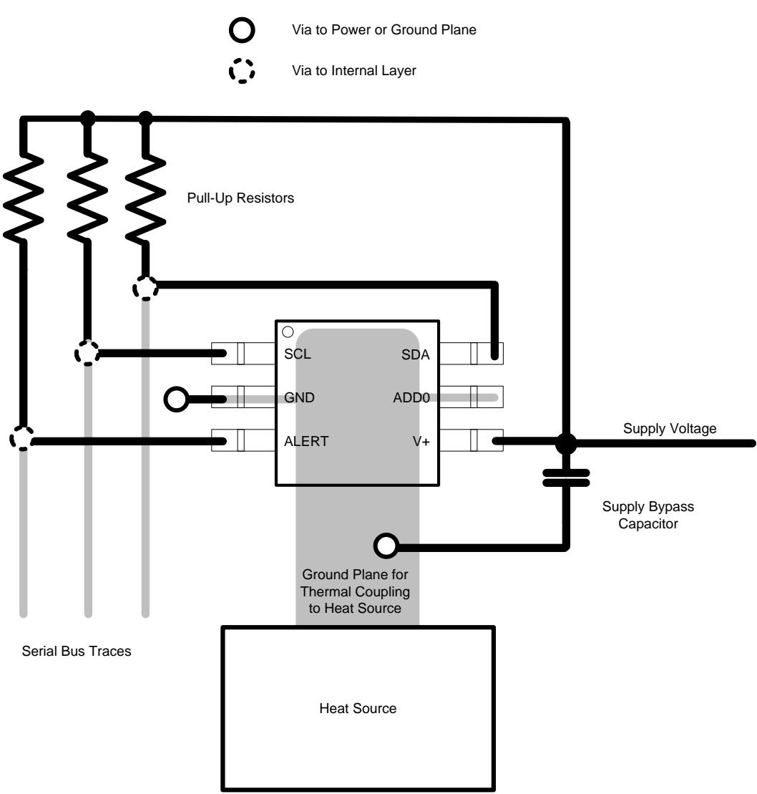  
Figure 16. TMP101 Layout Example

# 11 Device and Documentation Support

# 11.1 Related Links

The table below lists quick access links. Categories include technical documents, support and community resources, tools and software, and quick access to sample or buy.

Table 15. Related Links   

<table><tr><td rowspan=1 colspan=1> PARTS</td><td rowspan=1 colspan=1> PRODUCT FOLDER</td><td rowspan=1 colspan=1> SAMPLE &amp; BUY</td><td rowspan=1 colspan=1>TECHNICALDOCUMENTS</td><td rowspan=1 colspan=1>TOOLS &amp; SOFTWARE</td><td rowspan=1 colspan=1> SUPPORT &amp;COMMUNITY</td></tr><tr><td rowspan=1 colspan=1>TMP100</td><td rowspan=1 colspan=1>Click here</td><td rowspan=1 colspan=1>Click here</td><td rowspan=1 colspan=1>Click here</td><td rowspan=1 colspan=1>Click here</td><td rowspan=1 colspan=1>Click here</td></tr><tr><td rowspan=1 colspan=1>TMP101</td><td rowspan=1 colspan=1> Click here</td><td rowspan=1 colspan=1>Click here</td><td rowspan=1 colspan=1>Click here</td><td rowspan=1 colspan=1> Click here</td><td rowspan=1 colspan=1>Click here</td></tr></table>

# 11.2 Trademarks

SMBus is a trademark of NXP Semiconductors.   
All other trademarks are the property of their respective owners.

# 11.3 Electrostatic Discharge Caution

These devices have limited built-in ESD protection. The leads should be shorted together or the device placed in conductive foam during storage or handling to prevent electrostatic damage to the MOS gates.

# 11.4 Glossary

SLYZ022 — TI Glossary.

This glossary lists and explains terms, acronyms, and definitions.

# 12 Mechanical, Packaging, and Orderable Information

The following pages include mechanical, packaging, and orderable information. This information is the most current data available for the designated devices. This data is subject to change without notice and revision of this document. For browser-based versions of this data sheet, refer to the left-hand navigation.

PACKAGING INFORMATION   

<table><tr><td>Orderable part number</td><td>Status (1)</td><td>Material type (2）</td><td> Package | Pins</td><td>Package qty I Carrier</td><td>RoHS (3)</td><td>Lead finish/ Ball material</td><td>MSL rating/ Peak reflow</td><td>Op temp(℃)</td><td>Part marking (6）</td></tr><tr><td>TMP100NA/250</td><td>Obsolete</td><td>Production</td><td>SOT-23 (DBV)|6</td><td>-</td><td>·</td><td>(4 Call TI</td><td>(5) Call TI</td><td>-55 to 125</td><td>T100</td></tr><tr><td>TMP100NA/3K</td><td>Active</td><td>Production</td><td>SOT-23(DBV)I6</td><td>3000|LARGET&amp;R</td><td>Yes</td><td>NIPDAU</td><td>Level-2-260C-1 YEAR</td><td>-55 to 125</td><td>T100</td></tr><tr><td>TMP100NA/3K.B</td><td>Active</td><td>Production</td><td>SOT-23 (DBV)|6</td><td>3000|LARGET&amp;R</td><td>Yes</td><td>NIPDAU</td><td>Level-2-260C-1 YEAR</td><td>-55 to 125</td><td>T100</td></tr><tr><td>TMP100NA/3K1G4</td><td>Active</td><td>Production</td><td>SOT-23 (DBV) |6</td><td>3000|LARGE T&amp;R</td><td>Yes</td><td>NIPDAU</td><td>Level-2-260C-1 YEAR</td><td>-55 to 125</td><td>T100</td></tr><tr><td>TMP100NA/3K1G4.B</td><td>Active</td><td>Production</td><td>SOT-23 (DBV)|6</td><td>3000|LARGE T&amp;R</td><td>Yes</td><td>NIPDAU</td><td>Level-2-260C-1 YEAR</td><td>-55 to 125</td><td>T100</td></tr><tr><td>TMP101NA/3K</td><td>Active</td><td>Production</td><td>SOT-23 (DBV) |6</td><td>3000|LARGET&amp;R</td><td>Yes</td><td>NIPDAU</td><td>Level-2-260C-1 YEAR</td><td>-55 to 125</td><td>T101</td></tr><tr><td>TMP101NA/3K.B</td><td>Active</td><td>Production</td><td>SOT-23 (DBV) |6</td><td>3000|LARGET&amp;R</td><td>Yes</td><td>NIPDAU</td><td>Level-2-260C-1 YEAR</td><td>-55 to 125</td><td>T101</td></tr><tr><td>TMP101NA/3K1G4</td><td>Active</td><td>Production</td><td>SOT-23 (DBV)|6</td><td>3000|LARGET&amp;R</td><td>Yes</td><td>NIPDAU</td><td>Level-2-260C-1 YEAR</td><td>-55to 125</td><td>T101</td></tr><tr><td>TMP101NA/3K1G4.B</td><td>Active</td><td>Production</td><td>SOT-23 (DBV)|6</td><td>3000|LARGET&amp;R</td><td>Yes</td><td>NIPDAU</td><td>Level-2-260C-1 YEAR</td><td>-55 to125</td><td>T101</td></tr></table>

(1) Status: For more details on status, see our product life cycle.

(2) Material type: When designated, preproduction parts are prototypes/experimental devices, and are not yet approved or released for full production. Testing and final process, including without limitation quality assurance, reliability performance testing, and/or process qualification, may not yet be complete, and this item is subject to further changes or possible discontinuation. If available for ordering, purchases will be subject to an additional waiver at checkout, and are intended for early internal evaluation purposes only. These items are sold without warranties of any kind.

(3) RoHS values: Yes, No, RoHS Exempt. See the TI RoHS Statement for additional information and value definition.

(4) Lead finish/Ball material: Parts may have multiple material finish options. Finish options are separated by a vertical ruled line. Lead finish/Ball material values may wrap to two lines if the finish value exceeds the maximumcolumn width.

w: The moisture sensitivity level ratings and peak solder (reflow) temperatures. In the event that a part has multiple moisture sensitivity ratings, only the lowest level per JEDEC standards is shown.   
for the actual reflow temperature that will be used to mount the part to the printed circuit board.

(6) Part marking: There may be an additional marking, which relates to the logo, the lot trace code information, or the environmental category of the part.

Multiple part markings will be inside parentheses. Only one part marking contained in parentheses and separated by a "\~" will appear on a part. If a line is indented then it is a continuation of the previous line and the two combined represent the entire part marking for that device.

Important Information and Disclaimer:The information provided on this page represents TI's knowledge and belief as of the date that it is provided. TI bases its knowledge and belief on information provided by third parties, and makes no representation or warranty as to the accuracy of such information. Efforts are underway to better integrate information from third parties. TI has taken and continues to take reasonable steps to provide representative

and accurate information but may not have conducted destructive testing or chemical analysis on incoming materials and chemicals. TI and TI suppliers consider certain information to be proprietary, and thus CAS numbers and other limited information may not be available for release.

no event shall TI's liability arising out of such information exceed the total purchase price of the TI part(s) at issue in this document sold by TI to Customer on an annual basis.

# OTHER QUALIFIED VERSIONS OF TMP100, TMP101 :

Automotive $:$ TMP100-Q1, TMP101-Q1

Enhanced Product : TMP100-EP

NOTE: Qualified Version Definitions:

• Automotive - Q100 devices qualified for high-reliability automotive applications targeting zero defects

• Enhanced Product - Supports Defense, Aerospace and Medical Applications

# TAPE AND REEL INFORMATION

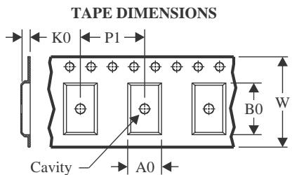

<table><tr><td rowspan=1 colspan=1>A0</td><td rowspan=1 colspan=1>A0Dimension designed to accommodate the component width</td></tr><tr><td rowspan=1 colspan=1>B0</td><td rowspan=1 colspan=1>Dimension designed to accommodate the component length</td></tr><tr><td rowspan=1 colspan=1>K0</td><td rowspan=1 colspan=1>Dimension designed to accommodate the component thickness</td></tr><tr><td rowspan=1 colspan=1>W</td><td rowspan=1 colspan=1>Overall width of the carrier tape</td></tr><tr><td rowspan=1 colspan=1>P1</td><td rowspan=1 colspan=1>Pitch between successive cavity centers</td></tr></table>

# QUADRANT ASSIGNMENTS FOR PIN 1 ORIENTATION IN TAPE

\*All dimensions are nominal   

<table><tr><td rowspan=1 colspan=1>Device</td><td rowspan=1 colspan=1>PackageType</td><td rowspan=1 colspan=1>PackageDrawing</td><td rowspan=1 colspan=1>Pins</td><td rowspan=1 colspan=1>SPQ</td><td rowspan=1 colspan=1>ReelDiameter(mm)</td><td rowspan=1 colspan=1>ReelWidthw1 (mm)</td><td rowspan=1 colspan=1>A0(mm)</td><td rowspan=1 colspan=1>BO(mm)</td><td rowspan=1 colspan=1>K0(mm)</td><td rowspan=1 colspan=1>P1(mm)</td><td rowspan=1 colspan=1>w(mm)</td><td rowspan=1 colspan=1>Pin1Quadrant</td></tr><tr><td rowspan=1 colspan=1>TMP100NA/3K</td><td rowspan=1 colspan=1>SOT-23</td><td rowspan=1 colspan=1>DBV</td><td rowspan=1 colspan=1>6</td><td rowspan=1 colspan=1>3000</td><td rowspan=1 colspan=1>178.0</td><td rowspan=1 colspan=1>9.0</td><td rowspan=1 colspan=1>3.23</td><td rowspan=1 colspan=1>3.17</td><td rowspan=1 colspan=1>1.37</td><td rowspan=1 colspan=1>4.0</td><td rowspan=1 colspan=1>8.0</td><td rowspan=1 colspan=1>Q3</td></tr><tr><td rowspan=1 colspan=1>TMP100NA/3K1G4</td><td rowspan=1 colspan=1>SOT-23</td><td rowspan=1 colspan=1>DBV</td><td rowspan=1 colspan=1>6</td><td rowspan=1 colspan=1>3000</td><td rowspan=1 colspan=1>178.0</td><td rowspan=1 colspan=1>9.0</td><td rowspan=1 colspan=1>3.23</td><td rowspan=1 colspan=1>3.17</td><td rowspan=1 colspan=1>1.37</td><td rowspan=1 colspan=1>4.0</td><td rowspan=1 colspan=1>8.0</td><td rowspan=1 colspan=1>Q3</td></tr><tr><td rowspan=1 colspan=1>TMP101NA/3K</td><td rowspan=1 colspan=1>SOT-23</td><td rowspan=1 colspan=1>DBV</td><td rowspan=1 colspan=1>6</td><td rowspan=1 colspan=1>3000</td><td rowspan=1 colspan=1>178.0</td><td rowspan=1 colspan=1>9.0</td><td rowspan=1 colspan=1>3.23</td><td rowspan=1 colspan=1>3.17</td><td rowspan=1 colspan=1>1.37</td><td rowspan=1 colspan=1>4.0</td><td rowspan=1 colspan=1>8.0</td><td rowspan=1 colspan=1>Q3</td></tr><tr><td rowspan=1 colspan=1>TMP101NA/3K1G4</td><td rowspan=1 colspan=1>SOT-23</td><td rowspan=1 colspan=1>DBV</td><td rowspan=1 colspan=1>6</td><td rowspan=1 colspan=1>3000</td><td rowspan=1 colspan=1>178.0</td><td rowspan=1 colspan=1>9.0</td><td rowspan=1 colspan=1>3.23</td><td rowspan=1 colspan=1>3.17</td><td rowspan=1 colspan=1>1.37</td><td rowspan=1 colspan=1>4.0</td><td rowspan=1 colspan=1>8.0</td><td rowspan=1 colspan=1>Q3</td></tr></table>

\*All dimensions are nominal   

<table><tr><td rowspan=1 colspan=1>Device</td><td rowspan=1 colspan=1>Package Type</td><td rowspan=1 colspan=1>Package Drawing</td><td rowspan=1 colspan=1>Pins</td><td rowspan=1 colspan=1>SPQ</td><td rowspan=1 colspan=1>Length (mm)</td><td rowspan=1 colspan=1>Width (mm)</td><td rowspan=1 colspan=1>Height (mm)</td></tr><tr><td rowspan=1 colspan=1>TMP100NA/3K</td><td rowspan=1 colspan=1>SOT-23</td><td rowspan=1 colspan=1>DBV</td><td rowspan=1 colspan=1>6</td><td rowspan=1 colspan=1>3000</td><td rowspan=1 colspan=1>180.0</td><td rowspan=1 colspan=1>180.0</td><td rowspan=1 colspan=1>18.0</td></tr><tr><td rowspan=1 colspan=1>TMP100NA/3K1G4</td><td rowspan=1 colspan=1>SOT-23</td><td rowspan=1 colspan=1>DBV</td><td rowspan=1 colspan=1>6</td><td rowspan=1 colspan=1>3000</td><td rowspan=1 colspan=1>180.0</td><td rowspan=1 colspan=1>180.0</td><td rowspan=1 colspan=1>18.0</td></tr><tr><td rowspan=1 colspan=1>TMP101NA/3K</td><td rowspan=1 colspan=1>SOT-23</td><td rowspan=1 colspan=1>DBV</td><td rowspan=1 colspan=1>6</td><td rowspan=1 colspan=1>3000</td><td rowspan=1 colspan=1>445.0</td><td rowspan=1 colspan=1>220.0</td><td rowspan=1 colspan=1>345.0</td></tr><tr><td rowspan=1 colspan=1>TMP101NA/3K1G4</td><td rowspan=1 colspan=1>SOT-23</td><td rowspan=1 colspan=1>DBV</td><td rowspan=1 colspan=1>6</td><td rowspan=1 colspan=1>3000</td><td rowspan=1 colspan=1>445.0</td><td rowspan=1 colspan=1>220.0</td><td rowspan=1 colspan=1>345.0</td></tr></table>

SMALL OUTLINE TRANSISTOR

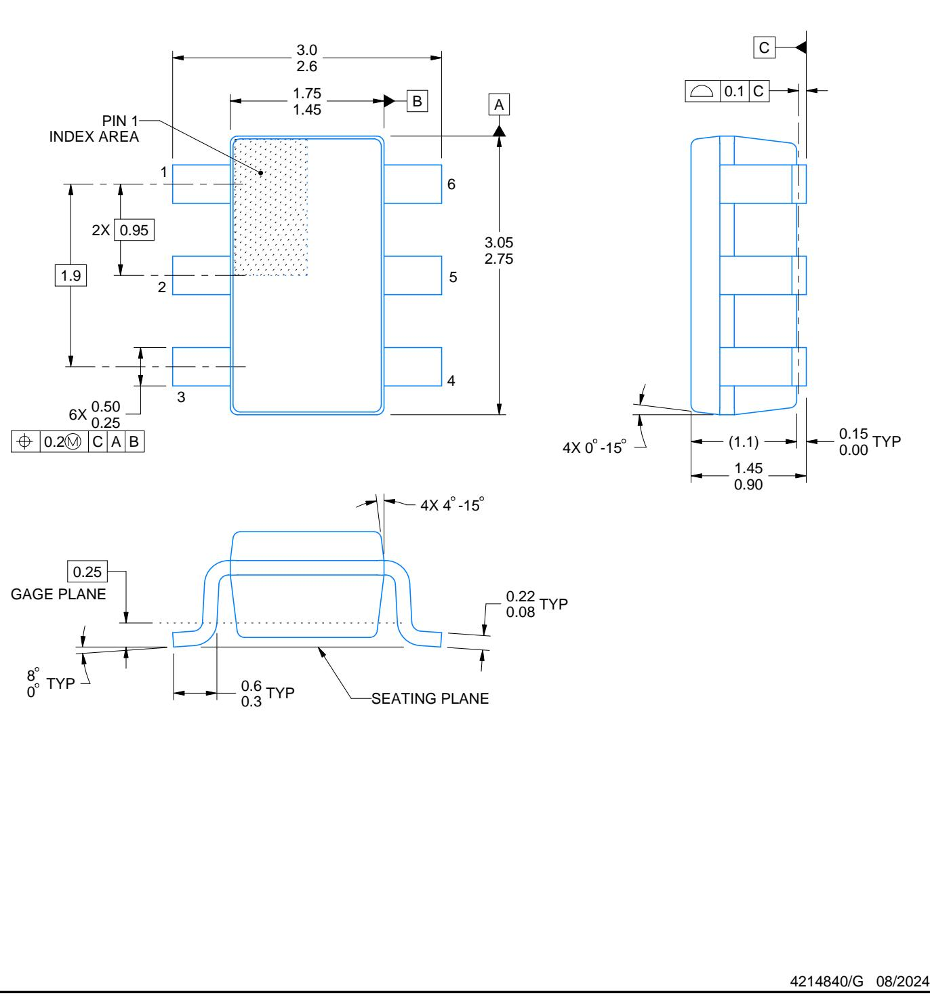

NOTES:

1. All linear dimensions are in millimeters. Any dimensions in parenthesis are for reference only. Dimensioning and tolerancing   
per ASME $\mathsf { Y } 1 4 . 5 \mathsf { M }$ .   
2. This drawing is subject to change without notice.   
3. Body dimensions do not include mold flash or protrusion. Mold flash and protrusion shall not exceed 0.25 per side.   
4. Leads 1,2,3 may be wider than leads 4,5,6 for package orientation.

5. Refernce JEDEC MO-178.

SMALL OUTLINE TRANSISTOR

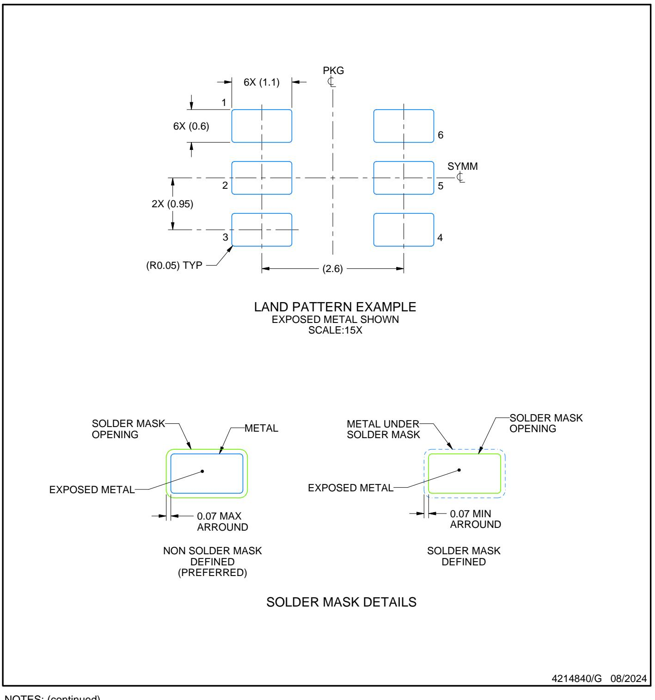  
NOTES: (continued)

6. Publication IPC-7351 may have alternate designs.   
7. Solder mask tolerances between and around signal pads can vary based on board fabrication site.

SMALL OUTLINE TRANSISTOR

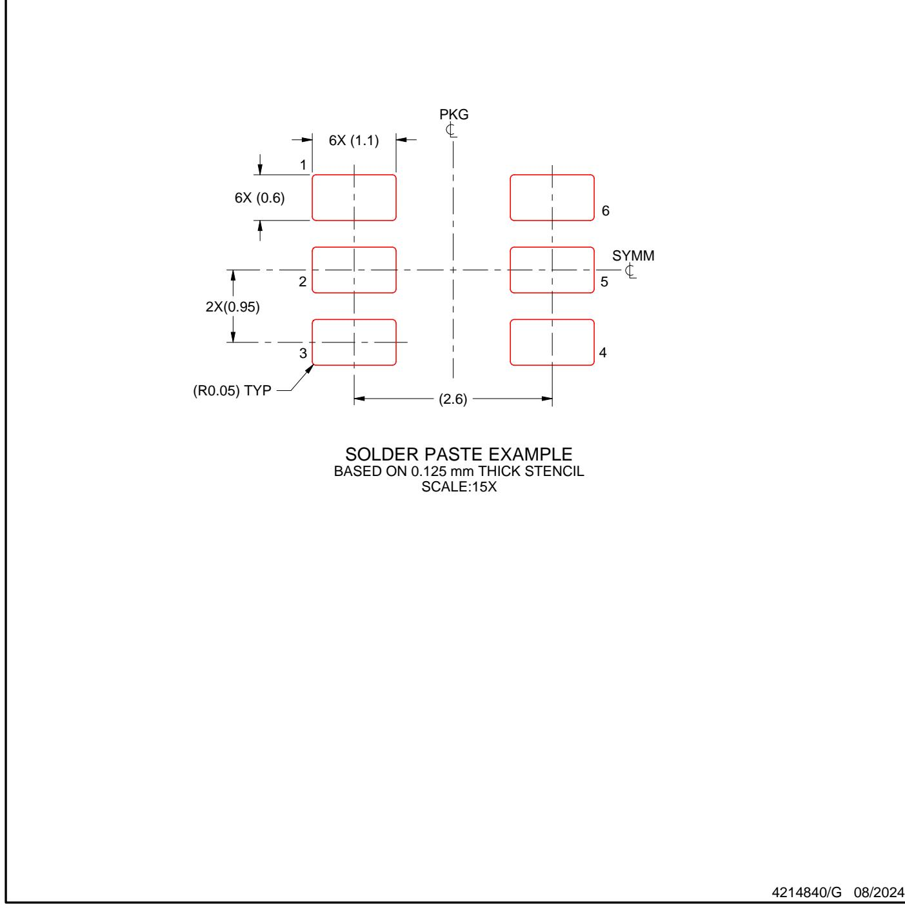  
NOTES: (continued)

8. Laser cutting apertures with trapezoidal walls and rounded corners may offer better paste release. IPC-7525 may have alternate design recommendations.   
9. Board assembly site may have different recommendations for stencil design.

# IMPORTANT NOTICE AND DISCLAIMER

TI PROVIDES TECHNICAL AND RELIABILITY DATA (INCLUDING DATASHEETS), DESIGN RESOURCES (INCLUDING REFERENCE DESIGNS), APPLICATION OR OTHER DESIGN ADVICE, WEB TOOLS, SAFETY INFORMATION, AND OTHER RESOURCES “AS IS” AND WITH ALL FAULTS, AND DISCLAIMS ALL WARRANTIES, EXPRESS AND IMPLIED, INCLUDING WITHOUT LIMITATION ANY IMPLIED WARRANTIES OF MERCHANTABILITY, FITNESS FOR A PARTICULAR PURPOSE OR NON-INFRINGEMENT OF THIRD PARTY INTELLECTUAL PROPERTY RIGHTS.

These resources are intended for skilled developers designing with TI products. You are solely responsible for (1) selecting the appropriate TI products for your application, (2) designing, validating and testing your application, and (3) ensuring your application meets applicable standards, and any other safety, security, regulatory or other requirements.

These resources are subject to change without notice. TI grants you permission to use these resources only for development of an application that uses the TI products described in the resource. Other reproduction and display of these resources is prohibited. No license is granted to any other TI intellectual property right or to any third party intellectual property right. TI disclaims responsibility for, and you fully indemnify TI and its representatives against any claims, damages, costs, losses, and liabilities arising out of your use of these resources.

TI’s products are provided subject to TI’s Terms of Sale, TI’s General Quality Guidelines, or other applicable terms available either on ti.com or provided in conjunction with such TI products. TI’s provision of these resources does not expand or otherwise alter TI’s applicable warranties or warranty disclaimers for TI products. Unless TI explicitly designates a product as custom or customer-specified, TI products are standard, catalog, general purpose devices.

TI objects to and rejects any additional or different terms you may propose.