# TMP102 Low-Power Digital Temperature Sensor With SMBus and Two-Wire Serial Interface in SOT563

# 1 Features

# 3 Description

• SOT563 package $1 . 6 \mathsf { m m } \times 1 . 6 \mathsf { m m } )$ is a $6 8 \%$ smaller footprint than SOT-23

• Accuracy without calibration: – $2 . 0 ^ { \circ } \mathsf { C }$ (maximum) from $\mathtt { - 2 5 ^ { \circ } C }$ to $8 5 ^ { \circ } \mathsf { C }$ – $3 . 0 ^ { \circ } \mathsf { C }$ (maximum) from $\angle 4 0 ^ { \circ } \mathsf { C }$ to $12 5 ^ { \circ } \mathrm { C }$

• Low quiescent current: – $7 . 5 \mu \mathsf { A }$ active (maximum) – $0 . 3 5 \mu \mathsf { A }$ shutdown (maximum)

• Supply range: 1.4V to 3.6V

• Resolution: 12 bits

Digital output: SMBus, two-wire, and ${ \mathsf { I } } ^ { 2 } { \mathsf { C } }$ interface compatibility • NIST traceable

# 2 Applications

Portable electronics   
Power-supply temperature monitoring   
Connected peripherals and printers   
PC and notebooks   
Battery management   
Enterprise machine   
Thermostat   
Electromechanical device temperatures   
General temperature measurements:

Factory automation & control Test & measurement Medical and healthcare

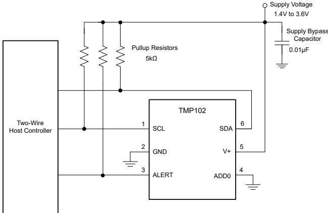  
Simplified Schematic

The TMP102 device is a digital temperature sensor designed for NTC/PTC thermistor replacement where high accuracy is required. The device offers an accuracy of $\pm 0 . 5 ^ { \circ } \mathsf { C }$ without requiring calibration or external component signal conditioning. Device temperature sensors are highly linear and do not require complex calculations or lookup tables to derive the temperature. The on-chip 12-bit ADC offers resolutions down to $0 . 0 6 2 5 ^ { \circ } \mathrm { C }$ .

The $1 . 6 \mathsf { m m } \ \times \ 1 . 6 \mathsf { m m }$ SOT563 package is $6 8 \%$ smaller footprint than an SOT-23 package. The TMP102 device features SMBus™, two-wire and $\mathsf { I 2 C }$ interface compatibility, and allows up to four devices on one bus. The device also features an SMBus alert function. The device is specified to operate over supply voltages from 1.4V to $3 . 6 \mathsf { V }$ with the maximum quiescent current of $7 . 5 \mu \mathsf { A }$ over the full operating range.

The TMP102 device is designed for extended temperature measurement in a variety of communication, computer, consumer, environmental, industrial, and instrumentation applications. The device is specified for operation over a temperature range of $\angle 4 0 ^ { \circ } \mathsf { C }$ to $12 5 ^ { \circ } \mathrm { C }$ .

The TMP102 production units are $100 \%$ tested against sensors that are NIST-traceable and are verified with equipment that are NIST-traceable through ISO/IEC 17025 accredited calibrations.

# Package Information

<table><tr><td rowspan=1 colspan=1>PART NUMBER</td><td rowspan=1 colspan=1>PACKAGE(1)</td><td rowspan=1 colspan=1> PACKAGE SIZE(2)</td></tr><tr><td rowspan=1 colspan=1>TMP102</td><td rowspan=1 colspan=1>SOT563 (6)</td><td rowspan=1 colspan=1>1.60mm ×1.60mm</td></tr></table>

(1) For more information, see Section 10. (2) The package size (length $\times$ width) is a nominal value and includes pins, where applicable.

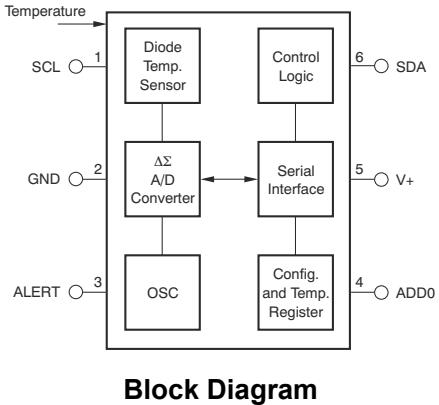

# Table of Contents

1 Features... 1   
2 Applications.. 1   
3 Description... .1   
4 Pin Configuration and Functions.. .3   
5 Specifications.. 4   
5.1 Absolute Maximum Ratings.. 4   
5.2 ESD Ratings.... 4   
5.3 Recommended Operating Conditions.. .4   
5.4 Thermal Information... .4   
5.5 Electrical Characteristics.. .5   
5.6 Timing Requirements.. 6   
5.7 Typical Characteristics..

# 6 Detailed Description.. 8

6.1 Overview.. 8   
6.2 Functional Block Diagram.. . 8   
6.3 Feature Description.... ..8   
6.4 Device Functional Modes.. .14

# 6.5 Programming... 16

# 7 Application and Implementation.. .20

7.1 Application Information.. 20   
7.2 Typical Application.. .. 20   
7.3 Power Supply Recommendations.. . 21   
7.4 Layout.. . 22

# 8 Device and Documentation Support.. .23

8.1 Documentation Support.. . 23   
8.2 Receiving Notification of Documentation Updates....23   
8.3 Support Resources.. 23   
8.4 Trademarks.. . 23   
8.5 Electrostatic Discharge Caution.. ... 23   
8.6 Glossary.... .23

# 9 Revision History... 23

# 10 Mechanical, Packaging, and Orderable

Information.. 25

# 4 Pin Configuration and Functions

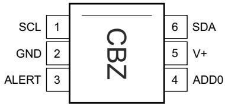  
Figure 4-1. DRL Package 6-Pin SOT563 Top View

Table 4-1. Pin Functions   

<table><tr><td rowspan=1 colspan=2>PIN</td><td rowspan=2 colspan=1>TYPE(1)</td><td rowspan=2 colspan=1>DESCRIPTION</td></tr><tr><td rowspan=1 colspan=1>NO.</td><td rowspan=1 colspan=1>NAME</td></tr><tr><td rowspan=1 colspan=1>1</td><td rowspan=1 colspan=1>SCL</td><td rowspan=1 colspan=1>1</td><td rowspan=1 colspan=1>Serial clock</td></tr><tr><td rowspan=1 colspan=1>2</td><td rowspan=1 colspan=1>GND</td><td rowspan=1 colspan=1>二</td><td rowspan=1 colspan=1>Ground</td></tr><tr><td rowspan=1 colspan=1>3</td><td rowspan=1 colspan=1>ALERT</td><td rowspan=1 colspan=1>0</td><td rowspan=1 colspan=1>Overtemperature alert. Open-drain output; requires a pulup resistor.</td></tr><tr><td rowspan=1 colspan=1>4</td><td rowspan=1 colspan=1>ADD0</td><td rowspan=1 colspan=1>1</td><td rowspan=1 colspan=1>Address select. Connect to GND or V+</td></tr><tr><td rowspan=1 colspan=1>5</td><td rowspan=1 colspan=1>V+</td><td rowspan=1 colspan=1>1</td><td rowspan=1 colspan=1>Supply voltage, 1.4 V to 3.6 V</td></tr><tr><td rowspan=1 colspan=1>6</td><td rowspan=1 colspan=1>SDA</td><td rowspan=1 colspan=1>1/0</td><td rowspan=1 colspan=1>Serial data. Open-drain output; requires a pullup resistor.</td></tr></table>

(1) $| =$ Input, ${ \sf O } =$ Output, $1 / \bigcirc =$ Input or Output

# 5 Specifications

# 5.1 Absolute Maximum Ratings

Over operating free-air temperature range (unless otherwise noted)(1)

<table><tr><td></td><td rowspan=1 colspan=1>MIN      MAX</td><td rowspan=1 colspan=1> UNIT</td></tr><tr><td rowspan=1 colspan=1>Supply voltage</td><td rowspan=1 colspan=1>4</td><td rowspan=1 colspan=1>V</td></tr><tr><td rowspan=1 colspan=1>Voltage at SCL, SDA and ADD0(2)</td><td rowspan=1 colspan=1>-0.5          4</td><td rowspan=1 colspan=1>V</td></tr><tr><td rowspan=1 colspan=1>Voltage at ALERT</td><td rowspan=1 colspan=1>(V+) + 0.3)and≤4</td><td rowspan=1 colspan=1>V</td></tr><tr><td rowspan=1 colspan=1>Operating temperature</td><td rowspan=1 colspan=1>-55       150</td><td rowspan=1 colspan=1>℃</td></tr><tr><td rowspan=1 colspan=1>Junction temperature</td><td rowspan=1 colspan=1>150</td><td rowspan=1 colspan=1>℃</td></tr><tr><td rowspan=1 colspan=1>Storage temperature, Tstg</td><td rowspan=1 colspan=1>-60       150</td><td rowspan=1 colspan=1>℃</td></tr></table>

(1) Operation outside the Absolute Maximum Ratings may cause permanent device damage. Absolute Maximum Ratings do not imply functional operation of the device at these or any other conditions beyond those listed under Recommended Operating Conditions. If used outside the Recommended Operating Conditions but within the Absolute Maximum Ratings, the device may not be fully functional, and this may affect device reliability, functionality, performance, and shorten the device lifetime.   
(2) Input voltage rating applies to all TMP102 input voltages.

# 5.2 ESD Ratings

<table><tr><td></td><td></td><td></td><td rowspan=1 colspan=1>VALUE</td><td rowspan=1 colspan=1> UNIT</td></tr><tr><td rowspan=2 colspan=1>V(ESD)</td><td rowspan=2 colspan=1>Electrostatic discharge</td><td rowspan=1 colspan=1>Human-body model (HBM), per ANSI/ESDA/JEDEC JS-001(1)</td><td rowspan=1 colspan=1>±2000</td><td rowspan=2 colspan=1>V</td></tr><tr><td rowspan=1 colspan=1>Charged-device model (CDM), per JEDEC specification JESD22-C101（2)</td><td rowspan=1 colspan=1>±1000</td></tr></table>

(1) Level listed above is the passing level per ANSI, ESDA, and JEDEC JS-001. JEDEC document JEP155 states that 500-V HBM allows safe manufacturing with a standard ESD control process.   
(2) Level listed above is the passing level per EIA-JEDEC JESD22-C101. JEDEC document JEP157 states that 250-V CDM allows safe manufacturing with a standard ESD control process

# 5.3 Recommended Operating Conditions

Over operating free-air temperature range (unless otherwise noted)

<table><tr><td></td><td></td><td> MIN</td><td>NOM</td><td>MAX</td><td>UNIT</td></tr><tr><td>V+</td><td>Supply voltage</td><td>1.4</td><td>3.3</td><td>3.6</td><td>V</td></tr><tr><td>TA</td><td>Operating free-air temperature</td><td>-40</td><td></td><td>125</td><td>℃</td></tr></table>

# 5.4 Thermal Information

<table><tr><td rowspan=3 colspan=2>THERMAL METRIC(1)</td><td rowspan=1 colspan=1>TMP102</td><td rowspan=3 colspan=1>UNIT</td></tr><tr><td rowspan=1 colspan=1>DRL (SOT563)</td></tr><tr><td rowspan=1 colspan=1>6 PINS</td></tr><tr><td rowspan=1 colspan=1>ReJA</td><td rowspan=1 colspan=1>Junction-to-ambient thermal resistance</td><td rowspan=1 colspan=1>240.2</td><td rowspan=1 colspan=1>C/W</td></tr><tr><td rowspan=1 colspan=1>ReJc(top)</td><td rowspan=1 colspan=1>Junction-to-case (top) thermal resistance</td><td rowspan=1 colspan=1>96.4</td><td rowspan=1 colspan=1>C/W</td></tr><tr><td rowspan=1 colspan=1>ReJB</td><td rowspan=1 colspan=1>Junction-to-board thermal resistance</td><td rowspan=1 colspan=1>124.3</td><td rowspan=1 colspan=1>CW</td></tr><tr><td rowspan=1 colspan=1>JT</td><td rowspan=1 colspan=1>Junction-to-top characterization parameter</td><td rowspan=1 colspan=1>4.0</td><td rowspan=1 colspan=1>C/W</td></tr><tr><td rowspan=1 colspan=1>JB</td><td rowspan=1 colspan=1>Junction-to-board characterization parameter</td><td rowspan=1 colspan=1>123.1</td><td rowspan=1 colspan=1>C/W</td></tr></table>

(1) For more information about traditional and new thermal metrics, see the Semiconductor and IC Package Thermal Metrics application note.

# 5.5 Electrical Characteristics

At $\mathsf { T } _ { \mathsf { A } } = 2 5 ^ { \circ } \mathsf { C }$ and $\mathsf { V } + = 1 . 4$ to $3 . 6 \lor ,$ , unless otherwise noted.

<table><tr><td rowspan=1 colspan=3> PARAMETER</td><td rowspan=1 colspan=1>TEST CONDITIONS</td><td rowspan=1 colspan=2>MIN      TYP      MAX</td><td rowspan=1 colspan=1> UNIT</td></tr><tr><td rowspan=1 colspan=6>TEMPERATURE SENSOR</td><td rowspan=1 colspan=1></td></tr><tr><td rowspan=1 colspan=1></td><td rowspan=1 colspan=2>Range</td><td rowspan=1 colspan=1></td><td rowspan=1 colspan=2>-40                    125</td><td rowspan=1 colspan=1>℃</td></tr><tr><td rowspan=1 colspan=1></td><td rowspan=2 colspan=2>Accuracy (temperature error)</td><td rowspan=1 colspan=1>-25C to 85C</td><td rowspan=1 colspan=2>±0.5       ±2</td><td rowspan=2 colspan=1>℃</td></tr><tr><td rowspan=1 colspan=1></td><td rowspan=1 colspan=1>-40°C to 125C</td><td rowspan=1 colspan=2>±1       ±3</td></tr><tr><td rowspan=1 colspan=1></td><td rowspan=1 colspan=2>vs supply</td><td rowspan=1 colspan=1></td><td rowspan=1 colspan=2>0.2       0.5</td><td rowspan=1 colspan=1>CN</td></tr><tr><td rowspan=1 colspan=1></td><td rowspan=1 colspan=2>Resolution</td><td rowspan=1 colspan=1></td><td rowspan=1 colspan=2>0.0625</td><td rowspan=1 colspan=1>℃</td></tr><tr><td rowspan=1 colspan=3>DIGITAL INPUT/OUTPUT</td><td rowspan=1 colspan=1></td><td rowspan=1 colspan=2></td><td rowspan=1 colspan=1></td></tr><tr><td rowspan=1 colspan=1></td><td rowspan=1 colspan=2>Input capacitance</td><td rowspan=1 colspan=1></td><td rowspan=1 colspan=2>3</td><td rowspan=1 colspan=1>pF</td></tr><tr><td rowspan=1 colspan=1>VIH</td><td rowspan=1 colspan=2>Input logic high</td><td rowspan=1 colspan=1></td><td rowspan=1 colspan=2>0.7×(V+)                    3.6</td><td rowspan=1 colspan=1>v</td></tr><tr><td rowspan=1 colspan=1>VIL</td><td rowspan=1 colspan=2>Input logic low</td><td rowspan=1 colspan=1></td><td rowspan=1 colspan=2>-0.5              0.3×(V+)</td><td rowspan=1 colspan=1>V</td></tr><tr><td rowspan=1 colspan=1>IN</td><td rowspan=1 colspan=2>Input current</td><td rowspan=1 colspan=1>0&lt;ViN&lt;3.6V</td><td rowspan=1 colspan=2>1</td><td rowspan=1 colspan=1>uA</td></tr><tr><td rowspan=4 colspan=1>VoL</td><td rowspan=4 colspan=1>Output logic</td><td rowspan=2 colspan=1>SDA</td><td rowspan=1 colspan=1>V+ &gt;2V,oL=mA</td><td rowspan=1 colspan=2>0                     0.4</td><td rowspan=4 colspan=1>V</td></tr><tr><td rowspan=1 colspan=1>V+&lt;2V,loL =3mA</td><td rowspan=1 colspan=2>0              0.2 ×(V+）</td></tr><tr><td rowspan=2 colspan=1>ALERT</td><td rowspan=1 colspan=1>V+&gt;2V,loL=3mA</td><td rowspan=1 colspan=2>0                     0.4</td></tr><tr><td rowspan=1 colspan=1>V+ &lt;2V,loL=3 mA</td><td rowspan=1 colspan=2>0              0.2 ×(V+）</td></tr><tr><td rowspan=1 colspan=1></td><td rowspan=1 colspan=2>Resolution</td><td rowspan=1 colspan=1></td><td rowspan=1 colspan=2>12</td><td rowspan=1 colspan=1>Bit</td></tr><tr><td rowspan=1 colspan=1></td><td rowspan=1 colspan=2>Conversion time</td><td rowspan=1 colspan=1></td><td rowspan=1 colspan=2>10        15</td><td rowspan=1 colspan=1>ms</td></tr><tr><td rowspan=4 colspan=1></td><td rowspan=4 colspan=2>Conversion modes</td><td rowspan=1 colspan=1>CR1=0,CR0 =0</td><td rowspan=1 colspan=2>0.25</td><td rowspan=4 colspan=1>Conv/s</td></tr><tr><td rowspan=1 colspan=1>CR1=0,CR0=1</td><td rowspan=1 colspan=1></td><td rowspan=1 colspan=1>1</td></tr><tr><td rowspan=1 colspan=1>CR1=1,CR0 = 0 (default)</td><td rowspan=1 colspan=2>4</td></tr><tr><td rowspan=1 colspan=1>CR1= 1, CR0 = 1</td><td rowspan=1 colspan=2>8</td></tr><tr><td rowspan=1 colspan=1></td><td rowspan=1 colspan=2>Timeout time</td><td rowspan=1 colspan=1></td><td rowspan=1 colspan=2>30        40</td><td rowspan=1 colspan=1>ms</td></tr><tr><td rowspan=1 colspan=3>POWER SUPPLY</td><td rowspan=1 colspan=1></td><td rowspan=1 colspan=2></td><td rowspan=1 colspan=1></td></tr><tr><td rowspan=1 colspan=1></td><td rowspan=1 colspan=2>Operating supply range</td><td rowspan=1 colspan=1></td><td rowspan=1 colspan=2>1.4                    3.6</td><td rowspan=1 colspan=1>V</td></tr><tr><td rowspan=4 colspan=1>lQ</td><td rowspan=4 colspan=2>Average quiescent current</td><td rowspan=1 colspan=1>Serial bus inactive, CR1 =0,CR0 = 1</td><td rowspan=1 colspan=2>3.2         5</td><td rowspan=4 colspan=1>UA</td></tr><tr><td rowspan=1 colspan=1>Serial bus inactive, CR1 =1, CR0 = 0 (default)</td><td rowspan=1 colspan=1></td><td rowspan=1 colspan=1>4.8       7.5</td></tr><tr><td rowspan=1 colspan=1>Serial bus active, SCLfrequency=400 kHz</td><td rowspan=1 colspan=1></td><td rowspan=1 colspan=1>10</td></tr><tr><td rowspan=1 colspan=1>Serial bus active, SCLfrequency = 2.85 MHz</td><td rowspan=1 colspan=1></td><td rowspan=1 colspan=1>40</td></tr><tr><td rowspan=3 colspan=1>IsD</td><td rowspan=3 colspan=2>Shutdown current</td><td rowspan=1 colspan=1>Serial bus inactive</td><td rowspan=1 colspan=1></td><td rowspan=1 colspan=1>0.15      0.35</td><td rowspan=3 colspan=1>HA</td></tr><tr><td rowspan=1 colspan=1>Serial bus active, SCLfrequency = 400 kHz</td><td rowspan=1 colspan=1></td><td rowspan=1 colspan=1>5.5</td></tr><tr><td rowspan=1 colspan=1>Serial bus active, SCLfrequency = 2.85 MHz</td><td rowspan=1 colspan=1></td><td rowspan=1 colspan=1>35</td></tr><tr><td rowspan=1 colspan=4>TEMPERATURE</td><td rowspan=1 colspan=3></td></tr><tr><td rowspan=1 colspan=1></td><td rowspan=1 colspan=2>Specified range</td><td rowspan=1 colspan=1></td><td rowspan=1 colspan=2>-40                    125</td><td rowspan=1 colspan=1>C</td></tr><tr><td rowspan=1 colspan=1></td><td rowspan=1 colspan=2>Operating range</td><td rowspan=1 colspan=1></td><td rowspan=1 colspan=2>-55                    150</td><td rowspan=1 colspan=1>℃</td></tr><tr><td></td><td></td><td></td><td></td><td></td><td></td><td rowspan=1 colspan=1></td></tr></table>

# 5.6 Timing Requirements

See the Timing Diagrams section for additional information.

<table><tr><td rowspan=2 colspan=4></td><td rowspan=1 colspan=1> FAST MODE</td><td rowspan=1 colspan=1> HIGH-SPEED MODE</td><td rowspan=2 colspan=1> UNIT</td></tr><tr><td rowspan=1 colspan=1>MIN        MAX</td><td rowspan=1 colspan=1>MIN        MAX</td></tr><tr><td rowspan=1 colspan=1>f(SCL)</td><td rowspan=1 colspan=1>SCL operating frequency</td><td rowspan=1 colspan=2>V+</td><td rowspan=1 colspan=1>0.001         0.4</td><td rowspan=1 colspan=1>0.001         2.85</td><td rowspan=1 colspan=1>MHz</td></tr><tr><td rowspan=1 colspan=1>t(BUF)</td><td rowspan=1 colspan=1>Bus-free time between STOP and STARTcondition</td><td rowspan=3 colspan=2>See Figure 6-1</td><td rowspan=1 colspan=1>600</td><td rowspan=1 colspan=1>160</td><td rowspan=1 colspan=1>ns</td></tr><tr><td rowspan=1 colspan=1>t(HDSTA)</td><td rowspan=1 colspan=1>Hold time after repeated START condition.After this period,the first clock is generated.</td><td rowspan=1 colspan=1>600</td><td rowspan=1 colspan=1>160</td><td rowspan=1 colspan=1>ns</td></tr><tr><td rowspan=1 colspan=1>SUSTA)</td><td rowspan=1 colspan=1>Repeated START condition setup time</td><td rowspan=1 colspan=1></td><td rowspan=1 colspan=1>600</td><td rowspan=1 colspan=1>160</td><td rowspan=1 colspan=1>ns</td></tr><tr><td rowspan=3 colspan=1>tsUSTO)</td><td rowspan=3 colspan=1>STOP condition setup time</td><td rowspan=5 colspan=2></td><td rowspan=3 colspan=1></td><td></td><td></td></tr><tr><td rowspan=1 colspan=1></td><td></td><td></td></tr><tr><td rowspan=1 colspan=1>600</td><td rowspan=1 colspan=1>160</td><td rowspan=1 colspan=1>ns</td></tr><tr><td rowspan=1 colspan=1>t(HDDAT)</td><td rowspan=1 colspan=1>Data hold time</td><td rowspan=1 colspan=1>100         900</td><td rowspan=1 colspan=1>25         105</td><td rowspan=1 colspan=1>ns</td></tr><tr><td rowspan=1 colspan=1>t(SUDAT)</td><td rowspan=1 colspan=1>Data setup time</td><td rowspan=1 colspan=1>100</td><td rowspan=1 colspan=1>25</td><td rowspan=1 colspan=1>ns</td></tr><tr><td rowspan=1 colspan=1>t(LOW)</td><td rowspan=1 colspan=1>SCL clock low period</td><td rowspan=1 colspan=2>V+, See Figure 6-1</td><td rowspan=1 colspan=1>1300</td><td rowspan=1 colspan=1>210</td><td rowspan=1 colspan=1>ns</td></tr><tr><td rowspan=1 colspan=1>t(HIGH)</td><td rowspan=1 colspan=1>SCL clock high period</td><td rowspan=1 colspan=2>See Figure 6-1</td><td rowspan=1 colspan=1>600</td><td rowspan=1 colspan=1>60</td><td rowspan=1 colspan=1>ns</td></tr><tr><td rowspan=1 colspan=1>tFD</td><td rowspan=1 colspan=1>Data fall time</td><td rowspan=1 colspan=2>See Figure 6-1</td><td rowspan=1 colspan=1>300</td><td rowspan=1 colspan=1>80</td><td rowspan=1 colspan=1>ns</td></tr><tr><td rowspan=2 colspan=1>tRD</td><td rowspan=2 colspan=1>Data rise time</td><td rowspan=1 colspan=2>See Figure 6-1</td><td rowspan=1 colspan=1>300</td><td rowspan=1 colspan=1></td><td rowspan=1 colspan=1>ns</td></tr><tr><td rowspan=1 colspan=2>SCLK ≤100 kHz,See Figure 6-1</td><td rowspan=1 colspan=1>1000</td><td rowspan=1 colspan=1></td><td rowspan=1 colspan=1>ns</td></tr><tr><td rowspan=1 colspan=1>tFc</td><td rowspan=1 colspan=1>Clock fall time</td><td rowspan=1 colspan=2>See Figure 6-1</td><td rowspan=1 colspan=1>300</td><td rowspan=1 colspan=1>40</td><td rowspan=1 colspan=1>ns</td></tr><tr><td rowspan=1 colspan=1>RC</td><td rowspan=1 colspan=1>Clock rise time</td><td rowspan=1 colspan=2>See Figure 6-1</td><td rowspan=1 colspan=1>300</td><td rowspan=1 colspan=1>40</td><td rowspan=1 colspan=1>ns</td></tr></table>

# 5.7 Typical Characteristics

At $\bar { \mathsf { T } } _ { \mathsf { A } } = 2 5 ^ { \circ } \mathsf { C }$ and $\mathsf { V } + = 3 . 3 \mathsf { V }$ , unless otherwise noted.

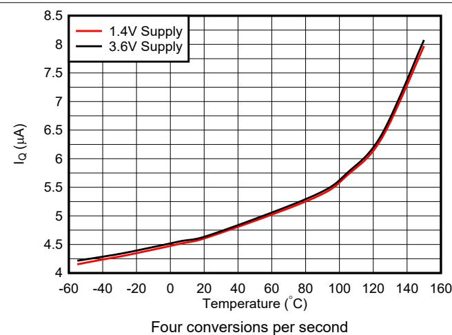  
Figure 5-1. Average Quiescent Current vs Temperature

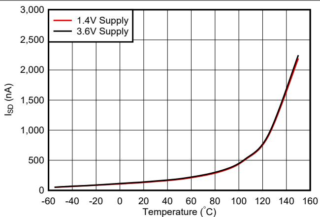  
Figure 5-2. Shutdown Current vs Temperature

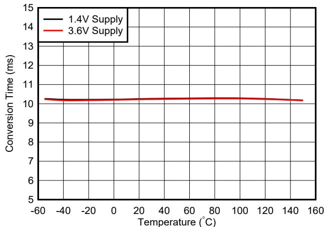  
Figure 5-3. Conversion Time vs Temperature

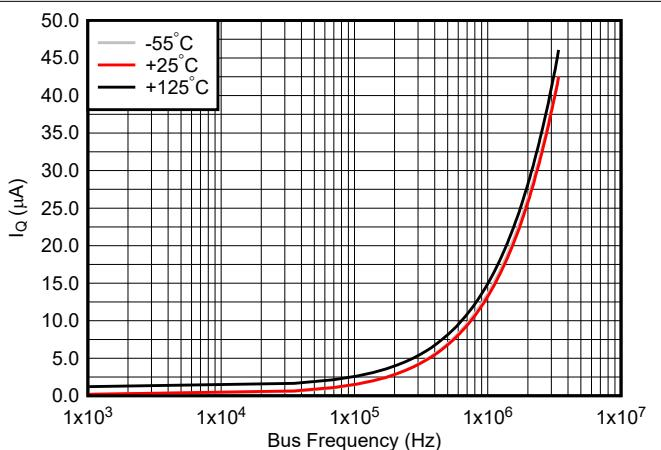  
Figure 5-4. Quiescent Current vs Bus Frequency (Temperature at 3.3-V Supply)

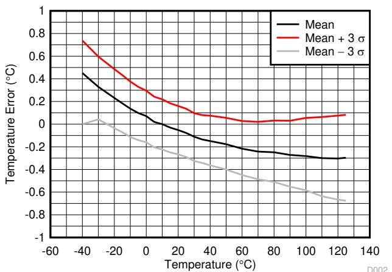  
Figure 5-5. Temperature Error vs Temperature

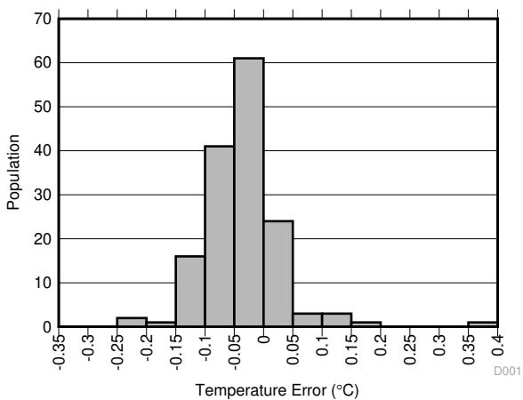  
Figure 5-6. Temperature Error at $\yen 50$

# 6 Detailed Description

# 6.1 Overview

The TMP102 device is a digital temperature sensor that is designed for thermal-management and thermalprotection applications. The TMP102 device is two-wire, SMBus and $\mathsf { I 2 C }$ interface-compatible. The device is specified over an operating temperature range of $\scriptscriptstyle - 4 0 ^ { \circ } \mathsf { C }$ to $12 5 ^ { \circ } \mathrm { C }$ . See Functional Block Diagram for a block diagram of the TMP102 device.

The TMP102 device is a temperature sensor. Thermal paths run through the package leads as well as the plastic package. The package leads provide the primary thermal path because of the lower thermal resistance of the metal.

An alternative version of the TMP102 device is available. The TMP112 device has highest accuracy, the same micro-package, and is pin-to-pin compatible.

Table 6-1. Advantages of TMP112 versus TMP102   

<table><tr><td rowspan=1 colspan=1>DEVICE</td><td rowspan=1 colspan=1>COMPATIBLEINTERFACES</td><td rowspan=1 colspan=1>PACKAGE</td><td rowspan=1 colspan=1> SUPPLYCURRENT</td><td rowspan=1 colspan=1> SUPPLY VOLTAGE(MIN)</td><td rowspan=1 colspan=1> SUPPLY VOLTAGE(MAX)</td><td rowspan=1 colspan=1>RESOLUTION</td><td rowspan=1 colspan=1>LOCAL SENSOR ACCURACY(MAX)</td><td rowspan=1 colspan=1> SPECIFIEDCALIBRATION DRIFT SLOPE</td></tr><tr><td rowspan=1 colspan=1>TMP112</td><td rowspan=1 colspan=1>²CSMBus</td><td rowspan=1 colspan=1>SOT5631.2 × 1.6× 0.6</td><td rowspan=1 colspan=1>7.5uA</td><td rowspan=1 colspan=1>1.4V</td><td rowspan=1 colspan=1>3.6V</td><td rowspan=1 colspan=1>12 bit0.0625°C</td><td rowspan=1 colspan=1>0.5C:(0°C to 65C)1°C:(-40°Cto 125C)</td><td rowspan=1 colspan=1>Yes</td></tr><tr><td rowspan=1 colspan=1>TMP102</td><td rowspan=1 colspan=1>2CSMBus</td><td rowspan=1 colspan=1>SOT5631.2 × 1.6×0.6</td><td rowspan=1 colspan=1>7.5uA</td><td rowspan=1 colspan=1>1.4V</td><td rowspan=1 colspan=1>3.6V</td><td rowspan=1 colspan=1>12 bit0.0625C</td><td rowspan=1 colspan=1>2°C:(25C to 85C)3°C:(-40°C to 125C)</td><td rowspan=1 colspan=1>No</td></tr></table>

# 6.2 Functional Block Diagram

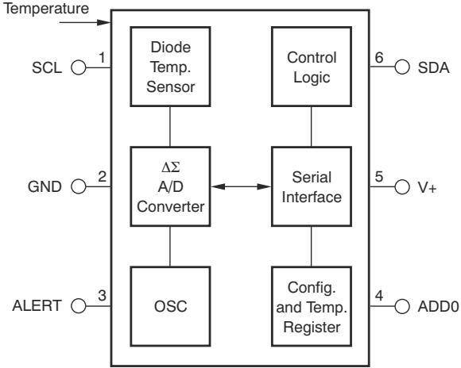

# 6.3 Feature Description

# 6.3.1 Digital Temperature Output

The digital output from each temperature measurement is stored in the read-only temperature register. The temperature register of the TMP102 device is configured as a 12-bit, read-only register (configuration register EM bit $\mathbf { \mu } = \mathbf { \sigma } _ { 0 }$ , see the Extended Mode (EM) section), or as a 13-bit, read-only register (configuration register EM bit $= ~ 1$ ) that stores the output of the most recent conversion. Two bytes must be read to obtain data and are listed in Table 6-8 and Table 6-9. Byte 1 is the most significant byte (MSB), followed by byte 2, the least significant byte (LSB). The first 12 bits (13 bits in extended mode) are used to indicate temperature. The least significant byte does not have to be read if that information is not needed. The data format for temperature is summarized in Table 6-2 and Table 6-3. One LSB equals $0 . 0 6 2 5 ^ { \circ } \mathrm { C }$ . Negative numbers are represented in binary twos-complement format. Following power-up or reset, the temperature register reads $0 ^ { \circ } \mathsf { C }$ until the first conversion is complete. Bit D0 of byte 2 indicates normal mode (EM bit $= 0$ ) or extended mode $( \mathsf { E M } \mathsf { b i t } = 1 )$ ) , and can be used to distinguish between the two temperature register data formats. The unused bits in the temperature register always read 0.

Table 6-2. 12-Bit Temperature Data Format(1)   

<table><tr><td rowspan=1 colspan=1>TEMPERATURE (°C)</td><td rowspan=1 colspan=1>DIGITAL OUTPUT (BINARY)</td><td rowspan=1 colspan=1>HEX</td></tr><tr><td rowspan=1 colspan=1>128</td><td rowspan=1 colspan=1>0111 1111 1111</td><td rowspan=1 colspan=1>7FF</td></tr><tr><td rowspan=1 colspan=1>127.9375</td><td rowspan=1 colspan=1>0111 1111 1111</td><td rowspan=1 colspan=1>7FF</td></tr><tr><td rowspan=1 colspan=1>100</td><td rowspan=1 colspan=1>0110 0100 0000</td><td rowspan=1 colspan=1>640</td></tr><tr><td rowspan=1 colspan=1>80</td><td rowspan=1 colspan=1>010100000000</td><td rowspan=1 colspan=1>500</td></tr><tr><td rowspan=1 colspan=1>75</td><td rowspan=1 colspan=1>0100 1011 0000</td><td rowspan=1 colspan=1>4B0</td></tr><tr><td rowspan=1 colspan=1>50</td><td rowspan=1 colspan=1>0011 0010 0000</td><td rowspan=1 colspan=1>320</td></tr><tr><td rowspan=1 colspan=1>25</td><td rowspan=1 colspan=1>0001 10010000</td><td rowspan=1 colspan=1>190</td></tr><tr><td rowspan=1 colspan=1>0.25</td><td rowspan=1 colspan=1>000000000100</td><td rowspan=1 colspan=1>004</td></tr><tr><td rowspan=1 colspan=1>0</td><td rowspan=1 colspan=1>00000000OOO0</td><td rowspan=1 colspan=1>000</td></tr><tr><td rowspan=1 colspan=1>-0.25</td><td rowspan=1 colspan=1>1111 111 1100</td><td rowspan=1 colspan=1>FFC</td></tr><tr><td rowspan=1 colspan=1>-25</td><td rowspan=1 colspan=1>1110 0111 0000</td><td rowspan=1 colspan=1>E70</td></tr><tr><td rowspan=1 colspan=1>-55</td><td rowspan=1 colspan=1>1100 10010000</td><td rowspan=1 colspan=1>C90</td></tr></table>

(1) The resolution for the Temp ADC in Internal Temperature mode is $0 . 0 6 2 5 ^ { \circ }$ C/count.

Table 6-2 does not list all temperatures. Use the following rules to obtain the digital data format for a given temperature or the temperature for a given digital data format.

To convert positive temperatures to a digital data format:   
1. Divide the temperature by the resolution   
2. Convert the result to binary code with a 12-bit, left-justified format, and ${ \mathsf { M S B } } = 0$ to denote a positive sign.

To convert a positive digital data format to temperature:

1. Convert the 12-bit, left-justified binary temperature result, with the ${ \mathsf { M S B } } = 0$ to denote a positive sign, to a decimal number. 2. Multiply the decimal number by the resolution to obtain the positive temperature.

$$
0 0 1 1 0 0 1 0 0 0 0 0 = 3 2 0 \mathsf { h } = 8 0 0 \times ( 0 . 0 6 2 5 ^ { \circ } \mathsf { C } / \mathsf { L S B } ) = 5 0 ^ { \circ } \mathsf { C }
$$

To convert negative temperatures to a digital data format:

1. Divide the absolute value of the temperature by the resolution, and convert the result to binary code with a 12-bit, left-justified format.   
2. Generate the twos complement of the result by complementing the binary number and adding one. Denote a negative number with $\mathsf { M S B } = 1$ .

Example: $( | - 2 5 ^ { \circ } \mathsf { C } | ) / ( 0 . 0 6 2 5 ^ { \circ } \mathsf { C } / \mathsf { L S B } ) = 4 0 0 = 1 9 0 \mathsf { h } = 0 0 0 1 \ 1 0 0 1 \ 0 0 0 0$

Two's complement form $1 1 1 0 0 1 1 0 1 1 1 1 + 1 = 1 1 1 0 0 1 1 1 0 0 0 0$

To convert a negative digital data format to temperature:

1. Generate the twos compliment of the 12-bit, left-justified binary number of the temperature result (with $\mathsf { M S B } = 1$ , denoting negative temperature result) by complementing the binary number and adding one. This represents the binary number of the absolute value of the temperature.

2. Convert to decimal number and multiply by the resolution to get the absolute temperature, then multiply by $- 1$ for the negative sign.

Example: 1110 0111 0000 has twos compliment of $0 0 0 1 \ 1 0 0 1 \ 0 0 0 0 = 0 0 0 1 \ 1 0 0 0 \ 1 1 1 1 + 1$

Convert to temperature: 0001 1001 $0 0 0 0 = 1 9 0 \mathsf { h } = 4 0 0$ ; $4 0 0 \times ( 0 . 0 6 2 5 ^ { \circ } \mathsf { C } / \mathsf { L S B } ) = 2 5 ^ { \circ } \mathsf { C } = ( | - 2 5 ^ { \circ } \mathsf { C } | ) ;$ ; (|– $2 5 ^ { \circ } \mathsf { C } | ) \times ( - 1 ) = - 2 5 ^ { \circ } \mathsf { C }$

Table 6-3. 13-Bit Temperature Data Format   

<table><tr><td rowspan=1 colspan=1>TEMPERATURE (C)</td><td rowspan=1 colspan=1>DIGITAL OUTPUT (BINARY)</td><td rowspan=1 colspan=1> HEX</td></tr><tr><td rowspan=1 colspan=1>150</td><td rowspan=1 colspan=1>0 1001 0110 0000</td><td rowspan=1 colspan=1>0960</td></tr></table>

Table 6-3. 13-Bit Temperature Data Format (continued)   

<table><tr><td rowspan=1 colspan=1>TEMPERATURE (C)</td><td rowspan=1 colspan=1>DIGITAL OUTPUT (BINARY)</td><td rowspan=1 colspan=1>HEX</td></tr><tr><td rowspan=1 colspan=1>128</td><td rowspan=1 colspan=1>0 100000000000</td><td rowspan=1 colspan=1>0800</td></tr><tr><td rowspan=1 colspan=1>127.9375</td><td rowspan=1 colspan=1>0 0111 1111 1111</td><td rowspan=1 colspan=1>07FF</td></tr><tr><td rowspan=1 colspan=1>100</td><td rowspan=1 colspan=1>00110 0100 0000</td><td rowspan=1 colspan=1>0640</td></tr><tr><td rowspan=1 colspan=1>80</td><td rowspan=1 colspan=1>0010100000000</td><td rowspan=1 colspan=1>0500</td></tr><tr><td rowspan=1 colspan=1>75</td><td rowspan=1 colspan=1>00100 10110000</td><td rowspan=1 colspan=1>04B0</td></tr><tr><td rowspan=1 colspan=1>50</td><td rowspan=1 colspan=1>0001100100000</td><td rowspan=1 colspan=1>0320</td></tr><tr><td rowspan=1 colspan=1>25</td><td rowspan=1 colspan=1>0000110010000</td><td rowspan=1 colspan=1>0190</td></tr><tr><td rowspan=1 colspan=1>0.25</td><td rowspan=1 colspan=1>0000000000100</td><td rowspan=1 colspan=1>0004</td></tr><tr><td rowspan=1 colspan=1>0</td><td rowspan=1 colspan=1>000000OOOOOOO</td><td rowspan=1 colspan=1>0000</td></tr><tr><td rowspan=1 colspan=1>-0.25</td><td rowspan=1 colspan=1>1 1111 1111 1100</td><td rowspan=1 colspan=1>1FFC</td></tr><tr><td rowspan=1 colspan=1>-25</td><td rowspan=1 colspan=1>1 1110 0111 0000</td><td rowspan=1 colspan=1>1E70</td></tr><tr><td rowspan=1 colspan=1>-55</td><td rowspan=1 colspan=1>11100 10010000</td><td rowspan=1 colspan=1>1C90</td></tr></table>

# 6.3.2 Serial Interface

The TMP102 device operates as a target device only on the two-wire bus and SMBus. Connections to the bus are made through the open-drain I/O lines, SDA and SCL. The SDA and SCL pins feature integrated spike suppression filters and Schmitt triggers to minimize the effects of input spikes and bus noise. The TMP102 device supports the transmission protocol for both fast (1 kHz to $4 0 0 ~ \mathsf { k H z }$ ) and high-speed (1 kHz to 2.85 MHz) modes. All data bytes are transmitted MSB first.

# 6.3.3 Bus Overview

The device that initiates the transfer is called a controller, and the devices controlled by the controller are called targets. The bus must be controlled by a controller device that generates the serial clock (SCL), controls the bus access, and generates the START and STOP conditions.

To address a specific device, a START condition is initiated, indicated by pulling the data-line (SDA) from a high to low logic level when SCL is high. All targets on the bus shift in the target address byte on the rising edge of the clock, with the last bit indicating whether a read or write operation is intended. During the ninth clock pulse, the target being addressed responds to the controller by generating an acknowledge and by pulling SDA pin low.

A data transfer is then initiated and sent over eight clock pulses followed by an acknowledge bit. During the data transfer the SDA pin must remain stable when SCL is high, because any change in SDA pin when SCL pin is high is interpreted as a START signal or STOP signal.

When all data have been transferred, the controller generates a STOP condition indicated by pulling SDA pin from low to high, when the SCL pin is high.

# 6.3.4 Serial Bus Address

To communicate with the TMP102, the controller must first address target devices via a target address byte. The target address byte consists of seven address bits, and a direction bit indicating the intent of executing a read or write operation.

The TMP102 features an address pin to allow up to four devices to be addressed on a single bus. Table 6-4 describes the pin logic levels used to properly connect up to four devices.

Table 6-4. Address Pin and Target Addresses   

<table><tr><td rowspan=1 colspan=1>DEVICE TWO-WIRE ADDRESS</td><td rowspan=1 colspan=1>A0 PIN CONNECTION</td></tr><tr><td rowspan=1 colspan=1>1001000</td><td rowspan=1 colspan=1>Ground</td></tr><tr><td rowspan=1 colspan=1>1001001</td><td rowspan=1 colspan=1>V+</td></tr><tr><td rowspan=1 colspan=1>1001010</td><td rowspan=1 colspan=1>SDA</td></tr><tr><td rowspan=1 colspan=1>1001011</td><td rowspan=1 colspan=1>SCL</td></tr></table>

# 6.3.5 Writing and Reading Operation

Accessing a particular register on the TMP102 device is accomplished by writing the appropriate value to the pointer register. The value for the pointer register is the first byte transferred after the target address byte with the $\mathsf { R } / \overline { { \mathsf { W } } }$ bit low. Every write operation to the TMP102 device requires a value for the pointer register (see Figure 6-2).

When reading from the TMP102 device, the last value stored in the pointer register by a write operation determines which register is read by a read operation. To change the register pointer for a read operation, a new value must be written to the pointer register. This action is accomplished by issuing a target address byte with the $\mathsf { R } \bar { \mathsf { W } }$ bit low, followed by the pointer register byte. No additional data are required. The controller then generates a START condition and sends the target address byte with the $\mathsf { R } \bar { \mathsf { W } }$ bit high to initiate the read command. See Figure 6-1 for details of this sequence. If repeated reads from the same register are desired, continually sending the Pointer Register bytes is not necessary because the TMP102 remembers the Pointer Register value until the device is changed by the next write operation.

Register bytes are sent with the most significant byte first, followed by the least significant byte.

# 6.3.6 Target Mode Operations

The TMP102 can operate as a target receiver or target transmitter. As a target device, the TMP102 never drives the SCL line.

# 6.3.6.1 Target Receiver Mode

The first byte transmitted by the controller is the target address, with the $\mathsf { R } \bar { \mathsf { W } }$ bit low. The TMP102 then acknowledges reception of a valid address. The next byte transmitted by the controller is the pointer register. The TMP102 then acknowledges reception of the pointer register byte. The next byte or bytes are written to the register addressed by the pointer register. The TMP102 acknowledges reception of each data byte. The controller can terminate data transfer by generating a START or STOP condition..

# 6.3.6.2 Target Transmitter Mode

The first byte transmitted by the controller is the target address, with the $\mathsf { R } / \mathsf { W }$ bit high. The target acknowledges reception of a valid target address. The next byte is transmitted by the target and is the most significant byte of the register indicated by the pointer register. The controller acknowledges reception of the data byte. The next byte transmitted by the target is the least significant byte. The controller acknowledges reception of the data byte. The controller terminates data transfer by generating a Not-Acknowledge on reception of any data byte, or generating a START or STOP condition.

# 6.3.7 SMBus Alert Function

The TMP102 device supports the SMBus alert function. When the TMP102 device operates in Interrupt Mode $( \mathsf { T M } = \mathsf { 1 } )$ , the ALERT pin can be connected as an SMBus alert signal. When a controller senses that an ALERT condition is present on the ALERT line, the controller sends an SMBus alert command (0001 1001) to the bus. If the ALERT pin is active, the device acknowledges the SMBus alert command and responds by returning the target address on the SDA line. The eighth bit (LSB) of the target address byte indicates if the ALERT condition was caused by the temperature exceeding ${ \sf T } _ { \sf H I G H }$ or falling below TLOW. For ${ \sf P O L } = 0$ , the LSB is low if the temperature is greater than or equal to ${ \mathsf { T } } _ { \mathsf { H I G H } }$ ; this bit is high if the temperature is less than ${ \mathsf { T } } _ { \mathsf { L O W } }$ . The polarity of this bit is inverted if $\mathsf { P O L } = 1$ . See Figure 6-4 for details of this sequence.

If multiple devices on the bus respond to the SMBus alert command, arbitration during the target address portion of the SMBus alert command determines which device clears the ALERT status. The device with the lowest two-wire address wins the arbitration. If the TMP102 device wins the arbitration, the ALERT pin inactivates at the completion of the SMBus alert command. If the TMP102 device loses the arbitration, the ALERT pin remains active.

# 6.3.8 General Call

The TMP102 device responds to a two-wire general call address (000 0000) if the eighth bit is 0. The device acknowledges the general call address and responds to commands in the second byte. If the second byte is 0000 0110, the TMP102 device internal registers are reset to power-up values. The TMP102 device does not support the general address acquire command.

# 6.3.9 High-Speed (HS) Mode

For the two-wire bus to operate at frequencies above $4 0 0 ~ \mathsf { k H z }$ , the controller device must issue an HS-Mode controller code (0000 1xxx) as the first byte after a START condition to switch the bus to high-speed operation. The TMP102 device does not acknowledge this byte, but switches the input filters on SDA and SCL and the output filters on SDA to operate in HS-mode, allowing transfers of up to $2 . 8 5 ~ \mathsf { M H z }$ . After sending the HS-Mode controller code and NACK bit, user must send a repeated start before sending the target address. The bus continues to operate in HS-Mode until a STOP condition occurs on the bus. Upon receiving the STOP condition, the TMP102 device switches the input and output filters back to fast-mode operation.

# 6.3.10 Timeout Function

The TMP102 device resets the serial interface if SCL is held low for $3 0 ~ \mathsf { m } \mathsf { s }$ (typ) between a start and stop condition. The TMP102 device releases the SDA line if the SCL pin is pulled low and waits for a start condition from the host controller. To avoid activating the time-out function, maintaining a communication speed of at least 1 kHz for SCL operating frequency is necessary..

# 6.3.11 Timing Diagrams

The TMP102 device is two-wire, SMBus, and ${ \mathsf { I } } ^ { 2 } { \mathsf { C } } .$ -interface compatible. Figure 6-1, Figure 6-2, Figure 6-3, and Figure 6-4 list the various operations on the TMP102 device. Parameters for Figure 6-1 are defined in the Timing Requirements table. The bus definitions are defined as follows:

# Acknowledge

Each receiving device, when addressed, is obliged to generate an acknowledge bit. A device that acknowledges must pull down the SDA line during the acknowledge clock pulse in such a way that the SDA line is stable low during the high period of the Acknowledge clock pulse. Setup and hold times must be taken into account. On a controller receive, the termination of the data transfer can be signaled by the controller generating a notacknowledge (1) on the last byte that has been transmitted by the target.

# Bus Idle Data Transfer

Both SDA and SCL lines remain high.

The number of data bytes transferred between a START and a STOP condition is not limited and is determined by the controller device. The TMP102 device can also be used for single byte updates. To update only the MS byte, terminate the communication by issuing a START or STOP communication on the bus.

Start Data Transfer Stop Data Transfer

A change in the state of the SDA line, from high to low, when the SCL line is high, defines a START condition. Each data transfer is initiated with a START condition.

A change in the state of the SDA line from low to high when the SCL line is high defines a STOP condition. Each data transfer is terminated with a repeated START or STOP condition.

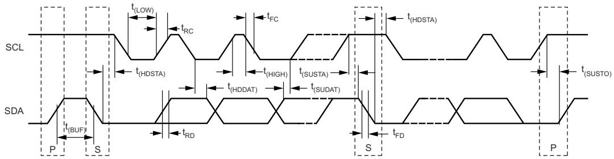  
Figure 6-1. Two-Wire Timing Diagram

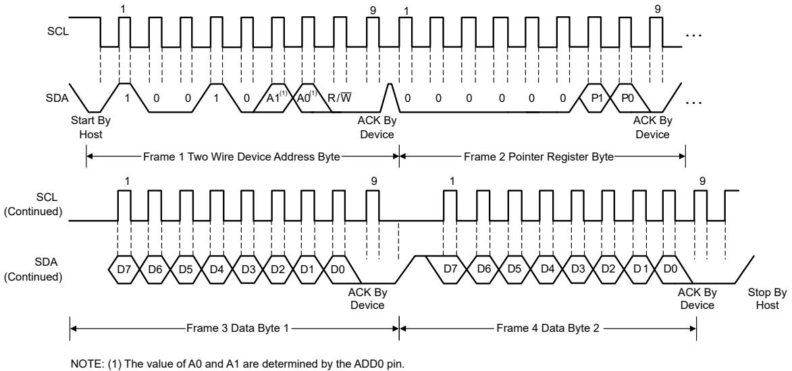  
Figure 6-2. Two-Wire Timing Diagram for Write Word Format

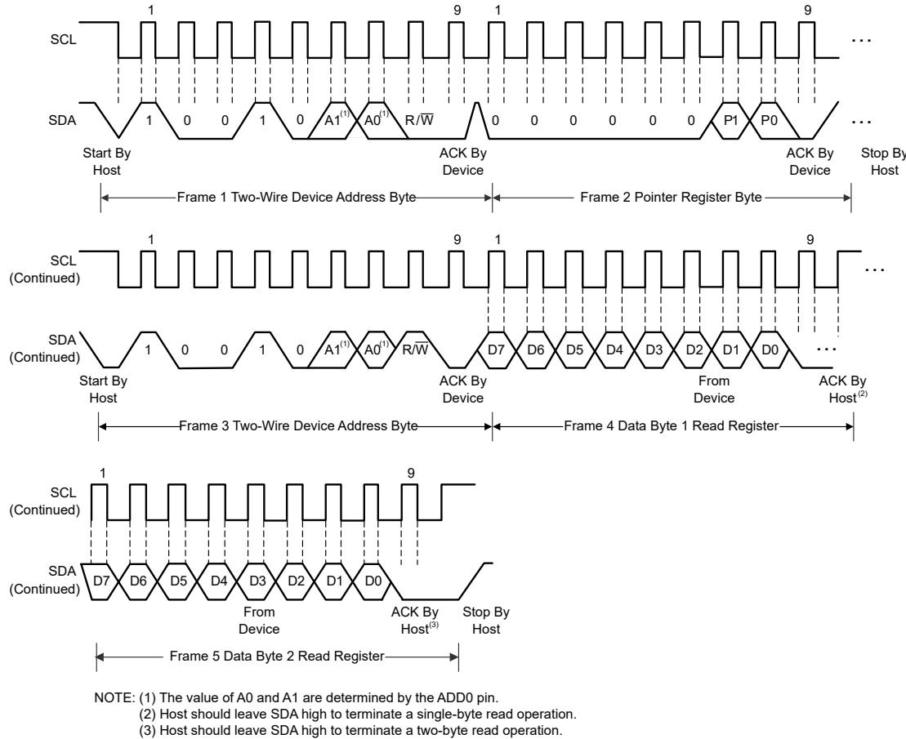  
Figure 6-3. Two-Wire Timing Diagram for Read Word Format

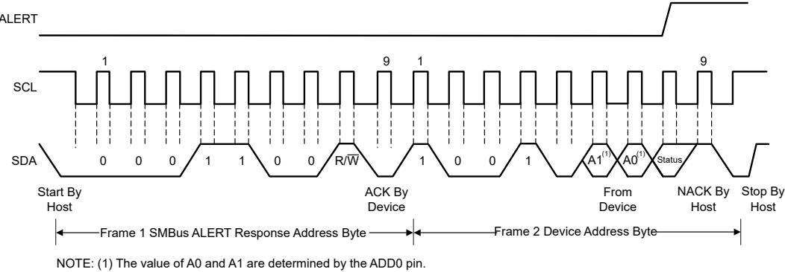  
Figure 6-4. Timing Diagram for SMBus Alert

# 6.4 Device Functional Modes

# 6.4.1 Continuous-Conversion Mode

The default mode of the TMP102 device is continuous conversion mode. During continuous-conversion mode, the ADC performs continuous temperature conversions and stores each results to the temperature register, overwriting the result from the previous conversion. The conversion rate bits, CR1 and CR0, configure the TMP102 device for conversion rates of $0 . 2 5 ~ \mathsf { H z }$ , 1 Hz, $4 \ H z$ , or $8 H z$ . The default rate is $4 \ H z$ . The TMP102 device has a typical conversion time of $1 0 \mathrm { ~ m s ~ }$ . To achieve different conversion rates, the TMP102 device makes a conversion and then powers down to wait for the appropriate delay set by CR1 and CR0. Table 6-5 lists the settings for CR1 and CR0.

Table 6-5. Conversion Rate Settings   

<table><tr><td rowspan=1 colspan=1>CR1</td><td rowspan=1 colspan=1>CRO</td><td rowspan=1 colspan=1>CONVERSION RATE</td></tr><tr><td rowspan=1 colspan=1>0</td><td rowspan=1 colspan=1>0</td><td rowspan=1 colspan=1>0.25 Hz</td></tr><tr><td rowspan=1 colspan=1>0</td><td rowspan=1 colspan=1>1</td><td rowspan=1 colspan=1>1Hz</td></tr><tr><td rowspan=1 colspan=1>1</td><td rowspan=1 colspan=1>0</td><td rowspan=1 colspan=1>4 Hz (default)</td></tr><tr><td rowspan=1 colspan=1>1</td><td rowspan=1 colspan=1>1</td><td rowspan=1 colspan=1>8 Hz</td></tr></table>

After power-up or general-call reset, the TMP102 immediately starts a conversion, as shown in Figure 6-5. The first result is available after $1 0 \mathrm { ~ m s ~ }$ (typical). The active quiescent current during conversion is $5 5 ~ \mu \mathsf { A }$ (typical at $+ 2 7 ^ { \circ } \mathsf { C } )$ . The quiescent current during delay is $2 . 6 \mu \mathsf { A }$ (typical at $+ 2 7 ^ { \circ } \mathsf { C }$ ).

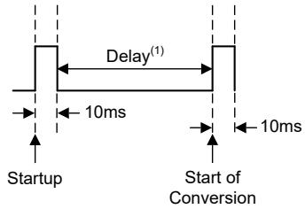  
Figure 6-5. Conversion Start

A. Delay is set by CR1 and CR0.

# 6.4.2 Extended Mode (EM)

The Extended-Mode bit configures the device for Normal mode operation $( \mathsf { E M } = 0$ ) or Extended mode operation $( \mathsf { E M } = 1 \mathrm { \Omega }$ ). In Normal mode, the Temperature Register and high- and low-limit registers use a 12-bit data format. Normal mode is used to make the TMP102 device compatible with the TMP75 device.

Extended mode $( \mathsf { E M } = \mathsf { 1 }$ ) allows measurement of temperatures above $12 8 ^ { \circ } \mathsf { C }$ by configuring the Temperature Register, and high- and low-limit registers for 13-bit data format.

# 6.4.3 Shutdown Mode (SD)

The Shutdown-mode bit saves maximum power by shutting down all device circuitry other than the serial interface, reducing current consumption to typically less than $0 . 1 5 \mu \mathsf { A }$ . Shutdown mode enables when the SD bit is 1; the device shuts down when current conversion is completed. When SD is equal to 0, the device maintains a continuous conversion state.

# 6.4.4 One-Shot/Conversion Ready (OS)

The TMP102 device features a one-shot temperature measurement mode. When the device is in Shutdown Mode, writing a 1 to the OS bit starts a single temperature conversion. During the conversion, the OS bit reads $\ " { } \mathrm { ~ 0 ~ } \mathrm { ~ }$ . The device returns to the shutdown state at the completion of the single conversion. After the conversion, the OS bit reads 1. This feature reduces power consumption in the TMP102 device when continuous temperature monitoring is not required.

As a result of the short conversion time, the TMP102 device achieves a higher conversion rate. A single conversion typically takes $1 0 \mathrm { ~ m s ~ }$ and a read can take place in less than 20 μs. When using One-Shot Mode, 80 or more conversions per second are possible.

# 6.4.5 Thermostat Mode (TM)

The thermostat-mode bit indicates to the device whether to operate in comparator mode $\langle \mathsf { T M } = 0 \rangle$ or Interrupt mode $( \mathsf { T M } = 1$ ).

# 6.4.5.1 Comparator Mode $( \mathsf { T M } = \mathsf { 0 } )$

In Comparator mode $( \mathsf { T M } = 0 )$ ), the Alert pin is activated when the temperature equals or exceeds the value in the T(HIGH) register and remains active until the temperature falls below the value in the T(LOW) register. For more information on the comparator mode, see the High- and Low-Limit Registers.

# 6.4.5.2 Interrupt Mode $( \mathsf { T M } = 1 )$

In Interrupt mode $\left( \mathsf { T M } = \mathsf { 1 } \right) .$ ), the Alert pin is activated with the conditions described in High- and Low-Limit Registers. The Alert pin is cleared when the host controller reads the temperature register. For more information on the interrupt mode, see the High- and Low-Limit Registers.

# 6.5 Programming

# 6.5.1 Pointer Register

Figure 6-6 illustrates the internal register structure of the TMP102 device. The 8-bit Pointer Register of the device is used to address a given data register. The Pointer Register uses the two least-significant bytes (LSBs) (see Table 6-15 and Table 6-16) to identify which of the data registers must respond to a read or write command. Table 6-6 identifies the bits of the Pointer Register byte. During a write command, P2 through P7 must always be '0'. Table 6-7 describes the pointer address of the registers available in the TMP102 device. The power-up reset value of P1 and P0 is 00. By default, the TMP102 device reads the temperature on power up.

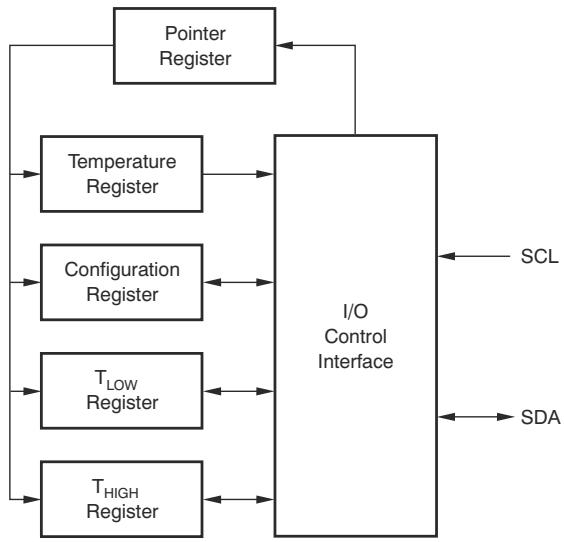  
Figure 6-6. Internal Register Structure

# Table 6-6. Pointer Register Byte

<table><tr><td rowspan=1 colspan=1>P7</td><td rowspan=1 colspan=1>P6</td><td rowspan=1 colspan=1>P5</td><td rowspan=1 colspan=1>P4</td><td rowspan=1 colspan=1>P3</td><td rowspan=1 colspan=1>P2</td><td rowspan=1 colspan=1>P1</td><td rowspan=1 colspan=1>P0</td></tr><tr><td rowspan=1 colspan=1>0</td><td rowspan=1 colspan=1>0</td><td rowspan=1 colspan=1>0</td><td rowspan=1 colspan=1>0</td><td rowspan=1 colspan=1>0</td><td rowspan=1 colspan=1>0</td><td rowspan=1 colspan=2>Register Bits</td></tr></table>

Table 6-7. Pointer Addresses   

<table><tr><td rowspan=1 colspan=1>P1</td><td rowspan=1 colspan=1>P0</td><td rowspan=1 colspan=1> REGISTER</td></tr><tr><td rowspan=1 colspan=1>0</td><td rowspan=1 colspan=1>0</td><td rowspan=1 colspan=1>Temperature Register (Read Only)</td></tr><tr><td rowspan=1 colspan=1>0</td><td rowspan=1 colspan=1>1</td><td rowspan=1 colspan=1>Configuration Register (Read/Write)</td></tr><tr><td rowspan=1 colspan=1>1</td><td rowspan=1 colspan=1>0</td><td rowspan=1 colspan=1>TLow Register (Read/Write)</td></tr><tr><td rowspan=1 colspan=1>1</td><td rowspan=1 colspan=1>1</td><td rowspan=1 colspan=1>THIGH Register (Read/Write)</td></tr></table>

# 6.5.2 Temperature Register

The Temperature Register of the TMP102 is configured as a 12-bit, read-only register (Configuration Register EM bit $= 0$ , see the Extended Mode section), or as a 13-bit, read-only register (Configuration Register EM bit $= 1$ ) that stores the output of the most recent conversion. Two bytes must be read to obtain data, and are described in Table 6-8 and Table 6-9. Note that byte 1 is the most significant byte, followed by byte 2, the least significant byte. The first 12 bits (13 bits in Extended mode) are used to indicate temperature. The least significant byte does not have to be read if that information is not needed.

Table 6-8. Byte 1 of Temperature Register(1)   

<table><tr><td>D7</td><td>D6</td><td>D5</td><td>D4</td><td>D3</td><td>D2</td><td>D1</td><td>DO</td></tr><tr><td>T11</td><td>T10</td><td>T9</td><td>T8</td><td>T7</td><td>T6</td><td>T5</td><td>T4</td></tr><tr><td>(T12)</td><td>(T11)</td><td>(T10)</td><td>(T9)</td><td>(T8)</td><td>(T7)</td><td>(T6)</td><td>(T5)</td></tr></table>

(1) Extended mode 13-bit configuration shown in parenthesis.

Table 6-9. Byte 2 of Temperature Register(1)   

<table><tr><td>D7</td><td>D6</td><td>D5</td><td>D4</td><td>D3</td><td>D2</td><td>D1</td><td>D0</td></tr><tr><td>T3</td><td>T2</td><td>T1</td><td>TO</td><td>0</td><td>0</td><td>0</td><td>0</td></tr><tr><td>(T4)</td><td>(T3)</td><td>(T2)</td><td>(T1)</td><td>(TO)</td><td>（0）</td><td>（0）</td><td>(1)</td></tr></table>

(1) Extended mode 13-bit configuration shown in parenthesis.

# 6.5.3 Configuration Register

The Configuration Register is a 16-bit read/write register used to store bits that control the operational modes of the temperature sensor. Read/write operations are performed MSB first. Table 6-10 and Table 6-11 list the format and the power-up or reset value of the configuration register. For compatibility, Table 6-10 and Table 6-11 correspond to the configuration register in the TMP75 device and TMP275 device (for more information see the device data sheets, SBOS288 and SBOS363, respectively). All registers are updated byte by byte.

Table 6-10. Byte 1 of Configuration and Power-Up or Reset Format   

<table><tr><td rowspan=1 colspan=1>D7</td><td rowspan=1 colspan=1>D6</td><td rowspan=1 colspan=1>D5</td><td rowspan=1 colspan=1>D4</td><td rowspan=1 colspan=1>D3</td><td rowspan=1 colspan=1>D2</td><td rowspan=1 colspan=1>D1</td><td rowspan=1 colspan=1>D0</td></tr><tr><td rowspan=2 colspan=1>OS0</td><td rowspan=2 colspan=1>R11</td><td rowspan=1 colspan=1>R0</td><td rowspan=1 colspan=1>F1</td><td rowspan=1 colspan=1>F0</td><td rowspan=1 colspan=1>POL</td><td rowspan=2 colspan=1>TM0</td><td rowspan=2 colspan=1>SD0</td></tr><tr><td rowspan=1 colspan=1>1</td><td rowspan=1 colspan=1>0</td><td rowspan=1 colspan=1>0</td><td rowspan=1 colspan=1>0</td></tr></table>

Table 6-11. Byte 2 of Configuration and Power-Up or Reset Format   

<table><tr><td>D7</td><td>D6</td><td>D5</td><td>D4</td><td>D3</td><td>D2</td><td>D1</td><td>D0</td></tr><tr><td>CR1</td><td>CRO</td><td>AL</td><td>EM</td><td>0</td><td>0</td><td>0</td><td>0</td></tr><tr><td>1</td><td>0</td><td>1</td><td>0</td><td>0</td><td>0</td><td>0</td><td>0</td></tr></table>

# 6.5.3.1 Shutdown Mode (SD)

The Shutdown-mode bit saves maximum power by shutting down all device circuitry other than the serial interface, reducing current consumption to typically less than $0 . 5 \mu \mathsf { A }$ . Shutdown mode enables when the SD bit is 1; the device shuts down when current conversion is completed. When SD is equal to 0, the device maintains a continuous conversion state

# 6.5.3.2 Thermostat Mode (TM)

The Thermostat mode bit indicates to the device whether to operate in Comparator mode $\langle \mathsf { T M } = 0 \rangle$ ) or Interrupt mode $( \mathsf { T M } = \mathsf { 1 } )$ ). For more information on comparator and interrupt modes, see the High- and Low-Limit Registers section.

# 6.5.3.3 Polarity (POL)

The polarity bit allows the user to adjust the polarity of the ALERT pin output. If the POL bit is set to 0 (default), the ALERT pin becomes active low. When the POL bit is set to 1, the ALERT pin becomes active high and the state of the ALERT pin is inverted. The operation of the ALERT pin in various modes is illustrated in Figure 6-7.

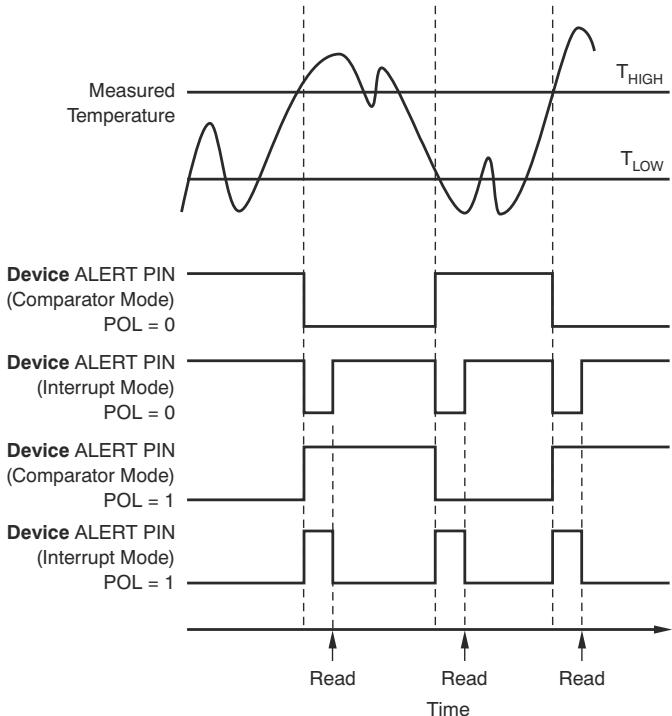  
Figure 6-7. Output Transfer Function Diagrams

# 6.5.3.4 Fault Queue (F1/F0)

A fault condition exists when the measured temperature exceeds the user-defined limits set in the ${ \mathsf { T } } _ { \mathsf { H I G H } }$ and TLOW registers. Additionally, the number of fault conditions required to generate an alert can be programmed using the fault queue. The fault queue is provided to prevent a false alert as a result of environmental noise. The fault queue requires consecutive fault measurements to trigger the alert function. Table 6-12 defines the number of measured faults that can be programmed to trigger an alert condition in the device. For ${ \mathsf { T } } _ { \mathsf { H I G H } }$ and ${ \mathsf { T } } _ { \mathsf { L O W } }$ register format and byte order, see the High- and Low-Limit Registers section.

Table 6-12. TMP102 Fault Settings   

<table><tr><td rowspan=1 colspan=1>F1</td><td rowspan=1 colspan=1>F0</td><td rowspan=1 colspan=1>CONSECUTIVE FAULTS</td></tr><tr><td rowspan=1 colspan=1>0</td><td rowspan=1 colspan=1>0</td><td rowspan=1 colspan=1>1</td></tr><tr><td rowspan=1 colspan=1>0</td><td rowspan=1 colspan=1>1</td><td rowspan=1 colspan=1>2</td></tr><tr><td rowspan=1 colspan=1>1</td><td rowspan=1 colspan=1>0</td><td rowspan=1 colspan=1>4</td></tr><tr><td rowspan=1 colspan=1>1</td><td rowspan=1 colspan=1>1</td><td rowspan=1 colspan=1>6</td></tr></table>

# 6.5.3.5 Converter Resolution (R1/R0)

The converter resolution bits, R1 and R0, are read-only bits. The TMP102 converter resolution is set at device start-up to 11 which sets the temperature register to a 12 bit-resolution.

# 6.5.3.6 One-Shot (OS)

When the device is in Shutdown Mode, writing a 1 to the OS bit starts a single temperature conversion. During the conversion, the OS bit reads $" 0 "$ . The device returns to the shutdown state at the completion of the single conversion. For more information on the one-shot conversion mode, see the One-Shot/Conversion Ready (OS) section.

# 6.5.3.7 EM Bit

The Extended-Mode bit configures the device for Normal Mode operation $( \mathsf { E M } = 0$ ) or Extended Mode operation $( \mathsf { E M } = \mathsf { 1 } _ { . }$ ). In normal mode, the temperature register, high-limit register, and low-limit register use a 12-bit data format. For more information on the extended mode, see the Extended Mode (EM) section.

# 6.5.3.8 Alert (AL Bit)

The AL bit is a read-only function. Reading the AL bit provides information about the comparator mode status. The state of the POL bit inverts the polarity of data returned from the AL bit. When the POL bit equals 0, the AL bit reads as 1 until the temperature equals or exceeds ${ \mathsf { T } } _ { ( \mathsf { H l G H } ) }$ for the programmed number of consecutive faults, causing the AL bit to read as 0. The AL bit continues to read as 0 until the temperature falls below ${ \sf T } _ { ( \sf L O W ) }$ for the programmed number of consecutive faults, when the AL bit again reads as 1. The status of the TM bit does not affect the status of the AL bit.

# 6.5.3.9 Conversion Rate (CR)

The conversion rate bits, CR1 and CR0, configure the TMP102 device for conversion rates of 0.25 Hz, 1 Hz, 4 Hz, or $8 H z$ . The default rate is $4 H z$ . For more information on the conversion rate bits, see Table 6-5.

# 6.5.4 High- and Low-Limit Registers

The temperature limits are stored in the $\mathsf { T } _ { ( \mathsf { L O W } ) }$ and ${ \mathsf { T } } _ { ( \mathsf { H l G H } ) }$ registers in the same format as the temperature result, and the values are compared to the temperature result on every conversion. The outcome of the comparison drives the behavior of the ALERT pin, which operates as a comparator output or an interrupt, and is set by the TM bit in the configuration register.

In Comparator mode $( \mathsf { T M } = 0 )$ ), the ALERT pin becomes active when the temperature equals or exceeds the value in ${ \mathsf { T } } _ { \mathsf { H I G H } }$ and generates a consecutive number of faults according to fault bits F1 and F0. The ALERT pin remains active until the temperature falls below the indicated ${ \mathsf { T } } _ { \mathsf { L O W } }$ value for the same number of faults.

In Interrupt mode $( \mathsf { T M } = \mathsf { 1 }$ ), the ALERT pin becomes active when the temperature equals or exceeds the value in ${ \mathsf { T } } _ { ( \mathsf { H l G H } ) }$ for a consecutive number of fault conditions (as shown in Table 6-5). The ALERT pin remains active until a read operation of any register occurs, or the device successfully responds to the SMBus Alert Response address. The ALERT pin will also be cleared if the device is placed in Shutdown mode. When the ALERT pin is cleared, it becomes active again only when temperature falls below ${ \sf T } _ { ( \sf L O W ) }$ , and remains active until cleared by a read operation of any register or a successful response to the SMBus Alert Response address. When the ALERT pin is cleared, the above cycle repeats, with the ALERT pin becoming active when the temperature equals or exceeds ${ \mathsf { T } } _ { ( \mathsf { H I G H } ) }$ . The ALERT pin can also be cleared by resetting the device with the General Call Reset command. This action also clears the state of the internal registers in the device, returning the device to Comparator mode $( \mathsf { T M } = 0 )$ ).

Both operational modes are represented in Figure 6-7. Table 6-13 through Table 6-16 describe the format for the ${ \sf T } _ { \sf H I G H }$ and ${ \mathsf { T } } _ { \mathsf { L O W } }$ registers. Note that the most significant byte is sent first, followed by the least significant byte. Power-up reset values for ${ \mathsf { T } } _ { \mathsf { H I G H } }$ and ${ \mathsf { T } } _ { \mathsf { L O W } }$ are: $T _ { \mathsf { H I G H } } = 8 0 ^ { \circ } \mathsf { C }$ and $T _ { \mathsf { L O W } } = 7 5 ^ { \circ } \mathsf { C }$ . The format of the data for ${ \mathsf { T } } _ { \mathsf { H I G H } }$ and ${ \mathsf { T } } _ { \mathsf { L O W } }$ is the same as for the Temperature Register.

Table 6-13. Byte 1 Temperature RegisterHIGH (1)   

<table><tr><td>D7</td><td>D6</td><td>D5</td><td>D4</td><td>D3</td><td>D2</td><td>D1</td><td>D0</td></tr><tr><td>H11</td><td>H10</td><td>H9</td><td>H8</td><td>H7</td><td>H6</td><td>H5</td><td>H4</td></tr><tr><td>(H12)</td><td>(H11)</td><td>(H10)</td><td>(H9)</td><td>(H8)</td><td>(H7)</td><td>(H6)</td><td>(H5)</td></tr><tr><td></td><td></td><td></td><td></td><td></td><td></td><td></td><td></td></tr></table>

(1) Extended mode 13-bit configuration shown in parenthesis.

Table 6-14. Byte 2 Temperature RegisterHIGH   

<table><tr><td>D7</td><td>D6</td><td>D5</td><td>D4</td><td>D3</td><td>D2</td><td>D1</td><td>D0</td></tr><tr><td>H3</td><td>H2</td><td>H1</td><td>H0</td><td>0</td><td>0</td><td>0</td><td>0</td></tr><tr><td>(H4)</td><td>(H3)</td><td>(H2)</td><td>(H1)</td><td>(HO)</td><td>（0）</td><td>(0）</td><td>（0）</td></tr></table>

Table 6-15. Byte 1 Temperature RegisterLOW (1)   

<table><tr><td>D7</td><td>D6</td><td>D5</td><td>D4</td><td>D3</td><td>D2</td><td>D1</td><td>DO</td></tr><tr><td>L11</td><td>L10</td><td>L9</td><td>L8</td><td>L7</td><td>L6</td><td>L5</td><td>L4</td></tr><tr><td>(L12)</td><td>(L11)</td><td>(L10)</td><td>(L9)</td><td>(L8)</td><td>(L7)</td><td>(L6)</td><td>(L5)</td></tr></table>

(1) Extended mode 13-bit configuration shown in parenthesis.

Table 6-16. Byte 2 Temperature RegisterLOW   

<table><tr><td>D7</td><td>D6</td><td>D5</td><td>D4</td><td>D3</td><td>D2</td><td>D1</td><td>D0</td></tr><tr><td>L3</td><td>L2</td><td>L1</td><td>L0</td><td>0</td><td>0</td><td>0</td><td>0</td></tr><tr><td>(L4)</td><td>(L3)</td><td>(L2)</td><td>(L1)</td><td>(LO)</td><td>（0）</td><td>（0）</td><td>(0)</td></tr></table>

# 7 Application and Implementation

# Note

Information in the following applications sections is not part of the TI component specification, and TI does not warrant its accuracy or completeness. TI’s customers are responsible for determining suitability of components for their purposes, as well as validating and testing their design implementation to confirm system functionality.

# 7.1 Application Information

The TMP102 device is used to measure the PCB temperature of the board location where the device is mounted. The programmable address options allow up to four locations on the board to be monitored on a single serial bus.

# 7.2 Typical Application

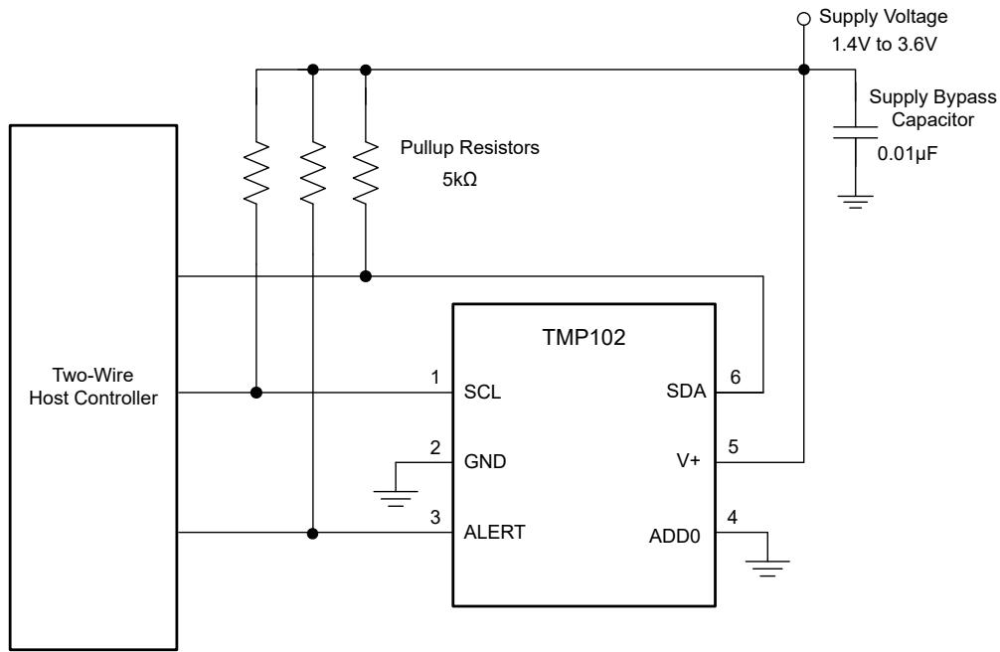  
Figure 7-1. Typical Connections

# 7.2.1 Design Requirements

The TMP102 device requires pullup resistors on the SCL, SDA, and ALERT pins. The recommended value for the pullup resistors is $5 \mathrm { - } \mathsf { k } \Omega$ . In some applications the pullup resistor can be lower or higher than $5 \mathsf { \star } \Omega$ but must not exceed $3 \mathsf { m A }$ of current on any of those pins. A 0.01-μF bypass capacitor on the supply is recommended as shown in Figure 7-1. The SCL and SDA lines can be pulled up to a supply that is equal to or higher than $\vee +$ through the pullup resistors. To configure one of four different addresses on the bus, connect the ADD0 pin to either the GND, $\vee +$ , SDA, or SCL pin.

# 7.2.2 Detailed Design Procedure

Place the TMP102 device in close proximity to the heat source that must be monitored, with a proper layout for good thermal coupling. This placement verifies that temperature changes are captured within the shortest

possible time interval. To maintain accuracy in applications that require air or surface temperature measurement, care must be taken to isolate the package and leads from ambient air temperature. A thermally-conductive adhesive is helpful in achieving accurate surface temperature measurement.

The TMP102 device is a very low-power device and generates very low noise on the supply bus. Applying an RC filter to the $\vee +$ pin of the TMP102 device can further reduce any noise that the TMP102 device can propagate to other components. $\mathsf { R } _ { ( \mathsf { F } ) }$ in Figure 7-2 must be less than $5 \mathsf { k } \Omega$ and ${ \mathsf C } _ { ( \mathsf F ) }$ must be greater than 10 nF.

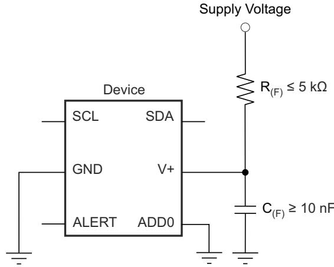  
Figure 7-2. Noise Reduction Techniques

# 7.2.3 Application Curve

Figure 7-3 shows the step response of the TMP102 device to a submersion in an oil bath of $1 0 0 ^ { \circ } \mathsf { C }$ from room temperature $( 2 7 ^ { \circ } \mathsf { C } )$ . The time-constant, or the time for the output to reach $6 3 \%$ of the input step, is $0 . 8 \ \mathsf { s }$ . The time-constant result depends on the printed circuit board (PCB) that the TMP102 device is mounted. For this test, the TMP102 device was soldered to a two-layer PCB that measured 0.375 inch $\times { } 0 . 4 3 7$ inch.

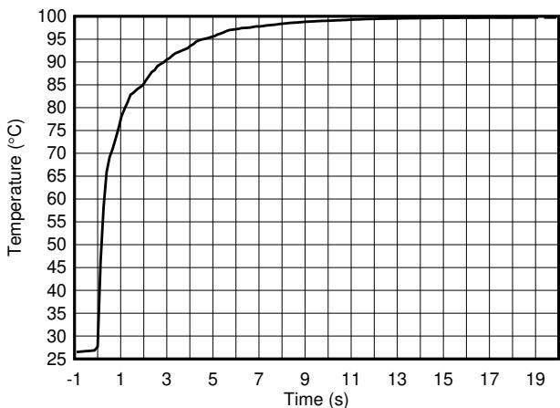  
Figure 7-3. Temperature Step Response

# 7.3 Power Supply Recommendations

The TMP102 device operates with power supply in the range of 1.4 to $3 . 6 \ \lor .$ The device is optimized for operation at 3.3-V supply but can measure temperature accurately in the full supply range.

A power-supply bypass capacitor is required for proper operation. Place this capacitor as close as possible to the supply and ground pins of the device. A typical value for this supply bypass capacitor is $0 . 0 1 \ \mu \mathsf { F } .$ . Applications

with noisy or high-impedance power supplies can require additional decoupling capacitors to reject power-supply noise.

# 7.4 Layout

# 7.4.1 Layout Guidelines

Place the power-supply bypass capacitor as close as possible to the supply and ground pins. The recommended value of this bypass capacitor is $0 . 0 1 ~ \mu \mathsf { F }$ . Additional decoupling capacitance can be added to compensate for noisy or high-impedance power supplies. Pull up the open-drain output pins (SDA , SCL and ALERT) through 5-kΩ pullup resistors.

# 7.4.2 Layout Example

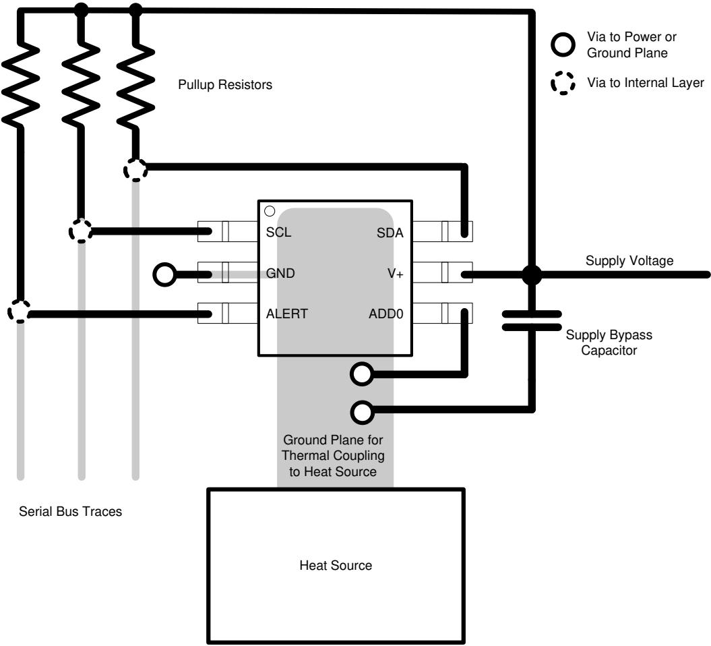  
Figure 7-4. TMP102 Layout Example

# 8 Device and Documentation Support 8.1 Documentation Support

# 8.1.1 Related Documentation

For related documentation see the following:

Texas Instruments, TMPx75 Temperature Sensor With I2C and SMBus Interface in Industry Standard LM75 Form Factor and Pinout, data sheet   
Texas Instruments, TMP275 $\pm 0 . 5 ^ { \circ } C$ Temperature Sensor With $I$ 2C and SMBus Interface in Industry Standard LM75 Form Factor and Pinout, data sheet   
Texas Instruments, Capacitive Touch Operated Automotive LED Dome Light with Haptics Feedback, Design Guide

# 8.2 Receiving Notification of Documentation Updates

To receive notification of documentation updates, navigate to the device product folder on ti.com. Click on Notifications to register and receive a weekly digest of any product information that has changed. For change details, review the revision history included in any revised document.

# 8.3 Support Resources

TI E2E™ support forums are an engineer's go-to source for fast, verified answers and design help — straight from the experts. Search existing answers or ask your own question to get the quick design help you need.

Linked content is provided "AS IS" by the respective contributors. They do not constitute TI specifications and do not necessarily reflect TI's views; see TI's Terms of Use.

# 8.4 Trademarks

SMBus™ is a trademark of Intel, Inc.   
TI E2E™ is a trademark of Texas Instruments.   
All trademarks are the property of their respective owners.

# 8.5 Electrostatic Discharge Caution

This integrated circuit can be damaged by ESD. Texas Instruments recommends that all integrated circuits be handled with appropriate precautions. Failure to observe proper handling and installation procedures can cause damage.

ESD damage can range from subtle performance degradation to complete device failure. Precision integrated circuits may be more susceptible to damage because very small parametric changes could cause the device not to meet its published specifications.

# 8.6 Glossary

# TI Glossary

This glossary lists and explains terms, acronyms, and definitions.

# 9 Revision History

NOTE: Page numbers for previous revisions may differ from page numbers in the current version.

# Changes from Revision H (December 2018) to Revision I (June 2024)

Updated the numbering format for tables, figures, and cross-references throughout the document 1 Changed all instances of legacy terminology to controller and target where ${ \mathsf { I } } ^ { 2 } { \mathsf { C } }$ is mentioned . Changed the "Conversion time" throughout the document.. Changed the active, shutdown, average, and delay quiescent current throughout the document.. Changed the SCL pin description in Pin Functions table.. 3 Removed machine model (MM) from ESD Ratings section.. 4 Changed DRL package Thermal Information section.. 4 Changed "Conversion time" in Electrical Characteristics table.. 5 Added Average quiescent current at 1Hz conversion mode in Electrical Characteristics table.. 5 Changed Average quiescent current at 4Hz conversion mode in Electrical Characteristics table.. 5

Changed Average quiescent current when serial bus active, SCL frequency $= 4 0 0 ~ { \mathsf { k H z } }$ in Electrical Characteristics table... 5 Changed Average quiescent current when serial bus active, SCL frequency $=$ 2.85MHz in Electrical Characteristics table.. . 5 Changed the frequency from 3.4 to 2.85 MHz in the POWER SUPPLY section of the Electrical Characteristics table.. . 5 Changed shutdown current for both serial bus inactive and active, SCL frequency $= 4 0 0 ~ { \mathsf { k H z } }$ in Electrical Characteristics table... . 5 Changed shutdown current when serial bus active, SCL frequency $= 2 . 8 5$ MHz in Electrical Characteristics table... . 5 Changed Average Quiescent Current vs Temperature, Shutdown Current vs Temperature, Conversion Time vs Temperature, and Quiescent Current vs Bus Frequency graphs in the Typical Characteristics section.... ..7 Changed the Interrupt Mode $( T M = 1 )$ section.. .16

# Changes from Revision G (September 2018) to Revision H (December 2018) Page

Changed Absolute Maximum Ratings for voltage at SCL, SDA and ADD0 pin.. .4   
• Changed Absolute Maximum Ratings for voltage at ALERT pin.. . 4

# Changes from Revision F (September 2018) to Revision G (November 2018) Page

Changed input voltage maximum value from: $3 . 6 \mathsf { V }$ to: 4V... .4   
Changed output voltage maximum value from: $3 . 6 \mathsf { V }$ to: $( ( \mathsf { V } + ) + 0 . 5 )$ and ≤ 4V... 4   
Changed Junction-to-ambient thermal resistance from $2 0 0 \ { } ^ { \circ } { \mathsf { C } } { \mathsf { M } }$ to $2 1 0 . 3 \ ^ { \circ } \mathsf { C } N .$ .. .4   
Changed Junction-to-case (top) thermal resistance from $7 3 . 7 \ ^ { \circ } \mathsf { C } N$ to 105.0 °C/W.. 4   
Changed Junction-to-board thermal resistance from $3 4 . 4 \ ^ { \circ } \mathsf { C } N$ to 87.5 °C/W.. 4   
Changed Junction-to-top characterization parameter from $3 . 1 ~ ^ { \circ } \mathsf { C } / \mathsf { W }$ to 6.1 °C/W.. .4   
Changed Junction-to-board characterization parameter from $3 4 . 2 \ ^ { \circ } \mathrm { C } / \mathsf { W }$ to 87.0 °C/W.. 4   
Added the Receiving Notification of Documentation Updates section...... .23

# es from Revision E (April 2015) to Revision F (December 2015) Page

• Added TI Design .. ................................................................................... • Added NIST Features bullet .. .................................................................................. • Added last paragraph of Description section

# Changes from Revision D (September 2014) to Revision E (December 2014)

Changed the Temperature Error vs Temperature graph in the Typical Characteristics section. 7 • Changed the Temperature Error at $\boldsymbol { 2 5 ^ { \circ } \mathrm { C } }$ graph in the Typical Characteristics section..

# Changes from Revision C (October 2012) to Revision D (September 2014)

# Page

Added Handling Rating table, Feature Description section, Device Functional Modes, Application and Implementation section, Power Supply Recommendations section, Layout section, Device and Documentation Support section, and Mechanical, Packaging, and Orderable Information section. 4 Changed parameters in Timing Requirements. . .6

# Changes from Revision B (October 2008) to Revision C (October 2012) Pag

#

Changed DRL package Thermal Information section.. .4   
Changed "Conversion time" in Electrical Characteristics table. . 5   
• Changed values for Data Hold Time parameter in Timing Requirements . .12

# 10 Mechanical, Packaging, and Orderable Information

The following pages include mechanical, packaging, and orderable information. This information is the most current data available for the designated devices. This data is subject to change without notice and revision of this document. For browser-based versions of this data sheet, refer to the left-hand navigation.

# PACKAGING INFORMATION

<table><tr><td> Orderable part number</td><td>Status (1)</td><td>Material type (2)</td><td>Package | Pins</td><td>Package qty | Carrier</td><td>RoHS (3）</td><td>Lead finish/ Ball material</td><td>MSL rating/ Peak reflow</td><td>Op temp(℃)</td><td>Part marking (6)</td></tr><tr><td>TMP102AIDRLR</td><td>Active</td><td>Production</td><td>SOT-5X3 (DRL)|6</td><td>4000|LARGET&amp;R</td><td>Yes</td><td>（4) NIPDAU |NIPDAUAG</td><td>(5) Level-1-260C-UNLIM</td><td>-40 to 125</td><td>CBZ</td></tr><tr><td>TMP102AIDRLR.A</td><td>Active</td><td>Production</td><td>SOT-5X3 (DRL)|6</td><td>4000|LARGE T&amp;R</td><td>Yes</td><td>NIPDAU</td><td>Level-1-260C-UNLIM</td><td>-40 to 125</td><td>CBZ</td></tr><tr><td>TMP102AIDRLR.B</td><td>Active</td><td>Production</td><td>SOT-5X3 (DRL)|6</td><td>4000|LARGET&amp;R</td><td>Yes</td><td>NIPDAU</td><td>Level-1-260C-UNLIM</td><td>-40 to 125</td><td>CBZ</td></tr></table>

(1) Status: For more details on status, see our product life cycle.

(2) Material type: When designated, preproduction parts are prototypes/experimental devices, and are not yet approved or released for full production. Testing and final process, including without limitation quality assurance, reliability performance testing, and/or process qualification, may not yet be complete, and this item is subject to further changes or possible discontinuation. If available for ordering, purchases will be subject to an additional waiver at checkout, and are intended for early internal evaluation purposes only. These items are sold without warranties of any kind.

(3) RoHS values: Yes, No, RoHS Exempt. See the TI RoHS Statement for additional information and value definition.

(4) Lead finish/Ball material: Parts may have multiple material finish options. Finish options are separated by a vertical ruled line. Lead finish/Ball material values may wrap to two lines if the finish value exceeds the maximumcolumn width.

low: The moisture sensitivity level ratings and peak solder (reflow) temperatures. In the event that a part has multiple moisture sensitivity ratings, only the lowest level per JEDEC standards is shown.   
el for the actual reflow temperature that will be used to mount the part to the printed circuit board.

(6) Part marking: There may be an additional marking, which relates to the logo, the lot trace code information, or the environmental category of the part.

Multiple part markings will be inside parentheses. Only one part marking contained in parentheses and separated by a "\~" will appear on a part. If a line is indented then it is a continuation of the previous line and the two combined represent the entire part marking for that device.

Important Information and Disclaimer:The information provided on this page represents TI's knowledge and belief as of the date that it is provided. TI bases its knowledge and belief on information provided by third parties, and makes no representation or warranty as to the accuracy of such information. Efforts are underway to better integrate information from third parties. TI has taken and continues to take reasonable steps to provide representative and accurate information but may not have conducted destructive testing or chemical analysis on incoming materials and chemicals. TI and TI suppliers consider certain information to be proprietary, and thus CAS numbers and other limited information may not be available for release.

no event shall TI's liability arising out of such information exceed the total purchase price of the TI part(s) at issue in this document sold by TI to Customer on an annual basis.

# OTHER QUALIFIED VERSIONS OF TMP102 :

Automotive : TMP102-Q1

NOTE: Qualified Version Definitions:

• Automotive - Q100 devices qualified for high-reliability automotive applications targeting zero defects

# TAPE AND REEL INFORMATION

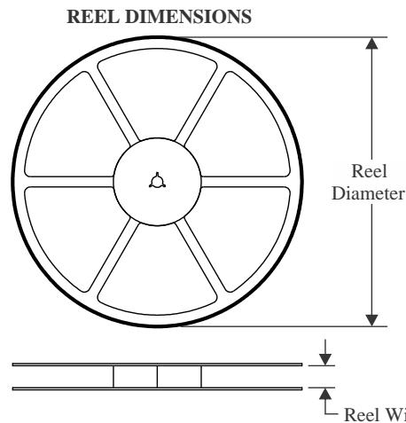

<table><tr><td rowspan=1 colspan=1>A0</td><td rowspan=1 colspan=1>A0Dimension designed to accommodate the component width</td></tr><tr><td rowspan=1 colspan=1>B0</td><td rowspan=1 colspan=1>Dimension designed to accommodate the component length</td></tr><tr><td rowspan=1 colspan=1>K0</td><td rowspan=1 colspan=1>Dimension designed to accommodate the component thickness</td></tr><tr><td rowspan=1 colspan=1>W</td><td rowspan=1 colspan=1>Overall width of the carrier tape</td></tr><tr><td rowspan=1 colspan=1>P1</td><td rowspan=1 colspan=1>Pitch between successive cavity centers</td></tr></table>

# QUADRANT ASSIGNMENTS FOR PIN 1 ORIENTATION IN TAPE

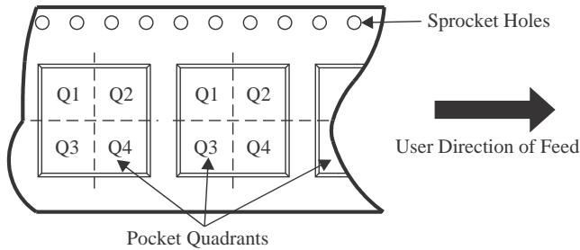

\*All dimensions are nominal   

<table><tr><td rowspan=1 colspan=1>Device</td><td rowspan=1 colspan=1>PackageType</td><td rowspan=1 colspan=1>PackageDrawing</td><td rowspan=1 colspan=1>Pins</td><td rowspan=1 colspan=1>SPQ</td><td rowspan=1 colspan=1>ReelDiameter(mm)</td><td rowspan=1 colspan=1>ReelWidthw1 (mm)</td><td rowspan=1 colspan=1>A0(mm)</td><td rowspan=1 colspan=1>B0(mm)</td><td rowspan=1 colspan=1>K0(mm)</td><td rowspan=1 colspan=1>P1(mm)</td><td rowspan=1 colspan=1>W(mm)</td><td rowspan=1 colspan=1>Pin1Quadrant</td></tr><tr><td rowspan=1 colspan=1>TMP102AIDRLR</td><td rowspan=1 colspan=1>SOT-5X3</td><td rowspan=1 colspan=1>DRL</td><td rowspan=1 colspan=1>6</td><td rowspan=1 colspan=1>4000</td><td rowspan=1 colspan=1>180.0</td><td rowspan=1 colspan=1>8.4</td><td rowspan=1 colspan=1>2.0</td><td rowspan=1 colspan=1>1.8</td><td rowspan=1 colspan=1>0.75</td><td rowspan=1 colspan=1>4.0</td><td rowspan=1 colspan=1>8.0</td><td rowspan=1 colspan=1>Q3</td></tr><tr><td rowspan=1 colspan=1>TMP102AIDRLR</td><td rowspan=1 colspan=1>SOT-5X3</td><td rowspan=1 colspan=1>DRL</td><td rowspan=1 colspan=1>6</td><td rowspan=1 colspan=1>4000</td><td rowspan=1 colspan=1>180.0</td><td rowspan=1 colspan=1>8.4</td><td rowspan=1 colspan=1>1.98</td><td rowspan=1 colspan=1>1.78</td><td rowspan=1 colspan=1>0.69</td><td rowspan=1 colspan=1>4.0</td><td rowspan=1 colspan=1>8.0</td><td rowspan=1 colspan=1>Q3</td></tr></table>

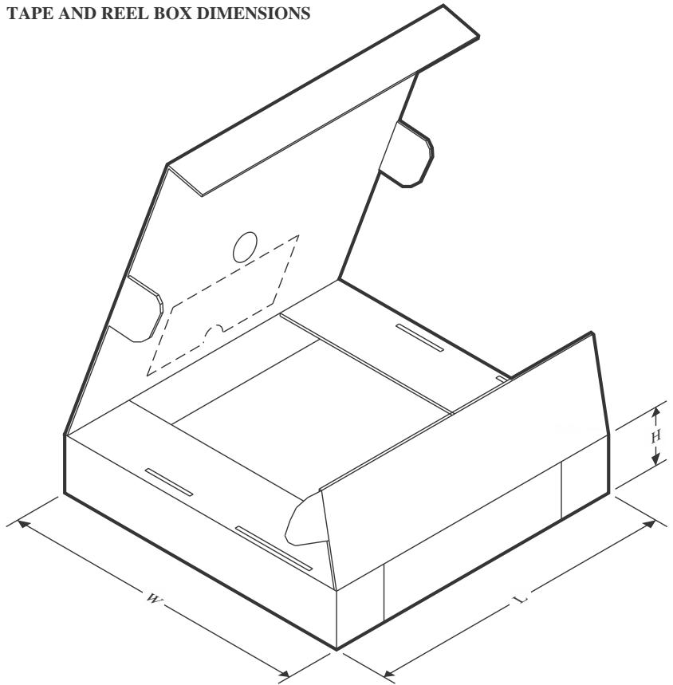

\*All dimensions are nominal   

<table><tr><td rowspan=1 colspan=1>Device</td><td rowspan=1 colspan=1>Package Type</td><td rowspan=1 colspan=1>Package Drawing</td><td rowspan=1 colspan=1>Pins</td><td rowspan=1 colspan=1>SPQ</td><td rowspan=1 colspan=1> Length (mm)</td><td rowspan=1 colspan=1>Width (mm)</td><td rowspan=1 colspan=1>Height (mm)</td></tr><tr><td rowspan=1 colspan=1>TMP102AIDRLR</td><td rowspan=1 colspan=1>SOT-5X3</td><td rowspan=1 colspan=1>DRL</td><td rowspan=1 colspan=1>6</td><td rowspan=1 colspan=1>4000</td><td rowspan=1 colspan=1>210.0</td><td rowspan=1 colspan=1>185.0</td><td rowspan=1 colspan=1>35.0</td></tr><tr><td rowspan=1 colspan=1>TMP102AIDRLR</td><td rowspan=1 colspan=1>SOT-5X3</td><td rowspan=1 colspan=1>DRL</td><td rowspan=1 colspan=1>6</td><td rowspan=1 colspan=1>4000</td><td rowspan=1 colspan=1>202.0</td><td rowspan=1 colspan=1>201.0</td><td rowspan=1 colspan=1>28.0</td></tr></table>

PLASTIC SMALL OUTLINE

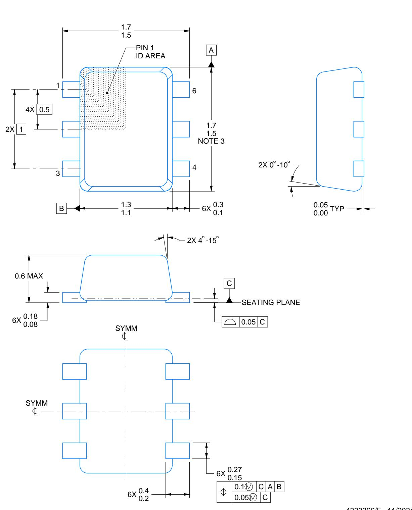

4223266/F 11/2024

# NOTES:

1. All linear dimensions are in millimeters. Any dimensions in parenthesis are for reference only. Dimensioning and tolerancing per ASME $\mathsf { Y } 1 4 . 5 \mathsf { M }$ .   
2. This drawing is subject to change without notice.   
3. This dimension does not include mold flash, protrusions, or gate burrs. Mold flash, protrusions, or gate burrs shall not exceed $0 . 1 5 \mathrm { m m }$ per side.   
4. Reference JEDEC registration MO-293 Variation UAAD

PLASTIC SMALL OUTLINE

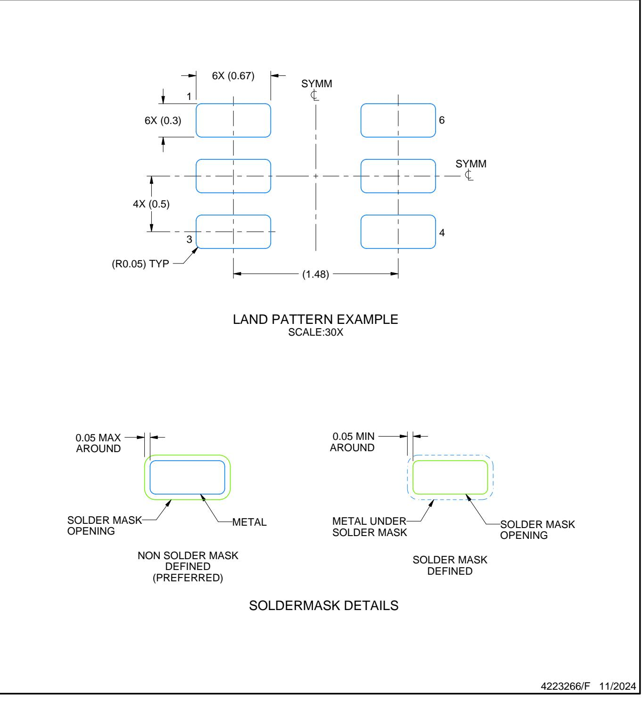  
NOTES: (continued)

PLASTIC SMALL OUTLINE

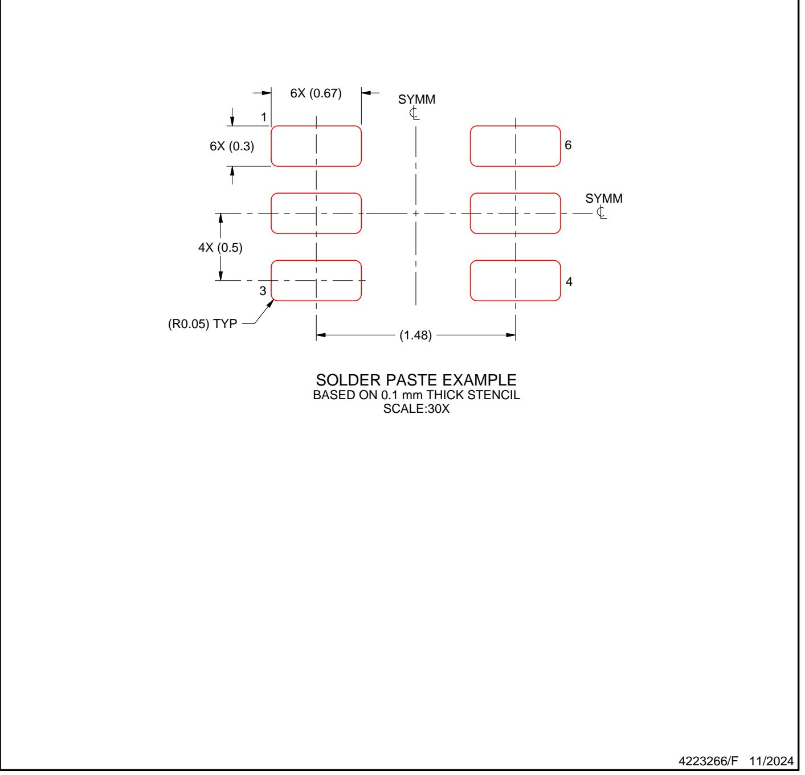  
NOTES: (continued)

8. Laser cutting apertures with trapezoidal walls and rounded corners may offer better paste release. IPC-7525 may have alternate design recommendations.   
9. Board assembly site may have different recommendations for stencil design.

# IMPORTANT NOTICE AND DISCLAIMER

TI PROVIDES TECHNICAL AND RELIABILITY DATA (INCLUDING DATASHEETS), DESIGN RESOURCES (INCLUDING REFERENCE DESIGNS), APPLICATION OR OTHER DESIGN ADVICE, WEB TOOLS, SAFETY INFORMATION, AND OTHER RESOURCES “AS IS” AND WITH ALL FAULTS, AND DISCLAIMS ALL WARRANTIES, EXPRESS AND IMPLIED, INCLUDING WITHOUT LIMITATION ANY IMPLIED WARRANTIES OF MERCHANTABILITY, FITNESS FOR A PARTICULAR PURPOSE OR NON-INFRINGEMENT OF THIRD PARTY INTELLECTUAL PROPERTY RIGHTS.

These resources are intended for skilled developers designing with TI products. You are solely responsible for (1) selecting the appropriate TI products for your application, (2) designing, validating and testing your application, and (3) ensuring your application meets applicable standards, and any other safety, security, regulatory or other requirements.

These resources are subject to change without notice. TI grants you permission to use these resources only for development of an application that uses the TI products described in the resource. Other reproduction and display of these resources is prohibited. No license is granted to any other TI intellectual property right or to any third party intellectual property right. TI disclaims responsibility for, and you fully indemnify TI and its representatives against any claims, damages, costs, losses, and liabilities arising out of your use of these resources.

TI’s products are provided subject to TI’s Terms of Sale, TI’s General Quality Guidelines, or other applicable terms available either on ti.com or provided in conjunction with such TI products. TI’s provision of these resources does not expand or otherwise alter TI’s applicable warranties or warranty disclaimers for TI products. Unless TI explicitly designates a product as custom or customer-specified, TI products are standard, catalog, general purpose devices.

TI objects to and rejects any additional or different terms you may propose.